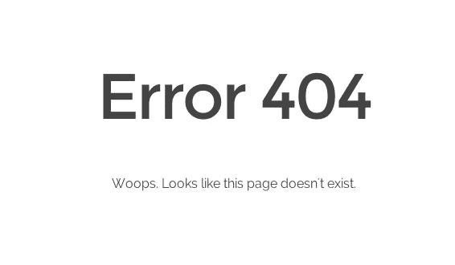

# 我们应该如何处理 NodeJS 中的错误？

> 原文：<https://blog.devgenius.io/how-we-should-handle-errors-in-nodejs-e855a32b7604?source=collection_archive---------6----------------------->

有时错误是可怕的，但实际上，当它们不在的时候，它们让我们的应用程序变得更好。如果我们正确处理错误，我们的前端队友会非常感激。



> “今天你可以采取什么简单的行动来为你的生活带来走向成功的新动力？”托尼·罗宾斯

# 错误

在 Node.js 中运行的应用程序通常会遇到四类错误:

*   标准 JavaScript 错误，如语法、引用、类型等。
*   系统错误由底层操作系统约束触发，例如试图打开不存在的文件或试图通过关闭的套接字发送数据。
*   应用程序代码触发的用户指定的错误。
*   `AssertionError` s 是一类特殊的错误，当 Node.js 检测到不应该发生的异常逻辑违规时会触发。这些通常由`assert`模块引发。

Node.js 引发的所有 JavaScript 和系统错误都继承自标准 JavaScript [< Error >](https://developer.mozilla.org/en-US/docs/Web/JavaScript/Reference/Global_Objects/Error) 类或者是该类的实例，并且保证至少为*提供该类上可用的属性。*

在我们的 API 中，我们将 JSON 结果返回给 process。但是当我们的应用程序出现错误时，它会返回错误消息和应用程序的堆栈树等信息。在这种情况下，用户可以了解我们的应用程序的私人信息，并将其用于不良目的。另一方面，我们的队友不明白发生了什么。因此，当错误发生时，最好发送 JSON 结果，就像我们成功的结果一样。

在以前的文章中，我们看到了如何创建节点应用程序和文件夹结构。我们在它上面建造东西。所以如果你还没有读，是时候了。

我们说我们的应用程序返回了成功的 JSON 结果；

```
{
    "code": "0",
    "msg": "Success",
    "records": [
        {
            "key": "rXOajnqt",
            "value": "QFKmpxRhmPPm",
            "count": 2169
        }
    ]
}
```

我们有三把钥匙。

代码；结果代码。0 表示成功。其他代码将用于错误。

味精；结果的简短描述

记录；该键仅出现在成功的结果中。它包含结果数据。

细节；它发生错误情况。给出了详细的错误信息。

错误示例；

```
{ "code": "4", "msg": "fail", "details": "No data found"}
```

如你所见；code 和 msg 属性是相互的。这使我们更容易理解我们的结果，在错误的情况下，我们可以查看细节，我们可以修复问题。

让我们开始编码吧！

首先创建一个名为 errorHandler.js 的中间件文件

这将触发每一个错误情况。这意味着我们可以控制错误。我们有 4 个参数；错误，请求，结果，下一个。

错误参数获取我们发送的错误。这还有另一个目的，我将在本文后面提到。

我还集成了一个记录器。记录是最重要的事情之一。然而，那是另一天的话题。

在第九行，我们用错误的状态指定了响应状态，如果为空，则指定默认值。在类似状态之后，给 JSON 分配一个错误消息。

那么什么会触发中间件呢？

两件事。未指定的终点和其他错误。

对于另一个错误，我创建了一个名为 errors 的文件夹和 ApiError.js 文件。如果你愿意，你可以把这个文件放在脚本/实用程序中。

我们必须继承 javascript 错误类。这样，我们可以访问所有的错误。在访问错误之后，我们将使用**这个**关键字来操作它。如果你不明白这些行是怎么回事，你必须学习 [OOP](https://developer.mozilla.org/en-US/docs/Learn/JavaScript/Objects/Object-oriented_JS) 。

我们最终可以调用这个函数并返回错误。

用法举例；

在这个例子中；验证数据时，如果 **joi** 抛出错误，用 next 调用错误类。

**对于未指定的端点**返回 app.js 文件。在所有端点之后，通过使用 app.use()将应用程序级中间件绑定到 app 对象的一个实例。如果用户发送的请求与任何端点都不匹配，它将捕获请求。之后，就像任何其他错误一样，只需调用错误类。

```
//this runs if the EP is not foundapp.use((*req*, *res*, *next*) => {next(**new** ApiError(`${*req*.method} ${*req*.path} endpoint not avaiable`, 404));});
```

最后，我们必须调用 app.js 文件的错误处理程序中间件端。如果应用程序中有错误，触发错误处理器中间件，我们可以返回响应。

```
app.use(errorHandler);
```

***希望你喜欢并学到了！***