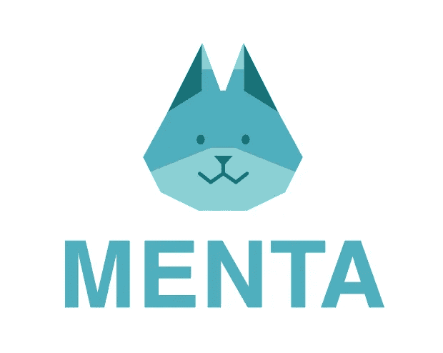
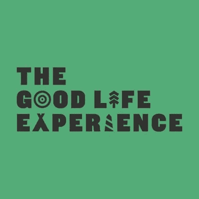

# 在签约了一个月的编程指导服务和对初学者有用的 YouTube 频道后，进展如何。

> 原文：<https://blog.devgenius.io/how-went-after-a-month-of-contracting-a-programming-mentor-service-and-useful-youtube-channels-e3ac35377e2a?source=collection_archive---------27----------------------->

日本编程导师平台

首先，我将介绍一下我的背景，因为肯定有人不知道我是谁。所以，你可以理解我写这篇文章的角度。

嗯，我曾经在机场做过很长时间的客服人员，但是我想改变我的职业，所以在日本集中学习了 3 个月的 web 编程课程(主要是前端:HTML，CSS，Sass，Javascript，jQuery，PHP 和 WordPress)。然后，幸运的是我在一家网页制作公司找到了一份助理程序员的工作，现在我已经在这家公司工作了半年。

程序设计研究

在我的上一篇文章中，我介绍了自己在学习期间为我的朋友开发了一个餐馆网站，使用的是一种叫做“门塔”([https://menta.work/member/dash](https://menta.work/member/dash))的日本导师服务。在那里，我与一位专门从事 Laravel 开发的导师签订了合同，并从 6 月初开始为我的项目工作。从结论上说，我和那个家伙完成了合同。原因是多方面的，但我猜主要原因是因为我对 Laravel 的理解太差，无法开始开发，所以我有很多机会问导师一些基本问题，他给了我他的初学者课程文档。在那一点上，我的开发停止了，即使如此，在我的项目上实际实现也很困难，我估计我的理解仍然很差，因为他无意中使用了很多技术词汇。然后，我不得不问导师一些基本的问题，我可以看出他变得不耐烦了，他的反应变得越来越迟钝和迟钝。问这样的问题让我感觉很糟糕，当我为了更好地理解而搜索其他学习资料时，我看到了一个 YouTube 视频，它更容易理解。然后我看完了所有的 laravel 教程，我的理解变好了，现在可以一点一点的进步开发了。这是我想知道为什么我要为我能更好地免费学习的东西付钱的时候！然后完成了合同。所以我决定现在通过 YouTube 教程来学习。或者，当我遇到新事物时，我可能会尝试不同的服务。反正都是很好的经历。

在这里，我将为编程初学者介绍几个有用的 YouTube 频道，我也和他们一起学习。这是我最喜欢的频道之一:1。Traversy Media {他描述了几种编程语言(包括 Laravel、bootstrap、React、Python Flask 等)和框架，实际上他开发了简单的示例 web 应用程序。虽然他因为生病暂时离开了 YouTube 频道，但他已经上传了几个有价值的教程，它们非常有用！值得一看，以便你更好地理解。}

 [## 旅行媒体

### Traversy Media 为所有最新的网站提供了最好的在线网站开发和编程教程

www.youtube.com](https://www.youtube.com/channel/UC29ju8bIPH5as8OGnQzwJyA) 

第一种是美式英语，如果你喜欢的话，这是英式英语。网络忍者{我用这个教程学习了 Flutter。他的解释非常清楚。他涵盖了诸如 Flutter、JavaScript、Node.js、TypeScript、Vue.js、React 等语言。}

 [## 网络忍者

### 黑带发展技能。教程:-现代 JavaScript(初级到高级)- Node.js - React - Vue.js…

www.youtube.com](https://www.youtube.com/channel/UCW5YeuERMmlnqo4oq8vwUpg) 

我的餐馆网站仍在运行，但新冠肺炎患者在日本也迅速增加，所以如果人数继续增加，我可能会再次在家工作。那我就有更多的时间去发展了。我希望我能在今年秋天完成这个项目，并开始寻找一份更好的工作

♡Thanks 代表 reading♡

Sanae♡的《♡Written》

2020♡♡friday 7 月 17 日电