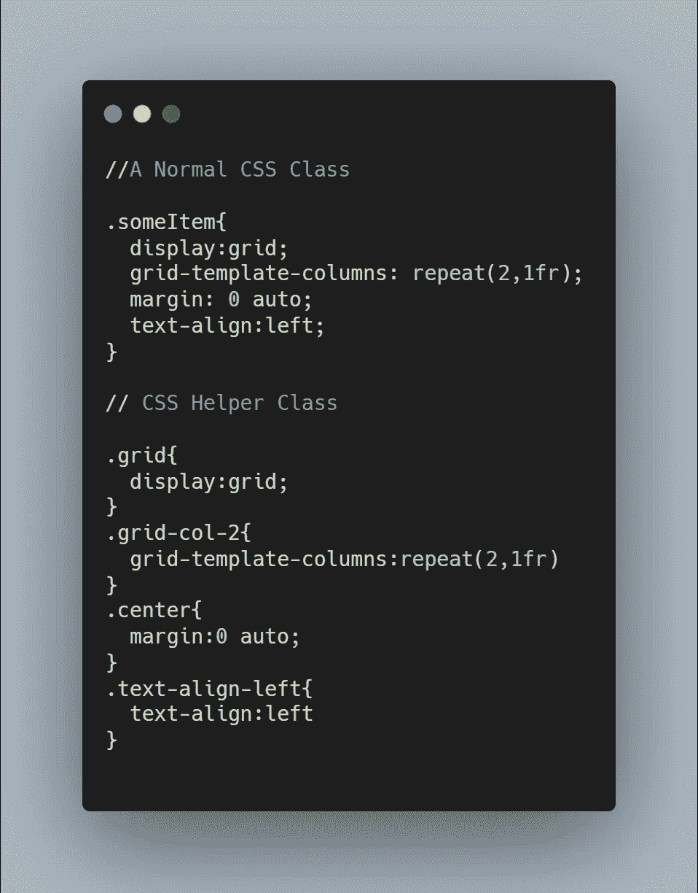
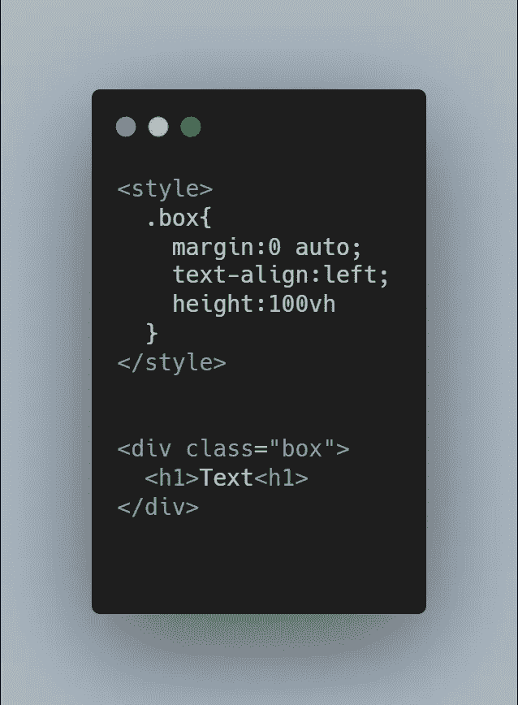
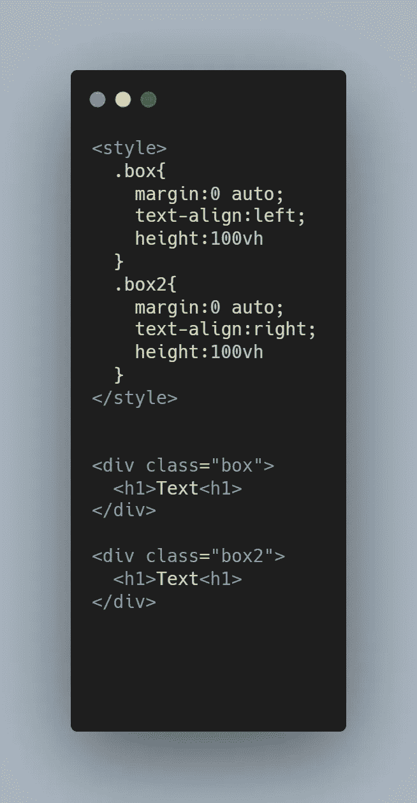
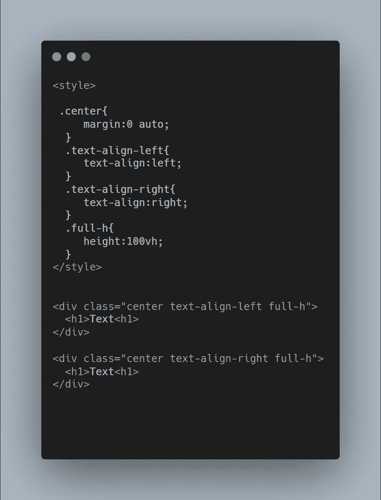

# 编写 CSS 助手类如何提高我的生产力

> 原文：<https://blog.devgenius.io/how-writing-css-helper-classes-improved-my-productivity-c2360d0dab78?source=collection_archive---------2----------------------->

*为什么在编写 CSS 时应该开始使用助手类*

照片由[克里斯汀·休姆](https://unsplash.com/@christinhumephoto?utm_source=medium&utm_medium=referral)在 [Unsplash](https://unsplash.com?utm_source=medium&utm_medium=referral) 上拍摄

当我在 web 开发生涯的早期开始学习 CSS 时，我意识到了一些事情。

我重复了很多代码。

当我说很多的时候，我是说很多。我滚动 CSS 代码并意识到用相同的精确值多次重复某些属性的次数是惊人的。在一些较大的项目中，我重复了近 20 次以上的属性。我认为这是我在进入 web 开发职业生涯中必须要面对的问题。

这是直到我了解了 CSS 助手类。

# 什么是 CSS 助手类？

CSS 助手类，也称为实用程序类，是一种 CSS 方法，允许我们编写较少重复的模块化代码。这是通过创建一组抽象类来实现的，这些抽象类只负责做一件事。例如，你可以写一个 *text-align-left* 类，它的唯一工作就是将文本向左对齐，仅此而已。这允许您在整个 HTML 中重用这个 CSS 类，而不仅仅是在一个地方。

普通 CSS 类与 CSS 助手类

# 编写 CSS 助手类

编写 CSS 助手类实际上非常简单。你所要做的就是把你的大类分解成小块。如果您发现自己一遍又一遍地输入某个属性，那么将该属性转换成它自己的助手类可能是个好主意。以下面的代码为例:

虽然这段代码没有任何问题，但是如果我们想添加另一个盒子，但是稍微有些不同，我们会怎么做呢？如果这一次，我们希望盒子右对齐，而不是左对齐，会怎么样？我们可以编写这样的代码:

但这只是暂时的解决办法。如果我们想做 5 个、10 个甚至 100 个盒子呢？我们会被迫一遍又一遍地写同样的 CSS 吗？不。在这种情况下，我们可以使用 CSS 助手类，使我们作为开发人员的工作变得更加容易。以这段代码为例:

相同的代码，但用 CSS 助手类代替

这是更好的代码，因为它允许你编写可重用的 CSS，无论我们添加多少个盒子，都可以很好地扩展。它还允许您轻松地在 HTML 中添加新的样式，因为我们可以根据需要轻松地创建新的助手类。

## 结论

简而言之，CSS helper 类是一种很好的方式来编写可重用的 CSS 样式，这些样式可以根据您的项目进行扩展。通过使用助手类，你将成为一个更有生产力的开发者。

## 进一步阅读

如果你喜欢这篇文章，看看我的其他几篇:

 [## 什么是盒子模型，为什么要关注它？

### HTML 最重要概念之一的指南

medium.com](https://medium.com/aziz-booker/what-is-the-box-model-and-why-should-you-care-783f1fdbc3c0)  [## 理解 HTML 的基础知识

### 理解 HTML 的初学者指南

medium.com](https://medium.com/aziz-booker/understanding-the-basics-of-html-bcc0e8990fa3)  [## 每个开发人员都应该知道的 4 种数据结构

### 每个开发人员都应该知道的数据结构概述

bookeraziz.medium.com](https://bookeraziz.medium.com/4-data-structures-every-developer-should-know-368d156ea384) 

祝你今天休息愉快！