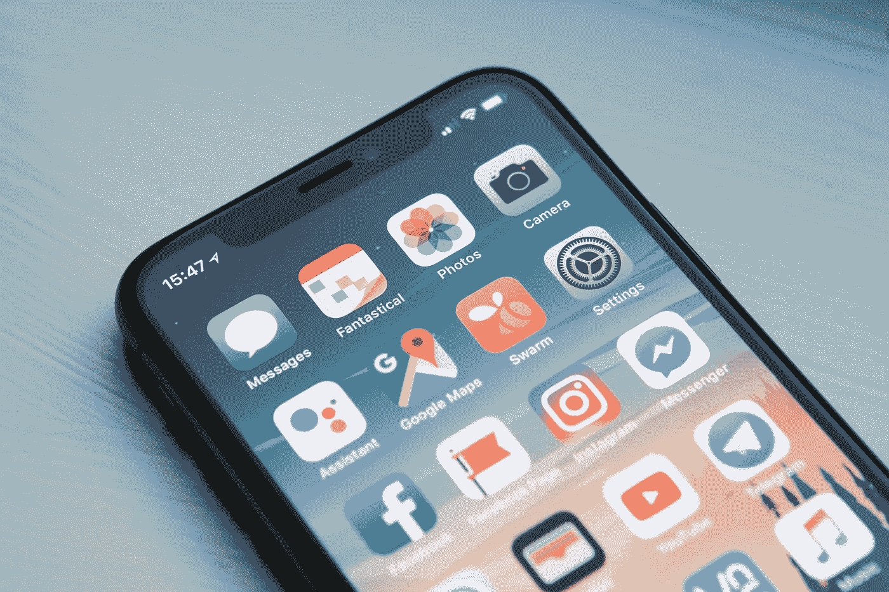
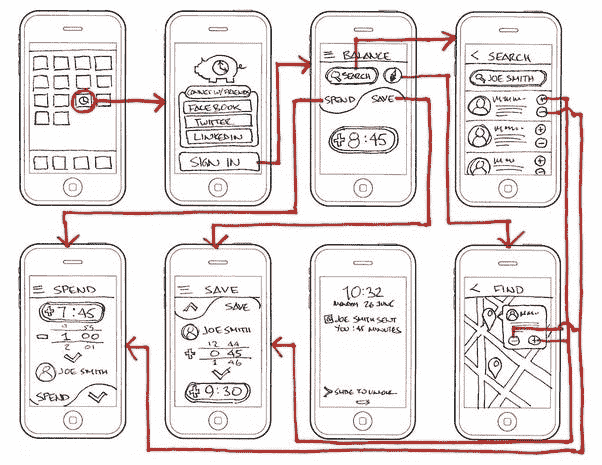

# 如何在疫情期间构建移动应用程序

> 原文：<https://blog.devgenius.io/how-you-can-build-a-mobile-app-during-the-pandemic-eb573097711e?source=collection_archive---------36----------------------->

照片由[威廉·胡克](https://unsplash.com/@williamtm?utm_source=unsplash&utm_medium=referral&utm_content=creditCopyText)在 [Unsplash](/s/photos/mobile-app?utm_source=unsplash&utm_medium=referral&utm_content=creditCopyText) 拍摄

我每天都呆在家里，躺着思考下一步该做什么？需要做些什么？

然后我想起了我在 2015 年夏天想到的一个应用程序创意(名为 [PartyApp！](https://itunes.apple.com/us/app/partyapp/id1130056779?ls=1&mt=8))。因为我现在有时间开始开发应用程序，我开始工作。

我花了整整 30 天(4 月份)来学习和完成 Android 应用程序。我又花了 3 周时间学习并完成了 iOS 版本。

当我发布这款应用时，除了开发这款应用，我对移动应用行业一无所知。我没有做任何 UX 设计，没有线框，没有用户界面设计(只是用了 Android 的设计)，没有应用商店优化，没有目标受众，我只是认为你会发布一个应用，本质上，每个人都会蜂拥而至。它没有发生。

我花了一年时间才最终意识到并掌握创建一个移动应用程序需要什么。我了解到创建一个应用程序不仅仅是坐下来编写一个应用程序并发布它。

**以下是你*应该如何*从头开始创建一个移动应用:**

## **想出一个 app 创意**

首先，你必须想出一个应该*解决人们问题*的 app 创意。我的想法是一个应用程序，显示他们所在地区附近发生的任何聚会或事件。该应用的目标是解决人们如果想出去过夜不知道去哪里的问题。我想为所有的聚会和活动创造一个集中的地方。

*你的 app 创意不一定要很棒，但一定要有很强的执行力。脸书最初的想法是为大学建立一个社交网络。这是一个 MySpace 和 Friendster 已经过时的时代，社交网络是一个古老的概念。不同的是，脸书以不同的方式执行了他们的想法，首先让他们的网站只对大学开放，让学生了解其他学生在做什么，他们的关系状况等等。*

当你计划开发和发布你的应用程序时，确保你对你的应用程序要做什么有一个全面的计划，并很好地执行它。

## **获得对你想法的反馈**

向其他人宣传你的想法。询问你的朋友、家人和/或陌生人是否会使用你的应用程序。询问他们的问题，并在您的应用程序中添加/删除有助于实现您的目标和解决他们问题的功能。这将给你一个总体的基础，一旦你的用户下载了你的应用程序，你会做什么。

确保你的应用程序第一版只包含最少**个**功能。你的目标不是实现每一个特性，只是先实现主要的特性。一旦你有了你的产品，你可以在必要的时候添加/删除任何功能。

## **用户体验设计**

用户体验只是用户将如何使用你的应用程序的整体体验。除了从用户那里获得反馈，你还应该设计你的应用程序，让用户在你一上应用程序就可以访问你提供的解决方案。

为了 PartyApp！，我确保一打开应用程序，就会显示一个基于离当前用户位置远近的聚会列表。这样，用户不会花很长时间就决定关闭应用程序，不再回来。

通过确保用户喜欢使用您的应用程序来设计您的体验，并根据它将如何帮助用户使用您的应用程序来配置您的应用程序中的功能。

## **线框**

线框本质上是为你的应用程序创建一个准系统用户界面。它不一定要设计得很漂亮，可以是用笔和纸粗略勾画出你的应用程序的样子。

你的线框应该连接你的用户体验研究中产生的所有信息。

有了你的线框图，你可以回到你得到反馈的人那里，向他们展示你的线框图，并指导他们你的应用将如何工作。根据你的用户反馈，对线框图进行任何必要的修改。

## **用户界面设计**

这(对我来说)是有趣的部分。将你的线框转换成实际的用户界面设计。你可以为此使用软件，比如 [Sketch](https://www.sketchapp.com/) 和 [Draw.io](https://www.draw.io/) ，并设计你的应用程序，让它抓住用户的眼球。

不要把重点放在视觉上吸引用户的设计上，而是展示一个实际上对用户有效的设计。在整个应用程序中保持**一致性**(确保应用程序在每个页面中都有一个整体模板)。

如果你不喜欢设计，你可以使用你的应用程序的股票 iOS 外观，但要确保它符合 iOS 的[设计原则或 Android](https://developer.apple.com/ios/human-interface-guidelines/overview/design-principles/) 的[材料设计。](https://material.io/guidelines/)

## **开发应用**

这一部分你应该已经知道了，因为你已经是一个普通的开发者了。开发应用程序。将 UI 转换成真正的应用程序。根据需要实现所有后端库。投入工作发展。

我推荐的是一个软件，在你的开发阶段会有帮助。

[**taiga . io**](https://taiga.io/)**是一个在线项目管理网站。你可以把你需要做的事情分解出来放在这个网站上，然后你可以在一段时间内完成一定数量的功能，称为 **sprints。**这可以帮助你计划要做什么，同时给你一个很好的时间表，告诉你什么时候完成你的应用程序。**

## ****测试您的应用****

**确保你测试了你的应用程序，没有 bug、错误和其他任何可能“破坏”你的应用程序的东西。**

**回到给你反馈的人身边，向他们展示产品。让他们使用它，看看它是否对他们有帮助，从他们那里得到反馈，并在必要时做出改变。**

## ****发布您的应用程序****

**不要等到你的应用程序“完美”了才发布。设计您的应用程序，开发应用程序的主要功能，测试应用程序，然后发布它！**

**现在，为了发布它，你可以做很多事情来帮助你的应用程序获得更多的浏览量和下载量，但这是你可以找到的最适合你的应用程序的研究。**

**这里有几篇文章可以帮助你开始:**

**[https://www . trade mob . com/app-store-optimization-guide-apple/](https://www.trademob.com/app-store-optimization-guide-apple/)**

**[应用商店优化——移动应用营销难题的关键一环](https://blog.kissmetrics.com/app-store-optimization/)**

**[高效应用商店优化的终极指南——build fire](https://buildfire.com/ultimate-guide-to-app-store-optimization/)**

# **外卖食品**

**将所有这些步骤付诸行动可能很难完成。随着全球疫情的出现，这为人们创造了很多机会，可以帮助不同行业和部门的应用程序。本文中的步骤可以帮助你将想法变成现实！**

**希望这有所帮助！**