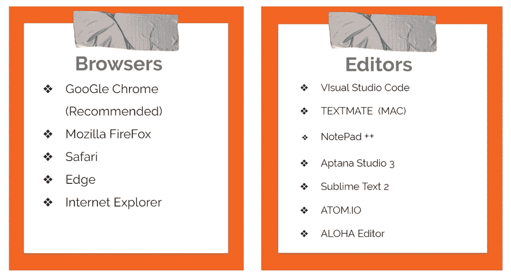
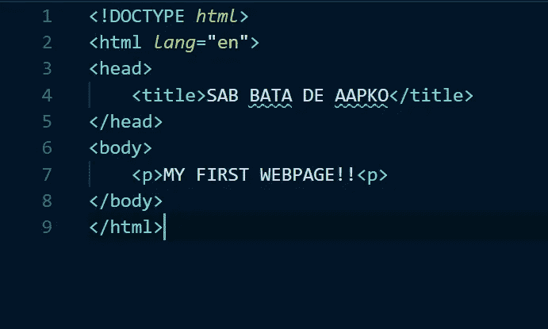
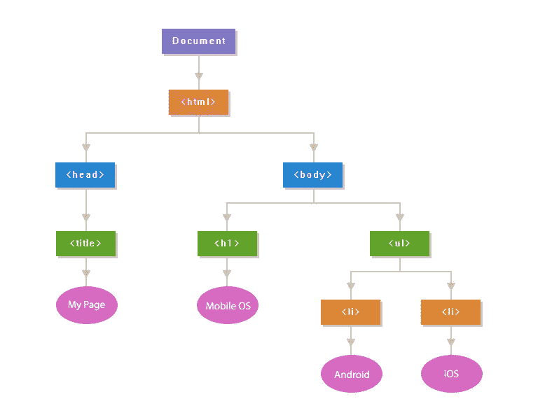
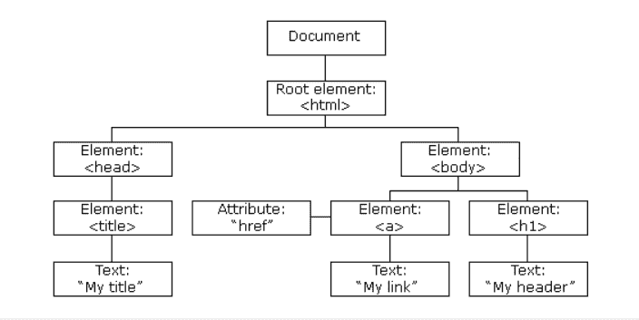

# HTML 5 —与众不同！！

> 原文：<https://blog.devgenius.io/html-5-the-difference-28866561da89?source=collection_archive---------44----------------------->

*学习 HTML5 的基础知识(绝对初学者)*


HTML-5

## 在我们开始之前…

*   本教程是为初学者准备的。
*   我们将在本教程中学习 HTML5 的基础知识。

> 耐心并享受学习

# **什么是 HTML？？**

*   **HTML** 代表**超文本标记语言。**
*   **HTML-5** 是 HTML 的第五个**也是当前版本**。
*   使用 ***标记语言设计*** 网页的 ***。***
*   ***【HTML 不是编程语言】***


# HTML 5 的特性

1.  *它有* ***引入了新的多媒体特性*** *，通过使用* ***<音频>*** *和* ***<视频>*** *标签支持音频和视频控制。*

*2。还有* ***新的图形元素*** *包括矢量图形和标记。*

*3。* ***丰富语义内容*** *由包括* ***<页眉>，<页脚>，<条>，<节>*** *和* ***<图>***

*4。* ***网络存储设备*** *提供网络应用方法，在网络浏览器上存储数据。*

*5。使用****SQL****数据库来* ***存储离线*** *数据。*

*6。允许* ***绘制各种形状*** *如三角形、矩形、圆形等。*

*7。能够处理不正确的语法。*

*8。* ***轻松 DOCTYPE 声明*** *即<！doctype html>*

*9。简单字符编码，即<元字符集= " UTF-8">*


# ***你需要入门的东西—***



物品清单，选择你最喜欢的

> ***入门***

步骤 1 — *打开您的编辑器*

步骤 2-选择保存或另存为，并用( ***)命名文件。html*** 扩展名

步骤 3 —添加文档类型、标题和正文标签

步骤 4—保存文件(Ctrl+S，命令 S[用于 mac])

步骤 5 —在浏览器中打开

> **HTML 代码**



> 从这里复制

```
**<!DOCTYPE *html*>**
<html *lang*="en">
<head>
<title>**SAB BATA DE AAPKO**</title>
</head>
<body>
<p>**MY FIRST WEBPAGE!!**<p>
</body>
**</html>**
```

# 什么是 DOM？

*   ***DOM 是 W3C(万维网联盟)*** 标准。
*   DOM ***定义了访问文档的标准*** :
*   “W3C 文档对象模型(DOM) — *是一个平台和语言中立的接口，允许程序和脚本动态访问和更新文档的内容、结构和样式。*

> **W3C DOM 标准分为 3 个不同的部分:**

*   ***核心 DOM*** —所有文档类型的标准模型
*   ***XML DOM***—XML 文档的标准模型
*   ***HTML DOM***—HTML 文档的标准模型

# **什么是 HTML DOM？**

HTML DOM 是 HTML 的标准对象模型和编程接口。



HTML DOM

> **它定义:**

*   作为对象的 HTML 元素
*   所有 HTML 元素的属性
*   访问所有 HTML 元素的方法
*   所有 HTML 元素的事件

> 换句话说:——HTML DOM 是如何获取、改变、添加或删除 HTML 元素的标准



元素形式

# 你可以看看这个相关的话题作为参考

[](https://medium.com/@aakarr.me/how-to-track-the-corona-patients-counts-in-world-using-html-css-javascript-5705dc365ca7) [## 如何使用 HTML CSS JavaScript 在世界范围内跟踪冠状动脉病人的数量

### 如何制作一个活的 Covid 世界计数器？在这个博客中，你将一步一步地学习如何更新世界直播…

medium.com](https://medium.com/@aakarr.me/how-to-track-the-corona-patients-counts-in-world-using-html-css-javascript-5705dc365ca7) [](https://medium.com/@aakarr.me/installation-of-git-for-absolute-beginners-1f6f9126637a) [## Git 的安装(绝对初学者)

### 上的，如何下载 Git 并安装到您的计算机上—

medium.com](https://medium.com/@aakarr.me/installation-of-git-for-absolute-beginners-1f6f9126637a) [](https://medium.com/@aakarr.me/how-to-track-the-corona-patients-counts-in-india-using-html-css-javascript-599491a2ad1e) [## 如何使用 HTML CSS JavaScript 在印度跟踪冠状动脉病人的数量

### 如何为印度制作一个实时的 COVID 追踪器。在这里，您将一步一步地学习如何使用…

medium.com](https://medium.com/@aakarr.me/how-to-track-the-corona-patients-counts-in-india-using-html-css-javascript-599491a2ad1e) [](https://medium.com/swlh/basic-git-commands-you-need-to-master-811a47a9cd05) [## 您需要掌握的基本 Git 命令

### 运行 git 需要知道的所有基本命令。

medium.com](https://medium.com/swlh/basic-git-commands-you-need-to-master-811a47a9cd05) [](https://medium.com/@aakarr.me/how-to-push-pull-and-clone-a-git-repository-406bc90ca700) [## 如何推拉和克隆 Git 存储库

### 关于如何将存储库从本地推/拉至在线 git 存储库，反之亦然

medium.com](https://medium.com/@aakarr.me/how-to-push-pull-and-clone-a-git-repository-406bc90ca700) [](https://medium.com/@aakarr.me/how-to-create-branch-in-git-6118de02a7c6) [## 如何在 Git 中创建分支

### 关于——什么是 git 分支系统&它的工作原理，以及如何在系统中创建 git 分支并在线推送它…

medium.com](https://medium.com/@aakarr.me/how-to-create-branch-in-git-6118de02a7c6)