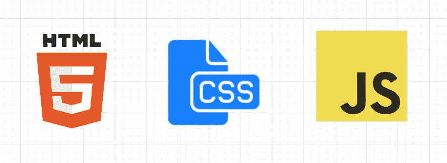
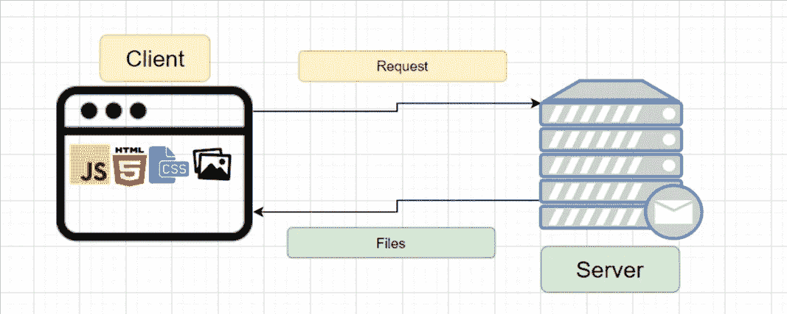
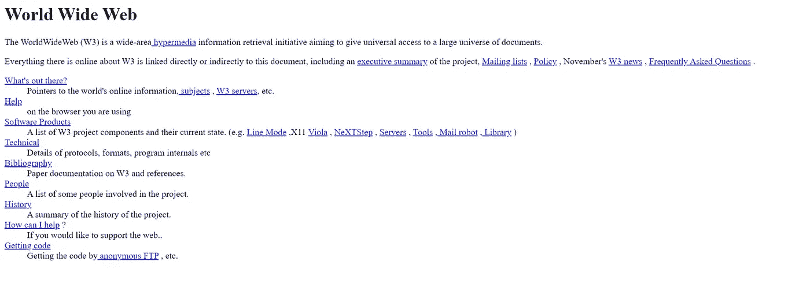
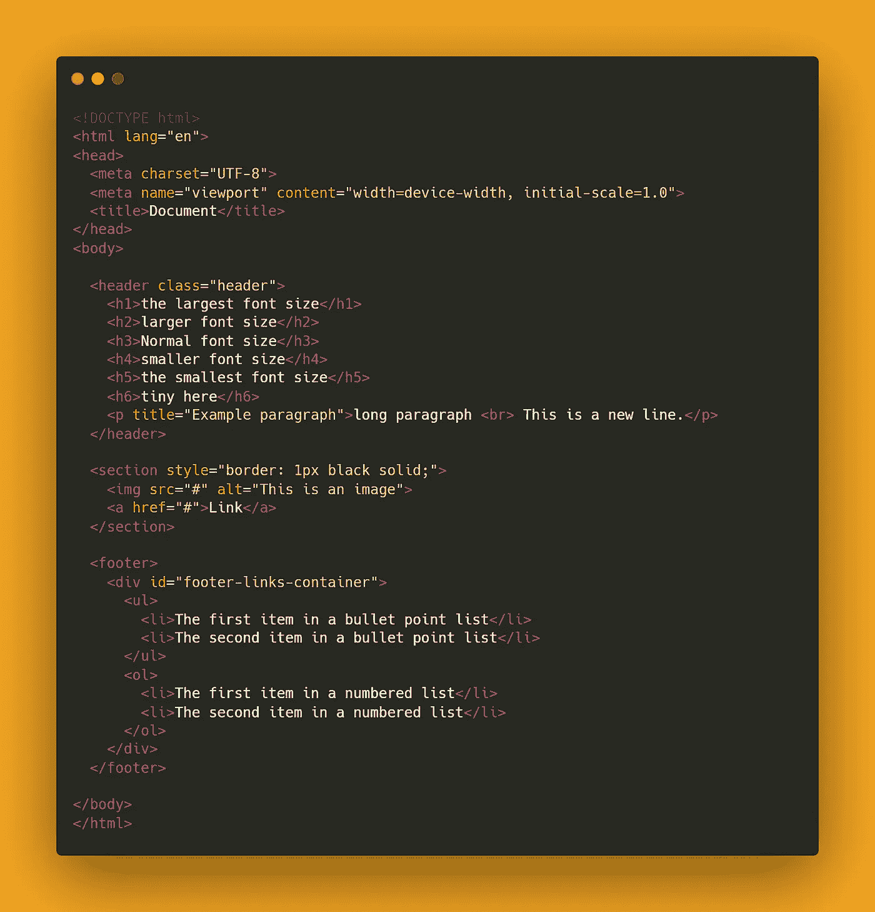
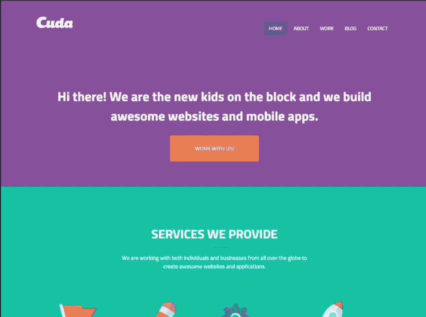
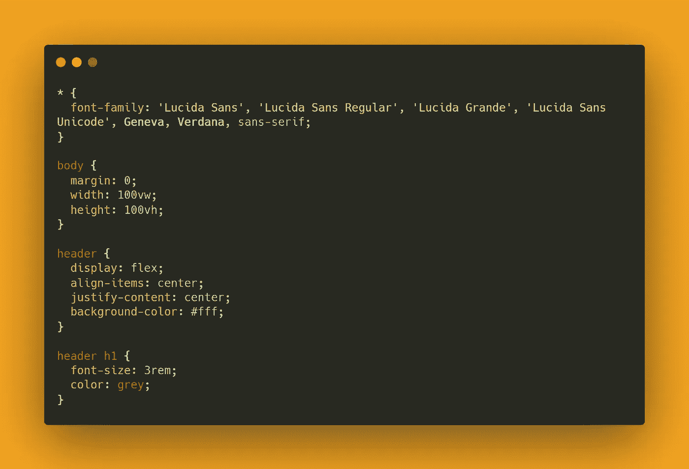
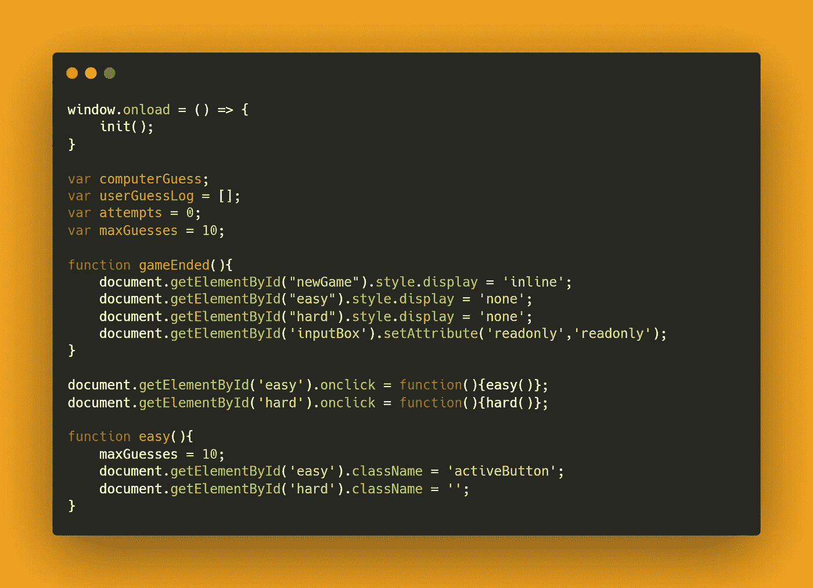

# HTML、CSS 和 JavaScript

> 原文：<https://blog.devgenius.io/html-css-javascript-8b67a0b9796b?source=collection_archive---------23----------------------->

## 初学者指南

## 一篇文章向初学者介绍了前端开发。

由 Kinng 在 draw.io 上创建

欢迎来到这篇文章，我猜你可能不熟悉前端开发，所以你进入这里。我会尽我所能分享我所知道的一切，让你对前端开发的元素和所有元素之间的关系有一个基本的了解。

# 什么是前端开发？

前端开发是创建客户端网页和应用程序的过程。例如，我们打开 facebook.com，我们在浏览器上看到的页面是客户端网页之一。此外，客户端网页通常不能存储数据。另一方面，后端开发或所谓的服务器开发是创建和托管存储(数据库)并在每次单击刷新按钮时根据请求与用户进行交互的开发。

# 为了找工作或开始我们的前端旅程，我们需要学习哪些编程语言？

一般来说，每种语言都有自己的 web 开发框架，但大多数都是后端开发。比如 Python 有 Django 和 Flask 来托管服务器。

对于初学者来说，从学习 HTML、CSS 和 JavaScript 开始是不错的。它们是 web 开发领域的基础，通过掌握这三个要素，你就能够构建一个简单的网站。将来，你可以在 ReactJs、AngularJs、Django 等网站上进一步发展你的技能，建立一个更复杂、更强大的网站。顺便说一下，脸书是一个强大而快速的网站的好例子，想象一下，脸书需要在一分钟内处理数十亿个请求和操作，而脸书是由 ReactJs 建立的。

# 什么是 HTML，CSS，JavaScript？

## 超文本标记语言

HTML，代表超文本标记语言，不是一种编程语言，但它是用来建立网站的主体。可以看作是网页的纽带。只包含 HTML 的网站看起来会很无聊，但所有第一代网页看起来都是这样。

截图来自[http://info.cern.ch/hypertext/WWW/TheProject.html](http://info.cern.ch/hypertext/WWW/TheProject.html)

代码编辑器中的 HTML 代码如下所示。PS 代码编辑器是让我们有更好的编码体验的工具，反正在记事本上写也是可以的…

HTML 示例代码

## [要了解更多关于代码编辑器的信息，请查看这个:)](https://medium.com/@fengyuan.yap/what-are-code-editors-ide-37727d6b8060)

 [## 什么是代码编辑器和 IDE？

### 你是一个初学者，不知道在漫长的编码旅程中应该选择哪一个？在这里，我将分享…

medium.com](https://medium.com/@fengyuan.yap/what-are-code-editors-ide-37727d6b8060) 

## 半铸钢ˌ钢性铸铁(Cast Semi-Steel)

CSS，代表层叠样式表，用来描述一个网站应该是什么样子。换句话说，CSS 允许我们设计我们的网页。如果 HTML 是骨骼，那么 CSS 就是网页的衣服和皮肤。一个只有 HTML 和 CSS 的网站可能会很棒，很迷人，但唯一的问题是所有的按钮都不起作用，或者更好的描述方式是只有 HTML 内置功能起作用，而你添加的按钮根本不起作用，即使它们是可点击的。

HTML + CSS

正如你所看到的，它看起来很完美，但所有的按钮都不起作用。下图是 CSS 代码的样子。此外，CSS 也不是一种编程语言。

## Java Script 语言

JavaScript 是一种编程语言，用于将网站的所有部分连接在一起，并为所有元素分配工作。因此，前端开发人员通常也被称为 JavaScript 开发人员。当然，与上面两种类型的代码相比，JavaScript 更难学，但它是让你的梦想网站活起来的那一种。HTML 是骨头，CSS 是皮肤，JavaScript 是肌肉。一个额外的信息是 JavaScript 已经安装在每个浏览器中，所以没有必要在你的电脑上安装，但是它不能在浏览器之外执行代码。为了解决这个问题，NodeJs 团队发布了 Node 来处理这个问题。你可能会听到 os NodeJs 和 DenoJs，它们是 JavaScript 运行的类似浏览器的环境。

下图是 JavaScript 的示例代码。

# 构建网页的工作流程是怎样的？

HTML，CSS，然后是 JavaScript。在 ReactJs 中，这个问题还没有解决，它允许程序员在 JavaScript 文件中编写 HTML。但是总是建议初学者从 HTML → CSS →JavaScript 开始。这个流程让你对如何从头开始创建一个网站有了更清晰的印象。

# 下一步是什么？

一开始编写 JavaScript 代码可能很难，但是从 HTML 和 CSS 开始，掌握构建网页的基本知识。然后用简单的 JavaScript 代码连接按钮和调用函数。[这里是免费 JavaScript 学习材料](https://www.w3schools.com/js/)的链接。另外，freecodecamp 和 YouTube 也是很好的素材来源。

如果你想跟踪你的编码之旅，想在采访中展示你的技能，那么我猜你也会对 GitHub 感兴趣。

 [## 什么是 GitHub？

### 这是一篇面向初学者的文章，讲述了为什么我们应该使用并上传我们的代码到 GitHub。以下是我对…的回答

medium.com](https://medium.com/@fengyuan.yap/what-is-github-260412a0dcd7) 

这是一个分享 GitHub 如何工作以及如何使用终端运行 Git 命令来上传、下载和分支您的代码的系列。

## 感谢您的阅读。没有人天生聪明，我们都是学来的。从事编程行业(IT)没有真正的本科证书门槛，尽你所能多学点。祝你好运。