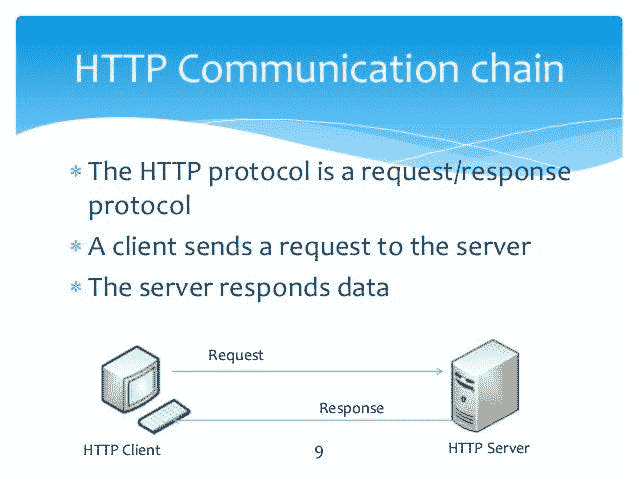
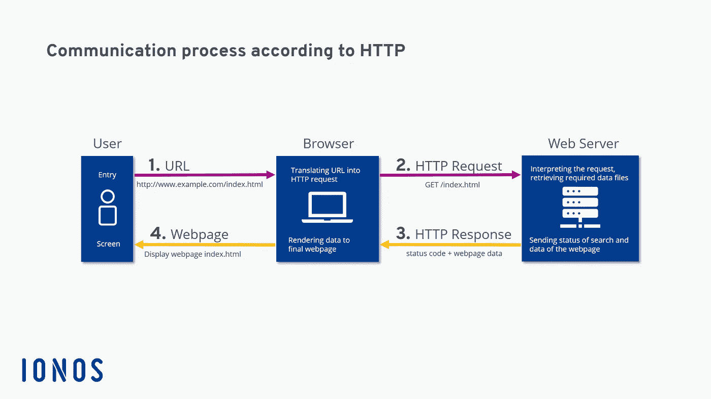
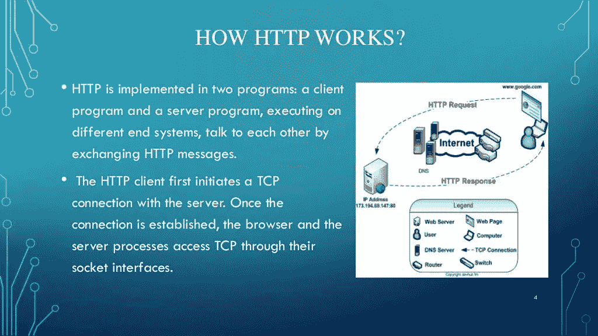
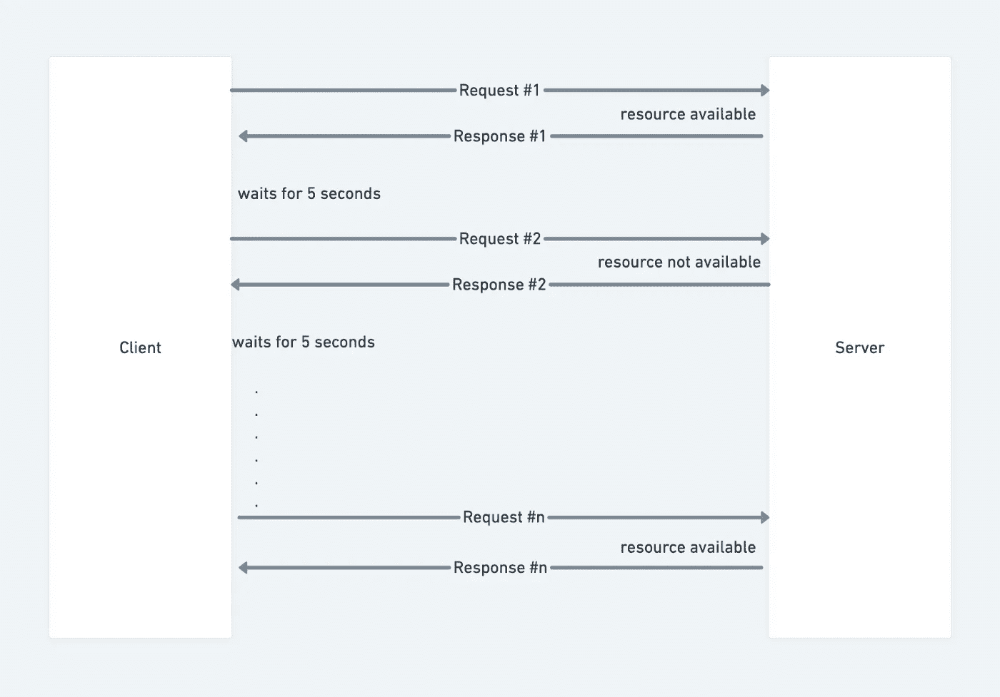
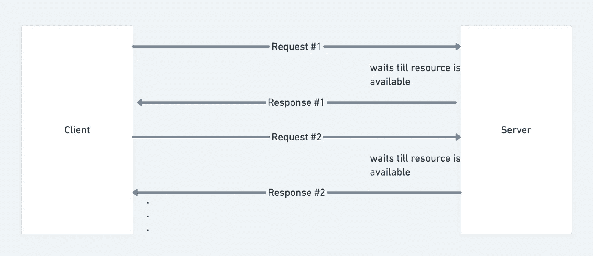
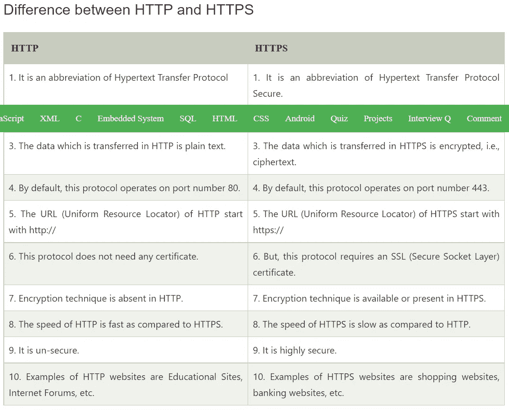
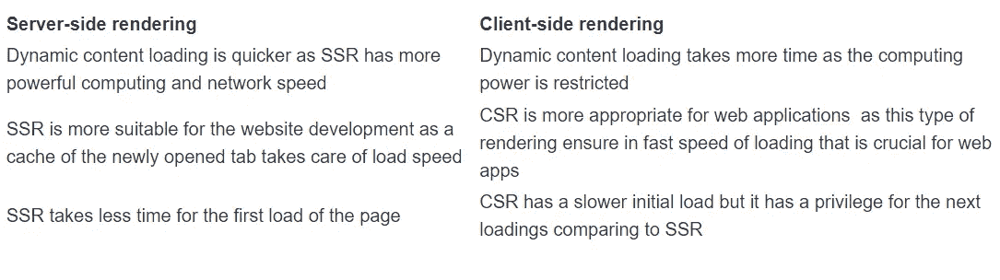
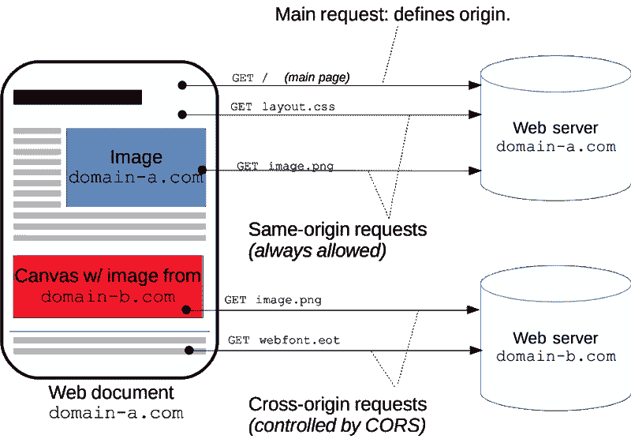

# HTML CSS-网络题库

> 原文：<https://blog.devgenius.io/html-css-web-question-bank-4b208c441068?source=collection_archive---------7----------------------->

# **什么是 HTTP 协议？**

## 回答:超文本传输协议(HTTP)是一个用于分布式、协作式、超媒体信息系统的会话层协议。

超文本传输协议(HTTP)是用于分布式协作超媒体信息系统的互联网协议簇模型中的应用层协议..

**HTTP 是一种用于通过网络获取资源的协议。它是一种客户端-服务器协议。客户端将"*请求*一个资源，服务器将把这个资源作为"*响应*"发送回来。**

> ***HTTP 是单向协议，这意味着通信总是由客户端发起。***

。
HTTP 是万维网数据通信的基础，其中超文本文档包括到用户可以容易地访问的其他资源的超链接，
例如通过鼠标点击或者通过在网络浏览器中点击屏幕。

## ***2)什么是 TCP 协议？***

答:TCP(传输控制协议)是互联网协议族的主要协议之一。它位于应用层和网络层之间，用于提供可靠的交付服务。它是面向连接的通信协议，有助于网络上不同设备之间的消息交换。

**优点**

*   这是一个可靠的协议
*   它提供了错误检查机制和恢复机制
*   它提供流量控制
*   它确保数据按照发送的准确顺序到达正确的目的地
*   开放协议，不归任何组织或个人所有
*   它为网络上的每台计算机分配一个 IP 地址，并为每个站点分配一个域名，从而使每个设备站点在网络上是可区分的。

**劣势**

*   TCP 是为广域网设计的，因此它的大小对于资源少的小型网络来说是个问题
*   TCP 运行几层，因此它会降低网络速度
*   它在本质上不是通用的。也就是说，它不能代表 TCP/IP 套件以外的任何协议栈。例如，它不能与蓝牙连接一起工作。
*   自从大约 30 年前开发以来没有修改过。

# 什么是 HTTP 头？

答: **HTTP 头**用于通过**请求**和**响应**头在客户端和服务器之间传递附加信息。所有标题都不区分大小写，标题字段由冒号分隔，键值对采用明文字符串格式。由空字段标头表示的标头部分的结尾。有几个标题字段可以包含注释。一些头可以包含由等号分隔的 quality(q)键值对。

**上下文中有四种报头:**

*   **通用头:**这种类型的头应用于请求和响应头，但不影响数据库体。
*   **请求头:**这种类型的头包含关于客户端获取的请求的信息。
*   **响应头:**这种类型的头包含客户端请求的源的位置。
*   **实体头:**这种类型的头包含关于资源主体的信息，如 MIME 类型、内容长度。

# 什么是 HTTP 轮询？

HTTP 轮询是一种机制，在这种机制中，客户端定期请求资源。如果资源可用，服务器会将资源作为响应的一部分发送出去。如果资源不可用，服务器将向客户端返回一个空响应。

# 什么是 HTTP 长轮询？

HTTP 长轮询是客户端向服务器请求资源，而 ***等待*** 服务器的机制。当请求的资源可用时，服务器返回响应。HTTP 连接一直保持打开，直到服务器有请求的资源可用，或者连接超时。当客户端收到响应时，连接被关闭。
一旦先前的连接关闭或超时，客户端就会向服务器发出另一个请求，循环继续。

# 几种常见的 HTTP 状态码是什么，它们的含义是什么？

HTTP 响应可以分为 5 类:

**1xx** — **信息响应**，表示请求已被服务器接收，是对客户端等待最终响应的指示。

**2xx** — **成功或接受响应**，表示请求被服务器成功接收并接受

**3xx** — **重定向响应**，通知客户端请求已经被重定向到另一台服务器，客户端需要采取明确的动作来完成请求

**4xx** — **客户端错误响应**，表示客户端发送的请求存在错误

**5xx** — **服务器错误响应**，表示服务器收到客户端请求，但由于服务器端错误，请求未完成

# 什么是 HTTPS？

**超文本传输协议安全** ( **HTTPS** )是[超文本传输协议](https://en.wikipedia.org/wiki/Hypertext_Transfer_Protocol) (HTTP)的扩展。它用于[计算机网络](https://en.wikipedia.org/wiki/Computer_network)上的[安全通信](https://en.wikipedia.org/wiki/Secure_communications)，广泛应用于互联网。

在 HTTPS，[通信协议](https://en.wikipedia.org/wiki/Communication_protocol)使用[传输层安全](https://en.wikipedia.org/wiki/Transport_Layer_Security) (TLS)或以前的安全套接字层(SSL)加密。因此，该协议也被称为**基于 TLS 的 HTTP**、[【3】](https://en.wikipedia.org/wiki/HTTPS#cite_note-3)或**基于 SSL 的 HTTP**。

# http 响应上的缓存控制是什么意思？

Cache-control 是一个 HTTP 头，用于在客户端请求和服务器响应中指定浏览器缓存策略。策略包括资源的缓存方式、缓存位置以及过期前的最大期限(即生存时间)。

# 什么是点击劫持？

**点击劫持攻击的目标是欺骗不知情的网站访问者在另一个网站(目标网站)上执行操作。**

例如，用户可能会被一个承诺给他们额外奖励的网站所吸引。当用户点击按钮接受奖品时，他们的点击被用来在电子商务网站上购买物品。通常，这种攻击是通过隐藏目标网站的用户界面并排列可见的用户界面来执行的，这样用户就不会意识到单击了目标网站。由于这种 UI 安排，这种攻击也被称为 *UI 矫正*或 *UI 矫正攻击。*

# 点击劫持攻击的类型

根据具体操作的性质，攻击可能采用不同的名称。例如，考虑以下变体:

*   ***Likejacking*** :这种攻击旨在抓取用户的点击，并将其重定向到脸书页面或其他社交媒体网络上的“赞”。
*   ***Cookiejacking***:在这种情况下，用户被引导与 UI 元素进行交互，例如，通过拖放，并向攻击者提供存储在其浏览器上的 cookies。这样，攻击者就能够代表用户在目标网站上执行操作。
*   *:通过这种类型的攻击，用户允许攻击者访问其本地文件系统并获取文件。*
*   ****光标移动*** :这种技术将光标位置改变到用户感知的不同位置。这样，用户相信他们正在做一个动作，而实际上他们正在做另一个动作。*
*   ****密码管理器攻击*** :此类攻击旨在欺骗密码管理器，利用其自动填充功能。*

# *服务器端和客户端渲染有什么区别？*

*因此，与没有动态内容呈现的静态站点的页面加载时间相比，服务器端呈现增加了页面加载时间。*

*什么是客户端渲染(CSR)？客户端呈现或 CSR 是处理网页以在浏览器上显示的不同方法。*

**

# *什么是渐进式渲染？*

***页面和图像的渐进式渲染**最简单的技术是，页面开始出现，甚至在所有文本和/或图像完全下载之前就可以阅读文本。*

*渐进式渲染是一种渲染模式，在这种模式下，程序会逐渐更新整个图像的小部分，从低质量到最终结果进行优化，而不是一次只关注图像的一小部分。*

*渐进式渲染过程由受控技术组成，这些技术可以从低质量到高质量连续更新整个视觉显示。这在保持高视觉质量的同时最大限度地提高了性能。*

# *什么是跨产地资源共享？(CORS)我们为什么需要它？*

***跨** - **源**-**资源**-**共享** ( **CORS** ) **跨** - **源**-**资源**-**共享** ( **CORS** )是一种基于 HTTP 头的机制，允许服务器指示除其自身之外的任何源(域、方案或端口)，浏览器应允许从其加载*

**

# *资源*

# ***CDN 或内容交付网络是做什么的？什么时候需要 CDN？***

***内容交付网络(CDN)是指地理上分布的一组服务器，它们协同工作，提供互联网内容的快速交付。***

*CDN 允许快速传输加载互联网内容所需的资产，包括 HTML 页面、java 脚本文件、样式表、图像和视频。CDN 服务越来越受欢迎，如今大部分网络流量都是通过 CDN 提供的，包括来自脸书、网飞和亚马逊等主要网站的流量。*

# *预取和预加载有什么区别？*

*预取与预加载非常相似，唯一的区别是**它是在页面加载后执行的。** Preload 获得更高的优先级，并告诉浏览器当前页面需要该特定资源。对于下一个导航动作所需的资源，预取将在以后发生。*

> *除了预加载资源之外，还可以预取它。预加载和预取之间的主要区别在于，当告诉浏览器预加载某个东西时，您肯定会需要某个资源。这赋予资源高优先级。*
> 
> *当使用预取时，您实际上是在告诉浏览器，资源可能(但不一定)会被需要。预取的资源比预加载的资源优先级低。*

## *预加载的资源通常用于当前页面，而预取的资源保留用于下一页面。*

# *预压是用来做什么的？*

***预加载通过告诉浏览器优先处理哪些资源来缩短网页加载时间。预加载通常用于关键资源，当这些资源比其他资源晚被发现时，会降低页面的加载速度。***

*在过去的几年里，浏览器在更快地发现和加载所需资源方面变得更好了。因此，preload 属性现在很少使用，只用于依赖重新加载来优化页面速度的资源。*

# *什么是 web 套接字？*

***Web 套接字被定义为服务器和客户端之间的双向通信，这意味着双方同时通信和交换数据。***

*该协议从头开始定义了全双工通信。Web sockets 在为 Web 浏览器带来丰富的桌面功能方面向前迈进了一步。它代表了客户机/服务器 web 技术的一种发展，这种发展已经等待了很长时间。*