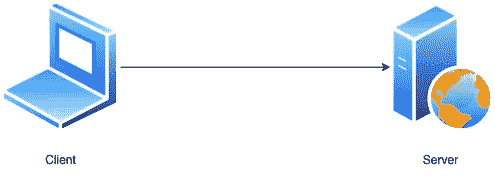
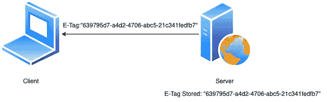
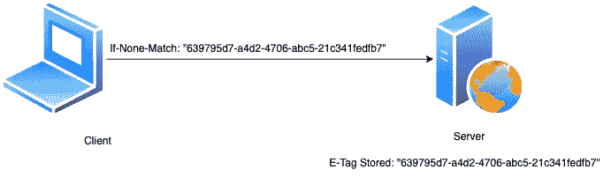

# HTML 电子标签

> 原文：<https://blog.devgenius.io/html-e-tags-326f49a3df58?source=collection_archive---------16----------------------->

# 什么是 HTML 电子标签？

用基本术语来理解，它们只是提供缓存机制的功能。所以让我们试着理解电子标签是如何工作的。

## 电子标签的工作原理

让我们假设有一个系统架构，如下图所示。 ***以下各处客户端简称浏览器。***

系统结构

客户端(浏览器)调用服务器获取特定网站的信息，比如说 xyz.com。服务器在发送响应的同时，还发送特定的电子标签。每个人都会想到使用这个标签的问题。当发送另一个请求以从服务器获取相同的网站数据时，客户端现在发送这个 E 标签，如果-无-匹配，则在标题中带有请求。每当网站数据有变化时，服务器更新电子标签，但是如果没有变化，则电子标签保持不变。因此，将 If-non-Match E-tag 与服务器 E-Tag 进行比较，如果没有变化，则整个后端处理不会发生，并且会向客户端发送一个响应，表明数据与之前调用的数据相同。可能将数据存储在某个地方的缓存中的客户端使用该缓存来显示网站数据。

带有电子标签的服务器响应

客户端发送电子标签和服务器检查

## 使用电子标签的好处

*   适用于低带宽设备，因为网站数据通常不会频繁更改
*   提高响应时间和即时用户满意度
*   电子标签机制也可以用来识别客户，但如何识别呢？

## 如何通过电子标签识别客户

因此，假设服务器总是发送对客户端调用的响应，因为数据与前一个调用相同。然后，服务器使用电子标签来识别客户端，并且收集的关于浏览历史等的所有数据可以用于向用户显示特定类型的活动、广告等，而无需知道用户的个人详细信息。即使用户没有登录到浏览器，也可以通过电子标签发送活动。

*希望你喜欢这篇文章。请鼓掌并订阅更多关于软件工程的信息性文章。*