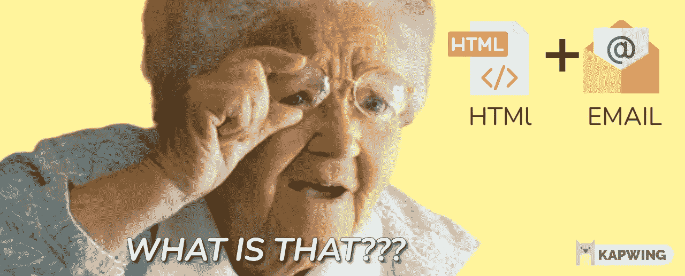
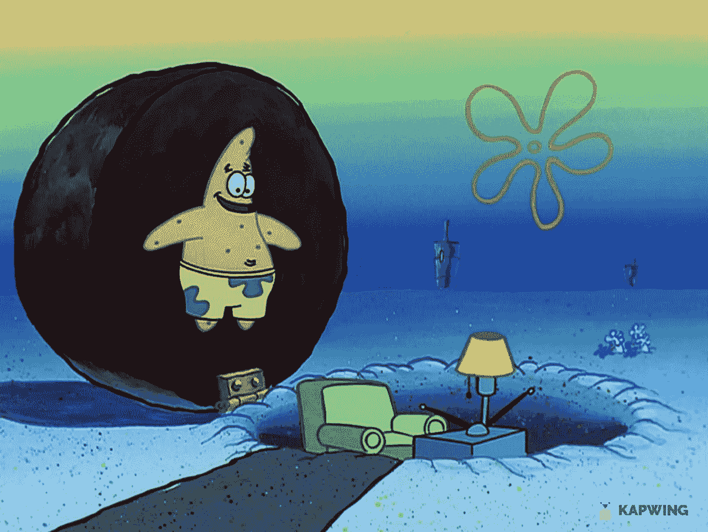
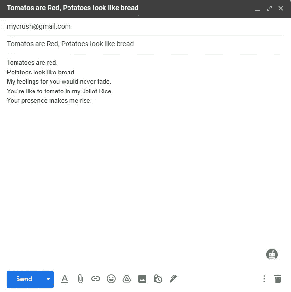

# HTML 邮件解释道。

> 原文：<https://blog.devgenius.io/html-email-explained-7ef777455081?source=collection_archive---------14----------------------->

由所有者制造

电子邮件开发导论。

如果你不知道什么是电子邮件，那么你能举起你的手吗？完美，(Snap)，我刚刚拍了一张照片，纪念我遇到一个比帕特里克更糟糕的人的时刻，他实际上住在一块岩石下。😂

啊啊啊

但是不要难过，我们每天都在学习，对吗？嗯，电子邮件是一种电子邮件，是一种通过互联网发送给你的信件。维基百科将电子邮件定义为使用电子设备的人之间交换信息的一种方式。这些邮件通常是在我们的电子邮件客户端提供的界面中制作和编写的，例如，下面是我用 Gmail 给我喜欢的人写电子邮件的例子。这封邮件清楚地表明了我有多喜欢她😌

给我喜欢的人的电子邮件

抛开我的天才文字游戏，我们可以看到上面的邮件是用纯文字写的。没有特别的附加功能，即使我想添加一张图片，我也可以通过点击 Gmail 提供的按钮来完成。对于 HTML 格式的电子邮件来说就不一样了。HTML 电子邮件是用 HTML 和 CSS 编写的电子邮件。这是普通邮件和 HTML 邮件的唯一区别。下面是一个活生生的例子。

我在 16-17 岁时偶然发现了这个编程领域，但当时我并不感兴趣。但是最近我一直在 youtube 上看[伊万·赫特的](https://www.youtube.com/c/IvanHurt)视频，这似乎是一项非常有利可图的学习技能。因此，我踏上了成为一名电子邮件开发人员的旅程，并得到了这个袋子。当然还有关于我旅程的博客。如果你想跟我一起踏上这段旅程，你需要:

1.  一个代码编辑器，例如 VS code，Sublime text e.t.c(添加 EMMET 插件),用于编写我们的代码
2.  一个浏览器(或者一个[石蕊订阅](https://www.litmus.com/)，如果你负担得起的话)来预览我们的电子邮件。

## 到目前为止我所学到的

*   雷·汤姆林森发明了电子邮件的现代概念。

*   第一封邮件发出的年份？1971 年。这是第一次使用带有@符号的电子邮件。
*   第一封垃圾营销邮件是在 1978 年由一个叫加里·瑟尔克的人发出的

— **为什么电子邮件很重要:**

1.  2019 年 39 亿邮箱用户(Radicati 集团)。这比任何社交媒体平台都多🤯
2.  人们平均每个工作日花 2.5 个小时在收件箱里
3.  每花一美元就赚 42 美元(石蕊)。所以不要被所有那些恶意的 HTML 邮件所愚弄

如果你对上面的文章感到气馁，这里有更多电子邮件很重要的原因

1.  电子邮件很容易发送，而且相对便宜。请记住，每花 1 美元就能赚 42 美元
2.  跟踪电子邮件很简单。(稍后将详细介绍这一点，这里有相关服务)
3.  测试电子邮件很快，使迭代变得容易。(如果你有一个电子邮件营销活动的想法，你肯定会工作，你可以立即测试它，立即得到你的答案，并再次尝试)
4.  电子邮件很容易被遗忘。对子孙后代来说很糟糕，但当我们搞砸的时候却很好。相信我，我们会搞砸的😂。此外，收集一些不应该被遗忘的很酷的电子邮件

## 这种利基发展最好的部分是，没有人真正拥有电子邮件。

*   电子邮件是普遍和流行的
*   电子邮件赚了很多。我指的是一大笔[钱](https://www.youtube.com/watch?v=oy0WR3hrC1I&t=28s)🤯

最后是**网！= HTML**

## 所以如果你和我一起做这个，这是我们拿到袋子需要的技巧。

1.  对 HTML 和 CSS 有相当的了解

*   内嵌 CSS
*   桌子
*   媒体查询

2.电子邮件服务提供商

*   MailChimp，活动家，持续接触(我们需要知道如何在那里插入代码)
*   自动响应
*   定序

3.电子邮件或石蕊

4.用计算机修改（图片或照片）

*   至少如何移除资产。

## 所以是的，让我们做所有的报纸💵通过这些课程🎒(点击这里阅读本系列的下一部分)。**此外，如果您有任何问题，请随时在**[**Twitter**](https://twitter.com/MyhnTari)**上问我，或者如果您需要认真的辅导，您可以在这里** 联系我

# **参考**

1.  **Venessa 关于 Skillshare 的 HTML 电子邮件课程[https://venessabaez.com/link-in-bio/](https://venessabaez.com/link-in-bio/)**
2.  **伊万·赫特的 Youtube 频道**
3.  **[Jason Rodriguez 的 HTML 电子邮件 v2](https://frontendmasters.com/workshops/html-email-v2/)**