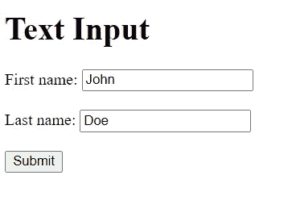
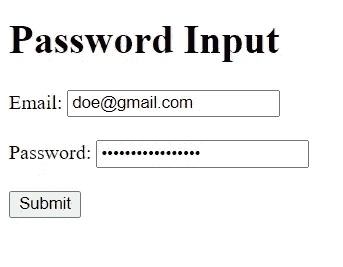
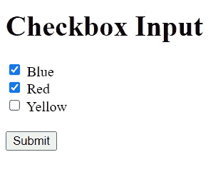
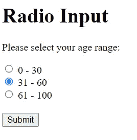
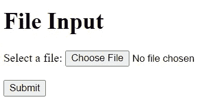
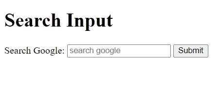
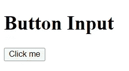

# 如何用 HTML 创建简单的表单？

> 原文：<https://blog.devgenius.io/html-form-4f06ee90ac5?source=collection_archive---------12----------------------->


你好世界！

作为记录我在学习过程中进步的一部分，我会每两周发布一次关于我所学内容的有见地的内容。

本周我将带你踏上了解 HTML 表单和使用输入元素的旅程。

让我们开始吧！

HTML 表单用于从用户那里收集信息。使用带有开始和结束标签的

**动作属性**

您可以构建仅使用纯 HTML 就能向服务器提交数据的 web 表单。您可以通过在表单元素上指定 action 属性来做到这一点。使用 action 属性指向用户提交表单后将加载的网页。

```
<form action ="https://www.google.com">
</form>
```

**方法属性**

method 属性指定提交表单时使用的 HTTP 方法(GET 或 POST)。

**注:**

当您使用 GET 时，表单数据将在页面地址中可见。如果表单正在更新数据或包含敏感信息(密码)，请使用 POST。POST 提供了更好的安全性，因为提交的数据在页面地址中不可见。

```
<form action ="url" method="GET"> </form>
<form action ="url" method="POST"> </form> 
```

**用户输入**

根据属性的类型，元素有许多变化。input 元素由其 type 属性定义，该属性指定要显示的 input 元素的类型。根据输入元素的特定属性，有几种类型的输入元素。它可以是文本、密码、单选按钮、复选框、提交、电子邮件、文件、按钮、搜索、数字、日期等。input 元素是自结束元素，它没有结束标记。下面我将通过一些例子来讨论一些重要的输入类型。

1.  **文本输入**

```
<input type ="text">
```

文本输入定义了一个单行文本字段，该文本字段的默认宽度为 20 个字符。

```
<h1> Text Input </h1>
<form action ="thanks.html">
<label for="fname">First name:</label>
<input type="text" id="fname" name="fname"><br><br>
<label for="lname">Last name:</label>
<input type="text" id ="lname" name="lname"><br><br>
</form>
```

2.**提交输入**

```
<input type="submit">
```

提交输入指定一个按钮，将所有表单数据发送到表单处理程序。表单的 action 属性指定了表单的处理程序。在下面的例子中，如果你点击提交按钮，表单数据将被传送到一个名为 thanks.html 的页面。注意，下面的例子是文本和提交输入类型的组合。

```
<h1> Text Input </h1>
<form action ="thanks.html">
<label for="fname">First name:</label>
<input type="text" id="fname" name="fname"><br><br>
<label for="lname">Last name:</label>
<input type="text" id ="lname" name="lname"><br><br>
<input type ="submit" value="Submit">
</form>
```



文本和提交输入类型

3.**邮件输入**

```
<input type= "email">
```

电子邮件输入为电子邮件地址定义了一个字段，并且验证该值以确保其被正确格式化为电子邮件地址。

4.**密码输入**

```
<input type="password">
```

密码输入屏蔽了输入的所有字符，这是一种提供额外密码安全性的方式，可防止他人窥探。下面的例子结合了电子邮件和密码输入类型。

```
<h1> Password Input </h1> 
<form action="thanks.html">
<label for="email">Email:</label>
<input type="email" id="email" name="email"><br><br> 
<label for="password">Password:</label>
<input type="password" id="psw" name="psw"><br><br>
<input type="Submit"
</form> 
```



电子邮件和密码输入类型

5.**复选框输入**

```
<input type="checkbox"
```

复选框允许用户从一组有限的可能性中选择一个或多个选项。下面我们来看一个例子。

```
<h1> Checkbox Input </h1>
<form action="thanks.html">
<input type ="checkbox" id="veicle1" name="vechicle1" value="Van">
<label for="vehicle1">Blue</label><br>
<input type="checkbox" id="vehicle2" name="vehicle2" value="Bus">
<label for ="vehicle2">Red</label><br>
<input type="checkbox" id="vehicle3" name="vehicle3" value="Car">
<label for ="vehicle3">Yellow</label>
<input type="submit" value="Submit">
</form>
```



6.**无线电输入**

```
<input type="radio">
```

无线电输入在无线电组中提供，其中一次只能选择一个无线电按钮。

```
<h1> Radio Input </h1>
<form action="thanks.html">
<p> please select your age range:</p>
<input type="radio" id="age1" name="age" value="30">
<label for="age1">0-30</label><br>
<input type="radio" id="age2" name="age" value="60">
<label for="age2">31-60</label><br>
<input type="radio" id="age3" name="age" value="100">
<label for ="age3">61-100</label><br>
<input type="submit" value="Submit">
</form>
```



无线电信号输入

7.**文件输入**

```
<input type="file">
```

对于文件上传，文件输入定义了一个文件选择字段和一个“浏览”按钮。

```
<h1> File Input</h1>
<form action="thanks.html">
<label for="myfile">Select a file:</label>
<input type="file" id="myfile" name="myfile"><br>
<input type="Submit">
</form>
```



文件输入

8.**搜索输入**

```
<input type="search">
```

用于输入搜索字符串的文本由搜索输入定义。如果不为搜索字段命名，将不会发送任何内容。参数“q”是搜索输入中最常用的名称。

```
<h1> Search </h1>
<form action ="thanks.html">
<label for="q"> Search Google:</label>
<input type="search" id="q" name="q" placeholder="search google">
<input type="submit" value="Submit">
</form> 
```



搜索输入

9.**按钮输入**

```
<input type="button">
```

一个可点击的按钮是由按钮输入定义的，当它被点击时，通常会激活一个 JavaScript 或 php 代码。

```
<h1> Button Input </h1>
<form>
<input type="button" value="Click me">
</form>
```



按钮输入

**结论**

如您所见，在构建需要在界面上输入数据的应用程序时，input 元素非常重要。值得学习如何创建输入字段以及定义它们的属性和特性。

希望你喜欢这个？

你可以查看我在 [Codepen](https://codepen.io/mercysticks/pen/GRMmwJN) 上创建的一个简单的注册表单。

更多内容关注我。

[推特](https://www.twitter.com/mercysticks)

[代码打开](https://codepen.io/mercysticks)