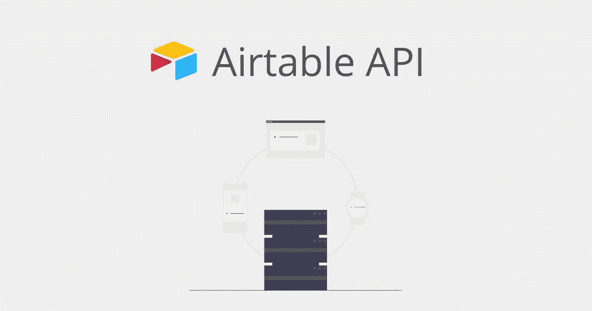
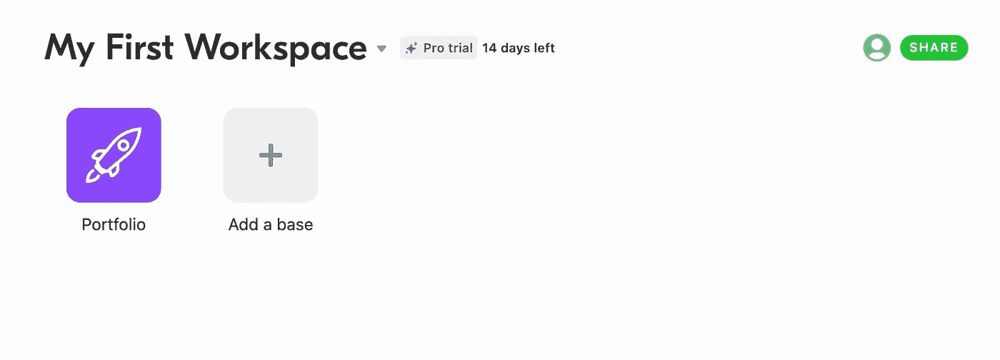
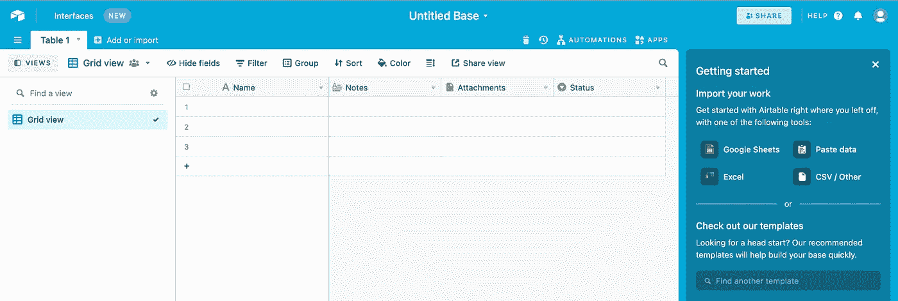
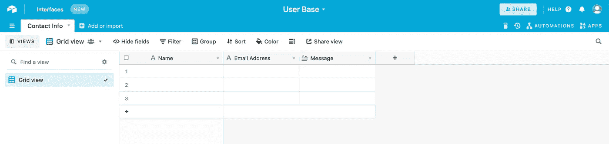
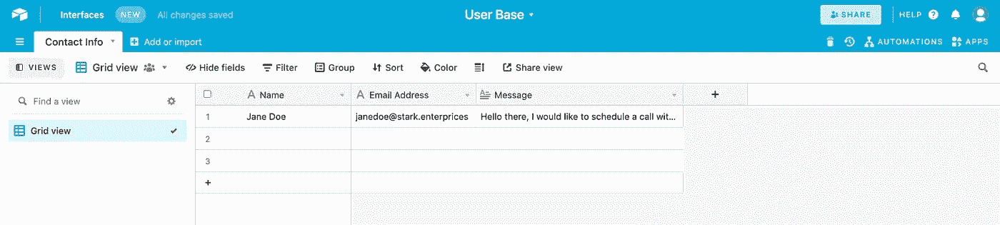
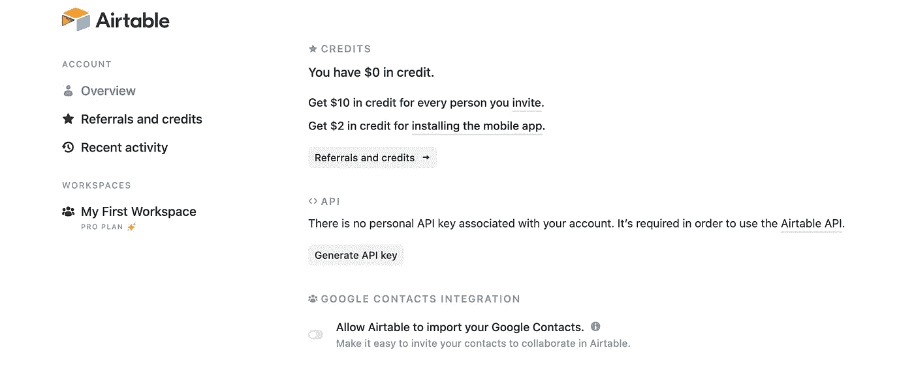
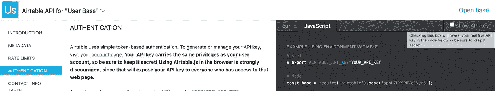
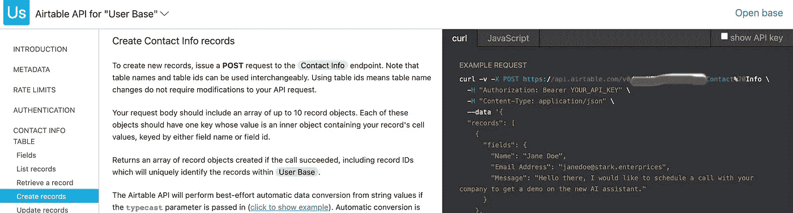
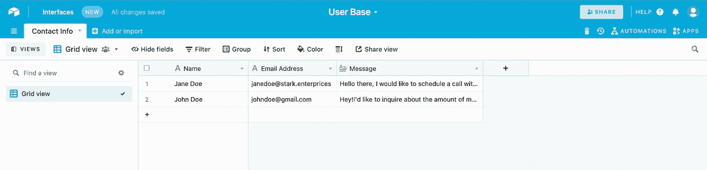

# 通过 REST API 将 HTML 表单数据发布到 Airtable

> 原文：<https://blog.devgenius.io/html-form-to-airtable-via-api-fc2f6f743cef?source=collection_archive---------4----------------------->



图片来自[https://www.softr.io/learn/airtable/airtable-api](https://www.softr.io/learn/airtable/airtable-api)

根据他们网站的说法， [**Airtable**](https://airtable.com) 是一个用于构建协作应用的低代码平台。这是一个从电子表格中存储数据的好方法。它还允许像 slack 和 email 这样的集成，一旦有新记录，您就可以收到直接通知。它可以用于从等待列表、联系信息甚至活动注册中收集数据。

在本文中，我将向您展示如何使用 REST API 将 HTML 表单中的数据发布到 Airtable 上的表格中。

**先决条件**

对于这个项目，你需要以下:

1.  有一些使用 HTML 和普通 Javascript 编码的经验

**我们开始吧**

**a .创建 Airtable 基础**

为此，请访问 [airtable 网站](https://airtable.com/)，如果您还没有帐户，请创建一个帐户。完成所有入职步骤并登录后，点击“**我的第一个工作区**”下的“**添加基础**”，如下所示。



工作区截图

当你点击它的时候，你应该会看到这样的内容:



充气台底座；默认视图

让我们在这里复习一些术语。

1.  "**未命名的库**"是你的库的名字，把这个想象成一个可以有多个可以互连的表的数据库。你可以点击文本，给它一个你喜欢的名字。我将命名我的**用户群。**
2.  " **Table 1** "是我们将要使用的表的名称。这个表将包含我们的 HTML 表单中的字段，所以您可以给它一个解释它收集什么数据的名称。要编辑名称，请单击 Table 1 旁边的小下拉菜单，然后选择 rename table。我会把我的改名为**联系方式**。
3.  默认情况下，airtable 会为您创建一些字段(**名称、注释、附件、**等)。您应该编辑它们，以匹配您在 HTML 表单中收集的输入。在我的情况下，我将收集一个人的名字，他们的电子邮件地址和他们的信息，因为它应该是一个网站上的联系方式。要编辑字段名称，点击每个默认字段旁边的下拉菜单，选择“**重命名字段**”，并输入您想要的名称。输入新名称后，记得按 enter 键。
4.  有几种字段类型，如文本、复选框、单选、电子邮件等。点击“**自定义字段类型**，选择合适的字段类型

到现在为止，你的基地应该是这样的:



定制充气台底座

现在我们已经创建了我们的 airtable 库，让我们添加一个将在下一步中使用的虚拟记录。下面是基地现在的样子:



带有样本数据的自定义飞行表库

现在我们已经有了一个基础数据、表格数据和样本数据，让我们生成一个 API 来发送表单数据。

**b .生成一个 Airtable API 密钥**

对于这一步，转到 A [irtable REST API 页面](https://airtable.com/api)并选择您刚刚在“选择一个基础”部分创建的基础。您应该被重定向到您的基础 API 的文档页面。请务必通读介绍，以便完全理解 API 的内部工作原理。阅读之后，第一步是认证。

**一、认证:**

这将确保只有经过身份验证的用户才能将表单发布到您的数据库。为此，在一个单独的选项卡上，转到[您的帐户页面](https://airtable.com/account)获取您的秘密 API 密钥。



Airtable 帐户页面

在 API 部分，点击**生成 API。这将创建一个密钥，您应该复制并存储在一个安全的文件中。现在我们有了密钥，让我们回到我们的文档来获取我们的 API。**

**二。获取 API url**

默认情况下，Airtable 检测到您已经创建了 API，要查看它，只需刷新您的文档页面，单击您右侧的 javascript 选项卡，然后单击“ **show API** ”复选框。



基础的 Airtable 文档

现在，我们需要获得一个帖子的 url，在左侧菜单中，单击您的表格，然后转到“**创建记录**”部分。在这里，点击左边代码区域的 curl 标签来查看你的文章 url。它应该是这样的:



Airtable URL 示例

正如您所看到的，它显示了一个 curl post 示例，发布了我们之前添加的样本记录。在这里，让我们复制我们的表的 url，从 https 开始直到第一行的结尾，留下反冲。在我的例子中，我将从 https 复制到 info。这是你的文章网址。这样，我们就可以发布到我们的表单上了！

**c. HTML 表单集成**

既然我们现在有了 API url 和特殊的 API 键，让我们跳到 HTML 表单。同样，在这一步中，将您在表中添加的字段添加到 Airtable 上。这是我的表格:

```
<form id="contactForm"><div> <input type=”text” id=”Name” name=”Name” placeholder=”Your Name”></div><div> <input type=”text” name=”EmailAddress” id=”EmailAddress” placeholder=”Your Email”></div><div> <textarea id=”Message” name=”Message” cols=”30" rows=”6" placeholder=”Your Message”></textarea><div> <input id=”submit” name=”submit” type=”submit” value=”Send Message”></div></div></form>
```

如您所见，我已经创建了我在联系人表中添加的字段。接下来，我们进入最重要的部分，这是将我们的数据发布到 airtable 的脚本。

在你的 html 文件的末尾，在你可能有的任何其他脚本文件的上面，创建一个新的

```
<script>
var thisForm = document.getElementById("contactForm");const headers_ = { 'Authorization': 'Bearer <YOUR SECRET API KEY>', 'Content-Type': 'application/json'};// When the form is submitted...thisForm.addEventListener("submit", function(event) { event.preventDefault(); // POST the dataaxios.post(<YOUR AIRTABLE URL>,{ "fields": { "Name": document.getElementById("Name").value, "Email Address": document.getElementById("EmailAddress").value, "Message": document.getElementById("Message").value}}, {headers: headers_}).then((resp) => { console.log("success!")})
.catch(function (error) { console.log(error);});});</script>
```

让我们看一下我们的代码。

1.  我们做的第一件事是通过引用 ID 来获取表单。我们将表单分配给变量 *thisForm。*
2.  接下来我们要做的是创建我们的头部，它将被附加到我们的请求中。这是我们使用由 Airtable 生成的秘密 API 密钥的地方。用你得到的密钥替换*你的秘密 API 密钥>T3。另一个头是内容类型，我们将它设置为 json，如图所示。*
3.  接下来，我们声明当用户通过点击提交按钮提交表单时应该发生什么，我们将该按钮的类型设置为*提交。*我们创建一个事件监听器来处理发布。
4.  首先，我们添加了一个 preventDefault 函数来防止表单被默认的 HTML 函数提交。
5.  接下来，我们添加 axios 函数来发布表单。在我们继续之前，由于 axios 是第三方库，我们需要将它导入到我们的 HTML 文件中以便使用它。在您的部分添加以下代码行:

```
<script src=”https://unpkg.com/axios/dist/axios.min.js"></script>
```

6.用从 API 页面复制的 URL 替换您的 AIRTABLE URL。它的语法应该是类似于[***https://api.airtable.com/app****/ContactInfo***](https://api.airtable.com/app****/ContactInfo)***的东西。***

字段部分主要是将表单输入链接到 airtable 中的表的字段。 ***NB。引号中的字段是 Airtable 中字段的名称，它们区分大小写。***

7.接下来的部分基本上通过了我们声明的头文件， ***。然后*** 显示如果 post 成功应该发生什么。在这里，一旦用户发帖，你可以做任何你想让你的页面做的事情；这可能是重定向到另一个页面，显示成功消息等。无论你喜欢什么。如果 ***下出现错误，您还可以自定义错误消息。赶上*节**节。

仅此而已！添加这个脚本文件后，通过表单提交一些数据来测试应用程序，并观察会发生什么。如果您正确配置了所有内容，您应该会在 airtable 中看到一条新记录，如下所示:



向 Base 成功发布数据的示例

**结论**

Airtable 是一种在 GUI 中存储详细信息的好方法，该 GUI 易于查看并与其他应用程序集成以跟踪您的数据。我希望这篇文章能有所帮助，如果你有任何问题或挑战，欢迎在评论区留下。谢谢大家！