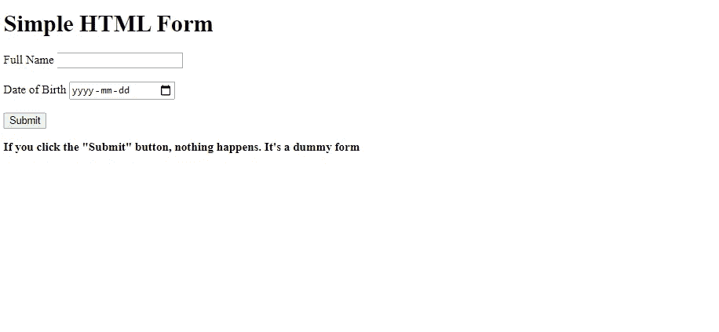
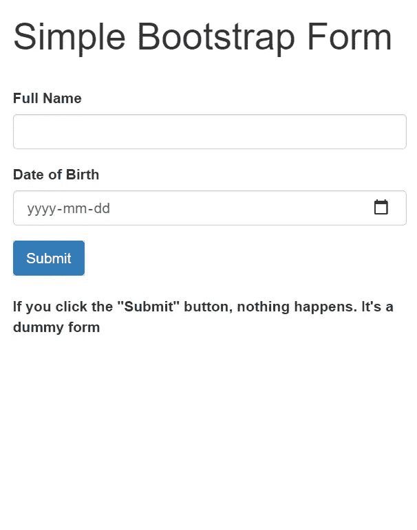

# HTML 表单与引导表单

> 原文：<https://blog.devgenius.io/html-forms-vs-bootstrap-forms-5d2001318f25?source=collection_archive---------2----------------------->

## 在这个简短的教程中，让我们了解使用 Bootstrap 表单优于 HTML 表单的重要性。

**纸质表格；照片由** [**凯莉·西克玛**](https://unsplash.com/@kellysikkema?utm_source=unsplash&utm_medium=referral&utm_content=creditCopyText) **上** [**下**](https://unsplash.com/s/photos/forms?utm_source=unsplash&utm_medium=referral&utm_content=creditCopyText)

# 表单(HTML)

HTML 表单(也称为 web 表单)用于从用户那里收集数据。用户可以通过多种方式填写 web 表单，如文本字段、单选按钮、下拉框和复选框。在这个简短的教程中，我们将学习实现一个简单的 HTML 和 Bootstrap 表单，并了解它们之间的区别。首先，在这个简短的教程中，你将理解响应的概念及其重要性。

# 使用 HTML 和 Bootstrap 实现表单

所以让我们用 HTML 和 Bootstrap 做一些基本的前端编码。现在为了使这更容易，我实现了两个简单的表单，都有两个输入字段:**全名**和**出生日期。**这两种形式有一个共同点，[即](/i.e.)两者的基础代码都是 HTML，但另一个有一个与 HTML 标签相关联的引导框架，如下所示。

## HTML 表单

实现一个简单的 HTML 表单相对来说比较简单。你所要做的就是使用一个**表单**标签，对于输入字段，你需要在**表单**标签中使用**输入**标签。**输入**标签的**类型**非常重要。根据你的喜好使用它。要了解输入类型，请参考下面的文章。

 [## HTML 输入标签

### 一个有三个输入字段的 HTML 表单；两个文本字段和一个提交按钮:名:姓:标签指定…

www.w3schools.com](https://www.w3schools.com/tags/tag_input.asp) 

最后，`**label**` 标签为`**input**`标签提供文本。点击`**submit**` 按钮，也就没有动作了。如果您需要任何动作，请在`**form**` 标签内的`**action**`标签中提供。现在让我们把你从上面学到的所有理论输入到如下所示的代码中。

## 结果

要查看上述代码的结果，您需要将上述代码键入或复制粘贴到 IDE 中。我使用 [**括号**](http://brackets.io/) 来执行我的前端代码。无论如何，当你执行上面的代码时，结果将是一个简单的形式。但是重要的部分当你点击**检查** ( **Ctrl-Shift-I** )然后点击**切换设备工具栏(Ctrl+Shift+M)** 。从下拉列表中，您可以选择任何智能手机或平板电脑设备。这用于检查网页或网站的响应性。

**缩放至 150%百分比的像素 2XL 的表格结果**

从上面的结果可以看出，这个窗体被缩小了很多。原谅我的非技术语言，我的意思是说，不回应。如果是这种情况，那么用户使用上面的 HTML 表单会非常沮丧。我不会开心的。那么你可能会问，解决方案是什么？。您的答案将在本教程的下一部分提供。

> 让我给你一个提示，要使表单具有响应性，一定要使用 Bootstrap 框架。

## 引导表单

实现一个简单的引导表单相对来说比较简单。首先，试着理解 Bootstrap 不是一种独立的 web 开发语言，它只是一个 HTML、CSS、JavaScript 框架**你可能不得不在 HTML 标签中使用。要更好地理解 Bootstrap，请参考下面给出的文章。**

 [## 什么是 Bootstrap:初学者指南

### Bootstrap 已经成为前端开发者的必备工具。但是什么是自举呢？你知道这很有用，但是…

careerfoundry.com](https://careerfoundry.com/en/blog/web-development/what-is-bootstrap-a-beginners-guide/) 

首先，我们需要在一个`**div**` 标签中使用一个名为`**container**` 的类，这是在使用默认网格系统进行响应时所需要的**。**可以使用每个标签中的类来扩展引导功能。就像上面实现一个表单一样，你所要做的就是使用一个`**form**` 标签。使用 form-group 类进行响应。同样，对于输入字段，使用`**form**` 标签本身内的输入标签，为此，您需要使用类`**form-control**` ，它将根据屏幕宽度扩展字段以保持响应性。

最后，`**label**` 标签为`**input**`标签提供文本。点击`**submit**` 按钮，也就没有动作了。如果您需要任何动作，请在`**form**` 标签内的`**action**`标签中提供。确保在`**head**` 标签中包含所有必要的 CSS、Javascript 引用。请参阅下面的文章，该文章解释了用于引导的入门模板。

 [## 介绍

### 开始使用 Bootstrap，这是世界上最受欢迎的用于构建响应迅速、移动优先的站点的框架，包括…

getbootstrap.com](https://getbootstrap.com/docs/4.3/getting-started/introduction/) 

现在让我们把你在上面学到的所有理论输入到如下所示的编码中。

## 结果

当您在智能手机或平板设备上执行上述代码时，您将会体会到响应能力的神奇之处。现在，无论其长宽比如何，表单都能清晰、精确地适应屏幕。感谢 Bootstrap，我想现在你已经得到了上述问题的答案。

**缩放至 100%百分比的像素 2XL 的表格结果**

# 结论

恭喜你，你已经到达教程“ **HTML 表单 vs Bootstrap 表单**”的结尾。我希望现在你已经理解了当响应是你的网站或网页的关键时，使用 Bootstrap 的必要性。关于 Bootstrap，还有更多需要学习和探索的地方。这只是一个关于实现表单的小教程，如果有新的东西引起了你的注意，请告诉我。如果您对代码或建议有任何疑问，请使用下面的评论部分。我会尽快回复你。就目前而言，这只是本教程的一部分，请继续关注更多更新。在那之前，注意安全。