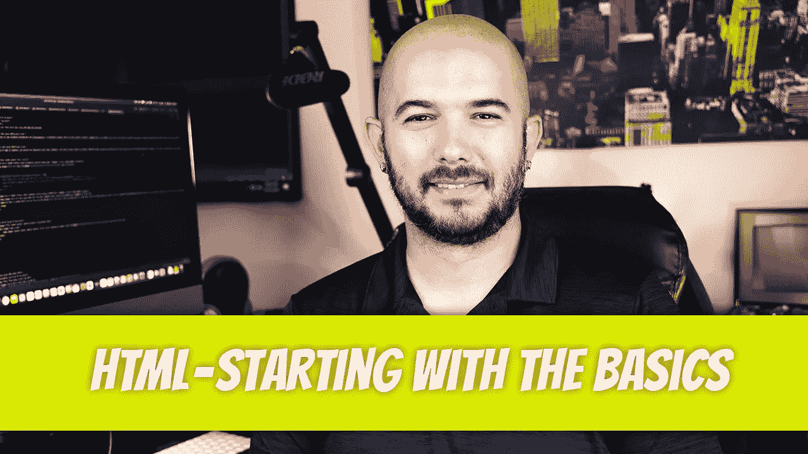
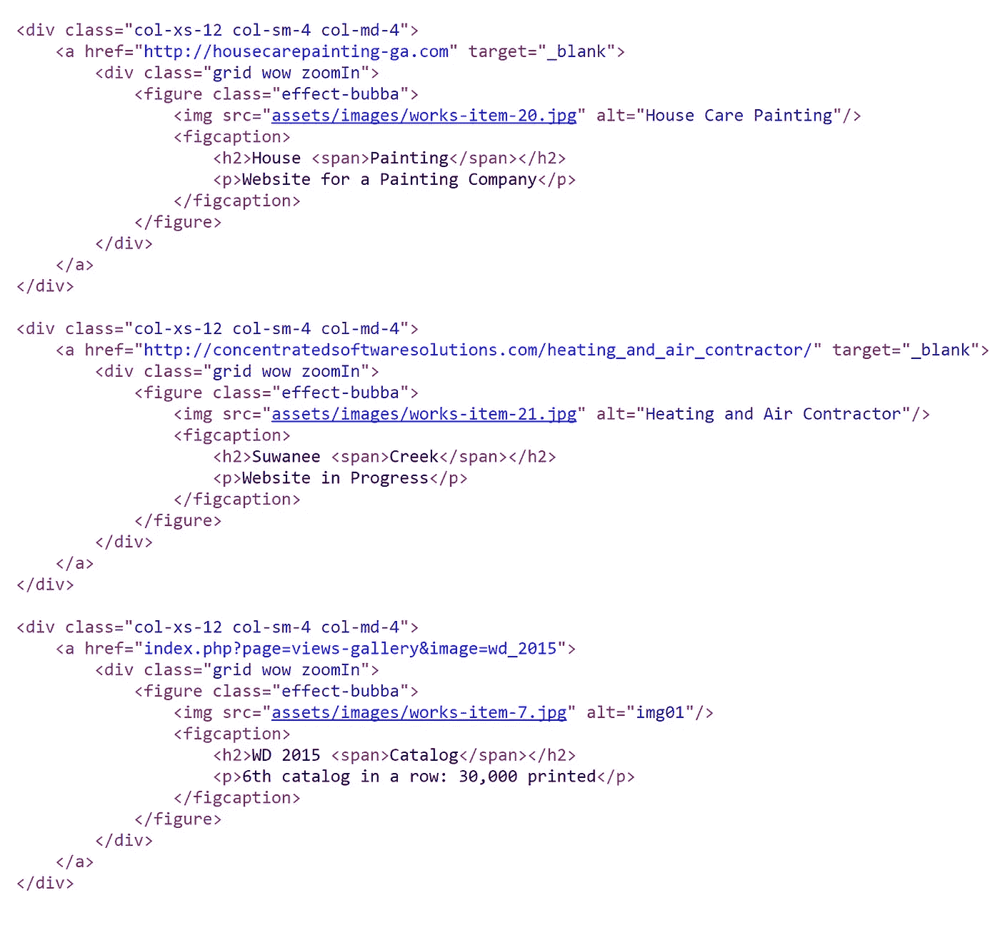
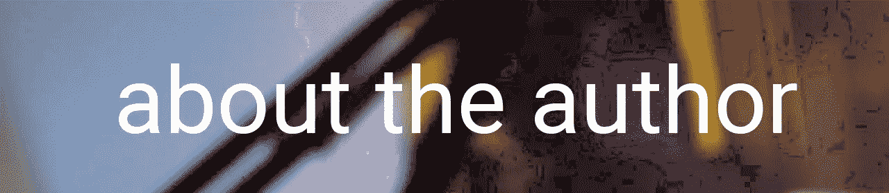

# P1:从基础开始

> 原文：<https://blog.devgenius.io/html-p1-starting-with-the-basics-a05e543b4d5b?source=collection_archive---------11----------------------->

HTML 是一种标记语言，由网络浏览器读取并翻译成用户可以与之交互的网站。HTML 代表超文本标记语言。存在许多组成每个网页的 HTML 元素。为了熟悉其中的一些，右键单击你最喜欢的网站，然后单击“查看页面源代码”(此过程因浏览器而异)。

您应该会看到类似下面列出的一些代码。回顾这一部分，您会注意到存在一些元素，每个元素都有一个开始标记和一个结束标记。例如，

…中有其他元素，每个元素都有一个开始标记，后面跟着一个结束标记。现在，知道这些元素做什么并不重要，只要意识到它们的存在就行了。仔细阅读每个 div 部分后，您会注意到一个模式出现了。似乎有一个网站链接，一个图片链接(通过观察。jpg 扩展名)和描述该图像内容的标题。如果您现在对 HTML 代码一无所知，您仍然可以很容易地推断出将构建三个网站元素，并且您将是正确的。

浏览器用这段代码做什么？它将其转化为更具视觉吸引力的网站。在大多数情况下，网站需要做到以下几点:

*   提供视觉上吸引人的内容。一个人浏览无数网站的注意力持续时间相对较短。如果用户不能在几秒钟内弄清楚这个网站是关于什么的，他们会离开这个网站，去找另一个网站。
*   提供优质内容。一旦网站吸引了用户，下一个目标就是让用户尽可能长时间地呆在上面。
*   提供简单的导航。如果用户不知道如何在页面之间导航，用户就会放弃这个网站。

不同类别的网站，如电子商务网站，拥有进一步的要求。

浏览器如何把上面的代码翻译成网站？这就是开发浏览器的公司所担心的编程的魔力。作为一个 HTML 创建者，你不需要为这些问题而烦恼。您所关心的是当您在浏览器中查看 HTML 时它会做什么。让我们看看上一页的代码产生了什么。

显示三幅图像。如果你还记得在源代码讨论中，我们说过要创建三个元素。我们还注意到，每个元素都有:

*   一个图像:通过观察元素，每个元素中都有一个图像。
*   标题:同样，我们可以在每个元素中看到一个标题。
*   链接:我们看不到链接，但当我们滚动图像时，我们注意到图像发生了变化。我们只能假设，如果我们点击图像，我们将被重定向到另一个页面。

通过以结构化的方式添加更多的元素，网站就被创建了。前四章是关于创建网站的。我们将使用 HTML 来构建网站的结构，并使用 CSS 来设计它的样式。在下一节中，我们将开始更详细地检查一些元素。我们将只研究足够的元素来制作一个简单的网站。一旦你掌握了基本知识，你就可以通过在线搜索 HTML 语法来进一步扩展你的知识。

迪诺·卡伊奇目前是 [LSBio(生命周期生物科学公司)](https://www.lsbio.com/)、[绝对抗体](https://absoluteantibody.com/)、 [Kerafast](https://www.kerafast.com/) 、[珠穆朗玛生物](https://everestbiotech.com/)、[北欧 MUbio](https://www.nordicmubio.com/) 和 [Exalpha](https://www.exalpha.com/) 的 IT 主管。他还担任我的自动系统的首席执行官。他有十多年的软件工程经验。他拥有计算机科学学士学位，辅修生物学。他的背景包括创建企业级电子商务应用程序、执行基于研究的软件开发，以及通过写作促进知识的传播。

你可以在 [LinkedIn](https://www.linkedin.com/in/dinocajic/) 上联系他，在 [Instagram](https://instagram.com/think.dino) 上关注他，[访问他的博客](https://www.dinocajic.com/)，或者[订阅他的媒体出版物](https://dinocajic.medium.com/subscribe)。

阅读 Dino Cajic(以及 Medium 上成千上万的其他作家)的每一个故事。你的会员费直接支持迪诺·卡吉克和你阅读的其他作家。你也可以在媒体上看到所有的故事。