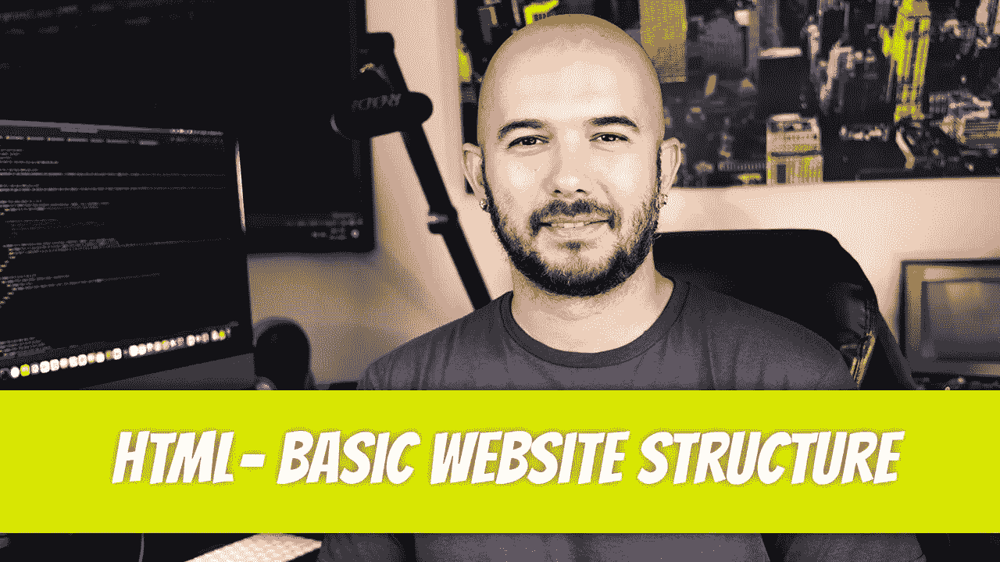

# HTML — P2:基本网站结构

> 原文：<https://blog.devgenius.io/html-p2-basic-website-structure-2aade4c59c8a?source=collection_archive---------22----------------------->



我们准备开始研究 HTML 的构成。我们将研究 HTML 元素，看看这些元素是如何组合在一起形成网页的。稍后，我们将了解 HTML5 以及它与以前版本之间的一些差异。

每个 HTML 站点都有一些必须存在的标签。其中包括 doctype、html 标记、head 标记和 body 标记。事实上，每次你开始创建一个网站时，你都想先包含这些元素，以避免更复杂的代码。

```
<!DOCTYPE html
    <html lang-"en">
<head>
    ‹meta charset-"UTF-8">
    ‹title›Title</title›
</head>
<body>
    Hello, my name is Dino Cajic
</body>
</html>
```

打开你喜欢的 IDE(集成开发环境)，输入下面的代码。您可以在记事本中输入以下内容，尽管对于更高级的代码，您会希望有一个漂亮的彩色编码编辑器。

另存为 index.html。为什么索引？网络服务器知道寻找索引文件作为主文件。如果你把你的网站上传到主服务器文件夹，通常是 *public_html* ，服务器软件会寻找 index.html 或 index.php*的*文件。因为这是默认文件名，所以当您输入地址时，不必在地址栏中指定文件名。

比如可以输入 *dinocajic.xyz* 或者*dinocajic.xyz/index.html*；他们会把你带到同一个页面。文件*index.html*应该是小写的，因为一些服务器不知道寻找大写版本。你的其他文件也应该是小写的。如果文件名由多个单词组成，请使用下划线或破折号作为分隔符。例如，如果您正在创建“关于我们”页面，您应该将该文件命名为 about_us.html 或 about-us.html。

一旦你在浏览器中打开这个页面，你会注意到一个几乎空无一物的屏幕，上面写着“你好，我叫迪诺·卡吉克”。检查源代码，你会注意到你写的 html 就在那里。

如您所见，这个文件由几个标签组成。第一个，，实际上并不是一个 html 标签。这只是告诉浏览器 html 文档版本的一种方式。表示下面的代码是用 HTML5 编写的，并且应该这样呈现。在 HTML5 之前，网站设计者必须考虑各种不同的文档类型。

谢天谢地，HTML5 简化了这个过程。从技术上讲，如果您只针对较新的浏览器，您根本不需要 doctype 声明，但是为了让较旧的浏览器满意，包含它是一个好的做法。访问[https://www.w3.org/QA/2002/04/valid-dtd-list.html](https://www.w3.org/QA/2002/04/valid-dtd-list.html)查看所有先前 doctype 声明的列表。

下一个标签是标签；它表示文档的开始。你应该养成立即关闭标签的习惯，这样你就不会忘记。标签以标签结束。标签可以有一个可选的语言属性。但是，最好将它包含在内(例如，)。一旦关闭标签，您可以将光标放在中间，添加几个空格，并开始编写一些新的嵌套标签。

下一个标签是 标签。head 标签是为您保留的:

标题，

CSS 代码和 CSS 包含，

JavaScript 代码和 JavaScript 包括，

和元标签等等。

字符编码(utf-8 字符集)与 HTTP 头一起发送。字符编码只是确保特殊字符被正确呈现。你不必对此过于担心；只知道要包含在头部。

title 标记位于 head 标记内，包含文档的标题。如果您查看选项卡，您会注意到显示的单词“Title”。那是因为我们在 title 标签之间输入了 title 这个词: <title>Title</title> 。

标签将保存你所有的可见内容。这是您将花费大部分时间编写代码的地方。


迪诺·卡希奇目前是 [LSBio(寿命生物科学公司)](https://www.lsbio.com/)、[绝对抗体](https://absoluteantibody.com/)、 [Kerafast](https://www.kerafast.com/) 、[珠穆朗玛生物科技](https://everestbiotech.com/)、[北欧 MUbio](https://www.nordicmubio.com/) 和 [Exalpha](https://www.exalpha.com/) 的 IT 负责人。他还担任我的自动系统的首席执行官。他有十多年的软件工程经验。他拥有计算机科学学士学位，辅修生物学。他的背景包括创建企业级电子商务应用程序、执行基于研究的软件开发，以及通过写作促进知识的传播。

你可以在 [LinkedIn](https://www.linkedin.com/in/dinocajic/) 上联系他，在 [Instagram](https://instagram.com/think.dino) 上关注他，[访问他的博客](https://www.dinocajic.com/)，或者[订阅他的媒体出版物](https://dinocajic.medium.com/subscribe)。

阅读 Dino Cajic(以及 Medium 上成千上万的其他作家)的每一个故事。你的会员费直接支持迪诺·卡吉克和你阅读的其他作家。你也可以在媒体上看到所有的故事。