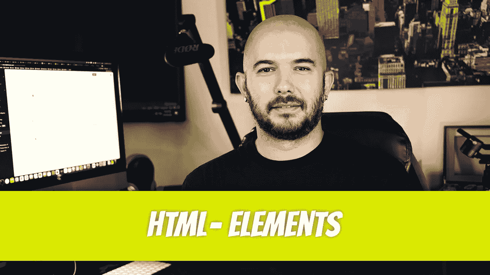
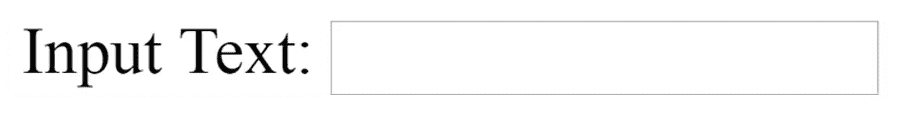
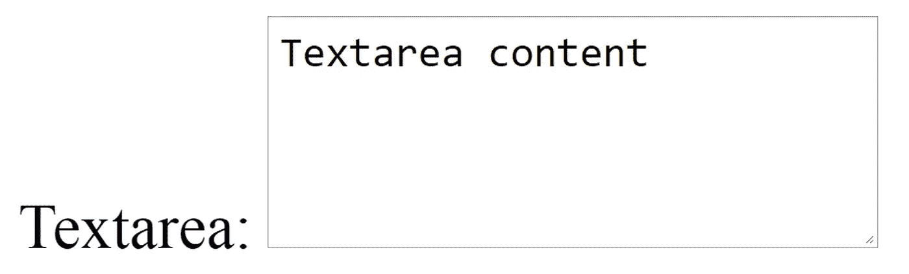
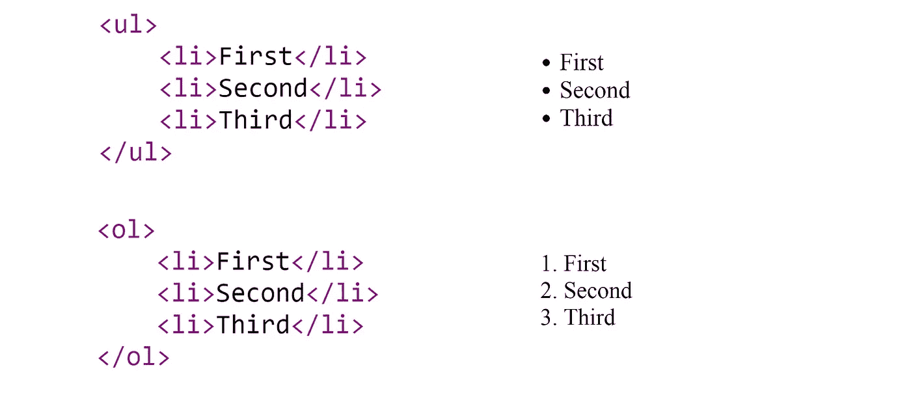
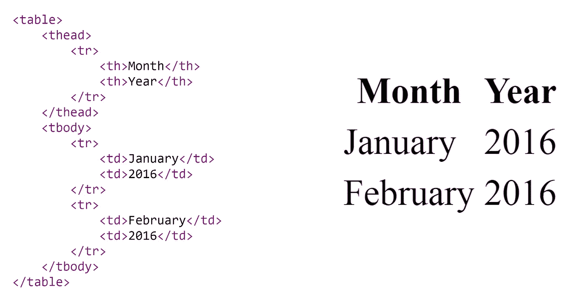
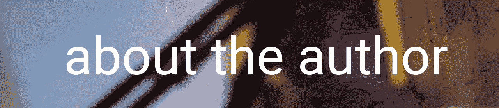

# HTML-P3:元素

> 原文：<https://blog.devgenius.io/html-p3-elements-9cd58f6b03d6?source=collection_archive---------12----------------------->



是时候开始研究构成 HTML 语言的各种 HTML 元素了。我们将在这一部分检查的元素有:

```
<a><br /><button><em><form><h1><h2><hr /><input><li><table><thead><tr><th><tbody><td><textarea><ul>
```

让我们更详细地检查下一页的代码。开始时，它可能看起来很杂乱，但是当你开始仔细观察它时，你会注意到它遵循一个简单的模式。让我们一起来看看代码。我们将从定位开始的主体标签`<body>`开始。

第一个标签是`<h1>`标签；它创建了一个主标题。在浏览网页时，你通常会发现这是一篇文章的标题。搜索引擎在索引你的页面时寻找主标题；搜索引擎算法知道这描述了一个主题。`<h1>`标签很容易被发现:它通常是比屏幕上其他文本大得多的文本。

```
<!DOCTYPE html>
<html><head>
    <title>Title</title>
</head><body>
<h1>Dino Cajic</h1><h2>Sample Website</h2><a href="http://dinocajic.xyz">Portfolio</a><div>DIV Element</div><p>Paragraph</p><br /> <button>Button</button> <em> Emphasis</em><form>
    Input Text: <input type="text" name="text_name" /> <br /> 
    Textarea: <textarea name="text_area">Textarea content</textarea>
    <input type="submit" name="submit" value="Submit" />
</form><hr /><ul>
    <li>First</li>
    <li>Second</li>
    <li>Third</li>
</ul><table>
    <thead>
    <tr>
        <th>Month</th>
        <th>Year</th>
    </tr>
    </thead>
    <tbody>
    <tr>
        <td> January</td>
        <td>2016</td>
    </tr>
    <tr>
        <td>February</td>
        <td>2016</td>
    </tr>
    </tbody>
</table>
</body>
</html>
```

标签在文章中创建一个副标题。通常，你会在`<h1>`标签后找到这个标签。一个`<font>`标签可以用来控制字体的大小，但是为了遵循 SEO(搜索引擎优化)标准，设计者应该在整个文档中加入`<h1>`和`<h2>`标签。毕竟，如果一个网站不能被搜索引擎轻易的索引，那么这个网站是没有用的。其他存在的标题标签包括`<h3>`、`<h4>`、`<h5>`和`<h6>`标签。

锚`<a>`，标签链接到网站的不同部分，甚至链接到网站之外的页面。href 指向特定的位置。如果你有两个页面，一个叫做`index.html` ，另一个叫做`contact.html`，你可以通过在`index.html`文件中添加`a href`标签来链接到`contact.html`。要链接到联系人页面，您需要输入以下代码:

```
<a href=”contact.html”>Contact Page</a>
```

为了链接到上面指定的页面，`contact.html`和`index.html`页面必须在同一个目录中。

将`<div>`标签视为一个容器。您可以在`<div>`容器中放置文本、图像甚至其他容器。现在，记住在结束的`</div>`标签之后，回车将被输入，代码的下一部分将出现在下面一行。例如，如果您输入

```
<div>Dino Cajic</div>Some other text
```

输出将是:

```
Dino CajicSome other text
```

`<p>`标签是段落标签。如果你写多段文章，每一段都应该用一个`<p></p>`标签包裹起来。每个段落之间会输入一个空行，就像你写段落时通常会跳过一行一样。

希望到现在为止，你已经看到一个模式出现了；电脑没有人类聪明。它需要规则，并且必须严格遵守这些规则，以便能够以结构化的方式显示内容。每个标签的命名约定是不言自明的，并且模仿标准英语。

当您需要快速显示回车时，您需要键入`<br>`标签。在 HTML5 之前，自结束标签是必需的。因为`<br>`标签没有结束标签，即`<br></br>`，所以它需要在自身内结束。所以你以前才会写`<br />`。有了 HTML5，现在写`<br>`就可以了。

需要按钮吗？使用`<button>`标签创建一个。只是打字

```
<button>Click Me</button>
```

这将创建一个按钮，文本“点击我”填充按钮的内部。按钮可以与链接或表单结合使用，几乎在每个网站上都有使用。

如果你需要强调文本的一部分，你需要使用`<em>`标签。`<em></em>`标签将标签内的文本设为斜体。

表单是获取网站用户输入的主要方式。数据可以被处理和/或存储在数据库中。表单用`<form>`标签勾勒出来。在表单标记中，您将添加某些输入。这些输入允许用户输入所请求的信息。例如，输入，

```
Input Text: <input type=”text” name=”some_name” />
```

将创建如下所示的输入字段。



如果希望为用户提供更多的空间，可以考虑在表单中添加一个 textarea。一个例子可能包括，

```
Textarea: <textarea name=”some_textarea”>Textarea content</textarea>.
```

textarea 的结果如下所示。



如果您一直非常注意，您可能会注意到在 textarea 和 input 标记中都出现了一个 name 属性。当我们开始开发 PHP 代码时，将使用这个名称。

最后一个标签是创建提交按钮的特殊输入标签。单击提交按钮后，位于`<form>`标签中的 action 属性将帮助将表单内容定向到最终目的地。操作属性如下所示:

```
<form action=”process_form.php”>…</form>.
```

`<hr />`标签提供了一个横跨容器长度的水平标尺，在这个例子中，横跨整个页面。它实际上是一条横跨页面的线，更直观地将顶部内容和底部内容分开。

我们遇到了另一个标签，即使没有解释也应该很容易理解:``标签。< img >标签有一个`src`属性，指定图像在文件夹中的位置。`index.html`文件包含了``标签。在根目录中，有另一个名为*图像*的目录，在`images`文件夹中有一个名为`example.jpg`的图片。要从`index.html`文件链接到 example.jpg，您可以输入``。

需要创建一个项目列表？它们需要按照从 *1* 到 *n* 的顺序排列还是应该是要点？如果您选择项目符号，您将使用`<ul>`标签编写一个无序列表。在标签`<ul>`中，存储了列表元素`<li>`。参考下面的两个代码片段，看看有序列表和无序列表之间的区别。



表格是将项目分组为行/列格式的便捷方式。要创建一个表，首先要指定`<table>`标签。下一部分，`<thead>`指出了顶行的开始，通常描述了它下面的行中的内容。

每行用`<tr>`标签分隔。每行可以有多列；每一列都用`<th>`标签表示。标题后面是表格的正文。使用`<tbody>`标签显示主体。主体也可以有行和列；行用`<tr>`标记表示，列用`<td>`标记表示。下面的代码生成了右图所示的表格。



元素复习到此结束。还有一些其他的标签可以使用。强烈建议您至少了解其中的大部分。在整个系列中，我们可能会稍微超出所讨论的元素的范围，但是每个元素都应该简单易懂，尤其是在您完成示例并在浏览器中进行测试的情况下。



迪诺·卡伊奇目前是 [LSBio(生命周期生物科学公司)](https://www.lsbio.com/)、[绝对抗体](https://absoluteantibody.com/)、 [Kerafast](https://www.kerafast.com/) 、[珠穆朗玛生物](https://everestbiotech.com/)、[北欧 MUbio](https://www.nordicmubio.com/) 和 [Exalpha](https://www.exalpha.com/) 的 IT 主管。他还担任我的自动系统的首席执行官。他有十多年的软件工程经验。他拥有计算机科学学士学位，辅修生物学。他的背景包括创建企业级电子商务应用程序、执行基于研究的软件开发，以及通过写作促进知识的传播。

你可以在 [LinkedIn](https://www.linkedin.com/in/dinocajic/) 上联系他，在 [Instagram](https://instagram.com/think.dino) 上关注他，[访问他的博客](https://www.dinocajic.com/)，或者[订阅他的媒体出版物](https://dinocajic.medium.com/subscribe)。

阅读 Dino Cajic(以及 Medium 上成千上万的其他作家)的每一个故事。你的会员费直接支持迪诺·卡吉克和你阅读的其他作家。你也可以在媒体上看到所有的故事。