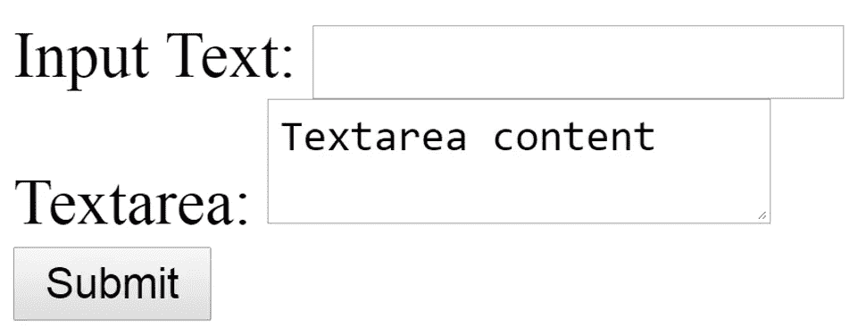

# HTML—P5:HTML 的问题

> 原文：<https://blog.devgenius.io/html-p5-problems-with-html-f86a745e743?source=collection_archive---------11----------------------->


有几个问题 HTML 无法解决。HTML 非常适合向用户显示小信息，但它在显示大量内容方面有所欠缺:想想一个电子商务网站。这些网站可能有成千上万的项目编号，每个项目编号可能会产生一个单独的页面。你以为每个页面都是一个人创作的吗？当然不是。接下来，考虑一个网站上的表单。当你填写你的信息并点击提交时会发生什么？魔法？HTML 无法为我们回答这些问题。我们稍后会得到这些问题的答案。

# 形式

除了向用户提供信息之外，有一个页面在 99%的网页上都是可用的:联系页面。联系人页面可能会列出企业的电话号码、企业地址，通常还有一个表单。该表单允许您与网站所有者进行交流。但是这是如何实现的呢？

HTML 为您提供了创建表单的工具。要创建表单，请将下面的内容复制到您的 IDE 中，并在浏览器中打开 html 文件。

```
<form action="process-form.php" enctype="multipart/form-data"> 
    <div>
        Input Text: <input type="text" name="text_name" /> 
    </div>
    <div>
        Textarea: <textarea name="text_area">Textarea content</textarea> 
    </div>
    <div>
        <input type="submit" name="submit" value="Submit" /> 
    </div> 
</form>
```

您应该得到一个带有输入字段、文本区域和提交按钮的表单。现在不要担心表单是什么样子；我们将在以后的文章中重点讨论这个问题。您应该会得到一个如下所示的表单。



HTML 为您提供了在输入字段中输入文本并单击 submit 的能力。点击`Submit`会把你带到一个尚不存在的页面:`process-form.php`。浏览器是怎么知道把你重定向到`process-form.php`页面的？它寻找表单标记中的 action 属性。触发器正在按提交按钮。`process-form.php`是处理表单的页面。我们将在后面的文章中讨论表单的处理。

目前 HTML 的武库中没有处理表单提交的东西。有了 PHP 和 MySQL，我们将能够捕获表单域提交，并且几乎可以自由支配数据。我们可以将数据存储到数据库中，或者发送包含提交数据的电子邮件。

# 存储和检索数据

我们在谈论什么样的数据？任何显示给用户的数据。这些可能是博客中的文章、电子商务网站中的产品、表单提交等。

如前所述，HTML 没有提供将表单提交存储到数据库中的机制。把数据库想象成一个电子表格。它将有行和列。列包含类别，行存储数据。

它也没有提供连接数据库和检索数据的机制。如果使用 SQL 数据库，那么检索数据的语言应该是 MySQL。MySQL 可以嵌入到 PHP 中，有效地建立与数据库的通信并从中检索数据。

# 网站的整体规模

想象一个电子商务网站。如果 HTML 是某个特定企业必须使用的唯一工具，那么该企业将不得不雇用数百名员工来维护页面的创建和删除。大型电子商务集团的可维护性将是不可能的。更不用说人们将无法通过网站购买产品，因为 HTML 也不提供这一功能。

您需要一种能够根据特定标准生成页面的编程语言。为了给你一个电子商务问题的示例解决方案，开发人员可以创建一个页面。该页面接受一个变量；可以把变量想象成一个存储容器，它可以承载某种类型的输入。为了这个例子，我们的变量将存储数字。通过传递一个不同的数字，我们可以使用 MySQL 访问数据库，并检索具有与该变量匹配的`id`列的行的内容。每次传递新的数字时，内容都会改变。然后，您可以在数据库中存储一个或一百万个条目，并使用相同的一页脚本来显示数据。

最后，HTML 真的没有任何问题。HTML 服务于它被设计的确切目的。一旦需要编写动态应用程序，就需要使用真正的编程语言。HTML 得到了很多热，但它真的不应该。如果有人因为 CSS 不能提交表单而攻击它，那也是同样的情况。


Dino Cajic 目前是 [LSBio(寿命生物科学公司)](https://www.lsbio.com/)、[绝对抗体](https://absoluteantibody.com/)、 [Kerafast](https://www.kerafast.com/) 、 [Everest BioTech](https://everestbiotech.com/) 、 [Nordic MUbio](https://www.nordicmubio.com/) 和 [Exalpha](https://www.exalpha.com/) 的 IT 主管。他还担任我的自动系统的首席执行官。他有十多年的软件工程经验。他拥有计算机科学学士学位，辅修生物学。他的背景包括创建企业级电子商务应用程序、执行基于研究的软件开发，以及通过写作促进知识的传播。

你可以在 [LinkedIn](https://www.linkedin.com/in/dinocajic/) 上联系他，在 [Instagram](https://instagram.com/think.dino) 上关注他，[访问他的博客](https://www.dinocajic.com/)，或者[订阅他的媒体出版物](https://dinocajic.medium.com/subscribe)。

阅读 Dino Cajic(以及 Medium 上成千上万的其他作家)的每一个故事。你的会员费直接支持迪诺·卡吉克和你阅读的其他作家。你也可以在媒体上看到所有的故事。