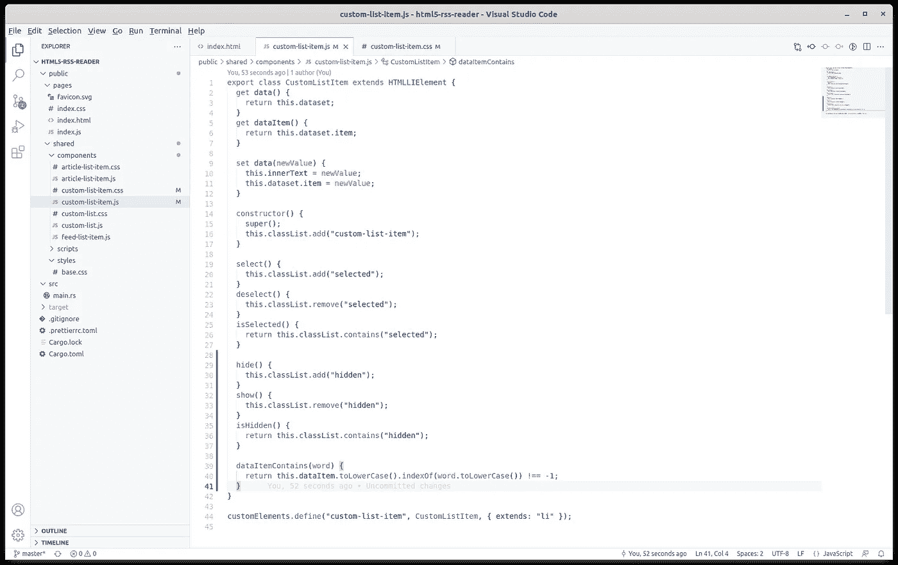
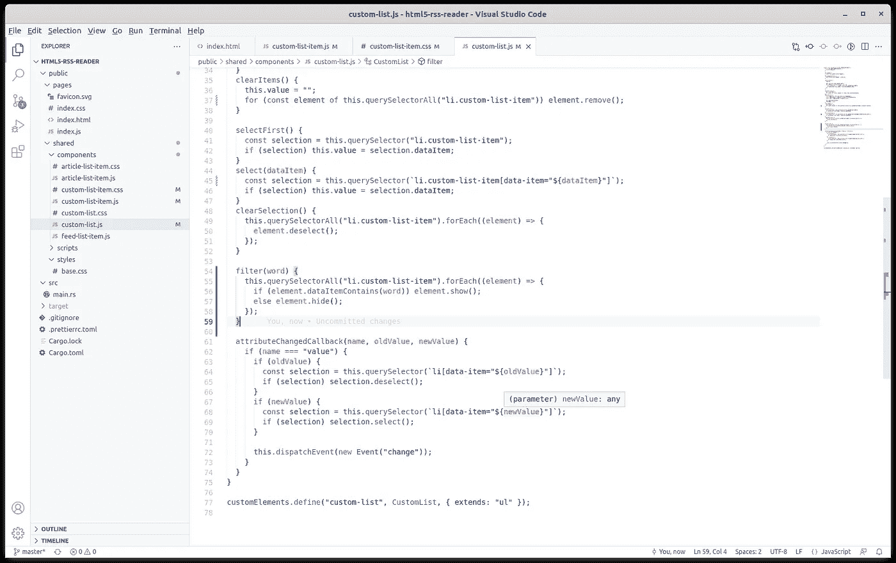
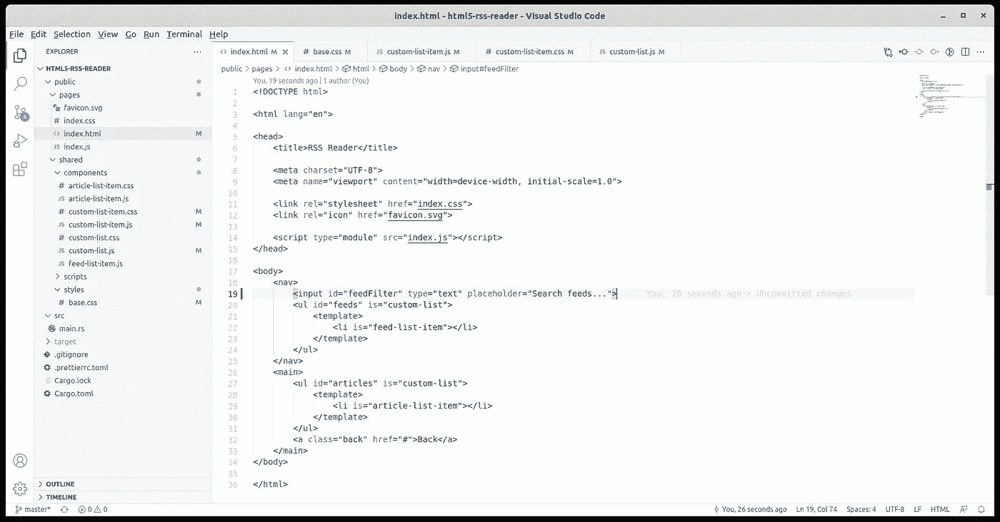
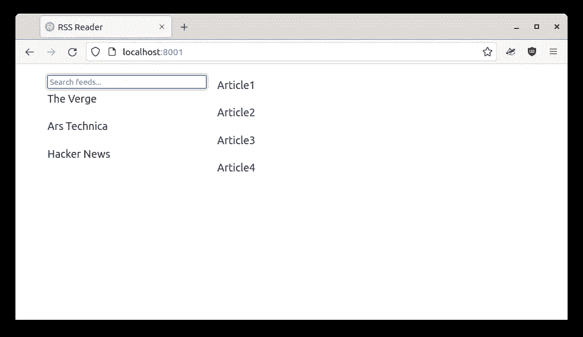
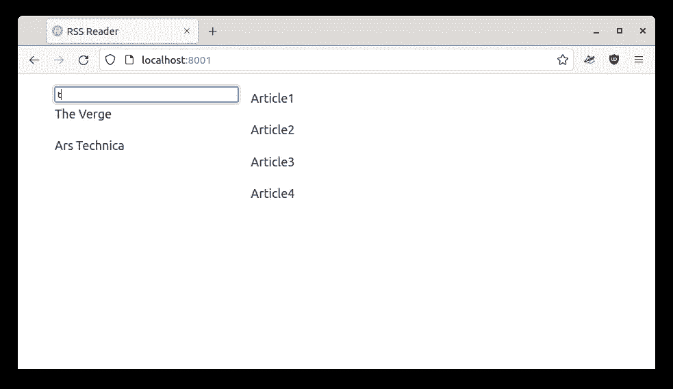
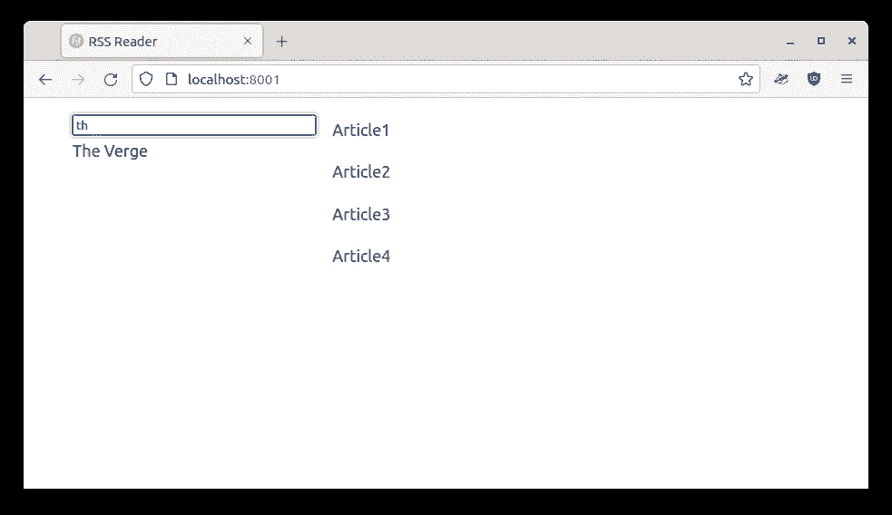
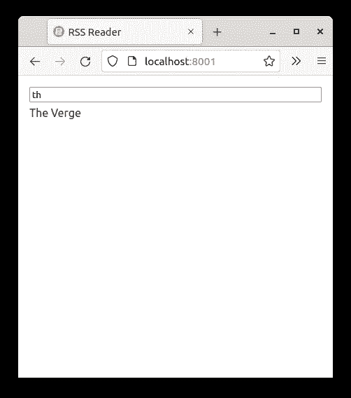

# HTML5 RSS 阅读器:过滤自定义列表组件

> 原文：<https://blog.devgenius.io/html5-rss-reader-filtering-the-custom-list-component-c3ba366c08fd?source=collection_archive---------9----------------------->


马库斯·温克勒在 [Unsplash](https://unsplash.com?utm_source=medium&utm_medium=referral) 上拍摄的照片

我们[开始](/initial-setup-for-a-rust-web-application-using-web-components-and-native-javascript-modules-ee832c062e8a)编写一个 HTML、Javascript 和 CSS 专用的[应用程序](/the-responsive-layout-for-our-rust-web-application-8fb46fe14c8f)，由一个最小的 Rust web 服务器支持。我们看到了如何只使用原生 Javascript 编写 web 组件，试图远离框架、构建器或捆绑器。我们研究了 CSS 导入和 Javascript [模块导入](/html5-rss-reader-writing-specialized-web-components-8c8a972e681a)，实现了一个无框架的 web 应用程序，所有依赖项都按需加载。

这个练习只是探索现代 Javascript 现在如何能够覆盖以前只能通过使用各种 UI 框架获得的架构。尽管最终的结果看起来很优雅，选择框架和构建者的负担也减轻了，但是每个项目都是不同的，因此必须遵循常识。

我们创建了一个`CustomList`组件和一个`CustomListItem`，然后我们将`CustomListItem`扩展为`FeedListItem`和`ArticleListItem`，因为它们有特定的渲染需求。今天我们将为`CustomList`添加过滤功能，并为`CustomListItem`添加一些支持功能。

## 搜索自定义列表项



对 CustomListItem 类的一个小补充

现在我们有了两个列表，一个包含提要，另一个包含文章，如果我们更改`CustomList`来添加一个新特性，它将可用于我们页面上的每个实例。同样，如果我们给`CustomListItem`添加一个特性，它也将适用于`FeedListItem`和`ArticleListItem`。所以首先，让我们修改我们的`CustomListItem`并添加几个函数来支持过滤:

```
hide() {
  this.classList.add("hidden");
}
show() {
  this.classList.remove("hidden");
}
isHidden() {
  return this.classList.contains("hidden");
}dataItemContains(word) {
  return this.dataItem.toLowerCase().indexOf(word.toLowerCase()) !== -1;
}
```

`CustomListItem`需要支持隐藏，以便`CustomList`可以隐藏当前过滤器不可用的项目。它还需要一个功能，允许搜索给定单词的数据项。这就是`dataItemContains`功能。还记得`FeedListItem`和`ArticleListItem`包含不同属性的对象，但是它们都设置了一个`dataset.item`用于搜索。`FeedListItem`正在将进给`name`属性设置为`dataset.item`，`ArticleListItem`正在设置物品`title`。所以`dataItemContains`基本上会检查给定的`word`是否能在`FeedListItem`的进给`name`和`ArticleListItem`的文章`title`中找到。

当然，`FeedListItem`和`ArticleListItem`都可以重新实现`dataItemContains`功能。它会覆盖默认的，并使用他们自己的。如果搜索会更复杂，默认功能不够用的话。但是在我们的例子中，在`dataset.item`中搜索`word`对于`FeedListItem`和`ArticleListItem`都足够了。我们还需要在`custom-list-item.css`中定义`hidden`类:

```
li.custom-list-item.hidden {
  display: none !important;
}
```

## 将过滤器功能添加到自定义列表



CustomList 类的小变化

`CustomList`只需要增加一个功能:

```
filter(word) {
  this.querySelectorAll("li.custom-list-item").forEach((e) => {
    if (e.dataItemContains(word)) e.show();
    else e.hide();
  });
}
```

那么这将如何工作呢？我们将在`index.html`中添加一个文本框，用户可以在其中输入用于过滤提要列表的单词。当用户输入时，我们将调用列表的`filter`函数，它将询问它的条目是否有响应给定单词的数据。让我们看看。

## 变化中的 index.html



将输入元素添加到 index.html

我们只需在提要列表前向`index.html`添加一行代码:

```
<input id="feedFilter" type="text" placeholder="Search feeds...">
```

在这里，用户将输入他们的搜索项，应用程序将通过调用`feeds.filter(feedFilter.value)`来响应。让我们在`index.js`中这样做:

```
document.getElementById("feedFilter").addEventListener("input", (e) => {
  document.getElementById("feeds").filter(e.target.value);
});
```

让我们给`base.css`增加一个小的造型变化:

```
body {
  grid-column-gap: 1em;
}input {
  width: 100%;
  box-sizing: border-box;
}
```

我们在提要列表和文章列表之间添加了一个小间隙。我们还扩展了`input`来填充所有可用空间，并确保在调整大小时`input`边界也算在内。

## 结果呢



改进的 RSS 阅读器应用程序

全部完成！我们在提要列表上方有搜索输入，如果我们输入字母:



过滤在行动

过滤器工作原理:



使用更多字母进行过滤

此外，由于我们之前在`index.css`中轻松定义的响应式布局，如果我们将浏览器调整为移动宽度，一切都可以开箱即用:



我们的 RSS 阅读器应用程序的移动版本

在本文的结尾，我们的新过滤功能工作正常，编写时改动和中断很少。我们甚至不用接触`FeedListItem`和`ArticleListItem`，一切都在它们的基类中完成。代码一如既往地在 Github 上可用，但是正如我一直说的，不要急于克隆它:尝试通读这篇文章并编写自己的代码。

下次我们将谈论[阴影 DOM](/the-shadow-dom-of-an-html5-web-component-d99af7844192) 。这是一个与 HTML5 web 组件相关的概念，它允许组件进一步隐藏其实现细节。那里见！