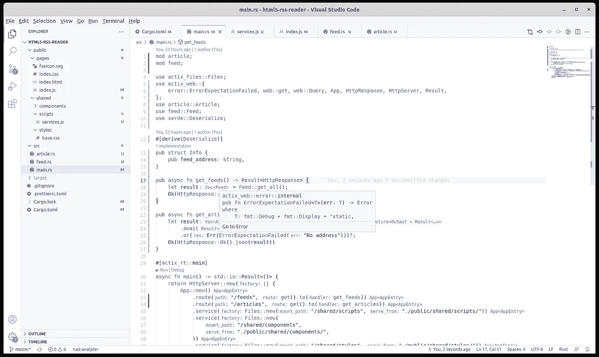
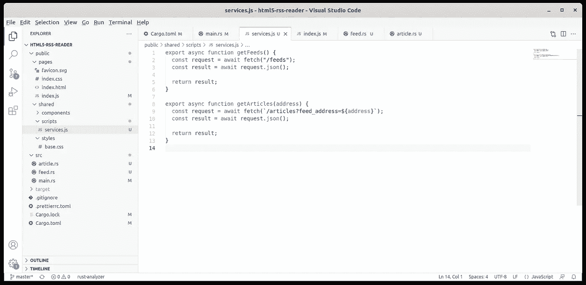

# HTML5 RSS 阅读器:Rust API

> 原文：<https://blog.devgenius.io/html5-rss-reader-the-rust-api-15d8300fc034?source=collection_archive---------13----------------------->


[Julian Hochgesang](https://unsplash.com/es/@julianhochgesang?utm_source=medium&utm_medium=referral) 在 [Unsplash](https://unsplash.com?utm_source=medium&utm_medium=referral) 上拍摄的照片

我们在这个[教程](/initial-setup-for-a-rust-web-application-using-web-components-and-native-javascript-modules-ee832c062e8a)中做了很多:了解了原生 [web 组件](/html5-rss-reader-writing-the-first-web-components-949eec88dbf9)，原生 Javascript [模块导入](/html5-rss-reader-writing-specialized-web-components-8c8a972e681a)，CSS 导入和[阴影 DOM](/the-shadow-dom-of-an-html5-web-component-d99af7844192) 。我们小心翼翼地创建了一个[反应灵敏的 UI](/the-responsive-layout-for-our-rust-web-application-8fb46fe14c8f) ，并赋予它合理的[特性](/html5-rss-reader-filtering-the-custom-list-component-c3ba366c08fd)。今天，我们已经到了本系列的末尾，还剩下最后一件事:创建 Rust API 来加载和提供 RSS 内容。

我们又做了这个东西[在过去](/using-threads-and-messages-to-load-data-in-a-gtk4-widget-5e1da3b0621d)对于 GTK4:我必须有一个加载和显示 RSS 内容的东西。设置几乎是一样的:我们向`Cargo.toml`添加一些依赖项，向`main.rs`添加 API 函数，我们创建一个 Javascript 服务来使用 Rust API 并在`index.js`中消费服务。我们走吧。

## 在后端处理 RSS



快速浏览项目结构

首先，让我们通过添加`rss`箱来更新`Cargo.toml`。我们还需要 JSON 序列化和反序列化，所以我们也包括了`serde`。我们将使用`reqwest`来调用 RSS URL，最后，为了简化我们的错误处理，我们将包含`anyhow`。

```
[package]
name = "html5-rss-reader"
version = "0.1.0"
edition = "2021"[dependencies]
actix-web = "*"
actix-files = "*"
actix-rt = "*"
rss = "*"
serde = {version = "*", features = ["derive"]}
reqwest = "*"
anyhow = "*"
```

Rust 中需要两个模型:一个 feed 模型(在`feed.rs`中)和一个 article 模型(在`article.rs`中)。这里是`feed.rs`:

```
use serde::{Deserialize, Serialize};#[derive(Serialize, Deserialize)]
pub struct Feed {
  pub name: String,
  pub address: String,
}impl Feed {
  pub fn get_all() -> Vec<Self> {
    let result = vec![
      Feed {
        name: "The Verge".to_string(),
        address: "https://www.theverge.com/rss/index.xml".to_string()},
      Feed {
        name: "Ars Technica".to_string(),
        address: "https://feeds.arstechnica.com/arstechnica/features".to_string()},
      Feed {
        name: "Hacker News".to_string(),
        address: "https://news.ycombinator.com/rss".to_string()},
    ];result
  }
}
```

`Feed`模型还通过`get_all`函数获取现有的提要。然后，这里是`article.rs`:

```
use serde::{Deserialize, Serialize};
use rss::Channel;
use serde::{Deserialize, Serialize};#[derive(Serialize, Deserialize)]
pub struct Article {
  pub title: String,
  pub summary: String,
}impl Article {
  pub async fn get_all(address: &str) -> Result<Vec<Self>> {
    let mut result = vec![];
    let response = reqwest::get(address).await?;
    let content = response.bytes().await?;
    let rss = Channel::read_from(&content[..])?;for item in rss.items() {
      result.push(Article {
        title: item.title()
          .ok_or(format_err!("No title available"))?
          .to_string(),
        summary: item.description()
          .ok_or(format_err!("No summary available"))?
          .to_string(),
      });
    }

    Ok(result)
  }
}
```

`Article`模型还使用`get_all`函数对提要地址进行`GET`调用，以获取现有的文章。然后我们在`main.rs`中构建 REST API 来获取提要和文章:

```
pub async fn get_feeds() -> Result<HttpResponse> {
  let result = Feed::get_all();
  Ok(HttpResponse::Ok().json(result))
}pub async fn get_articles(info: Query<Info>) -> Result<HttpResponse> {
  let result = Article::get_all(&info.feed_address).await
    .or(Err(ErrorExpectationFailed("No address")))?;
  Ok(HttpResponse::Ok().json(result))
}
```

`get_articles`函数需要一个`info`对象来获取我们需要的提要地址，所以让我们创建这个结构:

```
#[derive(Deserialize)]
pub struct Info {
  pub feed_address: String,
}
```

接下来，我们通过将 API 函数添加到`main`中的现有路由中，将它们注册到我们的应用程序路由中:

```
#[actix_rt::main]
async fn main() -> std::io::Result<()> {
  return HttpServer::new(|| {
    App::new()
      .route("/feeds", get().to(get_feeds))
      .route("/articles", get().to(get_articles))
    ---------
}
```

## 在 Javascript 中使用 RSS API



快速查看前端结构

Javascript 的变化更少:我们需要创建一个服务来委托 API 交互。我们将其命名为`services.js`，并将其放在`shared/scripts`文件夹中:

```
export async function getFeeds() {
  const request = await fetch("/feeds");
  const result = await request.json(); return result;
}export async function getArticles(address) {
  const request = await fetch(`/articles?feed_address=${address}`);
  const result = await request.json(); return result;
}
```

现在在`index.js`中，我们使用`services.js`来调用 Rust API 进行所有的 RSS 处理。所以我们用两个函数替换硬编码的值:

```
async function updateFeeds() {
  const result = await getFeeds();
  document.getElementById("feeds").setItems(result);
}async function updateArticles(address) {
  const result = await getArticles(address);
  document.getElementById("articles").setItems(result);
}
```

我们首先调用`updateFeeds`在页面加载时加载提要，然后在每个提要选择时调用`updateArticles`:

```
document.getElementById("feeds").addEventListener("click", async (e) => {
  document.body.classList.add("feed-selected"); const selection = document.querySelector("#feeds li.selected");
  if (selection) selection.classList.remove("selected"); e.target.closest("li").classList.add("selected");
  await updateArticles
    (encodeURIComponent(selection.dataset.address));
});
```

注意事件处理程序是如何在其签名中变成`async`的。

这就是全部了。不幸的是，The Verge 和 Ars Technica 不使用 RSS 作为联合内容系统，只使用黑客新闻。所以你会得到一个错误，只有黑客新闻可以工作。你可以随意使用任何你想要的提要，只要确定它们是 RSS。

你可以在 Github 上找到任何东西，但是我总是建议你写自己的代码，而不是克隆一个库。它让你学得更好，因为你拥有所有代码决策的全部所有权。此外，您在本教程中发现的只是一个建议的架构，请随意在您的项目中进行任何您喜欢的更改。感谢您的阅读，下一篇文章再见！