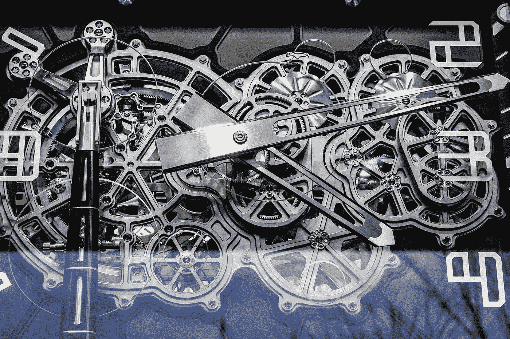
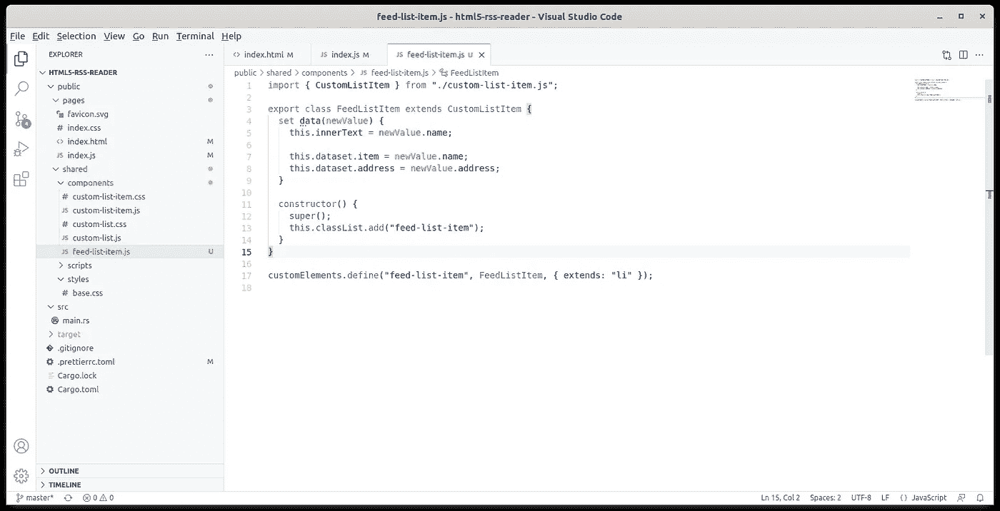
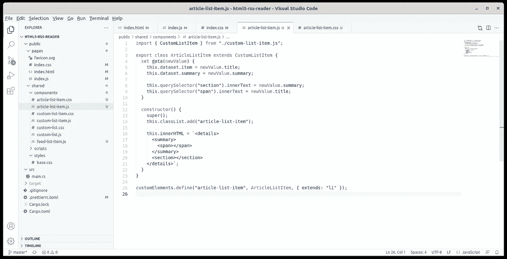
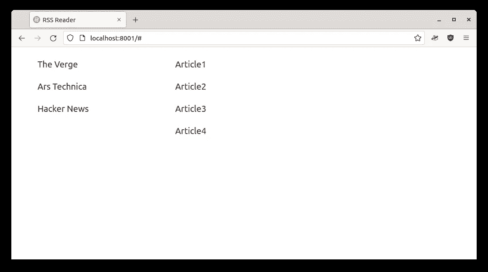
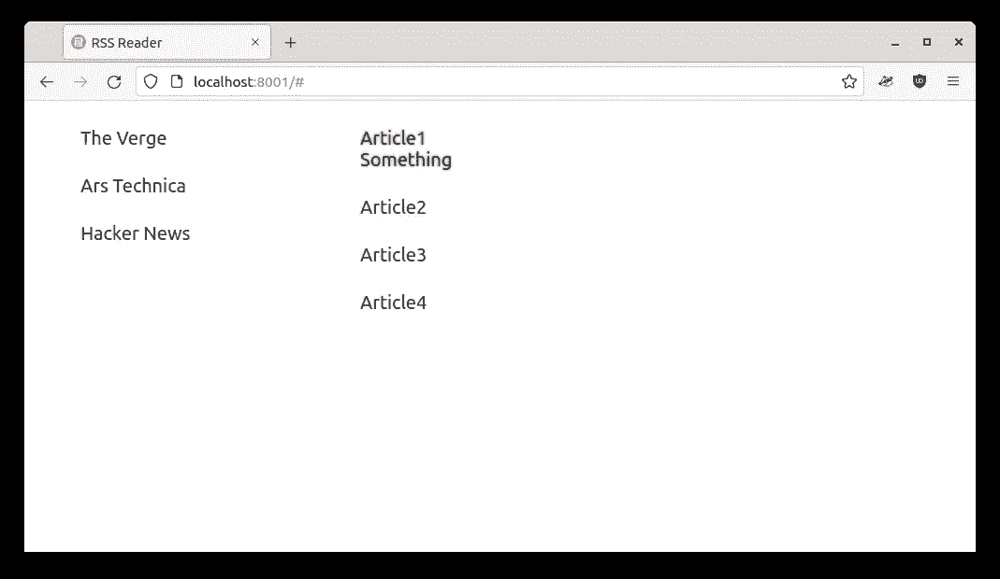
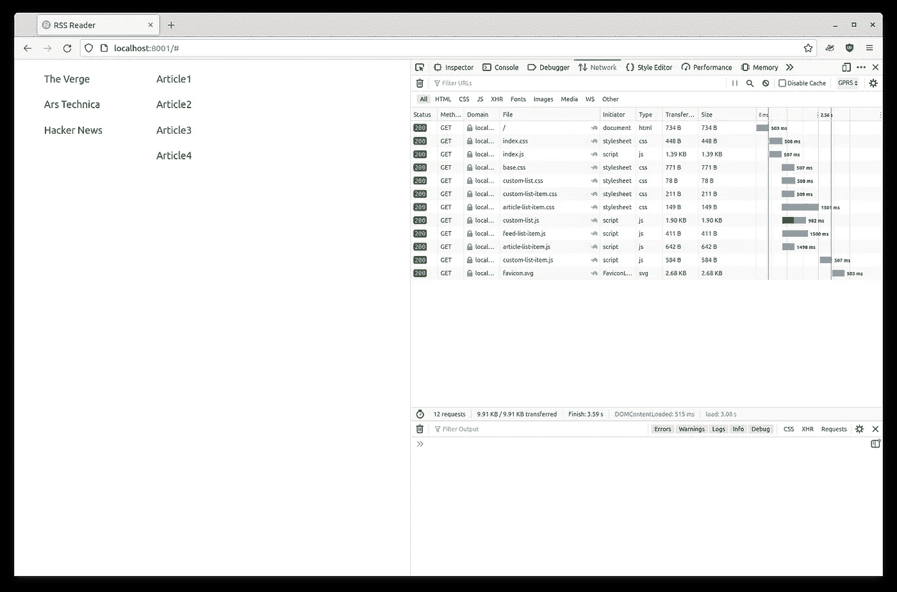

# HTML5 RSS 阅读器:编写专门的 web 组件

> 原文：<https://blog.devgenius.io/html5-rss-reader-writing-specialized-web-components-8c8a972e681a?source=collection_archive---------11----------------------->



[西格蒙德](https://unsplash.com/@sigmund?utm_source=medium&utm_medium=referral)在 [Unsplash](https://unsplash.com?utm_source=medium&utm_medium=referral) 上拍照

上次我们为我们的 RSS 阅读器[响应式](/the-responsive-layout-for-our-rust-web-application-8fb46fe14c8f) web [应用程序](/initial-setup-for-a-rust-web-application-using-web-components-and-native-javascript-modules-ee832c062e8a)使用了[第一个 web 组件](/html5-rss-reader-writing-the-first-web-components-949eec88dbf9)。到目前为止，我们讨论了 web 资源的延迟加载:CSS 和 Javascript 引用都是由需要它们的组件进行的，而不是由`index.html`进行的。我们还解释了现代 Javascript 如何在不需要任何编译器、捆绑器、框架或任何其他第三方系统的情况下做到这一点。

我们还学习了如何使用扩展 HTML 元素`<ul is=”custom-list”>`的`is`属性来应用 web 组件。不是说`<custom-list>`不正确，但是在 Firefox 中，至少这种语法会产生实例化错误。此外，当前的 web 组件文档更喜欢使用`is`语法。

最后，我们剩下一个`CustomListItem`组件，它能够显示一行文本，但不能处理特定的对象。`FeedListItem`需要一个`name`和一个`address`，而`ArticleListItem`需要一个`title`和一个`summary`。另外，`ArticleListItem`需要是一个`<details>`元素，以便在单击时显示`summary`。所以我们来延伸一下我们的`CustomList`。

## 自定义 FeedListItem



项目结构的变化

`FeedListItem`将是一个具有一些特殊性的`CustomListItem`:

```
import { CustomListItem } from "./custom-list-item.js";export class FeedListItem extends CustomListItem {
  set data(newValue) {
    this.innerText = newValue.name; this.dataset.item = newValue.name;
    this.dataset.address = newValue.address;
  } constructor() {
    super();
    this.classList.add("feed-list-item");
  }
}customElements.define("feed-list-item", FeedListItem, { extends: "li" });
```

注意`extends: “li”`。`is=”feed-list-item”`仍然适用于`li`标签，但是在内部我们知道它扩展了`CustomListItem`。

这个组件没有额外的样式，因为它仍然只显示一行文本。因为它扩展了`CustomListItem`，所以首先它导入它。它唯一改变的是构造函数，我们在其中添加了`feed-list-item`类来标识它和`data`设置器。`FeedListItem`需要具有`name`和`address`属性的数据。我们显示`name`并将`address`存储在元素的数据集中。要使用它，我们需要改变`index.html`:

```
<nav>
  <ul id="feeds" is="custom-list">
    <template>
      <li is="feed-list-item"></li>
    </template>
  </ul>
</nav>
```

`feeds`列表将不再使用`custom-list-item`，而是使用`feed-list-item`。此外，我们需要导入`FeedListItem`并在`index.js`中加载带有适当数据的列表:

```
import { FeedListItem } from "../shared/components/feed-list-item.js";document.getElementById("feeds").setItems([
  { name: "The Verge", address: "https://www.theverge.com/rss/index.xml" },
  { name: "Ars Technica", address: "https://feeds.arstechnica.com/arstechnica/features" },
  { name: "Hacker News", address: "https://news.ycombinator.com/rss" }]);
```

## 自定义文章列表项



更多项目结构变更

`ArticleListItem`还有更多的事情要做。它也有一些自定义的 HTML 和样式。让我们写我们的类:

```
import { CustomListItem } from "./custom-list-item.js";export class ArticleListItem extends CustomListItem {
  set data(newValue) {
    this.dataset.item = newValue.title;
    this.dataset.summary = newValue.summary; this.querySelector("section").innerText = newValue.summary;
    this.querySelector("span").innerText = newValue.title;
  } constructor() {
    super();

    this.classList.add("article-list-item");
    this.innerHTML = "<details>
      <summary>
        <span></span>
      </summary>
      <section></section>
    </details>";
  }
}customElements.define("article-list-item", ArticleListItem, { extends: "li" });
```

主要的变化是在构建组件 UI 的构造函数中。它有一个`<details>`元素，为`title`保存一个`<span>`，为`summary`保存一个`<section>`。我们可以看到如何在`data`设置器中添加`title`和`summary`，在这里我们得到内部`section`和`span`并设置它们的`innerText`。我们还将`title`和`summary`保存在元素的数据集中，以便于在 Javascript 中检索。

`article-list-item.css`将为该元素添加自定义样式:

```
@import url(./custom-list-item.css);li.article-list-item summary {
  cursor: pointer;
}li.article-list-item summary::marker {
  content: none;
}
```

由于`ArticleListItem`使用了`CustomListItem`样式，我们在这里将其导入，即使只是为了完整性，因为它也在`index.css`中被导入。接下来，我们简单地移动我们留在`index.css`中的内容，并使用我们专门为此目的定义的适当的`ArticleListItem` CSS 类。要使用`ArticleListItem`，让我们再次更改`index.html`:

```
<main>
  <ul id="articles" is="custom-list">
    <template>
      <li is="article-list-item"></li>
    </template>
  </ul> <a class="back" href="#">Back</a>
</main>
```

让我们导入`ArticleListItem`，并在`index.js`中填入适当的数据:

```
import { ArticleListItem } from "../shared/components/article-list-item.js";document.getElementById("articles").setItems([
  { title: "Article1", summary: "Something" },
  { title: "Article2", summary: "Another thing" },
  { title: "Article3", summary: "Whatever" },
  { title: "Article4", summary: "Yet another one" }]);
```

请注意，`index.js`此时不再需要导入`CustomListItem`，因为它被`ArticleListItem`和`FeedListItem`引用。还要注意，Javascript 很聪明，即使引用了两次，也只加载一次。让我们也清理一下`index.css`，因为我们移动了一些定义:

```
@import url(/shared/styles/base.css);
@import url(/shared/components/custom-list.css);
@import url(/shared/components/custom-list-item.css);
@import url(/shared/components/article-list-item.css);a.back {
  display: none;
  padding-top: 2em;
}@media (max-width: 710px) {
  main {
    display: none;
  } body.feed-selected nav {
    display: none;
  }
  body.feed-selected main {
    display: block;
  } a.back {
    display: block;
  }
}
```

因为我们将所有的 web 组件样式移到了它们自己的位置，所以`index.css`只剩下了`index.html`特定的样式，这是应该的。它还会在我们需要时导入所有组件样式。使用这种架构，我们可以随心所欲地改变样式，即使组件可能附带了“推荐的”样式。如果我们愿意的话，这可以使组件既保持样式，同时又保持非样式。

## 应用程序



使用我们的定制组件运行的应用程序

所以让我们看看我们做了什么。如上面的屏幕截图所示，我们又回到了最初的地方，只是这次我们使用了自定义 web 组件，并且我们还重新获得了正确的文章布局，一个可点击的细节元素:



可点击的细节元素

让我们也来看看加载图，因为我喜欢每个部分在需要时加载其依赖关系的方式:



按需延迟加载依赖项

看看`index.html`如何加载`index.css`和`index.js`，然后`index.css`加载其余的 CSS 文件，接着`index.js`加载 web 组件。`custom-list-item.js`最后加载，因为当`article-list-item.js`和`feed-list-item.js`需要时，它们会调用它。

当然，你可以用`required.js`和其他第三方 Javascript 模块系统得到这样的加载图，但是这一次它是由浏览器按照 Javascript 的指示完成的，不需要第三方。没有 Webpack，没有`node_modules`，没有 web 应用程序特别要求的任何东西。

我们到达了本教程的另一部分的结尾。我希望你读得开心，也希望你喜欢所提出的架构，一个最新 Javascript 特性的演示。和往常一样，代码可以在 [Github](https://github.com/raduzaharia-medium/html5-rss-reader-extended-components) 获得。[下一次](/html5-rss-reader-filtering-the-custom-list-component-c3ba366c08fd)我们将为`CustomList`添加更多的功能，我们将更接近最后的部分，在那里我们用 Rust 加载实际的 RSS 数据。到时候见！