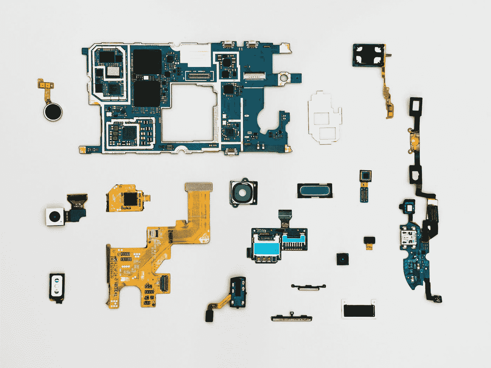
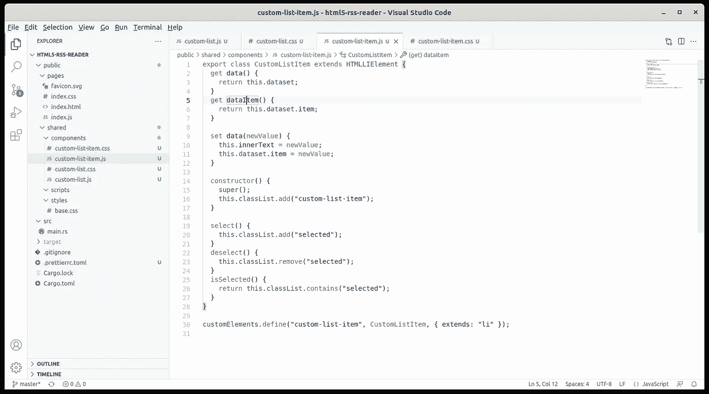
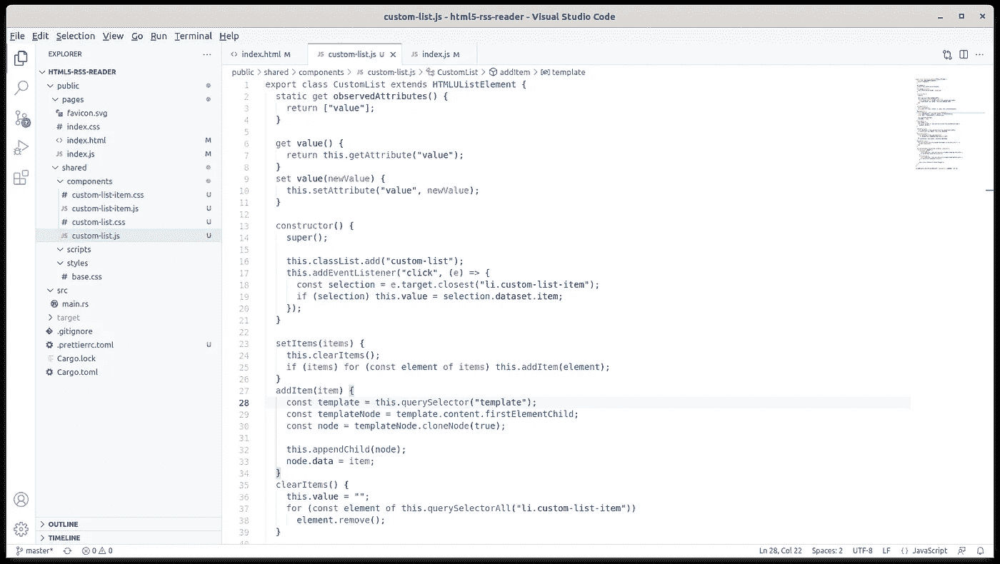
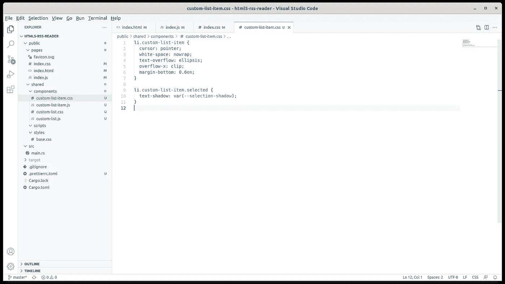
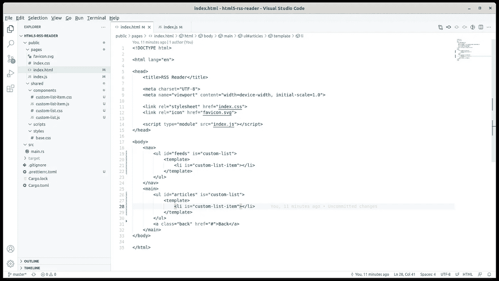
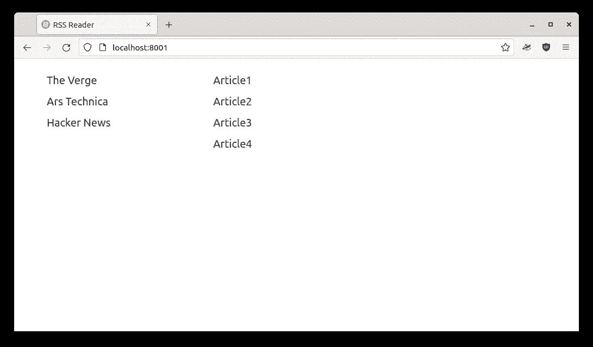

# HTML5 RSS 阅读器:编写第一个 web 组件

> 原文：<https://blog.devgenius.io/html5-rss-reader-writing-the-first-web-components-949eec88dbf9?source=collection_archive---------11----------------------->



丹-克里斯蒂安·pădureț在 [Unsplash](https://unsplash.com?utm_source=medium&utm_medium=referral) 上的照片

我们[开始编写](/initial-setup-for-a-rust-web-application-using-web-components-and-native-javascript-modules-ee832c062e8a)一个简单的 RSS 阅读器应用程序，在后端使用 Rust，在前端只使用现代的 Javascript 和 CSS。当然，这个练习只是回顾了现代浏览器支持的最新功能，并暗示了未来我们不一定需要 Webpack、缩小、捆绑和 UI 框架。

上次我们探讨了一种仅在需要时导入 CSS 的方法。这次我们将使用本地 Javascript 模块对 Javascript 做同样的事情。既然我们的响应式模拟用户界面已经准备好了，我们也知道我们想要什么样子，让我们开始构建我们的第一个 HTML5 web 组件:`CustomList`。

## 规划 HTML5 web 组件


[杰克逊·苏](https://unsplash.com/@jacksonsophat?utm_source=medium&utm_medium=referral)在 [Unsplash](https://unsplash.com?utm_source=medium&utm_medium=referral) 上的照片

就像 React 一样，HTML5 web 组件是类。就像老年人的反应一样。然而，HTML5 web 组件的第一个好处是直接继承了原生 HTML 类。例如，我们的`CustomList`类将扩展`HTMLUListElement`。这将是一个无序列表，所以它将使用普通的`<ul>`标签。然而，为了说明它不仅仅是一个`<ul>`，我们将像这样添加`is`属性:

```
<ul is="custom-list">
```

我们也可以编写`<custom-list>`并且它会工作，但是如果你想通过编程克隆或创建一个`CustomList`，这个类将不会被实例化，构造函数也不会被调用(至少在 Firefox 中)。您将获得一个具有所有已定义属性和方法的`CustomList`对象，但是您必须自己初始化它。但是，如果您以编程方式创建`<ul>`并将`CustomList`指定为`is`属性，它将会工作。此外，所有 HTML5 官方示例都使用了`is`语法，所以这可能是开发人员打算如何使用 web 组件。

列表中当然会有项目，我们希望允许它有不同类型的项目。所以我们将有一个通用的`CustomListItem`类，可以扩展成`FeedListItem`和`ArticleListItem`，每一个都有自己的特性。为此，我们需要为列表指定一个项目模板:

```
<ul is="custom-list">
  <template><li is="custom-list-item"></li></template>
</ul>
```

列表必须支持添加项目，当添加项目时，我们只需克隆模板内容并添加我们在那里指定的任何项目。让我们看看如何写这些。

## 自定义列表


凯利·西克玛在 [Unsplash](https://unsplash.com?utm_source=medium&utm_medium=referral) 上的照片

我们的`CustomList`将有两个主要功能:添加项目和选择项目。我们将放置一个`value`属性来指示当前选择的内容，并将它添加到可观察属性列表中:

```
export class CustomList extends HTMLUListElement {
  static get observedAttributes() {
    return ['value'];
  } get value() {
    return this.getAttribute('value');
  }
  set value(newValue) {
    this.setAttribute('value', newValue);
  } constructor() {
    super(); this.classList.add('custom-list');
    this.addEventListener('click', (e) => {
      const selection = e.target.closest('li.custom-list-item');
      this.value = selection.dataset.item;
    });
  } attributeChangedCallback(name, oldValue, newValue) {
    if (name === "value") {
      if (oldValue) {
        const selection = this.querySelector(`li[data-item="${oldValue}"]`);
        if (selection) selection.deselect();
      } if (newValue) {
        const selection = this.querySelector(`li[data-item="${newValue}"]`);
        if (selection) selection.select();
      } this.dispatchEvent(new Event("change"));
    }
  }
}customElements.define("custom-list", CustomList, { extends: "ul" });
```

静态的`observedAttributes` getter 检索被监视的属性的变化:在我们的例子中只有一个属性，即`CustomList`值。对于`value`属性，我们也有一个 getter 和一个 setter，它只是链接到`value` HTML 属性。在 HTML 语言中，这看起来像这样:

```
<ul is="custom-list" value="The Verge"></ul>
```

然后是处理我们的`observedAttributes`变化的`attributeChangedCallback`。处理程序提供属性名、旧值和新值。这里我们用`oldValue`取消选择项目，并选择新的。

接下来是类构造函数。因为我们从`<ul>`继承，所以我们需要调用`super()`来确保基类被初始化。我们将一个 CSS 类添加到我们的 web 组件中，这样我们就可以使用 CSS 样式来识别它。不幸的是，您不能使用`:is(custom-list)`选择器来瞄准`CustomList`。你只能用它来选择像`:is(section)`或`:is(div)`这样的原生 HTML 标签。所以为了正确地定位一个`CustomList`，我们必须使用普通的 CSS 类。我们还为`click`添加了一个事件处理程序，它会将列表的`value`属性更改为选中的内容。

最后，我们将我们的`CustomList`注册到`customElements`列表中，让每个人都知道我们新的 web 组件。注意我们的`CustomList`不做任何额外的 UI 相关的事情。它只是一个支持和处理项目选择的普通`<ul>`。

## 自定义列表项



项目结构在左侧的类

让我们构建我们的`CustomListItem`类。这将延长`HTMLLIElement`:

```
export class CustomListItem extends HTMLLIElement {
  get data() {
    return this.dataset;
  }
  get dataItem() {
    return this.dataset.item;
  } set data(newValue) {
    this.innerText = newValue;
    this.dataset.item = newValue;
  } constructor() {
    super();
    this.classList.add("custom-list-item");
  } select() {
    this.classList.add("selected");
  }
  deselect() {
    this.classList.remove("selected");
  }
  isSelected() {
    return this.classList.contains("selected");
  }
}customElements.define("custom-list-item", CustomListItem, { extends: "li" });
```

列表项也没有额外的 UI 来显示，只有便利类`custom-list-item`,所以我们可以用 CSS 更好地定位它。接下来，列表项只保存显示为`innerText`的数据。所以基本上当我们调用`listItem.data = “something”`时，得到的 UI 元素会是一个`<li>something</li>`。

我们还看到这些数据被放入了`li`数据集中。更重要的是，数据集应该有一个`item`属性，这是一种标识符，在本例中它就是数据。`FeedListItem`和`ArticleListItem`将有一个标识符，用于识别所选择的提要或文章。

除此之外，我们只有一些处理项目选择的行为，它只是将一个选择的类添加到`<li>`中。这对于所有项目都是一样的，选择逻辑也是一样的。

## 向自定义列表添加项目



略微改进的自定义列表

一切都差不多准备好了。我们有了`CustomList`和`CustomListItem`，但是我们需要一个在`CustomList`中加载项目的方法。让我们给我们的`custom-list.js`添加一些方法:

```
export class CustomList extends HTMLUListElement {
  ...

  setItems(items) {
    this.clearItems();
    if (items) 
      for (const element of items) this.addItem(element);
  }
  addItem(item) {
    const template = this.querySelector("template");
    const templateNode = template.content.firstElementChild;
    const node = templateNode.cloneNode(true); this.appendChild(node);
    node.data = item;
  }
  clearItems() {
    this.value = "";
    for (const element of this.querySelectorAll("li.custom-list-item")) element.remove();
  } ...
}
```

`setItems`方法只是接受一个项目数组(例如字符串),并为每个项目调用`addItem`。然后，`addItem`做我们最初说过的事情:它克隆模板内容并将该项添加到列表中。这样，不管模板包含什么，列表都是一样的:克隆和添加。列表完全不知道模板包含什么。

## 一点造型



CustomListItem 样式

如果我们看上面的截图，我们可以在左边的树中看到项目结构，我们可以看到组件的模式:Javascript 文件中的组件定义，然后是 CSS 文件中的组件样式。那么让我们来看看`CustomList`的风格:

```
ul.custom-list.alternate-odd li:nth-child(odd) {
  background-color: #0001;
}
```

列表的风格非常简单。我们只为带有额外的类`alternate-odd`的列表定义了一种样式，其中我们替换了奇数项的背景。没有`alternate-odd`类的`CustomList`没有任何额外的样式。让我们看看`CustomListItem`的风格:

```
li.custom-list-item {
  cursor: pointer;
  white-space: nowrap;
  text-overflow: ellipsis;
  overflow-x: clip;
  margin-bottom: 0.6em;
}li.custom-list-item.selected {
  text-shadow: var(--selection-shadow);
}
```

同样，没有什么特别的只是一些阴影应用于选定的项目。我们也不允许项目文本在多行上断开。

## 应用自定义元素



在 index.html 使用自定义列表

到目前为止还不错:我们有自己的定制 web 组件，现在我们只需在我们的`index.html`中替换它们:

```
<!DOCTYPE html>
<html lang="en">
  <head>
    <title>RSS Reader</title>
    <meta charset="UTF-8">
    <meta name="viewport" content="width=device-width, initial-scale=1.0"> <link rel="stylesheet" href="index.css">
    <link rel="icon" href="favicon.svg"> <script type="module" src="index.js"></script>
  </head>
  <body>
    <nav>
      <ul id="feeds" is="custom-list"></ul>
    </nav>
    <main>
      <ul id="articles" is="custom-list"></ul>
      <a class="back" href="#">Back</a>
    </main>
  </body>
</html>
```

如果我们就此打住，我们的`CustomList`和`CustomListItem`将不会加载，因为它们没有被引用。我们还必须用数据填充列表。让我们在`index.js`中这样做:

```
import { CustomList } from "../shared/components/custom-list.js";
import { CustomListItem } from "../shared/components/custom-list-item.js";document
  .getElementById("feeds")
  .setItems(["The Verge", "Ars Technica", "Hacker News"]);document
  .getElementById("articles")
  .setItems(["Article1", "Article2", "Article3", "Article4"]);document.getElementById("feeds").addEventListener("click", (e) => {
  document.body.classList.add("feed-selected");

  const selection = document.querySelector("#feeds li.selected");
  if (selection) selection.classList.remove("selected"); e.target.closest("li").classList.add("selected");
});document.getElementById("articles").addEventListener("click", (e) => {
  const selection = document.querySelector("#articles li.selected");

  if (selection) selection.classList.remove("selected");
  e.target.closest("li").classList.add("selected");
});document.querySelector(".back").addEventListener("click", () => {
  document.body.classList.remove("feed-selected");
});
```

我们的`index.css`也要改变。我们之前在那里定义了`li`和`ul`样式，但是现在它们被移到了`custom-list.css`和`custom-list-item.css`中，所以让我们来清理一下:

```
@import url(/shared/styles/base.css);
@import url(/shared/components/custom-list.css);
@import url(/shared/components/custom-list-item.css);a.back {
  display: none;
}@media (max-width: 710px) {
  main {
    display: none;
  } body.feed-selected nav {
    display: none;
  }
  body.feed-selected main {
    display: block;
  } a.back {
    display: block;
    padding-top: 2em;
  }
}
```

让我们看看这一切是怎么回事:



改进的 RSS 阅读器应用程序，现在使用 web 组件

变化不大。我们丢失了文章的`<details>`标签，但下次构建专用的`FeedListItem`和`ArticleListItem` web 组件时，我们会改变这一点。

我们刚刚编写了我们的第一个 web 组件，我们还使用了本地 Javascript 模块导入，消除了对 web 编译器或模块框架的需要。当然，房间里有一只大象，我们没有使用的 web 组件的影子 DOM:我们将在[未来](/the-shadow-dom-of-an-html5-web-component-d99af7844192)谈论它。

[下次](/html5-rss-reader-writing-specialized-web-components-8c8a972e681a)我们将创建两个专门的`CustomListItem`类，我们将进一步解释 Javascript 模块是如何工作的。代码一如既往地在 [Github](https://github.com/raduzaharia-medium/html5-rss-reader-web-components) 上可用。下次见！