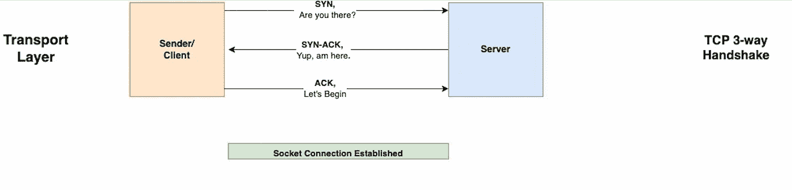
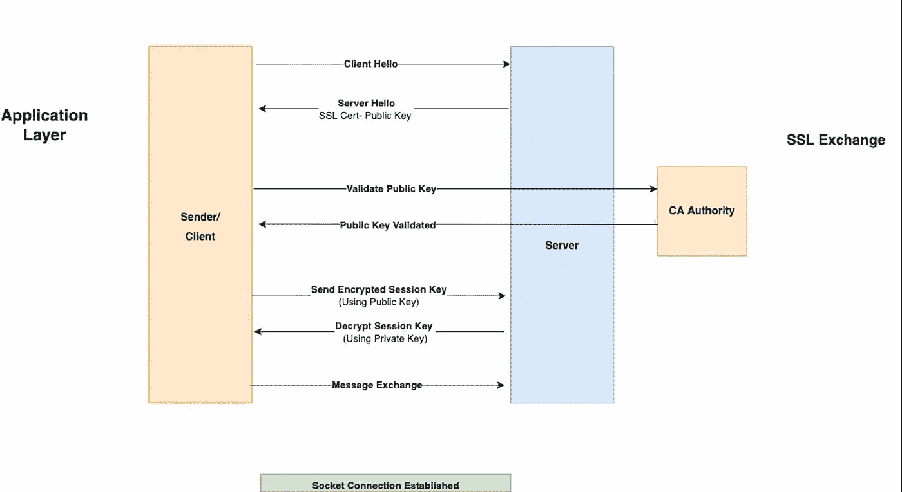
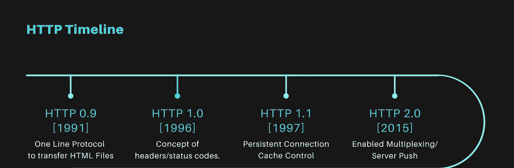

# HTTP(S): 101

> 原文：<https://blog.devgenius.io/http-s-101-3be3dd2763bd?source=collection_archive---------11----------------------->

这篇博客是我们从零开始讨论 101 个概念的系列文章的一部分，读者的入门知识有限。这篇文章属于 ***初级*** 系列，因为它涉及了解 HTTP(S) 的基础知识及其作为现代互联网主干的重要性。

101 系列中的一些早期博客如下:

[**数据加密 101**](/data-encryption-101-f0a25db7d913)[**数据库复制 101**](/database-replication-101-d148514598a7)[**数据库分片 101**](/database-sharding-101-4ef36046c29c)[**缓存策略 101**](/caching-strategy-101-3bc974d2a6cd)[**Kubernetes 部署 101**](http://kubernetes-deployments-101/)

# 什么是 HTTP(S)？

HTTP 是 internet protocol suite(也称为[**TCP/IP**](https://en.wikipedia.org/wiki/Internet_protocol_suite)**)**中的应用层协议，用于通过 internet 在服务器和客户端之间以超级文本的形式传输文档。HTTPS 是前者的安全版本，数据交换通过加密协议 [**TLS/SSL**](https://en.wikipedia.org/wiki/Transport_Layer_Security) 进行。

此外， **TCP、IP 和 UDP** 形成了分布在全球的计算机之间的现代通信的基础，并且通常在 [**OSI 模型**](https://www.imperva.com/learn/application-security/osi-model/#:~:text=The%20Open%20Systems%20Interconnection%20(OSI,companies%20in%20the%20early%201980s) **的网络/传输层上运行。**

# HTTPS 是如何工作的？

HTTPS 要求在客户端和服务器之间建立 TCP 连接，作为在安全协议上交换信息的前提。TCP 基于三方交换工作，以便双方进行可靠的数据交换。

## 传输层

1.  客户端向服务器发送一个 **SYN** (同步序列号)消息，表示即将开始。
2.  服务器用一个 **SYN-ACK** 来响应，确认它已经收到了 **SYN** 消息。
3.  客户端发送一个 **ACK** 消息，之后建立一个安全的套接字连接。

## 应用层

1.  客户端发送一个 **Client-Hello** 以及安全 HTTPS 通信所需的密码
2.  服务器用 **Server-Hello** 响应，并发送已安装的服务器证书的公钥。
3.  客户端将**公钥**发送给 **CA authority** 进行发行验证。
4.  **CA 机构**验证服务器证书的公钥。
5.  客户端使用公钥生成加密的会话密钥，并将其发送给服务器。
6.  服务器使用私钥(非对称加密)解密会话密钥。
7.  发布此消息后，客户端和服务器之间使用对称加密进行数据传输。

# HTTP 版本

自 1991 年问世以来，HTTP 已经发展成为一种协议，通过重用 TCP 连接和并行处理请求和响应来最大限度地提高性能。以下是整个旅程中的版本-

## HTTP/1.0

本地版本为每个 TCP 连接使用一个 r **请求/响应元组**。它还引入了发送**报头**来指示被交换数据的类型，这是早期协议中的一个新概念。除了传统的 HTML 文件之外， **Content-Type** header 允许用户发送信息。

## HTTP/1.1

它通过在多个请求/响应交换中重用同一个 TCP 连接来提高性能。它还引入了**管道**的概念——在服务器响应第一个请求之前发送第二个请求；**缓存控制** —确定要使用的缓存类型。

## HTTP/2.0

它通过引入**多路复用—** 显著提高了性能，即多个请求和响应可以通过一个 TCP 请求同时发送。

# 摘要

HTTPS 支持使用安全协议进行数据传输，因此在现代互联网的发展过程中非常关键。它支持各种响应状态代码和标题消息，以优化相关数据的交换。此外，像**消息压缩和 HTTP 缓存**这样的技术是改善最终用户延迟**的有效方法。**

如需反馈，请留言至***Amit[dot]894[at]Gmail[dot]com****或联系 https://about.me/amit_raj*[*的任何链接。*](https://about.me/amit_raj)