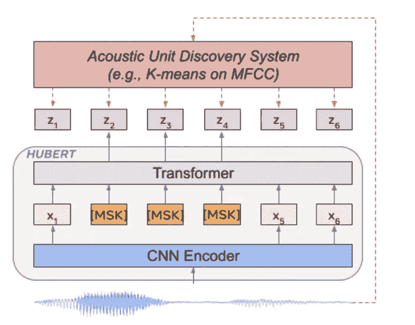
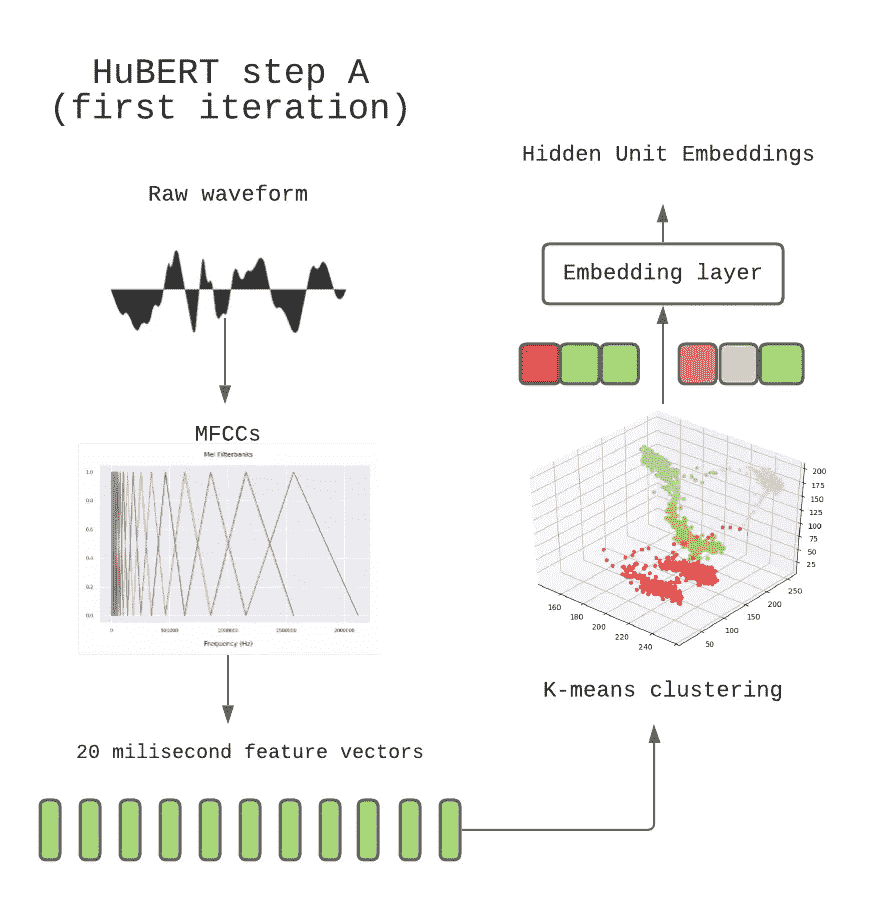
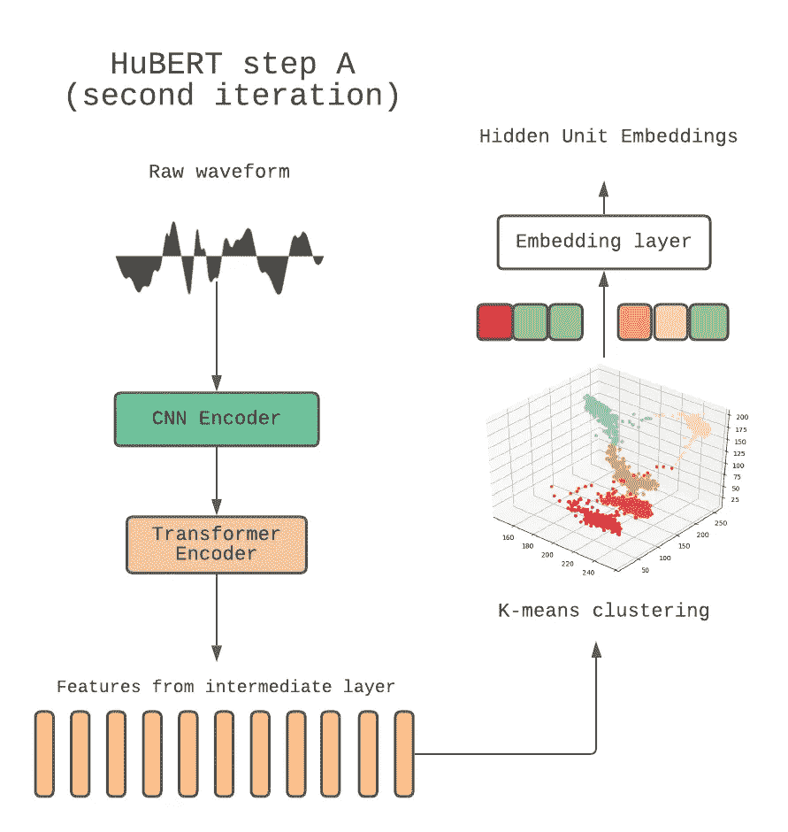
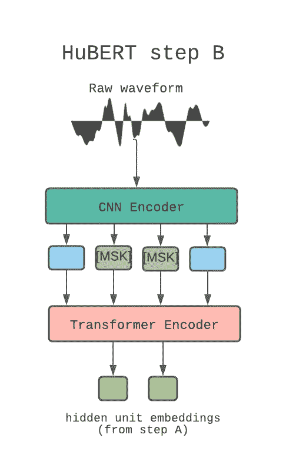

# 休伯特解释说

> 原文：<https://blog.devgenius.io/hubert-explained-6ec7c2bf71fc?source=collection_archive---------2----------------------->

## 使用 BERT 从语音中学习语言

休伯特建筑——图片来自原始论文

自 2019 年 wav2vec 原始论文发布以来，自我监督学习现在越来越多地用于语音。休伯特在这方面迈出了下一步。

论文背后的主要思想是通过**隐藏单元**对音频输入进行离散化，允许应用 BERT 模型。

在本帖中，我们将浏览该文件，解释该模型的组成部分，以及如何在您的项目中使用它。

# 摘要

1.  伯特简介
2.  为什么我们不能在音频上使用 NLP 模型
3.  休伯特建筑与训练程序
4.  如何在你的项目中使用休伯特
5.  结论

# 伯特简介

BERT 是基于 transformer 架构的双向自监督 NLP 模型。

让我们一步一步来

transformer 架构是一个基于自我关注机制的深度学习架构，但解释它超出了这篇文章的范围，要了解更多，你可以阅读这个[伟大的指南](http://peterbloem.nl/blog/transformers)。

双向意味着模型一次接收整个单词序列，因此能够根据单词之前和之后的单词来学习单词的上下文。

自我监督意味着 BERT 可以利用未标记的数据进行学习，为此它使用了两种机制，**掩蔽语言建模**和**下一句预测。**

**屏蔽语言建模**包括用[屏蔽]标记替换一定比例的输入标记，并训练模型预测屏蔽输入的原始值。

**下一个句子预测**包括输入模型 2 的句子，并训练它学习它们是否在原始文档中是后续的。

关于 BERT 更深入的解释可以在这篇伟大的 TDS 文章中看到，也可以阅读原文[1]

# 为什么我们不能在音频上使用 NLP 模型

当试图对语音数据应用 BERT 或其他 NLP 模型时，存在 3 个主要问题:

1.  每个输入表达式中有多个声音单元
2.  没有离散声音单位的词典
3.  声音单元具有可变的长度，并且没有明确的分段

问题 1 阻止了诸如实例分类之类的技术的使用，这些技术在计算机视觉中用于预训练。

问题 2 阻碍了预测损失的使用，因为没有可靠的目标来比较预测。

最后，由于声音单元之间的未知边界，问题 3 使掩蔽预测预训练变得复杂。

为了解决这些问题，作者提出了休伯特。

# 休伯特建筑与训练程序

休伯特建筑——图片来自原始论文

HuBERT 模型架构遵循 wav2vec 2.0 架构，包括:

*   卷积编码器
*   伯特编码器
*   投影层
*   代码嵌入层

这些组件的数量在基础、大和 x-大变量之间变化。

在解释训练循环时，将更好地解释每个组件及其任务。

培训包括 2 个步骤:

# 生成隐藏单元

休伯特初始聚类步骤-按作者分类的图像

第一个训练步骤包括发现隐藏单元，该过程从从音频波形中提取 [MFCCs(Mel 频率倒谱)](https://en.wikipedia.org/wiki/Mel-frequency_cepstrum)开始。

这些是用于表示语音的原始声学特征。

然后，每个音频片段被传递给 [K 均值聚类算法](https://pt.wikipedia.org/wiki/K-means)，并被分配给 K 个聚类中的一个。

所有的音频帧将根据它们所属的簇被标记，这些是**隐藏单元。**

之后，这些单元被转换成嵌入向量，用于训练的步骤 B。

在第一训练步骤之后，模型本身可以生成比 MFCCs 更好的表示，这是通过使用来自前一迭代的 BERT 编码器的中间层的输出来完成的:

休伯特后续聚类步骤-按作者分类的图像

# 掩蔽预测

休伯特预测步骤-作者图片

第二步类似于原始 BERT 模型的训练，使用屏蔽语言建模。

CNN 负责从原始音频中生成特征，然后随机屏蔽并馈入 BERT 编码器。

BERT 编码器输出特征序列，填充屏蔽的记号。该输出然后被投影到较低的维度以匹配标签，并且计算这些输出和在步骤 a 中生成的每个隐藏单元嵌入之间的余弦相似性

交叉熵损失然后被用于逻辑上以惩罚错误的预测。

# 如何在你的项目中使用休伯特

Huggingface 在变形金刚库中提供了 HuBERT 的所有官方版本(基本、大和 X-large ):

# 结论

现在您已经知道了 HuBERT 模型是如何工作的，您可以在您的语音识别项目中使用它了！如果您愿意，甚至可以为其他下游任务进行微调！

要了解关于模型和结果的更多信息，请查看原始论文！

**参考文献:**

[1] Hsu，Wei-Ning，et al .[“HuBERT:隐单元掩蔽预测的自监督语音表征学习”](https://arxiv.org/abs/2106.07447) (2021)。

彼得·布鲁姆的《从零开始的变形金刚》

[3] [Devlin，Jacob，等《Bert:用于语言理解的深度双向转换器的预训练》](https://arxiv.org/abs/1810.04805) (2018)。

【4】[巴耶夫斯基，阿列克谢，等，“wav2vec 2.0:语音表征的自我监督学习框架”](https://arxiv.org/abs/2006.11477) (2020)。