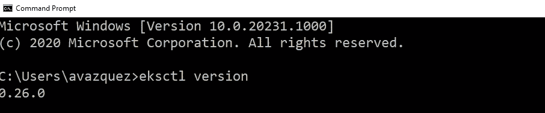
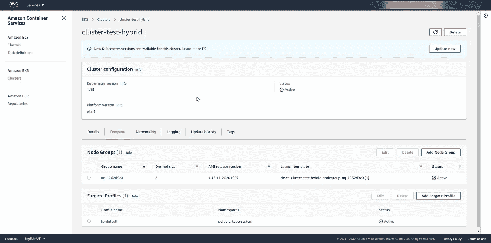

# 使用 EKS、EC2 和 Fargate 的混合 AWS Kubernetes 集群

> 原文：<https://blog.devgenius.io/hybrid-aws-kubernetes-cluster-using-eks-ec2-and-fargate-13198d864baa?source=collection_archive---------0----------------------->

## 了解如何使用 AWS Fargate 创建一个 Kubernetes 集群，该集群还可以使用无服务器计算的所有功能


照片由[德鲁·格拉汉姆](https://unsplash.com/@dizzyd718?utm_source=medium&utm_medium=referral)在 [Unsplash](https://unsplash.com?utm_source=medium&utm_medium=referral) 上拍摄

我们知道，有几个运动和模式正在推动我们努力改变我们的架构，试图利用更多的托管服务并关注运营级别，以便我们可以专注于对我们自己的业务真正重要的事情:创建应用程序并通过它们提供价值。

亚马逊的 AWS 是这一过程中的重要合作伙伴，尤其是在容器领域。随着前一段时间 EKS 的发布，我们能够提供每个人都可以使用的托管 Kubernetes 服务，而且引入 CaaS 解决方案 Fargate 也使我们能够以无服务器的方式运行容器工作负载，而无需担心其他任何事情。

但是你可以考虑这些服务是否可以一起工作？简单的回答是肯定的。但更重要的是，我们看到它们也可以在混合模式下工作:

因此，您可以拥有一个 EKS 集群，其中有些节点是 Fargate 服务，有些节点是正常的 EC2 机器，用于以全状态方式工作或更适合传统 EC2 方法的工作负载。所有东西都按照相同的规则运行，由同一个 EKS 集群管理。

这听起来很神奇，但是，我们该怎么做呢？我们开始吧。

# eksctl

为了达到这一点，我们需要首先介绍一个工具，该工具名为 eksctl，它是一个命令行实用程序，可以帮助我们执行任何操作来与 EKS 服务进行交互，简化了大量工作，并且能够以非人工方式自动执行大多数任务。因此，我们需要做的第一件事是在我们的平台中准备好 eksctl。让我们看看我们如何能得到它。

这里有亚马逊自己提供的关于如何在不同平台上安装 *eksctl* 的所有细节，无论你使用的是 Windows、Linux 还是 MacOS X:

 [## eksctl 命令行实用程序

### 本主题介绍 eksctl，这是一个简单的命令行实用程序，用于在亚马逊 EKS 上创建和管理 Kubernetes 集群…

docs.aws.amazon.com](https://docs.aws.amazon.com/eks/latest/userguide/eksctl.html) 

完成后，我们可以检查是否已经安装了 eksctl 软件，并运行以下命令:

```
eksctl version
```

我们应该得到类似这样的输出:



eksctl 版本输出命令

这样做之后，我们可以看到，只需在控制台窗口中键入这些简单的命令，就可以访问 EKS 服务背后的所有功能。

# 创建 EKS 混合集群

现在，我们将使用一些 EC2 机器创建一个混合环境，并启用对 EKS 的 Fargate 支持。为此，我们将从以下命令开始:

```
**eksctl create cluster --version=1.15 --name=cluster-test-hybrid --region=eu-west-1 --max-pods-per-node=1000 --fargate**
[ℹ]  eksctl version 0.26.0
[ℹ]  using region eu-west-1
[ℹ]  setting availability zones to [eu-west-1c eu-west-1a eu-west-1b]
[ℹ]  subnets for eu-west-1c - public:192.168.0.0/19 private:192.168.96.0/19
[ℹ]  subnets for eu-west-1a - public:192.168.32.0/19 private:192.168.128.0/19
[ℹ]  subnets for eu-west-1b - public:192.168.64.0/19 private:192.168.160.0/19
[ℹ]  using Kubernetes version 1.15
[ℹ]  creating EKS cluster "cluster-test-hybrid" in "eu-west-1" region with Fargate profile
[ℹ]  if you encounter any issues, check CloudFormation console or try 'eksctl utils describe-stacks --region=eu-west-1 --cluster=cluster-test-hybrid'
[ℹ]  CloudWatch logging will not be enabled for cluster "cluster-test-hybrid" in "eu-west-1"
[ℹ]  you can enable it with 'eksctl utils update-cluster-logging --region=eu-west-1 --cluster=cluster-test-hybrid'
[ℹ]  Kubernetes API endpoint access will use default of {publicAccess=true, privateAccess=false} for cluster "cluster-test-hybrid" in "eu-west-1"
[ℹ]  2 sequential tasks: { create cluster control plane "cluster-test-hybrid", create fargate profiles }
[ℹ]  building cluster stack "eksctl-cluster-test-hybrid-cluster"
[ℹ]  deploying stack "eksctl-cluster-test-hybrid-cluster"
[ℹ]  creating Fargate profile "fp-default" on EKS cluster "cluster-test-hybrid"
[ℹ]  created Fargate profile "fp-default" on EKS cluster "cluster-test-hybrid"
[ℹ]  "coredns" is now schedulable onto Fargate
[ℹ]  "coredns" is now scheduled onto Fargate
[ℹ]  "coredns" pods are now scheduled onto Fargate
[ℹ]  waiting for the control plane availability...
[✔]  saved kubeconfig as "C:\\Users\\avazquez/.kube/config"
[ℹ]  no tasks
[✔]  all EKS cluster resources for "cluster-test-hybrid" have been created
[ℹ]  kubectl command should work with "C:\\Users\\avazquez/.kube/config", try 'kubectl get nodes'
[✔]  EKS cluster "cluster-test-hybrid" in "eu-west-1" region is ready
```

该命令将设置 EKS 集群，启用 Fargate 支持。

注意:我们应该注意的第一件事是，Fargate 对 EKS 的支持尚未在所有 AWS 地区提供。因此，根据你使用的地区，你可能会得到一个错误。目前，仅在美国东部(北弗吉尼亚州)、美国东部(俄亥俄州)、美国西部(俄勒冈州)、欧洲(爱尔兰)、欧洲(法兰克福)、亚太地区(新加坡)、亚太地区(悉尼)、亚太地区(东京)启用，基于 AWS 公告的信息:、T2:【https://AWS . Amazon . com/about-AWS/whats-new/2020/04/eks-adds-fargate-support-in-Frankfurt-Oregon-Singapore-and-Sydney-AWS-regions/

现在，我们应该向该群集添加一个节点组。节点组是一组 EC2 实例，将作为它的一部分进行管理。为此，我们将使用以下命令:

```
eksctl create nodegroup --cluster cluster-test-hybrid --managed
[ℹ]  eksctl version 0.26.0
[ℹ]  using region eu-west-1
[ℹ]  will use version 1.15 for new nodegroup(s) based on control plane version
[ℹ]  nodegroup "ng-1262d9c0" present in the given config, but missing in the cluster
[ℹ]  1 nodegroup (ng-1262d9c0) was included (based on the include/exclude rules)
[ℹ]  will create a CloudFormation stack for each of 1 managed nodegroups in cluster "cluster-test-hybrid"
[ℹ]  2 sequential tasks: { fix cluster compatibility, 1 task: { 1 task: { create managed nodegroup "ng-1262d9c0" } } }
[ℹ]  checking cluster stack for missing resources
[ℹ]  cluster stack has all required resources
[ℹ]  building managed nodegroup stack "eksctl-cluster-test-hybrid-nodegroup-ng-1262d9c0"
[ℹ]  deploying stack "eksctl-cluster-test-hybrid-nodegroup-ng-1262d9c0"
[ℹ]  no tasks
[✔]  created 0 nodegroup(s) in cluster "cluster-test-hybrid"
[ℹ]  nodegroup "ng-1262d9c0" has 2 node(s)
[ℹ]  node "ip-192-168-69-215.eu-west-1.compute.internal" is ready
[ℹ]  node "ip-192-168-9-111.eu-west-1.compute.internal" is ready
[ℹ]  waiting for at least 2 node(s) to become ready in "ng-1262d9c0"
[ℹ]  nodegroup "ng-1262d9c0" has 2 node(s)
[ℹ]  node "ip-192-168-69-215.eu-west-1.compute.internal" is ready
[ℹ]  node "ip-192-168-9-111.eu-west-1.compute.internal" is ready
[✔]  created 1 managed nodegroup(s) in cluster "cluster-test-hybrid"
[ℹ]  checking security group configuration for all nodegroups
[ℹ]  all nodegroups have up-to-date configuration
```

所以现在我们应该能够使用 kubectl 来管理这个新集群。如果你没有安装 kubectl 或者你没有听说过它。这是允许我们管理您的 Kubernetes 集群的命令行工具，您可以根据此处显示的文档进行安装:

[](https://kubernetes.io/docs/tasks/tools/install-kubectl/) [## 安装并设置 kubectl

### Kubernetes 命令行工具 kubectl 允许您对 Kubernetes 集群运行命令。可以用 kubectl…

kubernetes.io](https://kubernetes.io/docs/tasks/tools/install-kubectl/) 

因此，现在，我们应该开始审视我们现有的基础架构。因此，如果我们键入以下命令来查看由我们支配的节点:

```
kubectl get nodes
```

我们看到类似于以下内容的输出:

```
NAME                                                    STATUS   ROLES    AGE   VERSION
fargate-ip-192-168-102-22.eu-west-1.compute.internal    Ready    <none>   10m   v1.15.10-eks-094994
fargate-ip-192-168-112-125.eu-west-1.compute.internal   Ready    <none>   10m   v1.15.10-eks-094994
ip-192-168-69-215.eu-west-1.compute.internal            Ready    <none>   85s   v1.15.11-eks-bf8eea
ip-192-168-9-111.eu-west-1.compute.internal             Ready    <none>   87s   v1.15.11-eks-bf8eea
```

如您所见，我们有 4 个“节点”,其中两个以 fargate 名称开头，它们是 fargate 节点，另外两个以 ip 开头，它们是传统的 EC2 实例。在那之后，我们就可以使用我们的混合环境了。

我们可以使用 AWS EKS 页面检查同一个集群，以便更详细地查看配置。如果我们在该群集的 EKS 页面中输入，我们会在“Compute”选项卡中看到以下信息:



在节点组下，我们可以看到作为该群集的一部分进行管理的 EC2 计算机的数据，正如您所看到的，我们看到 2 是所需的容量，这就是为什么我们的群集中有 2 个 EC2 实例。关于 Fargate 概要文件，我们看到名称空间被设置为 default 和 kube-system，这意味着这些名称空间的所有部署都将使用 Fargate 任务进行部署。

# 摘要

在本系列的后续文章中，我们将了解如何在我们的混合集群上取得进展，如何部署工作负载，如何根据我们的需求对其进行扩展，以及如何实现与 AWS CloudWatch 等其他服务的集成。所以，请继续关注，不要忘记关注我的文章，不要错过任何新的更新！