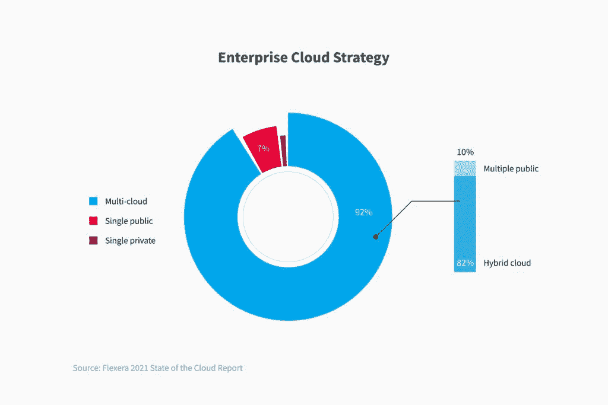
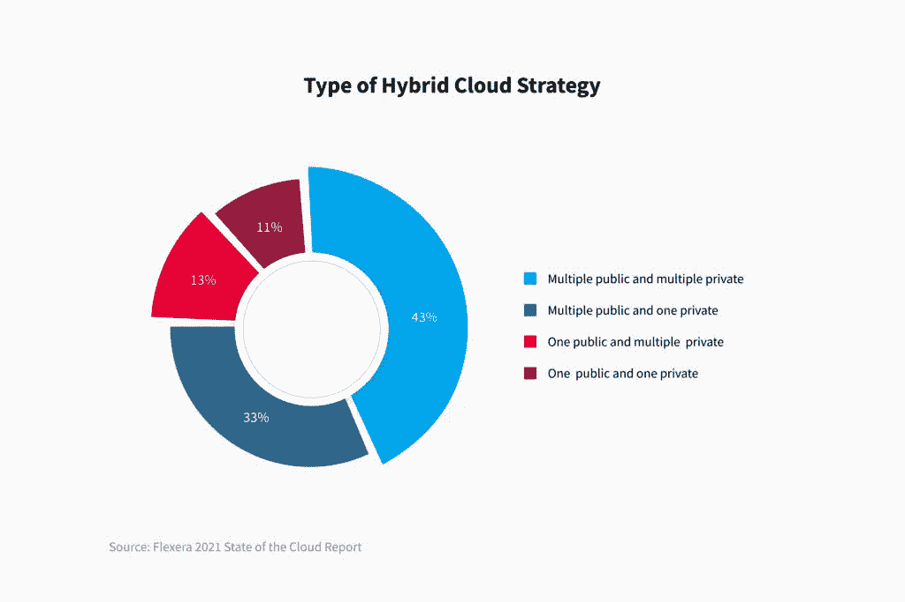
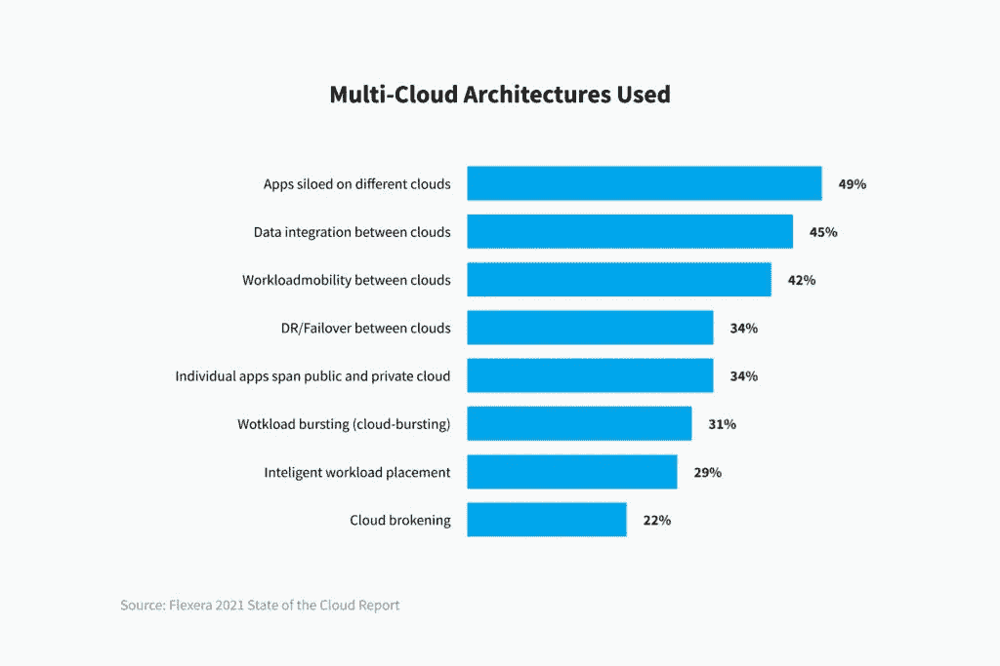
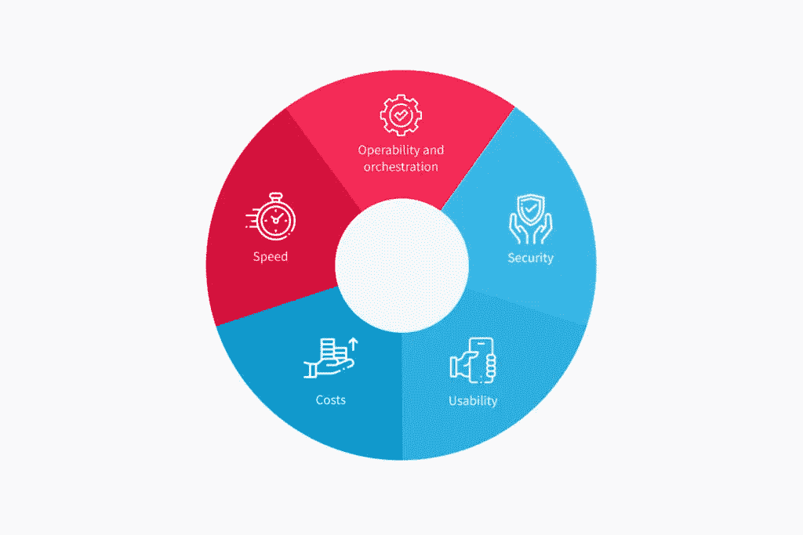

# 混合云架构:最佳数据驱动实践— NIX United

> 原文：<https://blog.devgenius.io/hybrid-cloud-architecture-the-best-data-driven-practices-nix-united-3cb01a6348ee?source=collection_archive---------6----------------------->

第一次接触云计算服务的人可能会有点困惑——有许多云架构类型可以处理不同的任务和业务目标。介于两者之间的是混合云架构。它是否能解决所有的业务需求，混合云有哪些好处，以及如何正确构建混合云，这些都是我们将在本文中澄清的问题。

# 云差异

云计算架构庞大而多样，涵盖了从传输和存储信息到借助继承工具(如[大数据管理系统](https://nix-united.com/services/big-data-management-services-data-engineering/))分析信息的功能。云解决方案有如此多的变体——私有、公共、混合多云和分布式基础设施——以至于用户往往不了解其中每一种的特性。因此，他们可以使用不符合其业务需求的计算系统，甚至对敏感的公司信息有危险。

云架构的基本类型可以分为以下几类:

*   公共云架构
*   私有云架构
*   混合云架构——两者的混合

公共云将数据存储在另一家公司的可通过互联网访问的数据中心。

这意味着任何拥有帐户的注册用户都可以与其他客户共享其资源。在这种情况下，各方避免了维护这一平台的费用，只需支付存储其信息的费用。公共云的常见例子是 IaaS 提供商，如亚马逊网络服务(AWS)、微软 Azure 和谷歌云。

与可共享的云解决方案不同，私有云专为一个客户端设计，比公共云更昂贵。这种存储可以由客户或第三方在现场数据中心进行维护和管理。

私有云并不通用，而公共云网络在处理敏感的客户数据方面存在风险。考虑到这一点，通过使用多云系统结合云计算的主要特性来提升技术似乎是最佳决策。这种架构被称为混合云或多云。

混合云市场[在全球快速发展](https://www.mordorintelligence.com/industry-reports/hybrid-cloud-market)-2020 年价值 560 亿美元，预计到 2026 年将达到 1450 亿美元。

# 什么是混合云架构

混合云方法将公共云技术与内部计算和专门设计的私有云资源相集成。换句话说，来自企业仓库的数据可以在内部和外部复制或扩充。这就是为什么企业在处理大量数据和边缘计算时，使用这样的服务——它们更有效。

混合云系统还能为您的公司带来哪些好处？这种基础设施可以很好地处理业务流程中的波动和变化，因为它允许根据需求从私有云转移到公共云，反之亦然。此外，尽管公共和内部数据中心、云资源和数据集的工作负载可以互操作并一起管理，但它们仍然是不同的，功能也是不同的。

# 为什么选择混合云？

混合云通过支持快速移动的数字业务转型而使企业受益。在快速变化和数字服务需求的时代，企业需要尽快适应全球变化。使用这种云架构，公司可以更快地平衡公共和内部解决方案的利弊。因此，全球超过 80%的企业已经[将](https://www.statista.com/statistics/817296/worldwide-enterprise-cloud-strategy/)混合云解决方案集成到他们的日常工作中。此外，混合云基础架构可以充当用于合规性、监管问题和数据主权的模型。

混合云的基础在于互联性。这些解决方案通过制定特定的策略，在云中的系统内建立稳固的连接，并更有效地同时安全地完成任务，来帮助企业处理数据集。您的混合云运行得有多好——工作负载移动、管理和流程发生——取决于连接的网络是否发展完善。

# 混合云解决方案的优势

混合云方法包含了内部和可共享云解决方案的最佳元素。尽管如此，混合云的主要优势可以归结为 3 个特征——灵活、经济和安全。

**灵活性:**混合云架构是敏捷的。由于互联服务中的宽带连接，您的数据可以在私有云和公共云之间灵活移动。因此，客户可以在自己资源的帮助下，自由决定在单个 IT 架构中共享什么信息和管理什么信息。因此，企业有更多的选择来满足他们的要求和需求，并可以根据预算变化以最有效的方式部署数据。

**经济高效:**混合云的另一个优势是，这种计算服务节省了维护基于这种架构的解决方案或系统的成本——没有技术支持、人工和开发方面的费用。此外，公司的数据部门可以自由选择每项服务的配置、服务提供商和位置。例如，必要时，可以轻松扩展、重新部署或缩减多云解决方案。实体可以管理相关任务的资源，而不需要额外的支出。如果他们临时需要一些数据，将其重定向到外部提供商会更有好处。

那些依赖私有企业数据中心和基础设施的组织需要足够的服务器来满足客户在高活动期的期望。这对他们来说是不划算的——如果在高峰需求期间，一家企业需要 600 台服务器，而在平均时期，这些服务器中的一半可以处理负载，那么购买 300 个额外的点会导致不相关的 IT 支出和对 IT 资源的错误利用。

反过来，集成了混合云方法的公司可以在内部部署 300 台服务器，如果需求过高，可以让公共云提供商参与进来，并临时获得额外的资源。最终，这样的云基础设施可以降低 IT 支出，提高效率。

**安全:**当网络威胁对企业变得越来越明显和危险时，嵌入技术以防止您的敏感企业数据泄露至关重要。经过适当开发、集成和维护的混合云架构可以有效抵御安全风险。当您的数据在部门或位置之间传输时，混合基础架构是安全的——不亚于传统的私有 IT 环境。将信息放在内部和外部数据中心可以帮助组织增加云存储，从而加强网络防御。

# 还有其他混合动力选项吗？

除了混合云之外，还有一种多云方法，客户对这种方法的理解是可互换的，也是不正确的。混合云和多云有一个共同点——两个系统都应用多个云。然而，虽然多云方法使用相同类型的云的组合，例如两个公共云，但混合云架构集成了私有云与公共云功能。

这两种变体对业务都有效，只是在不同的用例中。如果你的目标是避免单个云提供商的风险或者在多个地方存储数据，那么多云方法是一个不错的选择。或者，如果您的公司已经开发了内部 IT 基础设施，最好使用外部公共解决方案来实施。

# 混合云的局限性

尽管有灵活性和差异性，混合解决方案还是有一些限制。一个是与单独使用公共云相比，它的价格更高。如果企业没有足够的内部 IT 专家来构建内部云，那么当公共云发生变化时，要找到一家专门从事云解决方案设计、维护和开发的技术熟练的外包公司，其管理成本将会很高。

这也意味着您对混合云的控制更少。公共和私人平台之间的整合应该是强有力的；因此，私人基础设施应适应公共环境的可能变化。企业无法控制公共云技术算法，也永远不知道其数据是如何处理的，以及数据被分配到哪里。

# 如何使用它:实践中的混合云

组织如何利用混合解决方案优势的最佳例证是一个实际案例。日本公司富士通部署了混合云架构，以增加其服务基础和收入。乍一看，关注云解决方案的决定可能并不明显，但它是有效的。富士通使用外部提供商来帮助工程团队开发公司内部的系统集成。现在，他们向其他公司提供混合 IT 服务。

另一个混合云的例子是 Ducati，他加强了工程和设计部门。Ducati 集成了一系列混合云解决方案，旨在实现灾难恢复和数据保护开发、计算集群更新和数据中心整合，以及整个 IT 基础设施的现代化。

在通信领域，美国跨国电信集团威瑞森凭借基于云的集成混合解决方案，得以扩展其数据中心设施，满足高安全性和合规性要求。混合云解决方案的其他活跃用户是创新的美国公司，如 Inifinidat、Ensono、Unitas Global 和 DXC Technology。

因此，公共云和私有云的混合可以在所有经常处理数据的领域中有效——金融科技、银行、教育、政府部门、医疗保健、电信和其他 B2B 和 B2C 细分市场。这怎么可能呢？让我们想象你有一个巨大的信息范围，或者它经常变化。在这种情况下，您可以将易于扩展的公共云用于动态工作负载，并将更稳定或敏感的数据注入私有云或内部数据中心。或者，如果您不确定哪种类型的云解决方案最适合企业，您可以在公共云和小型私有云之间分配工作负载，并在两者之间做出决定，或者同时使用两者。

# 什么事情重要？

面对如此多类型和规格的云解决方案，很难选择合适的云服务组合。为了帮助您选择最佳解决方案，我们建议您询问以下问题来消除分歧:

**好用吗？**企业实施混合云解决方案来支持和优化数据向云的迁移。这意味着该过程应该是快速的，并且通过管理它来节省时间和金钱。如果架构过于复杂，可能会降低数据传输和分析的速度。

**你的数据安全吗？**您最好比较一下每个云提供商如何控制数据迁移和存储。您可以研究身份验证、对象锁和加密等安全特性的差异。这将保护您的数据免受不正确的干扰、篡改或泄漏。

**还有其他隐性成本吗？**一些云提供商对过滤、重组或从云中移除数据等信息操作收取额外费用。不明显的费用使得维护和提供商之间的转换更加昂贵。因此，您应该理顺云提供商提供的定价模式和额外选项。一个好办法是在电子表格中比较一些选项，以亲眼看到命题。

**速度高吗？你需要检查提供商提供的数据速度——它应该足以满足你的需求。此外，检查最初提到的速度是否是最终速度。有时，提供商需要额外的费用来实现更好的云运营。这是一种不同的提议-基本与专业。你可以自己决定是否愿意等待更长时间，不再每月支付额外费用，或者选择“专业”解决方案。储物也是如此——更多的空间，更多的钱。**

**基础设施是否擅长可操作性和编排？**混合云方法的主要优势是灵活性和互连性——一个操作可以支持或替代另一个操作。缺乏适当的集成架构可能会导致额外的财务和人力成本。因此，为了有效地运行服务，您需要了解提供商集成生态系统的特性。

# 最后的建议

为了在您的公司中正常工作，混合云模型应该满足您的目标和运营——它不是万灵药。主导角色是您的系统能够传输数据的速度和特定的云规范——如提供商、连接、技术限制等。较低的速度意味着不那么显著的性能。

混合云和多云可以帮助公司区分信息，并在处理敏感数据或巨大工作负载时保持信息安全。采用混合云基础架构的组织可以获得公共和私有平台的最强功能。因此，他们能够利用它提供的可伸缩性、适应性、高速和多样化。这些功能有助于最大限度地提高业务绩效，同时还具有成本效益。

尽管如此，适用于一家企业的可能不适合另一家企业，即使是在同一个行业。如果您是小型企业，一个完全公共的、基于云的解决方案可能是最佳选择，因为数据流不是那么动态，或者预算可能会紧张。

你需要尝试找出带来结果的最佳方式。如果您想将云解决方案集成到您的业务中，并寻求一个合适的组合，但不知道选择哪一个以及它将如何帮助您，请随时联系我们。我们的云工程师随时乐意为您提供帮助。

*原载于 2022 年 1 月 21 日*[*【https://nix-united.com】*](https://nix-united.com/blog/hybrid-cloud-architecture-mix-of-best-data-driven-practices/)*。*