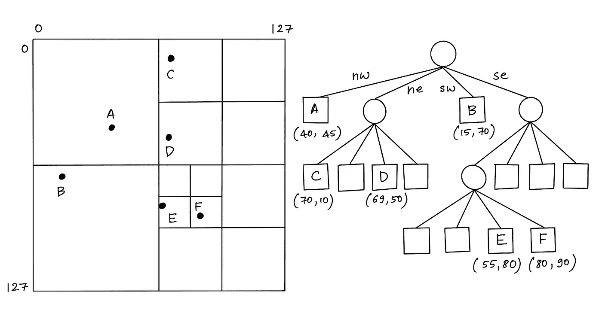
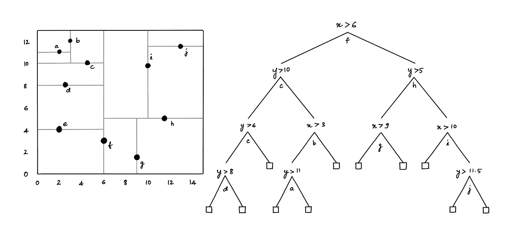
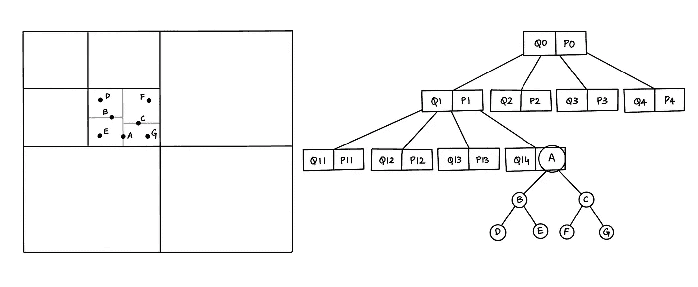

# 基于 KD 树和四叉树的混合空间数据结构

> 原文：<https://blog.devgenius.io/hybrid-spatial-data-structure-based-on-kd-tree-and-quadtree-8c0c5eebdbbf?source=collection_archive---------6----------------------->

让我们一起种树吧！—龙猫

# 什么是空间索引？

空间索引是一种允许高效访问空间对象的数据结构，这是空间数据库中常用的技术。如果没有索引，搜索将需要“顺序扫描”数据库中的所有记录，从而增加处理时间。最小包围矩形(MBR)通常称为包围盒(BBox)，在空间索引构建过程中用作对象近似。

# **不同类型的空间索引**

已经开发了各种空间索引来产生可测量的性能差异。概括地说，空间索引有两种类型的结构:

1.  **空间驱动结构**基于将嵌入的 2D 空间划分为网格/单元，根据某种空间关系(重叠或相交)将 MBR 映射到单元
2.  **数据驱动结构**由空间对象集合的分区来组织，其中空间数据对象使用 MBR 来分组，以适应它们在嵌入空间中的分布。

# **热门空间指数:**

1.  空间驱动结构:**四叉树**和 **KD 树**
2.  数据驱动结构: **R 树**和变体

# **四叉树**

四叉树是固定网格索引的一种特殊形式，其中网格的分辨率根据要拟合的空间对象的密度而变化。

图 1:四叉树

在四叉树中，每个节点代表一个覆盖被索引空间的某个部分的边界框，根节点覆盖整个区域。每个节点或者是包含一个或多个索引点且没有子节点的叶节点，或者是恰好具有四个子节点的内部节点，每个子节点对应于通过沿两个轴将覆盖区域分成两半而获得的每个象限。因此得名“四叉树”

# **KD 树**

KD 树是一种二叉树，其中每个节点代表一个轴对齐的超矩形。每个节点指定一个轴，并根据点沿该轴的坐标是大于还是小于特定值(如坐标中值)来分割点集。

图 2: KD 树

KD 树可用于索引一组 k 维点。每个非叶节点通过特定维度的超平面将空间分成两部分。左半空间中的点由该节点的左子树表示，落入右半空间的点由右子树表示[2]。

# **混合算法**

K-D 树好处多多；然而，要有效地实现它并不容易，而且对于线和多边形这样的高维数据也存在问题。此外，四叉树有一个明显的缺点:一个在零层与边界相交的对象将被自动放置到根节点，而不管它的大小。使用四叉树的最大挑战是为 k 找到一个好的因子。如果因子太小，根节点可能会被小的、分区不良的对象溢出。另一方面，使用太大的因子会导致过度宽松的边界长度，并因此在一个级别上的节点之间有太多的重叠。

图 3:混合树(四 KD 树)

混合算法将解决类似问题的两种或多种算法结合在一起。例如，结合了四叉树和 KD 树特征的混合树数据结构。上面的*图(3)* 显示的是一个混合结构，在一个地图中插入了七个点，所以地图按照四叉树结构分为四个部分，每个部分又细分为四个部分。如果一个部分在四叉树结构中存储了一条线或多边形，但其他部分包含点，我们在这个部分中使用 KD-tree 结构来存储每个点的位置[2]。

类似地，我们可以考虑一种混合树数据结构，它结合了 R 树和 KD 树的特征，其中我们在 R 树的一个较小的边界内使用 KD 树结构来存储每个点的位置。

为了验证混合树结构检索空间对象的性能:【https://github.com/addu390/hybrid-spatial-index】T2 是混合树在 2D 平面上搜索点和矩形的简单比较。

然而，该项目是一项正在进行中的工作，⚠️，并期待更多的更新🚀

> [1]张，X，和杜，Z. (2017)。空间索引。《地理信息科学与技术知识体系》(2017 年第四季度版)，约翰·p·威尔逊(编辑)。DOI: 10.22224/gistbok/2017.4.12
> 
> [2]马哈茂德，马哈茂德。(2019).一种基于 KD 树和四叉树的混合空间数据结构。雪山。69.2–6.