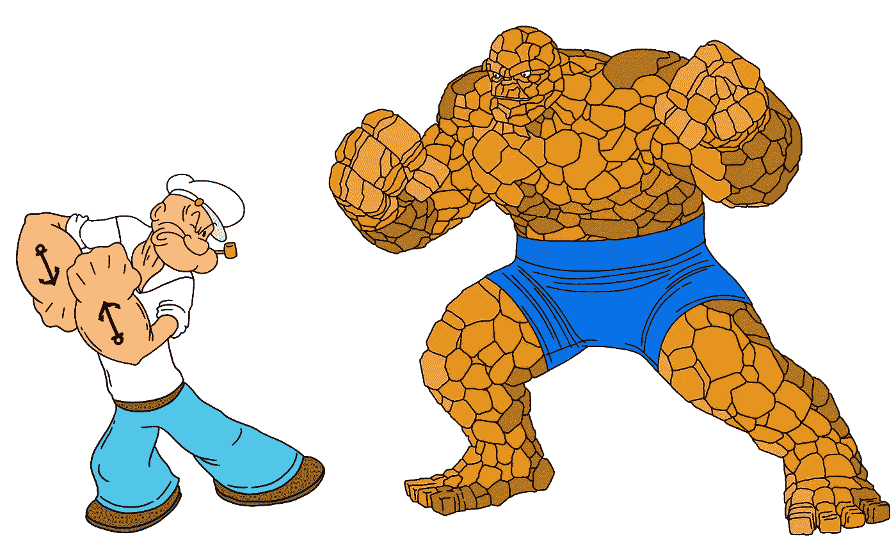
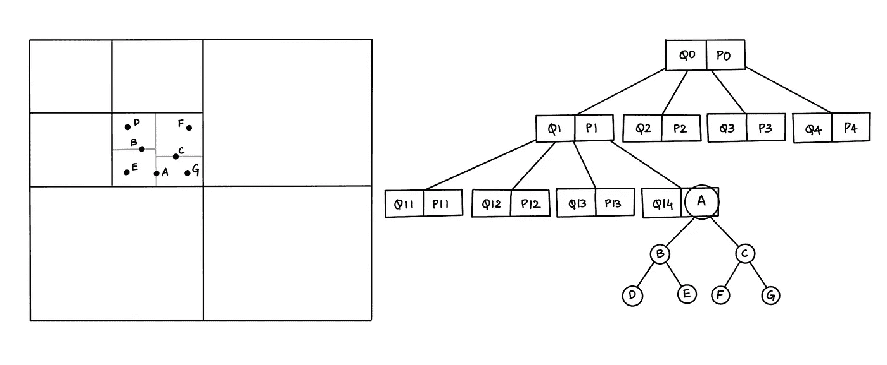
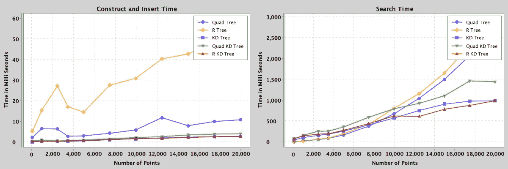
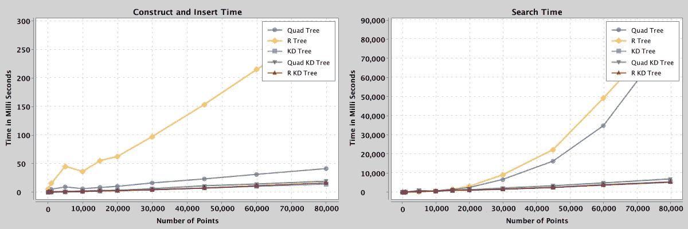
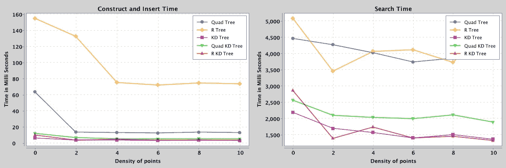
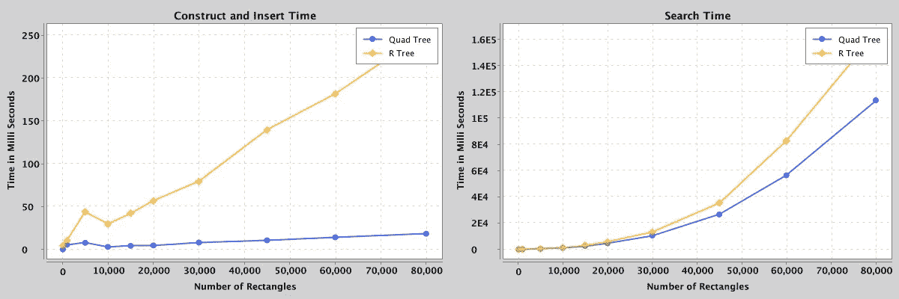
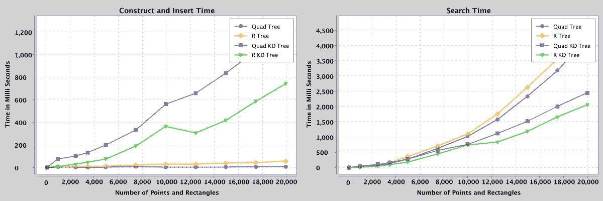
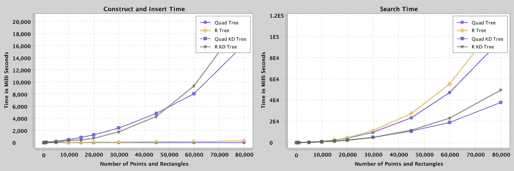
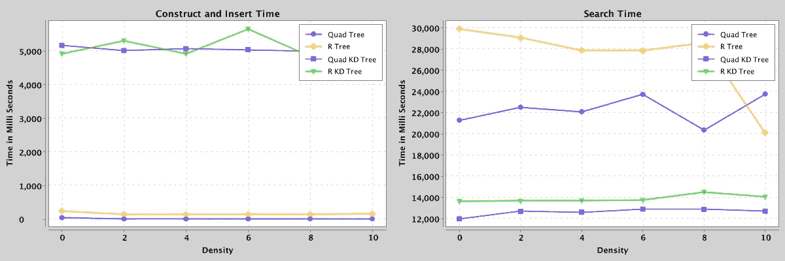

# 混合空间数据结构:四 KD 和 R-KD 树

> 原文：<https://blog.devgenius.io/hybrid-spatial-data-structures-quad-kd-and-r-kd-trees-3831b6bfbabe?source=collection_archive---------0----------------------->



四 KD 与 R-KD 树

# 1.摘要

混合空间索引是一种数据结构，它结合了两种或多种适合于有效存储空间对象以提高搜索性能的数据结构。项目报告比较了树数据结构 kd-tree、quad-tree 和 r-tree，然后介绍了混合树结构 quad-kd 和 r-kd 树，以减少空间对象的访问时间，特别是当数据集既有点又有面时。最后，报告总结了混合空间索引在 2D 空间中如何以及何时比其他常用的空间索引具有更好的搜索性能。

索引术语—空间数据结构、kd 树、四叉树、r 树、混合树、四叉树、r-kd 树、地理信息系统。

# 2.简介和调查

# 2.1.r 树

R-tree 是 GIS 数据库中常用的数据驱动的数据结构，包括 MySQL 和 PostGIS (Postgres)。尽管如此，r 树并不能保证良好的最坏情况下的性能(主要是因为重叠的包围矩形)，但通常在现实世界的数据中表现良好。有趣的是，r-Tree 对于一个搜索的最坏情况性能是“未定义的”，平均情况是 O(logMn)，其中 M 是一个页面的最大条目数；Guttman 说，“在一个被访问的节点下，可能需要搜索不止一个子树，因此不可能保证良好的最坏情况性能。”但是我认为最糟糕的情况是 O(n + logMn ),例如，考虑到 r 树中有许多重叠的矩形，并存储一个位于所有其他矩形重叠区域的小矩形。对该矩形的搜索查询是遍历所有子树，即 O(logMn)个节点和 O(n)个条目[8]。

# 2.2.四叉树

四叉树是一种空间驱动的数据结构，用于存储栅格数据集。但是对于高维空间数据，当点的密度增加时，搜索性能降低。因为当这些点在某些区域中密集分布时，树是不平衡的，并且可能具有接近 O(n)的最坏情况时间复杂度，最好情况是 O(log4n) [6]。

# 2.3.KD 树

KD 树是空间分区数据结构；尽管空间点的密度是变化的，但批量插入时树的高度是 O(log n)；因此，搜索操作的平均时间复杂度为 O(log n)。此外，与多边形相比，kd-tree 对于点是一个很好的选择(因为多边形需要重叠)，并且对于更高的维度，性能会下降(维数灾难)。最后，构建静态 kd-tree 的最坏情况时间复杂度是 O(n log n)，假设一个 O(n)中值算法(选择每一层的中值)[7]。

# 2.4.混合树

混合树是空间数据结构的组合，它结合了两种或多种空间结构的特征，以提高性能。

在现实世界中，空间对象并不是均匀分布的；相反，空间对象是复杂多边形和集中在某些区域(不同密度)的点的组合。因此，提高搜索性能的一种可能方法是使用对多边形和点表现良好的空间数据结构(混合树)的组合。到目前为止，我们知道四叉树和 r 树对于多边形表现很好，kd 树对于点表现最好。因此，对多边形使用四叉树/r 树，对点使用 kd 树是一个可行的选择，可以探索搜索时间的复杂性，结合 r 树/四叉树(来自 2.1 和 2.2)来搜索多边形/外接矩形，对点使用额外的 kd 树搜索时间(来自 2.3)。

本文的其余部分比较了 r 树、四叉树和 kd 树的搜索和构造性能，然后介绍和讨论了混合空间数据结构、四叉 kd 树和 r-kd 树。



图一。一种四 KD 混合树结构的表示。

# 3.已知结果

*   第 2.1 节至第 2.4 节讨论了四边形、kd 和 r 树的属性，它们构成了项目调查的基础。
*   针对 GIS 地图中不同区域的 10 个点和 10 个多边形比较四叉树、kd 树和四叉树的实验结果如下:
*   对于点:四叉 kd 树中的搜索时间比 kd 树减少了 56.6%，比四叉树减少了 45%。
*   对于多边形:四叉 kd 树中的搜索时间比四叉树减少了 71.4%，比 kd 树减少了 55.6%。
*   对于 GIS 地图中的点和面:与 kd 树相比，四叉树中的搜索时间减少了 67.47%，与四叉树相比减少了 51.3%。
*   当数据重叠增加时，四叉树、r 树和 qr 树会降低搜索性能。
*   k-d-树在大容量装载时很优雅，修改或重新平衡 KD-树也很重要；然而，r 树和四叉树不会受到这种影响。

而研究论文[2] [3]表明混合树极大地提高了 2D 空间中点和多边形的搜索性能。结果基于理论分析(先验分析)或实验(后验测试),针对一个狭窄的用例，考虑分布在地图上的 10 个点和 10 个多边形。结果没有清楚地表明杂交树在所有情况下都提高了性能。例如，空间数据的密度、大小和数量与搜索性能直接相关。此外，研究论文并未提及更好地理解任何优化的重要性所需的不同空间树结构的实现细节。

调查显示，需要针对不同的输入数据集(改变空间数据的密度和数量)测试四 kd 树，并进一步与其他混合树进行比较。更不用说，没有考虑构建混合树数据结构的开销。

# 4.问题陈述

随着供应链行业的市场份额不断增长，空间索引技术在时间关键的应用程序和管理空间数据中发挥着重要作用。例如，地理信息系统中内存空间树结构的一个常见用例是在客户端设备上索引空间对象，这通常具有较低的 CPU。GIS 导入一部分空间数据，并在客户端设备上对其进行索引，以获得更好的用户访问空间信息的体验。

我们知道，空间对象由点和多边形组成，相同的空间结构不会同时为点和多边形产生最佳的搜索性能。另一方面，当前的结果没有描述空间数据的真实世界的安排。因此，问题陈述是将理论分析考虑在内，选择一组树进行比较，描绘真实世界的空间数据集，并使用另一个混合树进行验证，以得出混合树改善搜索性能的效果。

# 5.实验

# 5.1.假设

确保实验在规定的时间内进行。以下假设定义了项目的范围

*   空间数据在二维空间中。
*   空间对象是点和矩形(复杂的多边形由最小外接矩形表示——MBR)。
*   搜索和构造/插入操作的性能比较。

# 5.2.数据结构

以下是一组相互比较的空间数据结构:

*   r 树
*   KD 树
*   四叉树
*   四 KD 树
*   R-KD 树

# 5.3.输入数据集

如前所述，实验的一个重要方面是描绘真实世界的空间数据排列。

*   100，000 x 100，000 单位的空间。
*   1 到 80，000 个点和矩形的范围。
*   通过将一组点和矩形放得更近来改变点和矩形的密度。
*   为四叉树/r 树中的 kd 树选择不同的包围盒。

# 5.3.结果

重要而有趣的结果:

*   对于 2D 点，r-kd 混合树具有最好的搜索性能，与四叉树和 r-树相比，搜索时间分别减少了近 49%和 58%，略好于 KD-树。R-kd 树在边界矩形内搜索点(通过对附近的点进行分组)，不像 kd 树那样划分整个区域。类似地，四 kd 树搜索嵌套象限中的边界矩形内的点。
*   随着 2D 矩形数量的增加，四叉树的搜索性能比 r-树好大约 26%,这与说四叉树比 r-kd 树对矩形更好相关。此外，r 树的构建/大容量装载时间明显比四叉树长。
*   当地图上有多个高密度点组时，点的密度不会显著影响搜索性能。
*   当空间数据超过 25，000 个点和矩形时，四 kd 树的性能优于所有其他树。一般来说，混合树具有更好的搜索性能，例如，四叉树比 r 树减少了近 68%的搜索时间，而 r-kd 树比四叉树减少了近 54%的搜索时间。然而，由于在包围矩形内插入点时的“搜索和插入”机制，混合树的构造时间更长。
*   此外，当数据集少于 25，000 个点和矩形时，r-kd 树比四 kd 树具有更好的搜索性能，平均提高 17%。

注:上述提高或降低的百分比取决于输入数据集，精度为+/- 7%。

在对不同密度和不同数量的点和矩形的几个场景进行实验之后，一些值得注意的结果如下:

# 5.3.1 要点



图 2:包含 100 到 20，000 个点的 quad、kd、r、quad-kd 和 r-kd 树的搜索和构造/插入性能的比较。



图 3:包含 100 到 80，000 个点的 quad、kd、r、quad-kd 和 r-kd 树的搜索和构造/插入性能的比较。



图 4:包含 25，000 个密度从 0 到 10 的点的 quad、kd、r、quad-kd 和 r-kd 树的搜索和构造/插入性能的比较。

# 矩形

当空间数据只有矩形时，r-kd 和四叉 kd 树分别是 r-树和四叉树的简单表示。因此，对于矩形，比较是在没有混合树的四叉树和 r 树之间进行的。



图 5:包含 100 到 80，000 个矩形的四叉树和 r 树的搜索和构造/插入性能比较。

# 点和矩形

由于为多边形实现 kd 树的已知复杂性，当空间数据包含矩形时，kd 树从比较中省略。

注意:对于混合树(四边形 kd 和 r-kd ),这些点在大约 32 个分布在整个区域的边界矩形内。



图 6:包含 100 到 20，000 个点和矩形的 quad、r、quad-kd 和 r-kd 树的搜索和构造/插入性能的比较。



图 7:包含 100 到 80，000 个点和矩形的 quad、r、quad-kd 和 r-kd 树的搜索和构造/插入性能的比较。



图 8:包含 50，000 个密度从 0 到 10 的点的 quad、r、quad-kd 和 r-kd 树的搜索和构造/插入性能的比较。

注意:经过反复试验，四叉树和 r 树的边界矩形的预定义最大容量是大约 450，四叉树的深度是 150 层。

# 6.履行

正如在第 3 节中提到的，实验描述真实世界用例的不同数据集的需要是很明显的。此外，需要从头开始实现数据结构，以便通过调整各种输入参数来提高测试的灵活性。最后，遵循问题陈述，探索其他数据结构以形成另一种混合变体进行比较，为更好地理解混合结构开辟了道路(在第 5 节中详细总结和解释)。

项目完成的一系列任务的高级概述:

*   从低层次设计开始，以便能够快速装载和比较各种空间索引结构。
*   实现树数据结构:四叉树、r 树和 kd 树以及混合树:四叉树和 r-kd 树。
*   生成输入数据集为了比较不同场景的所有五种树结构，一些突出的输入参数是:
    -空间数据的数量(点和矩形的数量)。
    -空间数据的密度(数据点之间的距离)。
    -混合树中给定区域内的包围矩形的数量。
    -决定何时分割的边界矩形/象限(分支因子)的最大容量。
*   与轻量级绘图库集成，以可视化结果。
*   创建一个框架来开发和测试空间数据结构，从而使进一步的研究更加容易。

代码库:【https://github.com/addu390/hybrid-spatial-index 

# 7.结论

第 5 节详细介绍了针对所有 5 种数据结构进行的各种实验，这些实验在第 5.4 节中进行了总结/归纳。但是，专门针对问题陈述(第 4 节)的简短结论如下:

*   对于包含大致相同数量的点和多边形的空间数据集，混合数据结构、四叉树和 r-kd 树优于四叉树、kd 树和 r-树。
*   此外，如果访问数据的频率更高以补偿空间索引的构建成本，那么 r-kd 树是一个不错的选择。然而，在内存存储限制的上限内处理较大的数据集(空间数据> 25，000)时，四 kd 树更好。
*   最后，未来的工作可能包括探索混合树的替代表示(例如:简洁)，缓存模型，以及其他基本操作的分析，如最近邻搜索，更新和删除。

# 8.参考

```
[1] Zhang, X and Du, Z. (2017). Spatial Indexing. The Geographic Information Science & Technology Body of Knowledge (4th Quarter 2017 Edition), John P. Wilson (ed). DOI: 10.22224/gistbok/2017.4.12[2] Mahmood, Mahmood. (2019). A Proposed Hybrid Spatial Data Structure based on KD Tree and Quad Tree. Jokull. 69\. 2-6\. [3] Bereczky, Nikolett & Duch, Amalia & Németh, Krisztián & Roura, Salvador. (2015). Quad-kd trees: A general framework for kd trees and quad trees. Theoretical Computer Science. 616\. 10.1016/j.tcs.2015.12.030\. [4] Wang, W.; Zhang, Y.; Ge, G.; Jiang, Q.; Wang, Y.; Hu, L. (2021). A Hybrid Spatial Indexing Structure of Massive Point Cloud Based on Octree and 3D R*-Tree. DOI: 10.3390/app11209581[5] Jayanaranjan Dash et al. (2015). International Journal of Computer Science and Information Technologies (IJCSIT). Vol 6 (2).[6] Wikipedia, “Quadtree,” Nov. 06, 2019\. Available: https://en.wikipedia.org/wiki/Quadtree. [Accessed Feb. 12, 2022].[7] Wikipedia, “k-d tree,” Apr. 02, 2022\. Available: https://en.wikipedia.org/wiki/K-d_tree. [Accessed Feb. 12, 2022].[8] Wikipedia, “R-tree,” Aug. 18, 2021\. Available: [https://en.wikipedia.o](https://en.wikipedia.o)
```