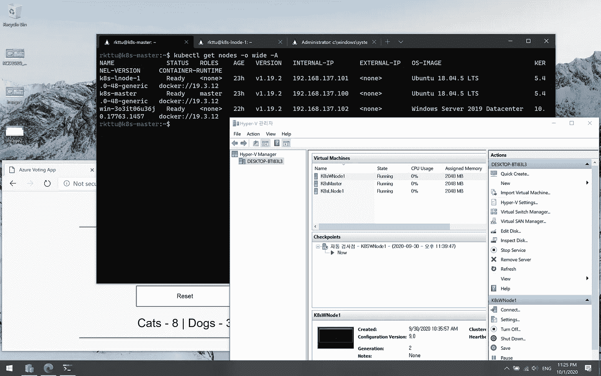
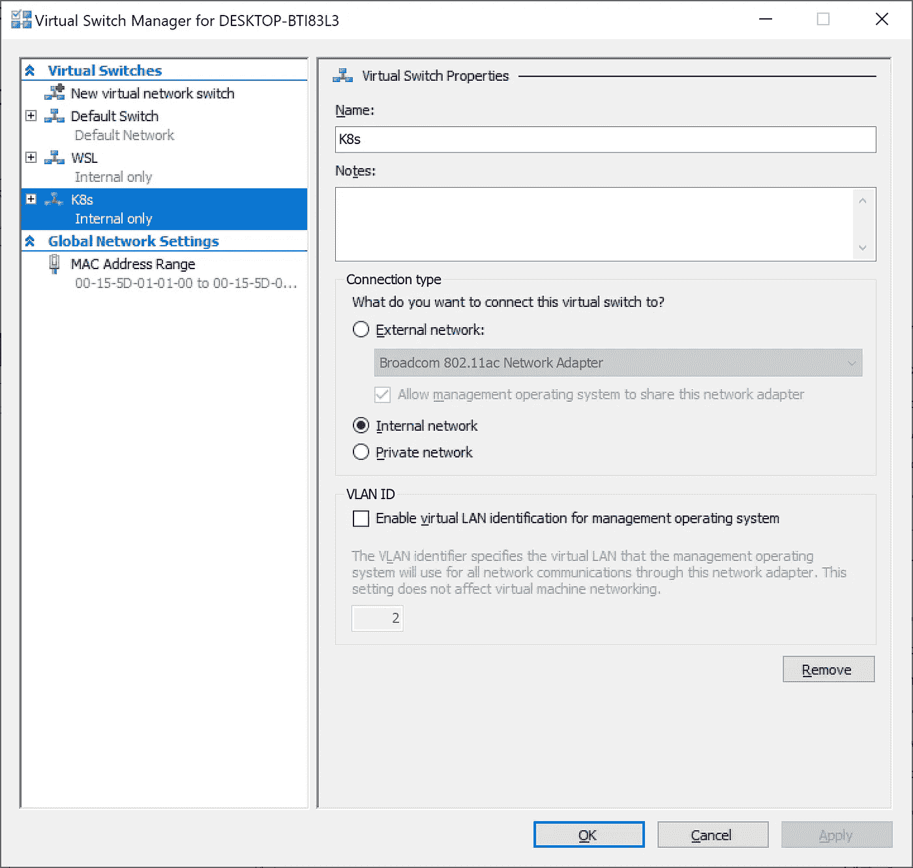
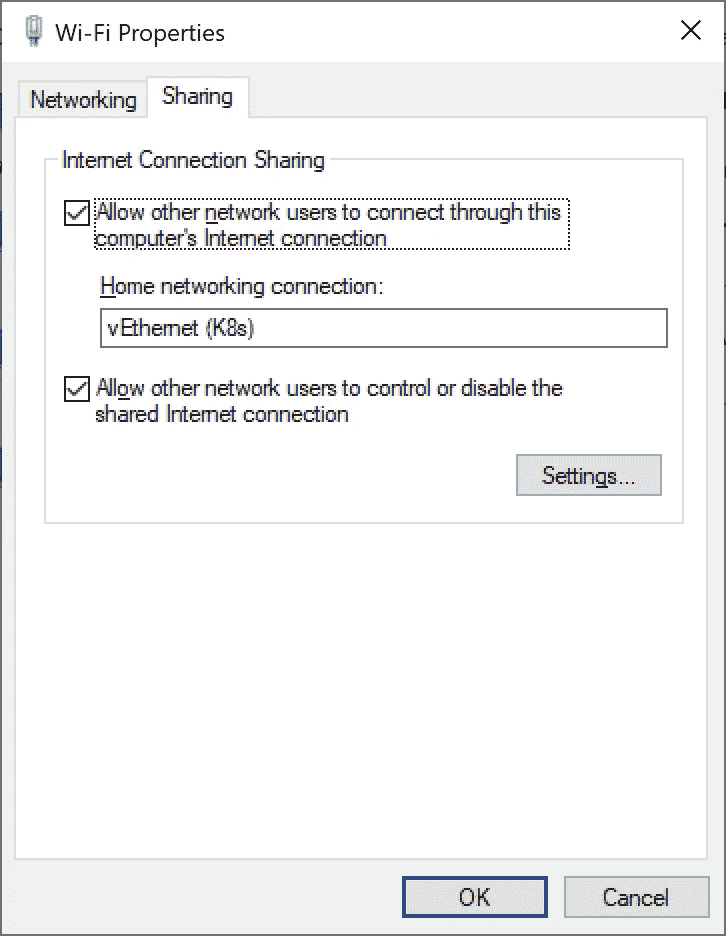
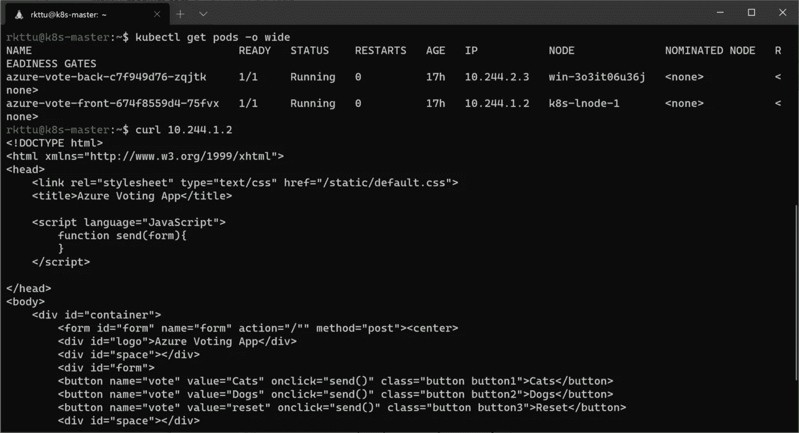
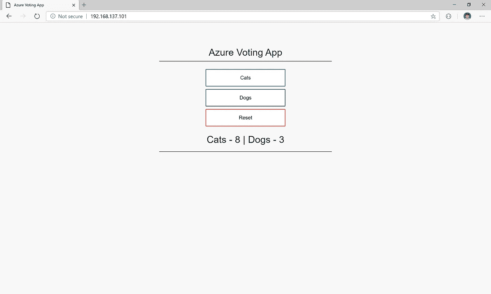
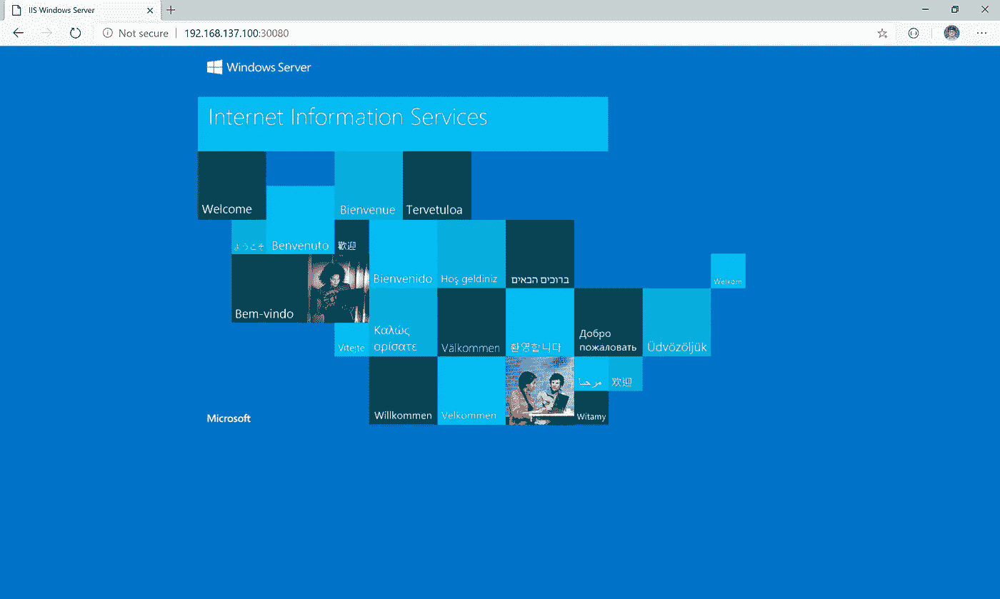
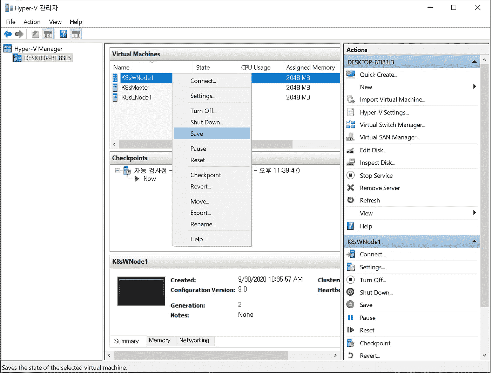

# Hyper-V 和 Windows Kubernetes

> 原文：<https://blog.devgenius.io/hyper-v-and-windows-kubernetes-6568461e7d02?source=collection_archive---------0----------------------->



您可以在 MacBook 和 bootcamp 上创建带有 Windows worker 节点的混合 Kubernetes 集群！

从 Kubernetes 1.14 开始，Windows worker node 支持已经全面上市。尽管如此，还是做了很多改进来减少 Linux Kubernetes worker node 之间的差距。

依我看，在生产环境中使用 Windows Kubernetes 之前，有两个重要的问题需要解决。

*   Windows 容器和 Windows Kubernetes 都依赖于主机网络服务(也称为 HNS)提供的网络功能。当 Kubernetes 集群创建一个新服务时，Windows worker 节点可以通过其本地负载平衡器将流量路由到服务，并且每个服务使用一个临时端口。不可避免的是，所有短暂的港口最终都会枯竭。这种行为将导致阻止进一步的连接使用。
*   Windows 容器不支持提升模式，所以管理员应该直接将`kube-proxy`安装到 worker 节点中，而不是容器形式。此外，您应该正确配置所有网络参数。这种工作管理起来极其困难，每次都要手动升级 Kubernetes worker 节点。

最后，Kubernetes 1.19 解决了这两个问题。多亏了这一点，使本地安装的 Windows Kubernetes 才变得比以前更加舒适。

本文将演示如何在我的 MacBook Pro 上安装带有 Hyper-V 的本地 Windows Kubernetes。

我很高兴找到了一篇由[金](https://github.com/kimkihyuk)撰写的很棒的教程文章。感谢你的精彩帖子。谢谢你。

[](https://medium.com/@keyhyuk.kim/hyper-v-%ED%99%98%EA%B2%BD%EC%97%90%EC%84%9C-%EC%BF%A0%EB%B2%84%EB%84%A4%ED%8B%B0%EC%8A%A4-master-worker-%ED%81%B4%EB%9F%AC%EC%8A%A4%ED%84%B0-%EA%B5%AC%EC%B6%95%ED%95%98%EA%B8%B0-b7aead20132f) [## Hyper-v 환경에서 쿠버네티스主工클러스터 구축하기

### Hyper-V 환경에서 1 个主人，1 个工人관계를 가지는 클러스터를 구축하고，工人머신에去 application를포함하는pod와로드밸런스서비스를생성해외부에서접근할수있도록…

medium.com](https://medium.com/@keyhyuk.kim/hyper-v-%ED%99%98%EA%B2%BD%EC%97%90%EC%84%9C-%EC%BF%A0%EB%B2%84%EB%84%A4%ED%8B%B0%EC%8A%A4-master-worker-%ED%81%B4%EB%9F%AC%EC%8A%A4%ED%84%B0-%EA%B5%AC%EC%B6%95%ED%95%98%EA%B8%B0-b7aead20132f) 

# 在 MacBook Pro 上构建稳定的 Windows 10 环境

很遗憾，这不是一个众所周知的事实；macOS 有一个安全功能，当您的 Mac 设备被盗或丢失时，它可以保护磁盘数据，该功能称为 FileVault。Windows 也有一个相同的功能，称为 BitLocker。

不幸的是，当你在 macOS 环境中打开 FileVault 时，你可能会遇到脆弱的 Windows 10 安装体验，尤其是在使用最新的基于英特尔的 mac 时；型号和配置可能会有所不同。

因此，我的建议是，在你的 mac 上安装 Windows 10 之前，你最好关闭它，尤其是你正试图使用 Hyper-V 这样的复杂功能。

## 我应该关闭 FileVault 吗？

有一些 B 计划来持久化 FileVault。您可以选择支持“嵌套”虚拟化的虚拟化软件。

然而，根据我的个人经验，“嵌套虚拟化”的性能通常很糟糕，包括 VMware 和 Parallels。

假设您无论如何都无法关闭 FileVault。在这种情况下，您可以选择一种替代方式，如嵌套虚拟化的云计算(例如，Microsoft Azure 上的 Dv3 或 Ev3，或裸机支持的公共云)。

在财务方面，IMHO 建议在 Microsoft Azure 上使用 Dv3 或 Ev3 实例，以节省您的预算。

[在 Azure 上选择 Dv3 或 Ev3 之前，请在此页面上咨询更多信息。](https://docs.microsoft.com/en-us/azure/virtual-machines/windows/nested-virtualization?WT.mc_id=DOP-MVP-4024633)

# 重要的事情先来

为了传递简洁的信息，我想你已经满足了一些条件。我稍后会解释你为什么满足那些条件。

1.  您有宽带互联网连接，但没有计量连接。(特别是你应该避免移动网络共享。)
2.  本文使用 AMD64 Hyper-V 和 Windows 容器进行了测试。
3.  您使用的 Hyper-V 具有 16GiB 或更高的内存和 512GiB (0.5TiB)或更大的 SSD 磁盘。
4.  您安装了最新版本的 Windows 10 Pro。
5.  您在“添加/删除 Windows 组件”对话框中安装了整个 Hyper-V 组件。
6.  您有一个英语、美国版本的 Windows Server 2019 数据中心安装副本。

# 配置 Hyper-V 网络

一切准备就绪后，您可以开始在 Hyper-V 管理控制台窗口中配置 Hyper-V 内部网络。打开虚拟交换机管理对话框，并创建名为 K8s 的内部虚拟交换机。



在虚拟交换机管理窗口中创建内部交换机。

该网络的所有成员计算机都应接入互联网。为此，您需要进行互联网连接共享配置。找到连接到互联网的网络适配器，打开“共享”选项卡，并将共享设置为新创建的虚拟网络适配器。



您可以在连接到 internet 的适配器的属性窗口中设置 internet 连接共享。

# 创建 Hyper-V 虚拟机

要创建一个混合 Kubernetes 集群，您需要创建两个安装了 Ubuntu 18.04 LTS 的虚拟机(一个使用 Linux 的主节点和工作节点)，以及一个 Windows Server 2019 虚拟机。

你可以用你的方式制作你的 Ubuntu Linux VM。但是我将使用快速 VM 创建特性来节省时间和精力。快速虚拟机创建将使用 OOBE(开箱即用的体验，您可以在打开新买的 PC 或笔记本电脑时体验此步骤。)，所以没有额外的文件复制过程。向导会询问一些基本问题来初始化环境，然后你马上就可以得到你的桌面了。

请创建 3 个满足这些条件的虚拟机。

*   所有虚拟机都是第二代 Hyper-V 虚拟机。
*   所有虚拟机都至少有两个处理器内核和 2gb 或更高的内存。
*   如果是 Windows VM，请在没有桌面经验的情况下安装。此选项意味着您使用的是 Windows Server Core 版本。
*   所有虚拟机都更新到最新的安全修复程序。(在 Windows Server Core 中，可以使用`sconfig`命令来实现这一点。)
*   所有虚拟机都配置为使用静态 IP 地址，而不是 DHCP。(在 Windows Server Core 中，可以使用`sconfig`命令来实现这一点。)
*   所有配置到`hosts`文件(在 Linux，`/etc/hosts`文件和 Windows，`C:\Windows\System32\Drivers\etc\hosts`文件)的虚拟机在每个 Kubernetes 节点主机之间都有多个主机名和地址映射，包括其自身。正确注册后，您可以使用`ping`命令测试连接。)

## 为客户端和节点配置 SSH

为了提高效率，您可以使用多个 SSH 连接来完成任务。我将添加一些指南来配置您的 Windows 10 和虚拟机之间的 SSH 连接。

您可以从 Microsoft 商店安装 Windows 终端应用程序。

[](https://www.microsoft.com/store/productId/9N0DX20HK701) [## 获取 Windows 终端- Microsoft 商店

### Windows 终端是一个现代的、快速的、高效的、强大的、多产的终端应用程序，适用于…

www.microsoft.com](https://www.microsoft.com/store/productId/9N0DX20HK701) 

请参考这篇文章来配置你的 Windows 10 SSH 客户端。

[](https://medium.com/rkttu/set-up-ssh-key-and-git-integration-in-windows-10-native-way-c9b94952dd2c) [## 以 Windows 10 原生方式设置 SSH Key 和 Git 集成

### 你知道 Windows 10 自带 OpenSSH 客户端吗？

medium.com](https://medium.com/rkttu/set-up-ssh-key-and-git-integration-in-windows-10-native-way-c9b94952dd2c) 

在 Linux 服务器中，您可以参考本指南来配置 SSH 服务器。可以从 Windows 10 添加自己的公钥，公钥位于`%USERPROFILE%\.ssh\id_rsa.pub`(PowerShell 中，`$env:USERPROFILE\.ssh\id_rsa.pub`)下。

 [## 服务- OpenSSH |服务器文档| Ubuntu

### OpenSSH 是一个强大的工具集，用于远程控制联网计算机和在联网计算机之间传输数据…

ubuntu.com](https://ubuntu.com/server/docs/service-openssh) 

最后，您可以使用本文配置您的 Windows 服务器来接受 SSH 连接。您可以用同样的方式注册您的公钥。

[](https://medium.com/rkttu/set-up-your-ssh-server-in-windows-10-native-way-1aab9021c3a6) [## 以 Windows 10 原生方式设置您的 SSH 服务器

### 本文展示了如何设置 Windows 10 和 Windows Server 提供的内置 SSH 服务器。

medium.com](https://medium.com/rkttu/set-up-your-ssh-server-in-windows-10-native-way-1aab9021c3a6) 

一切都准备好了吗？让我们进一步深入，完成配置。

# Linux 虚拟机配置(通用步骤)

本节包含所有 Linux Kubernetes 节点通常需要的步骤。

## 安装软件

让我们安装附加组件。

```
sudo apt -y install curl vim apt-transport-https
```

*   `curl`:这个工具用来解析和运行来自互联网的 shell 脚本。
*   我将使用这个工具来编辑文本文件。可以用 nano 之类的其他工具。
*   `apt-transport-https`:该工具允许为`apt`软件包管理器向本地系统添加第三方软件包仓库。我将在这个系统上添加 Kubernetes 智能目录。

## 安装和配置 Docker

让我们安装 Docker 引擎。我将使用 Rancher 的自动安装脚本。有了这个脚本，您可以轻松快速地安装 Docker 引擎。

```
curl [https://releases.rancher.com/install-docker/19.03.sh](https://releases.rancher.com/install-docker/19.03.sh) | sh
```

安装 docker 引擎后，将当前用户添加到`docker`组，无需`sudo`命令即可连接本地 Docker 引擎。然后注销后再次登录。

```
sudo usermod -aG docker $USERlogout
```

要在 Kubernetes 中使用 Docker 引擎，让我们编辑 daemon.json 文件。

```
sudo vim /etc/docker/daemon.json
```

配置文件是这样的。

```
{
  "exec-opts": ["native.cgroupdriver=systemd"],
  "log-driver": "json-file",
  "log-opts": {
    "max-size": "100m"f
  },
  "storage-driver": "overlay2"
}
```

用这个命令保存文件并重启 docker 引擎。

```
sudo systemctl restart docker
```

## 更改系统设置

要创建 Kubernetes 节点，您应该关闭交换。此外，为了在 Windows 和 Linux 节点之间集成 CNI 插件，内核参数需要改变。

首先，我们需要关闭 swap。

```
sudo swapoff -a
```

然后，在系统重启后，将`/etc/fstab`文件更改为关闭持久交换。

```
sudo sed -i ‘/ swap / s/^\(.*\)$/#\1/g’ /etc/fstab
```

最后，我们需要改变内核参数来整合 Windows 和 Linux 的法兰绒 CNI 插件。([参考](https://kubernetes.io/docs/tasks/administer-cluster/kubeadm/adding-windows-nodes/#configuring-flannel))

```
sudo sysctl net.bridge.bridge-nf-call-iptables=1
```

## 安装 Kubernetes CLI

让我们安装 Kubernetes CLI 来初始化、配置和管理 Kubernetes 集群。

我们需要将谷歌的`apt`目录添加到系统中。让我们运行下面的命令。

```
curl -s [https://packages.cloud.google.com/apt/doc/apt-key.gpg](https://packages.cloud.google.com/apt/doc/apt-key.gpg) | sudo apt-key add -cat <<EOF | sudo tee /etc/apt/sources.list.d/kubernetes.list
deb [https://apt.kubernetes.io/](https://apt.kubernetes.io/) kubernetes-xenial main
EOFsudo apt update
```

然后，安装相关工具并修复版本。

```
sudo apt-get install -y kubelet kubeadm kubectlsudo apt-mark hold kubelet kubeadm kubectl
```

验证`kubeadm`是否正确安装。我们将在每个 Linux 节点上使用这个工具，包括每个控制平面和工作节点。

```
kubeadm version
```

如果版本信息显示正确，您的设置就完成了。

# 配置 Linux 控制平面节点

要初始化群集和控制平面节点，让我们运行以下命令。

```
sudo kubeadm init — pod-network-cidr=10.244.0.0/16
```

注意，在该命令中，我们在`--pot-network-cidr`选项中指定了 CIDR 范围。我们将在覆盖网络上虚拟地分配这个 CIDR 范围，并且覆盖网络在这个集群的成员节点上被识别。因此，你可以选择你的 CIDR 范围的价值，创建一个当地的 Kubernetes 集群简单。

**⚠重要提示——运行该命令后，集群很快就会初始化。然后，您将看到其他节点的 join 命令行。请安全地复制该命令以供将来使用。**

然后，将客户机配置文件复制到主目录中，该目录包含新创建的集群的管理凭据。

```
mkdir -p $HOME/.kube 
sudo cp -i /etc/kubernetes/admin.conf $HOME/.kube/config 
sudo chown $(id -u):$(id -g) $HOME/.kube/config
```

您可以使用下面的命令测试配置文件。我们可以通过命令行监控所有的豆荚变绿。

```
watch kubectl get pods -A
```

看到所有窗格都变绿后，按 Ctrl+C 退出。

## 安装 Linux 法兰绒 CNI

让我们为 Linux 节点安装法兰绒 CNI。我们需要修改分布式 YAML 文件来实现我们的目标。

先下载 kube-法兰绒. yaml 文件。

```
curl -L [https://raw.githubusercontent.com/coreos/flannel/master/Documentation/kube-flannel.yml](https://raw.githubusercontent.com/coreos/flannel/master/Documentation/kube-flannel.yml) -o kube-flannel.yaml
```

然后用您喜欢的编辑器打开 YAML 文件，找到行`net-conf.json: |`字符串。您可能会发现类似下面的行。

```
net-conf.json: |
    {
      "Network": "10.244.0.0/16",
      "Backend": {
        "Type": "vxlan"
      }
    }
```

这里，`Network`应该指向您在初始化集群时指定的有效 CIDR 范围。然后，在`Backend`属性下，需要添加两个属性。

*   VNI: 4096
*   端口:4789

为了完整性，修改后的内容如下所示。

```
net-conf.json: |
    {
      "Network": "10.244.0.0/16",
      "Backend": {
        "Type": "vxlan",
        "VNI" : 4096,
        "Port": 4789
      }
    }
```

保存修改后的 YAML 文件，并使用下面的命令行应用 YAML 文件。

```
kubectl apply -f kube-flannel.yml
```

然后你需要监控所有的法兰绒豆荚变绿。您可以使用下面的命令观察每个 pod 的状态。

```
watch kubectl get pods -A
```

# 安装 Linux 工作节点

假设您有一个用于将新节点加入集群的命令行。同`kubeadm init`。您可以通过在前面添加`sudo`关键字来运行该命令。

但是，如果您很晚才运行该命令，或者丢失了命令行，您可以在控制平面节点的 shell 中使用下面的命令重新发出 join 命令行。

```
kubeadm token create --print-join-command
```

或者，您可以使用以下命令行来恢复令牌和 CA 证书哈希。

```
$MASTER_IP=(Control-plane VM’s IP Address)$TOKEN=kubeadm token list -o jsonpath=’{.token}’$CA_CERT_HASH=openssl x509 -pubkey -in /etc/kubernetes/pki/ca.crt | openssl rsa -pubin -outform der 2>/dev/null | openssl dgst -sha256 -hex | sed ‘s/^.* //’
```

通过合并恢复的值，您可以用下面的命令行连接新节点。

```
sudo kubeadm join $MASTER_IP:6443 — token $TOKEN — discovery-token-ca-cert-hash sha256:$CA_CERT_HASH
```

在节点加入 Kubernetes 集群之后，您可以使用下面的命令监视节点的状态。将`Not Ready`状态转换到`Ready`状态需要一些时间。

```
watch kubectl get nodes -o wide
```

# 配置 Windows 工作节点

我们来看一个最喜欢的部分，Windows worker 节点！

## 在你开始之前

几乎所有为 Windows 编写的 CNI 插件都将依赖于 HNS API，而 HNS 将代表 CNI 插件配置虚拟网络。

此时，Windows 将通过显示名称或随机生成的 GUID 提供所有已安装的网络适配器的信息。所以 CNI 会用显示字符串找到一个合适的网络适配器。

正因为如此，你需要使用美式英语版本的 Windows Server。否则，Windows 会将网络适配器名称翻译成默认显示语言，而不是单词`Ethernet`。

此外，每个 Windows 工作节点应该具有相同的硬件配置。从 Kubernetes 1.19 开始，WINS 用于处理来自 pod 的管理请求，这种方法实现了以容器形式安装`kube-proxy`。

在守护程序集中安装`kube-proxy`时，不同的硬件配置会导致守护程序集部署失败。每次都必须修改守护进程集来解决这类问题。

所以如果你在这种情况下，你需要在每次部署时检查守护进程设置文件。

## 正在检查 Kubernetes 集群版本

当您将 Windows worker 节点添加到群集时，您将体验到不同之处。首先，您需要检查所有 Kubernetes 节点的版本是否相同，以及运行的是什么版本。

```
kubectl get nodes -o wide
```

## 正在检查 Windows Server 版本

正如我前面提到的，您需要使用最新版本的 Windows Server 来启用 Kubernetes 的所有功能。让我们用下面的命令检查 Windows Server 版本。

```
cmd.exe /s /c ver
```

假设您使用的是比以下版本更新的版本。

```
Microsoft Windows [Version 10.0.17763.1432]
```

如果你的 OS 版本低于`10.0.17763` ( `10`和`0`是版本号，`17763`是内部版本号)，说明你用的不是 Windows Server 2019。您应该执行就地升级或更改安装了 Windows Server 2019 的其他计算机。

如果您的版本号的三个部分匹配，但不是最后一个低于`1432`，您的操作系统不支持 HNS 中的 DSR 功能。

在这种情况下，您可以执行 Windows Update 操作或从 Microsoft Update 目录网站下载编号为`KB4571748`的修补程序。

## 为窗户配置法兰绒 CNI

要检查您的默认适配器名称是否为`Ethernet`，请运行以下命令。

```
Get-NetAdapter
```

然后，将`kube-proxy`守护进程集部署到集群中。你需要更换合适的版本而不是`v1.19.2`。您可以在控制平面节点的 shell 中运行以下命令。

```
curl -L [https://github.com/kubernetes-sigs/sig-windows-tools/releases/latest/download/kube-proxy.yml](https://github.com/kubernetes-sigs/sig-windows-tools/releases/latest/download/kube-proxy.yml) | sed ‘s/VERSION/v1.19.2/g’ | kubectl apply -f -
```

然后，在集群上部署覆盖版本的法兰绒 CNI 守护进程集。让我们再次在控制平面节点的 shell 中运行下面的命令行。

```
kubectl apply -f [https://github.com/kubernetes-sigs/sig-windows-tools/releases/latest/download/flannel-overlay.yml](https://github.com/kubernetes-sigs/sig-windows-tools/releases/latest/download/flannel-overlay.yml)
```

如果您发现 Windows 中的适配器名称不是`Ethernet`，请更改如下命令行以解决问题。(在`sed`命令中，前一部分是原字符串，后一部分是目标字符串。)

```
curl -L [https://github.com/kubernetes-sigs/sig-windows-tools/releases/latest/download/flannel-overlay.yml](https://github.com/kubernetes-sigs/sig-windows-tools/releases/latest/download/flannel-overlay.yml) | sed ‘s/Ethernet/Ethernet0 2/g’ | kubectl apply -f -
```

此时，我们仍然没有将 Windows worker 节点加入到集群中，所以让我们继续工作。

## 安装 Docker 企业版 Windows 版

您可以在 Windows Server 中免费使用 Docker 企业版，因为您已经按照您的 Windows Server 价格支付了 Docker EE 的价格。所以你可以从微软的包商店下载 Docker EE。

> 注意:请不要与 Docker CE 或 Docker Toolbox 混淆。可以通过 Docker 官方网站下载 Docker CE，但是 Docker CE 不支持 Windows server 的生产 Windows 容器。另外，Docker 工具箱不提供 Windows 容器功能。

首先，我们来安装 Docker EE 安装的先决条件。

```
Install-Module -Name DockerMsftProvider -Repository PSGallery -Force
```

然后，安装最新版本的 Docker 企业版。

```
Install-Package -Name docker -ProviderName DockerMsftProvider
```

将 Docker 引擎启动模式改为系统启动时自动启动。

```
Set-Service -Name ‘docker’ -StartupType Automatic
```

最后，重新启动服务器以应用系统范围的配置更改。

```
Restart-Computer -Force
```

## 安装 Windows Kubernetes 工作节点

最后，我们将安装 Windows Kubernetes worker 节点。我们可以使用 Kubernetes 项目的 Windows SIG 团队开发的 PowerShell 脚本。

```
curl.exe -LO [https://github.com/kubernetes-sigs/sig-windows-tools/releases/latest/download/PrepareNode.ps1](https://github.com/kubernetes-sigs/sig-windows-tools/releases/latest/download/PrepareNode.ps1)
```

我们使用了 Windows Server 2019 中包含的`curl.exe`。

`curl.exe`很好用，比 Windows PowerShell 的`Invoke-WebRequest`好用。因为，`Invoke-WebRequest`需要 Internet Explorer，除非你指定`-UseBasicParsing`选项。此外，您已经熟悉了 Linux 环境中的`curl`实用程序。

然后，重新检查正在运行的 Kubernetes 版本，并使用如下命令行所示的确切版本号运行 PowerShell 脚本。

```
.\PrepareNode.ps1 -KubernetesVersion v1.19.2
```

运行脚本后，目录`C:\k`被创建，目录`kubeadm.exe`和其他相关的 CLI 工具被复制到该目录。更改您的当前目录，并在这里运行发出的 join 命令。

```
cd c:\kkubeadm.exe join <IP address of control-plane node>:6443 --token <Token> --discovery-token-ca-cert-hash sha256:<CA Cert Hash>
```

当 Windows worker 节点加入时，部署的 CNI 守护进程集会自动将 pod 部署到新创建的节点中。

使用 Windows 服务器核心基础映像构建的`sigwindowstools/flannel`映像会导致很长的提取时间。因此，您的 Windows 节点将需要很长时间转换到`Ready`状态。

您可以通过运行`docker pull`命令来监视 Windows worker 节点中的提取状态。您可以通过调查部署的守护进程集和 pod 信息来发现确切的映像名称和标记。

# 部署测试应用程序

让我们部署一个同时包含 Linux 和 Windows 容器的混合 Kubernetes 应用程序！

我将部署 AzureVote 应用程序的修改版本，由 Python Django 和 Redis 容器组成。

这里，Redis pod 使用一个自定义映像，Redis 的移植版本进入 Windows，Windows Server Core 1809 基本映像。(我用的是移植的 Redis，是老牌公司微软开放技术公司开发的)。

如果应用程序运行正常，我们可以看到带有投票用户界面的网页。

让我们看看 YAML 的文件来做这件事。

```
apiVersion: apps/v1
kind: Deployment
metadata:
  name: azure-vote-back
spec:
  selector:
    matchLabels:
      app: azure-vote-back
  replicas: 1
  template:
    metadata:
      labels:
        app: azure-vote-back
    spec:
      containers:
      - name: azure-vote-back
        image: rkttu/redis-windows:3.0-1809
        ports:
        - containerPort: 6379
          name: redis
      nodeSelector:
        "beta.kubernetes.io/os": windows
---
apiVersion: v1
kind: Service
metadata:
  name: azure-vote-back
spec:
  ports:
  - port: 6379
  selector:
    app: azure-vote-back
---
apiVersion: apps/v1
kind: Deployment
metadata:
  name: azure-vote-front
spec:
  selector:
    matchLabels:
      app: azure-vote-front
  replicas: 1
  strategy:
    rollingUpdate:
      maxSurge: 1
      maxUnavailable: 1
  minReadySeconds: 5 
  template:
    metadata:
      labels:
        app: azure-vote-front
    spec:
      containers:
      - name: azure-vote-front
        image: microsoft/azure-vote-front:v1
        ports:
        - containerPort: 80
        resources:
          requests:
            cpu: 250m
          limits:
            cpu: 500m
        env:
        - name: REDIS
          value: "azure-vote-back"
      nodeSelector:
        "beta.kubernetes.io/os": linux
---
apiVersion: v1
kind: Service
metadata:
  name: azure-vote-front
spec:
  type: LoadBalancer
  ports:
  - port: 80
  selector:
    app: azure-vote-front
```

我们可以用下面的命令行部署应用程序。

```
kubectl apply -f azurevote.yaml
```

然后，我们需要等待所有的 pod 进入就绪状态。同样，首次部署需要很长时间，所以请耐心等待。

```
watch kubectl get pods -A
```

要检查 Python Django pod 是否成功运行，请记下 pod IP 地址，如果响应包含 HTML 页面，则使用`curl`命令获取响应，Linux 容器与 Windows Redis 容器连接。



检查 pod 运行是否正常

然后，我们可以为服务分配一个外部 IP 地址，以供外部访问。与公共云的 Kubernetes 不同，Hyper-V 没有像负载平衡器这样的概念，所以我们需要分配工作节点的 IP 地址来服务。

检查控制平面或工作节点的 IP 地址，并运行以下命令行来设置有效的 IP 地址。

```
kubectl patch svc azure-vote-front -p '{"spec":{"externalIPs":["192.168.137.101"]}}'
```

然后，您可以使用 web 浏览器浏览您的节点 IP；可以看到 Azure 投票 App 界面。



在浏览器中运行 AzureVote 应用程序

遗憾的是，您不能使用 Windows worker 节点的 IP 地址来提供服务。

但是，您可以通过 Linux 节点 IP 地址在 Windows worker 节点上路由 web 服务。例如，我们可以在 Windows 节点上托管一个 IIS 容器，并通过 Linux 节点的 IP 地址对其进行路由。

```
apiVersion: v1
kind: Pod
metadata:
  labels:
    name: iis
  name: iis
  namespace: default
spec:
  containers:
  - image: microsoft/iis
    imagePullPolicy: Always
    name: iis
    ports:
    - containerPort: 80
  nodeSelector:
    beta.kubernetes.io/os: windows
---
apiVersion: v1
kind: Service
metadata:
  labels:
    name: iis
  name: iis
spec:
  ports:
  - port: 8080
    targetPort: 80
    nodePort: 30080
  selector:
    name: iis
  type: NodePort
```



Kubernetes 群集中 Windows 工作节点上的 IIS 容器。

# 保存和恢复整个 Kubernetes 集群

与云上的托管 Kubernetes 集群不同，我在我的 MacBook 上构建了我自己的本地 Kubernetes 集群。当我不使用 Kubernetes 集群时，这个系统会耗尽我的电池。

我们可以从控制平面节点到工作节点按顺序保存和恢复群集的每个虚拟机，以避免此问题。



我们可以通过将虚拟机从控制平面休眠和恢复到工作节点来节省我们的 MacBook 电池

# 结论

首先，我想写的是 2020 年夏天发布的开源 Windows Calico CNI 插件。然而，Windows Calico CNI 插件需要开发以配置新的 WINS 架构，这超出了我的工作预算。

很快，Windows Kubernetes 将从 docker 企业版迁移到 containerd 中，Windows 版本的 Docker 将解耦到前端 CLI 和 containerd 中。这种方法需要一些时间，但当谈到 out 时，我们可以通过 Hyper-V containers 打破主机操作系统和容器版本匹配规则之间的严格限制，这需要虚拟化或嵌套虚拟化。

如果你有任何进一步的问题或建议，请让我知道。你可以对这篇文章写一个回应。