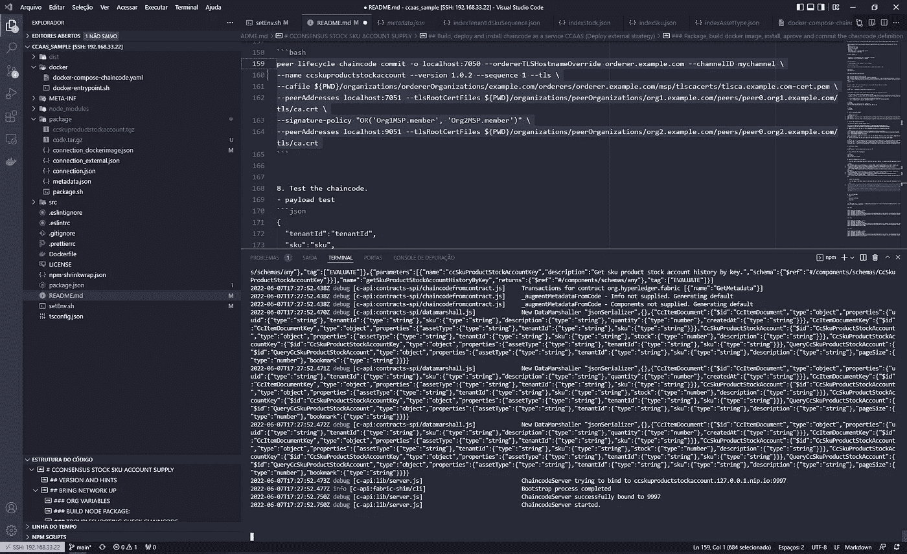
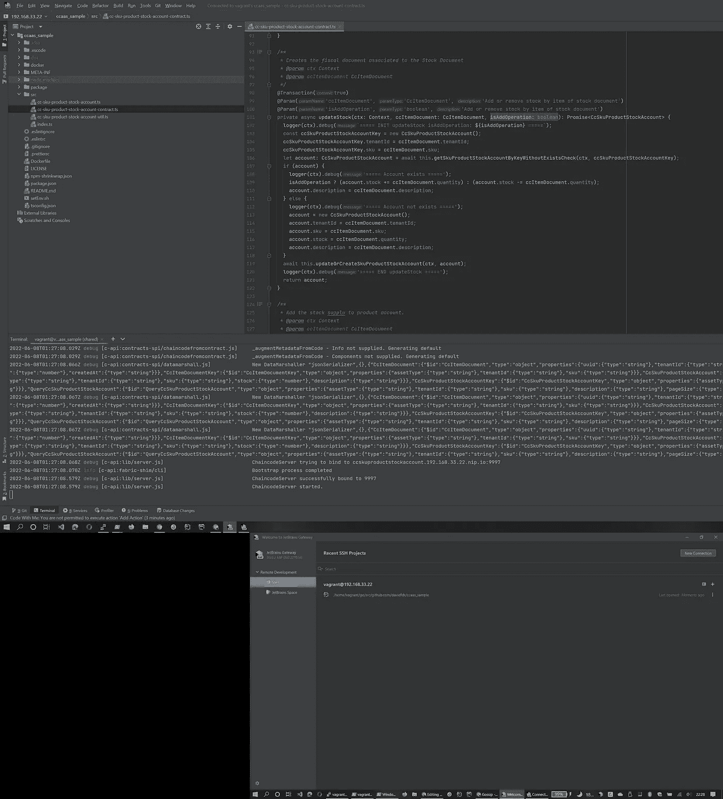

# Hyperledger Fabric —快速开发环境和 CCAAS(链码即服务)调试和部署。

> 原文：<https://blog.devgenius.io/hyperledger-fabric-lighting-fast-development-environment-and-ccaas-chaincode-as-a-service-971192db3e40?source=collection_archive---------2----------------------->

对于新开发人员来说，使用 Hyperledger Fabric 平台开发智能合同可能是一个小技巧。有很多可能的配置。Fabric Samples 并没有提供一个指南来说明如何更好地设置开发人员使用的开发环境。只举例子。这里的目标是提供一种仅使用 fabric_samples 设置环境的好方法。

如果我们深挖(google)这个话题，似乎唯一容易调试的方法就是使用带有 VSCode 扩展的 IBM 区块链平台。:).

 [## 调试链码超级分类帐结构-谷歌搜索

### 调试 chaincode(智能合约)最简单的方法是在 IBM Blockchain 平台上使用 VS 代码编辑器…

www.google.com](https://www.google.com/search?q=debug+chaincode+hyperledger+fabric&rlz=1C1ISCS_pt-PTBR958BR958&oq=debug+chaincode+hyperledger+fabric&aqs=chrome..69i57j69i61l3.6562j0j4&sourceid=chrome&ie=UTF-8#cobssid=s) 

但是我喜欢尝试做同样事情的其他方法。

想象一下，每次一次又一次地运行 lifecycle peer 命令来测试您的新智能契约代码？这是浪费时间。我的第一份智能生产合同是在多次运行该工作流程的情况下开发的。使用这种方法的另一个问题是调试智能合约代码。如果您代码变得更加复杂(例如，从链接代码到链接代码调用)，仅仅使用 TDD 进行开发和使用测试框架进行调试是不足以达到良好的生产率的。

我决定在开发智能合同时继续使用 CCAAS 方法，因为这样可以提高生产率，简化环境设置，而且如果您的 chaincode 将部署在 k8s 集群(Kubernetes)中，事情会变得容易得多。

在本文中，我将展示如何创建一个开发环境，创建一个智能契约，调试智能契约(启动 peer with-peer-chaincodedev = true)并创建链码 docker 映像。

开发环境框:

*   主机操作系统机器:Windows 10
*   主机硬件:联想 Yoga Slim 9i 16gb ram Core i7 第 11 代；
*   流浪汉 2.2.19:

流浪版

*   Ubuntu 2004:https://app.vagrantup.com/bento/boxes/ubuntu-20.04 图片
*   流浪者文件:

*   Hyperledger Fabric —最新版— (2.4.3 至今)；
*   Hyperledger 织物样品—最新；
*   NodeJS 16(所解释的示例将带有 Typescript/NodeJS)；
*   NPM 8；
*   码头工人；
*   Putty ssh 客户端；
*   带有远程资源管理器 ssh 插件的 VSCODE IDE:

远程浏览器 ssh 连接到 Ubuntu 流浪盒

*   具有 Jetbrains 网关的智能集成电路

远程使用 IntelliJ 的 Jetbrains 网关

关于 IDEs，你可以选择一个。我使用 IntelliJ IDE 和 VSCODE(智能合约)。

记得配置远程 SSH 密钥，以便使用 putty、VSCode 和 IntelliJ IDE Gateway 轻松连接到 Ubuntu Box。

我将假设你已经有一个流浪的便当/ubuntu-2004 盒子启动并运行。

# 使用测试网络初始化 Hyperledger 结构和结构样本

让我们遵循官方文档:

*   [https://hyperledger-fabric . readthedocs . io/en/latest/prereqs . html](https://hyperledger-fabric.readthedocs.io/en/latest/prereqs.html)

1.  **检查先决条件:**

> git-版本；
> 卷发版；
> docker-version(sudo apt-get-y install docker-compose)；

**2。下载最新面料:**

[https://hyperledger-fabric . readthedocs . io/en/latest/install . html](https://hyperledger-fabric.readthedocs.io/en/latest/install.html)

**3。安装织物和织物样品:**

为了安装，我使用了以下命令(下载示例、docker 映像和二进制文件):

> 。/install-fabric.sh
> 
> 。/install-fabric.sh d
> 
> 。/install-fabric.sh b

(我运行这些命令是因为只运行脚本。/install-fabric.sh 没有安装 docker 映像和二进制文件。仅存储库结构样本)

这些命令将下载 de fabric 样本、fabric 二进制文件和 docker fabric 映像。

在安装结构之前，这是一个很好的设置。具有以下变量的流浪用户的配置文件:

这将设置默认的结构配置文件路径，并将结构二进制文件放入浮动框路径中。

我喜欢添加一些指向结构目录的 bash 别名:

**4。开始测试网络:**

运行:

> 。/network . sh up create channel-ca-c my channel-s couch db

**5。测试测试网络:**

> 流浪者@流浪者:~/go/src/github . com/David FDR/fabric-samples/test-network $。。/scripts/env var . sh
> vagger @ vagger:~/go/src/github . com/David FDR/fabric-samples/test-network $ set globals 1
> 使用组织 1
> vagger @ vagger:~/go/src/github . com/David FDR/fabric-samples/test-network $ peer channel list
> 2022–06–06 14:23:24.559 UTC 0001 INFO[channel CMC

6。破坏网络:

7。安装节点 JS 和 NPM:

该示例将使用 typescript 智能协定。

我想从节点源存储库安装:

 [## 主节点上的分发/README.md 源/分发

### 该存储库包含通过使用 NodeSource 二进制发行版的文档。转速和。黛比以及他们的…

github.com](https://github.com/nodesource/distributions/blob/master/README.md) 

现在测试 nodejs 引擎:

> 流浪者@流浪者:~$ node —版本
> v16.15.1
> 流浪者@流浪者:~$ npm —版本
> 8.11.0

好的。一切都准备好了。现在让我们去 CCAAS。

# CCAAS —链码即服务

Chaincode as a service 是一种使用外部构建器部署 Chaincode 容器的方法(默认情况下在 Hyperledger Fabric 的 2.4+版本中实现)。它在 2.2 版本上工作，但是你需要做更多的环境改变。

下面的链接有关于 CCAAS 的官方文档，但是要遵循并取得成功还不够容易:

[CCAAS](https://hyperledger-fabric.readthedocs.io/en/latest/cc_service.html?highlight=chaincode%20as%20a%20service)—[https://hyperledger-fabric . readthedocs . io/en/latest/cc _ service . html？highlight = chain code % 20 as % 20a % 20 service](https://hyperledger-fabric.readthedocs.io/en/latest/cc_service.html?highlight=chaincode%20as%20a%20service)。

为了了解如何使用 CCAAS 设置我的环境，我使用了以下链接:

 [## fabric-samples/asset-transfer-basic/chain code-外部主分类帐/fabric-samples

### 此示例介绍了如何使用外部构建器和启动器脚本来运行链码作为…

github.com](https://github.com/hyperledger/fabric-samples/tree/main/asset-transfer-basic/chaincode-external)  [## 主 hyperledger/fabric-samples/chain code _ AS _ A _ SERVICE _ tutorial . MD

### “链码即服务”功能是运行“智能合同”的一种非常有用和实用的方式。传统上…

github.com](https://github.com/hyperledger/fabric-samples/blob/main/test-network/CHAINCODE_AS_A_SERVICE_TUTORIAL.md)  [## 超高速智能合同开发

### 目前在草案中的目标是向您展示如何编码，调试，然后在最快的时间内测试您的合同…

hyperledgendary.github.io](https://hyperledgendary.github.io/docs/tutorials/hyperfast_contract_development.html) 

好吧，我们走吧！

1.  **从我的存储库中克隆示例 CCAAS 智能合同:**

 [## GitHub - cconsensus/ccaas_sample:使用 ccaas 作为部署的 typescript 智能合约示例…

### Hyperledger Fabric Smart Contract 用于跟踪供应库存 SKU(产品供应帐户),这是开发的…

github.com](https://github.com/cconsensus/ccaas_sample) 

> git 克隆[https://github.com/cconsensus/ccaas_sample](https://github.com/cconsensus/ccaas_sample)
> 克隆到‘ccaas _ sample’……
> 远程:枚举对象:55，完成。
> 远程:清点对象:100% (55/55)，完成。
> 远程:压缩对象:100% (38/38)，完成。
> 远程:总计 55 (delta 16)，复用 49 (delta 14)，打包复用 0
> 拆包对象:100% (55/55)，72.79 KiB | 560.00 KiB/秒，完成。

我构建这个简单的链代码只是为了展示使用 typescript 的 de CCAAS 示例。

**2** 。**运行 npm 安装和 npm 运行包:**

> $ npm 安装
> $ npm 运行包

**3。测试链码:**

*   配置环境(运行脚本 setEnv.sh):

> $ .。/setEnv.sh

*   运行链码:

> $ npm 运行开始:服务器调试

*   控制台将输出如下内容:

> 2022–06–07t 13:57:54.373 z debug[c-API:lib/server . js]chain codeserver 尝试绑定到 ccskuproductstockaccount . 127 . 0 . 0 . 1 . nip . io:9997
> 2022–06–07t 13:57:54.375 z info[c-API:fabric-shim/CLI]引导进程已完成
> 2022–06–07t 13:022

如果你检查 setEnv.sh 的内容，你会看到我正在使用 [nip.io](https://nip.io) dns 服务。如果没有 nip.io，我们将需要更改系统主机文件。

# 注意:根据你的网络，你可能需要设置另一个 IP 地址到 Ubuntu travel BOX。

OBS:当我们安装 CHAINCODE 时, **CHAINCODE_ID** 变量将被新的包 ID 替换。现在，我们只是测试智能合同是否运行正常。

**4。构建链码包:**

*   检查 connection.json 文件 ccaas _ sample/package/connection . JSON 的内容:

使用 nip.io 寻址

“address”变量值告诉对等体在哪里寻找 chaincode 微服务。

这时你可能会问:如果每个对等体都想连接到不同的端点呢？connection.json 支持模板指令。您可以使用以下内容:

变量 **{{。peername}}** 与下面的 ***peer*** 环境变量相关:

> chain code _ AS _ A _ SERVICE _ BUILDER _ CONFIG = { " peer name ":" peer 0 org 1 " }

在 test-network 中，该变量设置在以下文件下:
[/fabric-samples/test-network/compose/compose-test-net . YAML](https://github.com/hyperledger/fabric-samples/blob/main/test-network/compose/compose-test-net.yaml)

这允许每个对等体拥有自己的链码端点地址(入口)。

*   检查 metadata.json 文件 ccaas _ sample/package/metadata . JSON 的内容:

这个文件告诉对等体使用外部构建器(“类型”)和链码标签。

**5。生成链码包 tgz:**

> tar cfz code.tar.gz 连接../META-INF
> tar cfz ccskurproductstockaccount . tgz metadata . JSON code.tar.gz

记住:META-INF 是部署 couchdb 索引的地方。

**6。更改测试网络合成文件，以开发模式启动对等体:**

/fabric-samples/test-network/compose/compose-test-net . YAML

命令:**对等节点开始** - **对等-链码开发=真**

只需要在 start peer 命令的行中添加参数 **- peer-chaincodedev=true 即可。**如果没有这个参数，如果您在启用调试的情况下启动 nodejs chaincode 进程，对等方将不会连接到端点。

**7。在 dev 模式下启动测试网络:**

*   从测试网络文件执行 monitordocker.sh 以监控 de 网络:

> 。/network . sh up create channel-ca-c my channel-s couch db

输出:

> 2022–06–07 17:07:49.490 UTC 0001 INFO[Channel cmd]InitCmdFactory->背书者和订购者连接已初始化
> 2022–06–07 17:07:49.496 UTC 0002 INFO[Channel cmd]update->成功提交频道更新【org ' Org2MSP '在频道' mychannel'
> 频道' mychannel '已加入【T3

**8。使用 peer 命令安装生成的包(来自/test-network 文件夹):**

保存包标识符(您需要用这个新值更新环境)。

> vagger @ vagger:~/go/src/github . com/davidfdr/fabric-samples/test-network $ peer life cycle chain code install/home/vagger/go/src/github . com/davidfdr/ccaas _ sample/package/ccskuproductstockaccount . tgz
> 2022–06–07 17:16:27.461 UTC 0001 INFO[CLI . life cycle . chain code]submit install proposal->Installed r remote:response:？

如果您正在运行 monitordocker.sh，您将在日志中看到以下内容(您将看到 ccaas_builder 执行步骤):

> peer 0 . org 2 . example . com | 2022–06–07 17:18:30.850 UTC 004d 信息**【chain code . external builder . ccaas _ builder】**wait for exit->::Detect command = Detect
> peer 0 . org 2 . example . com | 2022–06–07 17:18:30.850 UTC 004 e 信息**【chain code . external builder** wait forexit->::Release command = Release
> peer 0 . org 2 . example . com | 2022–06–07 17:18:30.854 UTC 0052 INFO**【chain code . external builder . ccaas _ builder】**wait forexit->::Release phase completed command = Release
> peer 0 . org 2 . example . com | 2022–06–07 17: 背书人 grpc . method = process proposal grpc . peer _ address = 172 . 18 . 0 . 1:59992 grpc . code = OK grpc . call _ duration = 8.358158 ms

9。检查是否安装了链码:

> $对等生命周期链代码查询已安装

输出:

> 对等点上安装的链码:
> 包 ID:ccskuproductstockaccount:b 43 aff 167 c 6755 e 11 C5 a 811d 1255936 f 76 df 8db 6775 fdbc 62329 D1 EC 88572 f 3，标签:ccskuproductstockaccount

10。用生成的包 ID 更新 setEnv.sh 文件

**$。。/setEnv.sh**

11。使用新的包 id 作为环境变量运行 chain code:

> $ npm 运行包

输出:

> > cc-SKU-product-stock-account @ 1 . 0 . 2 package
> >NPM 运行构建& & npm 收缩
> 
> > cc-SKU-product-stock-account @ 1 . 0 . 2 build
> >TSC
> 
> npm 通知 npm-shrinkwrap.json 最新

$ npm 运行开始:服务器调试

输出:

> 2022–06–07t 17:27:52.473 z debug[c-API:lib/server . js]**chain codeserver 尝试绑定到 ccskuproductstockaccount . 192 . 168 . 33 . 22 . nip . io:9997**
> 2022–06–07t 17:27:52.477 z info[c-API:fabric-shim/CLI]引导过程已完成

**提示:为了更好地理解，请打开定义运行脚本的 pakcage.json 文件:**

> " start:SERVER-debug ":" set-x & & NODE _ OPTIONS = '—inspect = 0 . 0 . 0 . 0:9227 ' fabric-chain code-NODE SERVER—chain code-ADDRESS = $ chain code _ SERVER _ ADDRESS—chain code-ID = $ chain code _ ID "，

**start:server-debug** 脚本使用我们运行脚本 setEnv.sh 时定义的环境变量

注意:您可以在 VSCode 或 IntelliJ 中使用终端运行。

使用 VSCode 远程运行 chaincode。

**12。让我们使用对等生命周期命令来批准这个定义:**

提示:我们将签名策略设置为“仅需要一次签署”(仅用于调试)。

13。提交定义(另一个生命周期命令):

运行完所有这些命令后，您可以在 monitordocker.sh 上检查是否成功(如果已启动)。

在 commit 命令之后，如果 chaincode 正在运行，您可能会收到一些输出:

> 2022**–06–07t 18:14:54.533 z debug[c-API:lib/handler . js]收到来自对等方的聊天消息:%s，状态:%s " "，" created "
> 2022–06–07t 18:14:54.533 z info[c-API:lib/handler . js]成功注册到对等方节点。状态转移到“已建立”
> 2022–06–07t 18:14:54.533 z debug[c-API:lib/handler . js]收到来自对等方的聊天消息:%s，状态:%s " "，2022–06–07t 18:14:54.533 z info[c-API:lib/handler . js]成功建立了与对等方节点的通信。状态已转换为“就绪”
> 2022–06–07t 18:14:54.534 z debug[c-API:lib/handler . js]已收到来自对等方的聊天消息:%s，状态:%s " "，已“创建”
> 2022–06–07t 18:14:54.534 z info[c-API:lib/handler . js]已成功向对等方节点注册。状态转移到“已建立”
> 2022–06–07t 18:14:54.534 z debug[c-API:lib/handler . js]收到来自对等方的聊天消息:%s，状态:%s " "，2022–06–07t 18:14:54.534 z info[c-API:lib/handler . js]成功建立了与对等方节点的通信。状态转换为“就绪”**

**14。测试链码:**

*   在任何 shell 中打开 monitordocker.sh。
*   运行以下命令:

你应该收到假的。

**15。运行初始分类帐功能(再次测试链码):**

如果运行链代码调用命令时出现错误:

> 错误:获取广播客户端时出错:订购者客户端无法连接到 order . example.com:7050:无法创建新连接:连接错误:desc = "传输:拨号时出错:拨号 tcp:查找订购者. example . com:没有这样的主机"

也许您需要配置您的主机系统文件 etc/hosts:

我选择 192.168.33.22 内部 IP 地址。你可以选择任何 ip。

**16。另一次测试，检查分类帐是否成功初始化(如果您检查链码源代码，您将看到要查询的适当对象关键字)**

输出:

> **vagger @ vagger:~/go/src/github . com/davidfdr/fabric-samples/test-network $ peer chain code query-C my channel-n CcSkuProductStockAccount-C ' { " Args ":[" getSkuProductStockAccountByKey "，" {\"tenantId\":\"tenantId001\ "，\ " SKU \ ":\ " 0013 \ " } "]} '
> { " asset type ":" CcSkuProductStockAccount "，" description ":"橙汁"，"说明"**

## ***好了，现在你的链码作为一个服务在你的 ide 里面运行了！:)***

# 调试链代码

1.  VSCode —启动并打开 ccaas_sample 文件夹以配置 IDE。

*   就我而言，它在以下文件夹中:

> /home/vagger/go/src/github . com/David FDR/ccaas _ sample

*   创建一个 launch.json 来附加和调试 NODEJS 进程:

*   运行链代码(npm run start:server-debug)，初始化调试器:

调试器已启动。

*   设置断点(我将选择 getSkuProductStockAccountByKey 方法)
*   执行查询命令:

测试调试器。

2.智能集成开发:

*   打开 JetBrains 网关，连接到流浪者 ubuntu 盒子:

吉普车之门

等待下载 IDE 启动:

远程启动 IntelliJ

运行 **npm run start:server-debug** 启动 chaincode！

启动智能集成电路。

*   连接到调试

远程调试配置

*   设置调试断点并运行测试查询:

> 流浪者@流浪者:~/go/src/github . com/David FDR/ccaas _ sample $ test network
> 流浪者@流浪者:~/go/src/github . com/David FDR/fabric-samples/test-network $。。/scripts/env var . sh
> vagger @ vagger:~/go/src/github . com/davidfdr/fabric-samples/test-network $ set globals 1
> 使用组织 1
> vagger @ vagger:~/go/src/github . com/davidfdr/fabric-samples/test-network $ peer chain code query-C my channel-n ccskurproductstockaccount-C ' " " Args ":[" getskurproductstockaccountbykey "，" { \ " tena 响应:状态:500 消息:“模拟出错:无法执行事务 e 65 DDB 34 BF 2279 e 8 C4 E4 d 51 CB 5 a 4 bb 4 f 8 F2 a 75330 ab 77 BF 69 fac 6 c 79 BD 151 e 51:发送出错:chain code stream terminated "
> vagger @ vagger:~/go/src/github . com/David FDR/fabric-samples/test-network $

使用 intellij ide 调试

如果您在线路中延迟太多，对方将断开连接并向您发送一个错误。

干得好。现在您可以调试复杂的链代码了。并且您不需要再次运行所有生命周期命令来部署和测试更新。

我建议自己尝试使用 [IBM 区块链平台 VSCode 扩展](https://marketplace.visualstudio.com/items?itemName=IBMBlockchain.ibm-blockchain-platform)进行设置。这是获得高生产率的好方法。

当然，您可以随时自动执行各种任务。这里的原因是让一步一步尽可能的说教。

# 可选:构建并运行链码 Docker 映像

1.  只需转到克隆示例 CCAAS 链代码的目录并运行:

> docker build-t cconsensus/ccskurproductstockaccount:1 . 0 . 0。

(您可以选择自己的标签)

您应该会看到以下输出:

> 成功构建 6cf39fb62260
> 成功标记 cconsensus/ccskuproductstockaccount:1 . 0 . 0

使用的 Dockerfile 文件:

2.使用 docker/docker-compose.yaml 文件启动链代码对等容器。

> 记得更新 chain code _ ID = ccskuproductstockaccount:25141 c 2188 b 022013 CDF 687645 fc6d 665d 9 badfe 56210 bb 94330544772765 EB 7
> 
> 在 docker-compose.yaml 文件中。

Yaml 的 chaincode 容器—使用 nip.io dns 服务！！！！

现在快跑。

> docker-compose-f ./docker-compose-chain code . YAML up-d
> 
> docker ps

您应该会看到新的运行容器:

运行容器

如果脚本 monitordocker.sh 正在运行，您应该会看到很多调试消息。

好的。部署在 k8s 下是没问题的:)

# 关于作者

**姓名:**大卫·赖斯

**电子邮件**:[davidfdr@gmail.com](mailto://davidfdr@gmail.com)

***Instagram***:[https://www.instagram.com/davidfaulstich/](https://www.instagram.com/davidfaulstich/)

***领英***:[https://www.linkedin.com/in/david-faulstich-reis/](https://www.linkedin.com/in/david-faulstich-reis/)

***Github:***[https://github.com/davidfdr](https://github.com/davidfdr)

***Linux foundation open profile . dev:***[https://openprofile.dev/profile/davidfdr](https://openprofile.dev/profile/davidfdr)

国家:巴西；

体验:

二十年来主要用 Java 开发酷的解决方案。

区块链顾问和讲师。如果需要，请随时联系我！

超级分类帐织物专家。

我是区块链的开发商和工程师，也是父亲和丈夫。Overlander 4x4 越野爱好者，热爱露营和业余无线电。

巴西业余无线电爱好者。呼号: [PU2DAV](https://www.qrz.com/db/PU2DAV/)

QRZ。COM 查找:[https://www.qrz.com/db/PU2DAV/](https://www.qrz.com/db/PU2DAV/)

我们信任开源软件

[可信地:](https://www.credly.com/users/david-reis.c1dbeb11/badges)

[https://www.credly.com/users/david-reis.c1dbeb11/badges](https://www.credly.com/users/david-reis.c1dbeb11/badges)

[CHFA —认证 Hyperledger 结构管理员](https://www.credly.com/badges/c36aba8c-a655-4c48-8830-7efa432bba52/public_url)

[CHFD——认证 Hyperledger Fabric 开发者](https://www.credly.com/badges/cf1d0ee0-dc93-4716-8714-89ccae169fb8/public_url)

[职业 Scrum 高手](https://www.credly.com/badges/3679245b-4c71-40fd-9a3a-89ca0420e831/public_url)

SCJP — Sun 认证 Java 程序员 1.4。