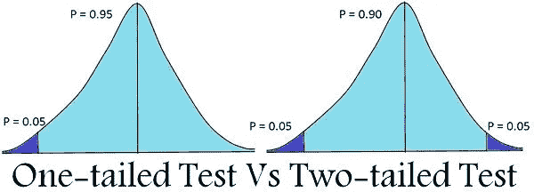
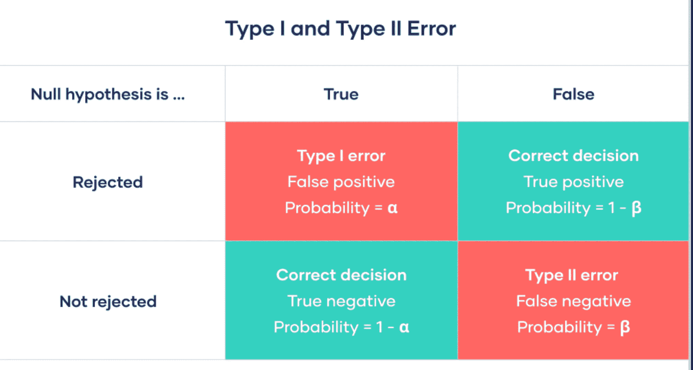
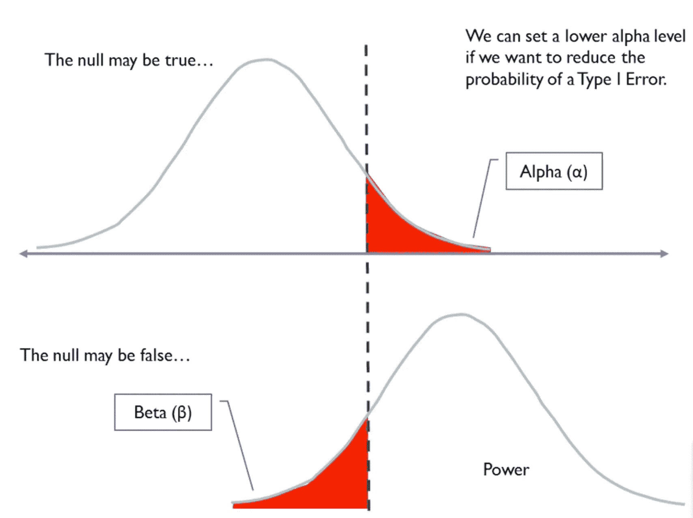

# 假设检验(无效和替代)和第一类/第二类误差(第一部分)

> 原文：<https://blog.devgenius.io/hypothesis-testing-f6162726321a?source=collection_archive---------8----------------------->

科学过程的第一步不是观察，而是产生一个假说，然后通过观察和实验对该假说进行严格的检验。

## 假设

假设:关于参数的一些假设。一个好的假设必须基于一个好的研究问题。它应该简单、具体，并事先说明

## 假设的类型

(1)零假设和替代假设
(2)单尾检验和双尾检验

## 1)无效假设和替代假设

这些假设总是用＄H _ 0＄来表示，称为零假设
零假设的反义词称为替代假设＄H _ a＄

*可以先形成空，也可以先形成替代*

替代假设不能被直接检验；如果统计显著性检验拒绝零假设，则排除法接受该假设。

## 形成零假设的方法

*   把现状(陈述状态中的事物)作为无效假设。它意味着首先宣布某人是无辜的
*   我们通常认为某事没有关系
*   示例:-

H0:引入新的奖金计划不会增加销售额

H0:新药不会降低胆固醇水平

## 2.单尾检验和双尾检验

**单尾检验:**
备择和无效假设只有一个方向，要么向左，要么向右。
示例:
H0: X 的响应时间应小于等于 8 分钟
高可用性:X 的响应时间应更长

**双尾检验:-**
这里交替假设有两个方向。
示例:
H0: X 的响应时间应等于 8 分钟
哈:X 的响应时间应小于或大于 8 分钟

## 第一类和第二类错误

如果研究者拒绝了在人群中实际上为真的无效假设，则发生 I 型错误(假阳性);如果研究者未能拒绝在人群中实际上为假的无效假设，则发生 II 型错误(假阴性)。

由于偏倚(观察者、仪器、回忆等)，也可能出现假阳性和假阴性结果。).(然而，由偏差引起的误差不被称为 I 型和 II 型误差。)这样的误差是很麻烦的，因为它们可能难以检测，并且通常不能量化。

## α、β和功率

1.  α:犯第一类错误的概率称为α(即当空值为真时拒绝它)。也叫统计显著性水平。
2.  β:犯第二类错误的概率称为β(即拒绝备选项，错误地接受空值)。
3.  (1-β)称为功效:它是正确决策的概率。

**通过例子理解α、β和幂**
我们正在分析一种流感的样本。

***无效假设:*** 流感不会引起精神障碍。
***候补假设:*** 流感会引起精神障碍。

α =研究者设定的 5%。这意味着 5%是错误推断流感导致精神障碍的最大可能性。

β =研究者设定的 10%。这意味着有 10%的可能性我们忽略了流感和精神疾病之间的关系。意味着有 90%的机会找到关联。

应考虑适当的抽样规模，并尽可能减少 I 型和 II 型误差

许多研究将α设为 0.05，β设为 0.20(0.80 的幂)。这些值有些随意，有时也会用到其他值；α的常规范围在 0.01 和 0.10 之间；并且对于β，在 0.05 和 0.20 之间。

一般来说，当研究问题使得避免 I 型(假阳性)错误特别重要时，研究者应选择较低的α值，当避免 II 型错误特别重要时，研究者应选择较低的β值。

阿尔法，贝塔和权力之间的关系也可以在下图中看到。虚线称为 z。增加α将减少β，增加功率。

降低α和β并提高功效的唯一方法是通过增加样本大小来降低标准偏差。

如果你喜欢这篇文章，请鼓掌并跟我来。如果我们能通过 linkedin 或 twitter 联系，我将不胜感激。