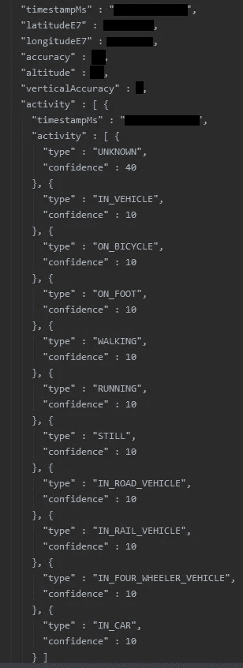

# 我向 4 个最大的网站询问了我的数据。

> 原文：<https://blog.devgenius.io/i-asked-4-of-the-biggest-websites-for-my-data-d047213ed586?source=collection_archive---------6----------------------->

## 你认为你的数字足迹有多大？

马库斯·斯皮斯克在 [Unsplash](https://unsplash.com?utm_source=medium&utm_medium=referral) 上的照片

无论是喜欢 Instagram 帖子，还是查看您最喜欢的新闻应用程序以获取最新的 Covid 信息，我们都在不断地、不可避免地生成数据。当我们浏览和狂欢时，我们的行为被跟踪、存储和解释，最终以精确得吓人的定向广告的形式卖回给我们。**如果产品免费，你就是产品**。网上的“你”是由什么组成的？**你就是你的数据。**

可怕的是，你可能已经知道并接受了这一点。有多少次你开玩笑说 Alexa 偷偷给你录音，或者在私聊中聊到一个产品只为了第二天给你做广告？我们知道我们正在被挖掘和压榨越来越多的数据，并且**我们通过接受条款和条件明确同意**这一点。

但实际上，这些公司掌握了我们多少数据？我决定找出答案。

# 被选中的 4

我不知道你怎么想，但是我的电子邮件注册了很多在线公司，我指的是很多在线公司。谷歌密码管理器显示大约有 300 个密码，这还不包括我通过电话号码注册的东西，一次性电子邮件，甚至第三方集成(比如注册一个现有的脸书账户)。我的数字足迹很大，所以我想把范围缩小到我认为拥有我最多数据的 4 家公司。这是清单。

1.  一个非常明显的选择，因为我的整个数字生活似乎都围绕着不同的谷歌产品——Gmail、Photos、Drive、Android 等
2.  与谷歌相似，但又截然不同，足以让我认为它所知道的关于我的数据值得一查
3.  脸书
4.  Reddit 是我最主要也是最活跃的社交媒体形式。我不认为他们有谷歌或脸书那么多关于我的数据，但这是一个通配符

我在互联网上做的大部分事情可能都以这样或那样的方式围绕着这 4 个网站，所以让我们看看我给了他们多少和什么类型的数据。

# 如何索取自己的数据

多亏了英国一项名为“**数据保护法**”的便利措施，所有英国公民都有权向任何存储你个人数据的个人/组织提交**主体访问请求** (SAR)。SAR 的接收者有 **30 天**的时间来遵从或面临处罚。我原以为向谷歌这样的大公司索要我的个人数据的过程会非常令人生畏且耗时，但事实上，我在 24 小时内收到了来自所有 4 个网站的个人数据。
尽管我不同意某些英国法律和政治，但《数据保护法》是一个非常强大的工具，它允许任何个人了解个人数据，如数量、共享位置以及谁可能与他们共享了这些数据。从“我们对他们”的角度来看，这无疑是人民的一次坚实的胜利。为了帮助提交我的 SAR，我使用了一个名为**的网站。这很简单，只要选择你想联系的公司，提供一些细节，然后正确地迈出联系这些公司的第一步。别担心，讽刺的是，我注册了一项帮助人们取回个人数据的服务。在恰当地开启对话后，大多数公司回复了一个链接，要求你提供数据，谷歌有一整套服务专门用于这种被恰当地称为“外卖”的服务。在 24 小时内，通过少量的链接跟踪和电子邮件检查，我现在可以访问我所有的数据。**

# 尺寸很重要

我真的不知道会有多大的文件。鉴于脸书和谷歌拥有数百万甚至数十亿的用户，我认为每个用户拥有几千兆字节的数据是不太可能的，所以我认为每个用户大约 2Gb 是一个合理的假设。这不是一个公平的假设。我大大低估了我的足迹有多大。以下是 4 家公司各自的总数据文件大小；

1.  谷歌 **: 8.8Gb**
2.  Youtube: **300Mb**
3.  脸书: **13.2Gb(！！！)**
4.  Reddit: **2.1Mb**

这些差异巨大的尺寸起初看起来有点令人困惑，但实际上很有意义。我只在脸书使用 messenger，messenger 数据包含许多媒体文件，这导致文件大小比我预期的要大很多。与此类似的是谷歌出口，其中也包括许多媒体。Reddit 同样令人惊讶，只是方向相反。由于我没有在 Reddit 上发表媒体文章，我可能会认为它会比谷歌或脸书小，但它的大小只有 2Mb 多一点，大约是 4500 倍。

# 挖掘数据

现在我有了这么多数据，我开始分解它们，并记录下任何有趣的发现。让我们看看这些数据对每一个都意味着什么；

1.  **谷歌**
    正如我之前提到的，谷歌有这么多我使用的服务，所以我无法深入介绍，但大部分文件大小来自**谷歌照片。**我用安卓手机拍的所有照片都会自动备份到谷歌相册(我不确定自己是否选择了谷歌相册)，所以看到 2014 年的照片我并不感到惊讶。但是请记住，当你在 Google 相册中“删除”一张照片时，它实际上并不会立即删除。相反，它落在你的垃圾桶里，60 天后被清理掉(如果不是手动清理的话)。我相信很多人认为这是谷歌的一个有用的功能，但就个人而言，这有点像谷歌不愿意放弃你的数据，在你最初试图删除数据后保留了 2 个月。
    Google Pay 文件夹也是一座数据金矿，提供了一个 HTML 页面供你浏览所有记录的 GPay 交易。如果你觉得还不够追踪的话，这些交易中的大多数都附有一个**地图链接**，这样你就可以看到它们发生在哪里。
    正如你所料，你访问过的每个网站、点击过的每个广告都有大量的数据，使用任何谷歌产品都有无止境的活动日志。但是让我们进入更令人毛骨悚然的部分-

谷歌位置数据的一个例子

**谷歌位置历史**。这真是令人吃惊。我知道谷歌正在通过 GPS 监控我的位置，但我不太清楚监控到什么程度。打开一个名为 *LocationHistory.json* 的文件，迎接我的是大约 100Mb 的关于我所在位置的数据。这大约是 Reddit 数据总量的 50 倍。每一个单独的数据捕捉记录了时间，坐标，以及它认为你当时在做什么活动，比如汽车，火车，步行等等。稍微更令人担忧的是，我发现我的 GPS 记录中大多数都确信我的活动类型是“静止的”——**这意味着谷歌在我甚至没有移动的时候就在检查我的位置**。出于某种原因，在不移动的情况下被监视的想法似乎比在我实际改变位置时发送数据更糟糕。
我找到的最后一个令人毛骨悚然的文件夹名为 **Voice and Audio，**其中包含了大约 800 段我与谷歌助手(在我的手机上或通过谷歌 Home 设备)交谈的录音。我认为这是相对无害的，但我不得不质疑为什么谷歌需要这些数据？是训练一个 AI 像我一样说话吗？嗯，不，可能不会，但它仍然令人毛骨悚然。如果你曾经和你的谷歌助手说过话，你的语音剪辑现在是谷歌的财产，他们打算无限期地保留它。我听了一些录音，谢天谢地，我似乎意识到我在和谷歌对话，它们不仅仅是随机录制的对话。然而，有人报告说，他们的个人数据记录包含了他们没有同意记录的全部对话。

2.脸书对我来说，脸书是我最害怕的人。可能是因为我只用它来发信息，但过去它非常活跃。
我立刻看到了一个位置历史文件夹。值得庆幸的是，我不认为它像谷歌的位置历史轮询那样压抑，但每次你登录脸书，你的位置和网络数据都会被捕获并保存下来供他们使用。
脸书也有我期待的所有数据，比如记录每一次搜索，比如发送/接收、页面访问或视频观看。迄今为止，脸书数据中最令人担忧的部分是“信息”文件夹。这是我在脸书的每一次谈话的完整历史记录。如果你和我一样，从 21 世纪初就开始在 messenger 上与人交谈，那么你现在会看到数量惊人的媒体数据— **每个对话大约有 4000 张照片。**这些照片似乎没有有效期，所以请记住，当你在 messenger 上发送照片时，**脸书将永远拥有这张照片的副本**。阅读消息日志很怀旧，但我意识到我和一些老朋友有超过 100 万条消息，所有这些脸书都可以访问。令人惊讶的是，有了这么多关于我的信息，脸书仍然设法猜测我的兴趣，这是令人难以置信的错误。

3. **Youtube** 我不得不从谷歌数据捆绑包中提取 Youtube 数据，因为它们属于谷歌品牌。看了谷歌的数据后，我以为 Youtube 的东西也同样令人发指，但我惊喜地发现——没有位置数据，也没有长期的历史数据。老实说，它相对简单，由喜欢的视频、订阅的频道和评论的简单列表组成。将 Youtube 比作脸书感觉就像白天和黑夜一样，但请记住，Youtube 并不是真正独立的；他们不需要像脸书收集那么多数据的原因是，谷歌为他们做了所有的事情。

4. **Reddit** 相当于这个数据沙漠中的一片绿洲。Reddit 只保留了大约 2Mb 的关于我的最少数据,尽管它们可能占据了我浏览时间的最大部分。Reddit 保存的数据中没有什么令人毛骨悚然的东西——绝大多数都和 Youtube 类似，只有列表和上传评论列表、引导帖子、私人信息等。
我发现的最有趣的东西是在“comments.csv”文件中，这是一个在 Reddit 内容上发表的所有评论的列表。在 Reddit 上，您可以删除评论，这样它们就不再面向公众，也不会显示在您的个人资料中。然而，这些评论仍然由 Reddit 保存，并在您的整体导出评论数据中可见。我想这并不像谷歌保留语音记录那样令人惊讶，但它再次提醒人们，互联网上没有删除这回事。

# 最后

我承认，当我想到发送 SAR 的想法时，我更感兴趣的是写这篇文章，而不是真正关心我的个人数据。但在看到我的数字足迹的范围后，情况正好相反。但是我们不要假装这一切都是悲观的。我不会天真到认为我的任何个人数据都不应该存储在任何地方。事实上，你甚至可以说，在某些情况下，存储和共享你的个人数据是一件好事，明显的例子是更个性化的内容和广告。如果我秃顶了，我会一直收到护发产品的广告，如果我住在高层公寓里，我会收到剪草机的广告。同样，我们的 Youtube 主页是根据我们的个人喜好定制的，允许我们消费更多相关的内容，并让 Youtube 获得更多广告收入——双赢。与这些公司拥有的关于我的大量数据相比，我更担心的是**类型的数据**。比起我所在的位置，我更喜欢看录制的小猫视频。再加上多年的旧个人照片和语音剪辑，就不难理解为什么人们会把大型科技公司视为个人安全恶魔了。我认为和大多数事情一样，这是为了找到平衡。作为这些产品的客户，我们**并非完全无能为力**。我的**责任**是确定这些公司保留在我身上的数据对我来说是否可以接受(假设这些公司遵守法律)。我不是说要阅读全部条款和条件(我不相信任何人曾经阅读过)，但是了解自己的数据是很重要的。我认识几个离开脸书的人，他们把个人数据隐私作为主要问题(讽刺的是，他们中的很多人仍然虔诚地使用 Instagram 和 Twitter)。

我强烈建议您提交您自己的主题访问请求，并花一分钟时间思考您的个人数据和数字足迹。这是一次令人惊讶的有影响力的发现之旅，坦率地说，能够窥探自己很有趣。哦，不要担心 Covid 疫苗会给你一个微芯片——你可能每天都带着这个世界上最有效的袖珍间谍。

如果您喜欢这篇文章或觉得它有用，请随意。或者，你可以在 Medium [*这里*](https://jamesmbrightman.medium.com/membership) *支持我或者给我买一杯* [*咖啡*](https://ko-fi.com/jamesbrightman) *！非常感谢所有的支持。*