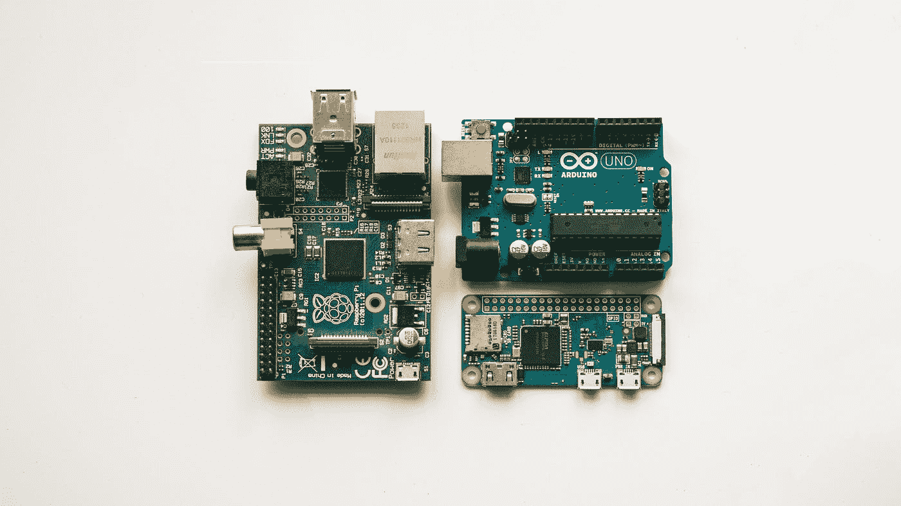
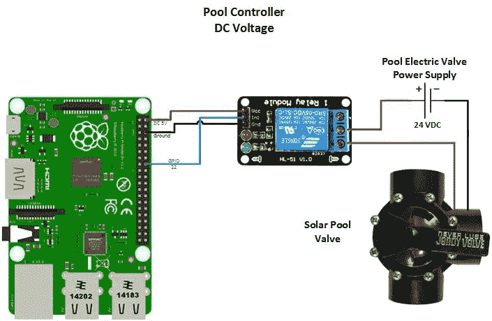

# 我只用一个树莓做了一个智能灌溉系统。

> 原文：<https://blog.devgenius.io/i-built-a-smart-irrigation-system-using-only-a-raspberry-pi-ba29282b499e?source=collection_archive---------3----------------------->

哈里森·布罗德本特在 [Unsplash](https://unsplash.com?utm_source=medium&utm_medium=referral) 上的照片

## 我是这样做的，你也可以这样做

智能灌溉系统到处都在涌现！农民们正在使用尖端技术来节省农场的时间和费用。房主正在使用智能灌溉控制器来节省每月的水费。如果你安装一个，这些系统每年可以为你节省多达 10，000 加仑的水。他们从哪里得到这些新奇的设备？大公司。但事实是，自己做一个并不难。我做到了，你也可以。

智能灌溉系统是郁郁葱葱的草坪和廉价水费的最终结合。[智能灌溉控制器](https://www.hydropoint.com/what-is-smart-irrigation/)根据你的花园需求调整灌溉计划。有几个因素，管制员审查和可靠的时间表的基础。这些因素包括当地天气、土壤条件和你院子里的植物种类。这种不干涉的方法是在美国房主社区获得牵引力的连胜。

我的家庭使用传统的洒水系统，估计每年要用 30，000 加仑的水；改用智能控制器改变了生活。真的。为了制作一个，我只使用了一个[树莓酱](https://www.raspberrypi.org/)、电磁阀、一个 5 伏继电器和几根电线。在项目的软件方面，我混合使用了 [python](https://www.python.org/) 、 [json](https://www.json.org/json-en.html) 和 [swift](https://developer.apple.com/swift/) 来执行重要的任务。对于天气数据，我使用了 [OpenWeatherMap API](https://openweathermap.org/api) 。[堆栈溢出](https://stackoverflow.com/)是一个了不起的资源，帮助我解决了出现的任何问题。

连接硬件很容易。我用四根母到母的跳线电缆从树莓派连接到五伏继电器。迷你电脑的 GPIO 引脚使连接变得简单易行。全世界的人们都可以利用这些 i/o 引脚来实现他们的技术梦想。我用标准铜线创建了一个与[电源](https://www.sparkfun.com/products/10288)、[电磁阀](https://en.wikipedia.org/wiki/Solenoid_valve#:~:text=A%20solenoid%20valve%20is%20an,characteristics%20of%20fluid%20they%20control.)和[固态继电器](https://en.wikipedia.org/wiki/Solid-state_relay)的三向连接。对于大多数电气工程挑战来说，稳定的电源非常重要。该系统的图表如下所示。

在这个项目中，我花了相当多的时间弄清楚灌溉系统的软件是如何工作的。我需要解决它的多个方面。系统的这些不同部分代表了应用程序的不同层。这包括编写一个接收用户输入的应用程序，创建一个将参数传递给 json 文件的 python 脚本，以及编写一个可以读取和执行 python 文件参数的系统。

到目前为止，编写 ios 应用程序是我项目中最难的部分。我以前从未在 swift 中编写过代码，这种体验有点令人沮丧。UI 不是我的强项，设计应用程序的过程对我来说也不自然。

我在设计整个系统时遇到的一个障碍是如何将数据从用 swift 编码的应用程序传输到 raspberry pi，在那里用 python 分析数据。为了解决这个问题，我使用了一个名为 [MQTT](http://mqtt.org/) 的消息协议。消息将从应用程序发送到所有订阅的服务器。在这种情况下，我们订阅的服务器将是 raspberry pi。

我使用了 [CocoaMQTT 框架](https://cocoapods.org/pods/CocoaMQTT)，这样应用程序就可以在应用程序和服务器之间传输数据了。我使用 podfile 设置了这项服务。

逻辑和 ui 链接到名为 viewcontroller.swift 的主要 ios 应用程序文件。在这个文件中，我链接了 ios storyboard 的功能，这是一个用于设计外向应用程序的 gui。我包含了向 python 文件所在的 raspberry pi 发送时间表和浇水偏好等信息的逻辑。

由于我缺乏使用 swift 的经验，栈溢出是棘手情况下的救命稻草。[苹果开发者文档](https://developer.apple.com/documentation/swift)帮助我了解了如何使用不同的部分，如选择器、按钮和文本区。每个部分的不同属性帮助我塑造了代码，并将其转化为可用的东西。

在我的 raspberry pi 上，我安装了 MQTT 软件，使设备能够订阅来自 ios 应用程序的任何消息。我创建了一个简单的 python 脚本来处理传入的消息，这些消息携带了用户信息，比如他们设置的时间表和 rain delay 首选项。

我导入 mqtt 客户端库和 gpio pin 库。这有助于我将消息与系统物理方面的执行联系起来。我使用 MQTT 库中的预设函数来连接我的 ios 设备。我将消息中的信息传递到一个 [json 字典](https://www.w3schools.com/python/python_json.asp)中，并将其附加到一个 json 文件中，如下所示:

这个配置文件包含了关于 rain_delay 和调度的所有重要信息。这个文件是我们的主 python 文件读取和分析的内容，以决定它需要采取什么行动。下面是 main.py:

Main.py 文件处理来自 config.json 文件和 PpenWeatherMap API 的分析信息，执行 rain_delay 函数和其他进程。我选择使用 openweathermap API，因为它是免费的，并且在 python 中使用它的文档非常简单。我所要做的就是访问 pyowm 库并用 API 密钥验证自己。这允许我使用 pyowm 库中的所有天气 API 函数。为了决定什么将参与降雨延迟功能，我使用了华盛顿州雷蒙德市的降雨预报，并设置了一个 if 语句，该语句将查看数据并决定最佳行动方案。

我的智能灌溉控制器还没做好。有这么多不同的事情需要努力。我需要你的帮助来完成这个项目。我链接了我的 github 库，这样你就可以查看代码，调整它，让项目变得更好。除此之外，我将链接几个帮助我开始这个项目的来源，希望它们也能指导你。

Github 资源库:【https://github.com/omshah2006/Smart-Irrigation-Controller 

带树莓 pi 的 MQTT 指南:[https://www.raspberrypi.org/forums/viewtopic.php?t=196010](https://www.raspberrypi.org/forums/viewtopic.php?t=196010)

GPIO 引脚连接指南:[https://www.youtube.com/watch?v=iF-cOppShQE](https://www.youtube.com/watch?v=iF-cOppShQE)

我用过的工具和资源:Macbook Air，Xcode，Raspberry Pi，Thony IDE，Stack Overflow，W3 Schools，4 根母对母 gpio 线，3 根电线，5 伏固态继电器模块，电磁阀，电源线，直流连接器(母)。

这是我的联系方式！如果你对这个项目有任何问题，随时给我发电子邮件。

电子邮件:omshah2006@gmail.com