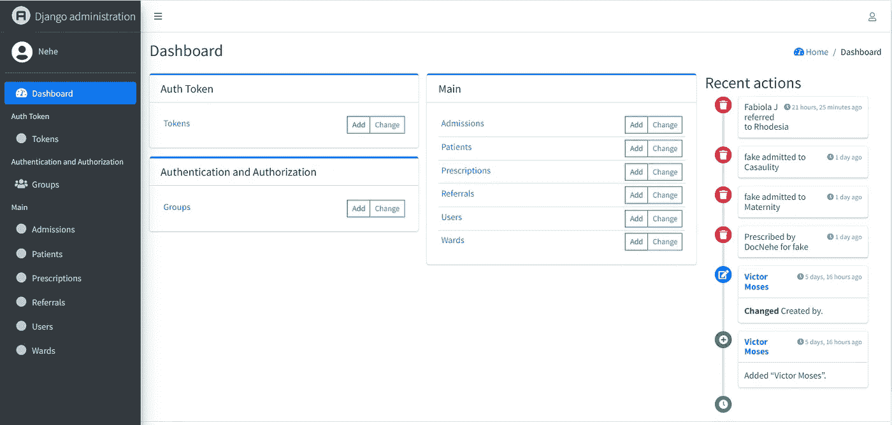

# 我使用 Django 和 Next 构建了一个 Web 应用程序。射流研究…

> 原文：<https://blog.devgenius.io/i-built-a-web-application-using-django-and-next-js-fd964260203f?source=collection_archive---------0----------------------->

LiveUp 登录页面的部分截图

LiveUp 使医生能够跟踪患者的处方，减少冗余和手动流程。

# 灵感

在我镇上的一家药房，有很长的流程和重复的步骤。一天，我被要求提供我过去接受过的药物的信息，但我无法提供或记住具体的信息。卫生工作者写的那本书被雨毁坏了。

我也注意到一些病人在他们进入的每个办公室都带着不止一本书。如果其中一个或全部被放错地方或毁坏，许多信息都会丢失。这将需要卫生工作者记录细节一秒钟或 N 次。

# 体系结构

LiveUp 系统的建筑插图

这个网络应用程序在**上运行，这是一个举办 Next 的绝佳地点。Js 应用。然后，它使用托管在 [**Heroku**](https://www.heroku.com/) 上的 REST API。Heroku 上的设置包括 API 使用的 PostgreSQL 数据库。**

# **使用的工具和技术**

*   **对于前端，接下来我选择使用 [**。Js**](https://nextjs.org/) 、(涉及 **HTML** 、 **CSS** 、 **React-Bootstrap** 和 J **avascript** )因为它有一个简单的基于文件的路由系统，所以不需要设置 React-Router、自动代码分割、预渲染、路由预取、内置图像优化组件、在生产中使用 cdn、API 路由、增量静态页面生成、类型脚本支持等等。**
*   **我使用 [**Django**](https://www.djangoproject.com/) 构建了 API。Django 附带了一个管理面板，涵盖了常见的 CRUD 管理任务。这减少了构建自定义管理所需的时间。Django ORM 最让我兴奋，非常强大，但是太直观了。这的确是有期限的完美主义者的框架。**

****

**LiveUp 的 Django 管理面板截图**

*   **[PostgreSQL。这是 python 社区的最爱。非常容易在 Django settings.py 文件中进行设置，让迁移为您做好准备。](https://www.postgresql.org/)**
*   **[**韦尔塞尔**](https://vercel.com/) 。它是由下一代建造的。Js 团队负责托管下一个应用程序。最有趣的特性是为您的开发 Git 分支生成的预览链接，您可以在推送到 main 之前与您的团队共享这些链接。**
*   ****。我过去用来托管 ExpressJs APIs 的常见云解决方案。我在 Heroku 上设置了 API 和数据库。****
*   ****[**Git**](https://git-scm.com/)&[**Github**](https://github.com/)便于版本控制和部署。****
*   ****[**Docker**](https://www.docker.com/) 避免“在我机器上能用”的借口。****

# ****特征****

## ****所有用户****

*   ****登录和注销****
*   ****编辑个人资料。****
*   ****生成 pdf 和 CSV。****
*   ****过滤、排序和分页。****

## ****管理****

*   ****管理员可以添加病房，注册接待员和卫生工作者，并可以修改他们的数据。卫生工作者可以是医生、护士或实习医生。****

## ****接待员****

*   ****接待员可以登记患者，并且只能查看他们已经登记的患者****
*   ****可以把病人介绍给卫生工作者。****
*   ****查看所有接待员对患者的转诊记录。****
*   ****只编辑他们推荐的人。****
*   ****可以修改和查看患者的详细信息。****
*   ****可以查看当天以及自注册开始以来已注册和转诊的患者人数。****
*   ****可以查看当天以及自登记开始以来所有接待员登记和转诊的患者人数。****

********

****接待员用于将患者转介给卫生工作者的模式的屏幕截图****

## ****卫生工作者****

*   ****可以查看分配给他们的所有患者。****
*   ****入院并开药。****
*   ****查看患者过去的入院记录和所有卫生工作者开出的处方。****
*   ****可以编辑他们的入院或处方。****
*   ****可以查看当天所有卫生工作者转诊、收治的患者数量、开出的处方数量，以及从第一次转诊开始的总数。****
*   ****可以查看当天转诊、入院、开出处方的患者数量，以及首次转诊后的患者总数。****

********

****一个带有表单的模型的屏幕截图，医生可以使用该表单来记录特定患者的处方****

# ****挑战****

*   ****在管理这个州的时候，我面临着种族问题。在某个时候，当我创建一个功能使临床医生能够更新处方时。应用程序状态的一部分在我无意的情况下被更改。我了解到，在一个操作完成之前，另一个操作已经更改了值，从而导致了意外的结果。它迫使我撤销了大量的工作来追踪它。我在每个函数中添加了大量日志来跟踪整个流程。我还使用了谷歌 Chrome 中的开发者工具来识别 bug。****
*   ****我发现我在使用不再受支持的 d [jango-rest-auth 包](https://github.com/Tivix/django-rest-auth)作为 JSON Web 令牌。这是在实施身份验证和授权 3 天后。我不得不重构受影响的代码，并熟悉它的替代品， [dj-rest-auth](https://github.com/iMerica/dj-rest-auth) 。****
*   ****重新学习[反应引导](https://react-bootstrap.github.io/)。我忘记了大部分的引导类。我不得不提醒自己一些基本的东西。****

# ****我学到了什么****

****这并不是第一次使用 Django 或 Next.Js 构建项目，大部分时间都是一次修改和掌握的经历。然而，我学到了以下几点，****

*   ****如何在 Heroku 上设置 Django 项目和 PostgreSQL DB？****
*   ****Django Rest 框架中的嵌套序列化器。****
*   ****如何使用[***Dj-rest-auth***](https://github.com/iMerica/dj-rest-auth)*包？它附带了获取令牌、电子邮件和密码重置的路径，开箱即用。*****
*   *****[**Redux Toolkit**](https://redux-toolkit.js.org/) 用于前端状态管理。*****
*   *****更多 React-Bootstrap 组件和类。*****
*   *****Docker、docker 文件和 docker-compose。我打算今年更多地研究 Docker。*****

# *****链接*****

## *****密码*****

*   *****[前端](https://github.com/KNehe/liveup_web)，[后端](https://github.com/knehe/liveup_api/)。*****

## *****实时项目*****

*****我不知道该项目将持续多久，因为我使用了免费的托管计划。*****

*   *****访问[前端](https://liveup-web.vercel.app/)。*****
*   *****阅读 [Swagger 文档](https://nehe-liveup-api.herokuapp.com/api/v1/swagger/)、 [Redoc 文档](https://nehe-liveup-api.herokuapp.com/api/v1/redoc/)或[可浏览 API](https://nehe-liveup-api.herokuapp.com/api/v1/) 。*****

## *****演示*****

*****下面是演示主要功能的视频。*****

*****在 YouTube 上观看 LiveUp 演示*****

*****感谢您的阅读！！！😊😊。*****

*****让我们在 [LinkedIn](https://www.linkedin.com/in/nehemiah-kamolu/) 和 [Twitter](https://twitter.com/Nehemiah_Nehe) 上连线。*****