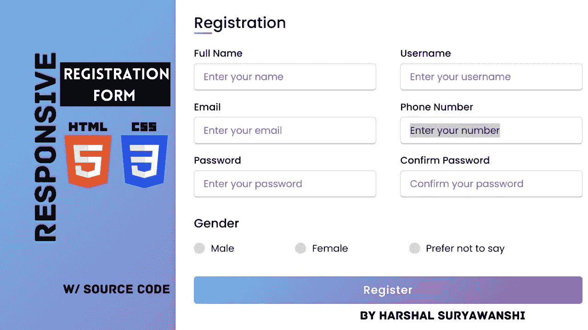
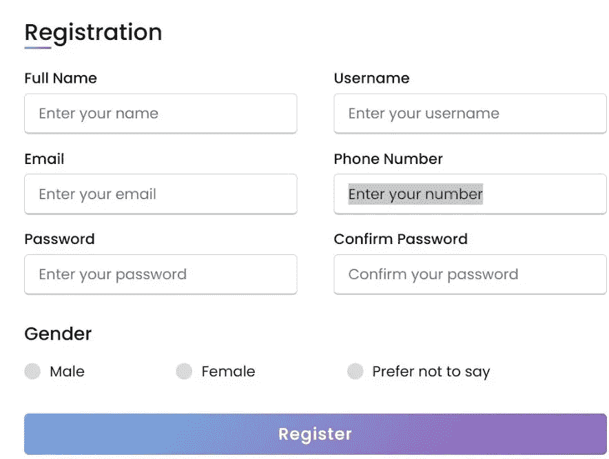

# 我使用 HTML 和 CSS 创建了一个响应式注册表单

> 原文：<https://blog.devgenius.io/i-created-a-responsive-registration-form-using-html-and-css-54a938f45ab?source=collection_archive---------1----------------------->

大家好！希望你们都做得很好…今天我将演示我如何只用 HTML 和 CSS 创建一个响应式注册表单。我创建的这个注册表单是使用 HTML 和 CSS 的结构和设计最漂亮的网页。



所以，作为一个初学者，我想你应该知道什么是 HTML 和 CSS 吧？不要！从技术上讲，它们不是编程语言。它们被用来在 web 开发中构建结构和设计。

所以，让我们开始使用 HTML 和 CSS 创建一个响应注册表单。

源代码:(HTML)

```
<!DOCTYPE html>
<html lang="en" dir="ltr">
  <head>
    <meta charset="UTF-8">
    <!---<title> Responsive Registration Form | CodingLab </title>--->
    <link rel="stylesheet" href="style.css">
     <meta name="viewport" content="width=device-width, initial-scale=1.0">
     <title>Registration Form</title>
   </head>
<body>
  <div class="container">
    <div class="title">Registration</div>
    <div class="content">
      <form action="#">
        <div class="user-details">
          <div class="input-box">
            <span class="details">Full Name</span>
            <input type="text" placeholder="Enter your name" required>
          </div>
          <div class="input-box">
            <span class="details">Username</span>
            <input type="text" placeholder="Enter your username" required>
          </div>
          <div class="input-box">
            <span class="details">Email</span>
            <input type="text" placeholder="Enter your email" required>
          </div>
          <div class="input-box">
            <span class="details">Phone Number</span>
            <input type="text" placeholder="Enter your number" required>
          </div>
          <div class="input-box">
            <span class="details">Password</span>
            <input type="text" placeholder="Enter your password" required>
          </div>
          <div class="input-box">
            <span class="details">Confirm Password</span>
            <input type="text" placeholder="Confirm your password" required>
          </div>
        </div>
        <div class="gender-details">
          <input type="radio" name="gender" id="dot-1">
          <input type="radio" name="gender" id="dot-2">
          <input type="radio" name="gender" id="dot-3">
          <span class="gender-title">Gender</span>
          <div class="category">
            <label for="dot-1">
            <span class="dot one"></span>
            <span class="gender">Male</span>
          </label>
          <label for="dot-2">
            <span class="dot two"></span>
            <span class="gender">Female</span>
          </label>
          <label for="dot-3">
            <span class="dot three"></span>
            <span class="gender">Prefer not to say</span>
            </label>
          </div>
        </div>
        <div class="button">
          <input type="submit" value="Register">
        </div>
      </form>
    </div>
  </div></body>
</html>
```

之后，创建网页的 HTML 结构，你需要通过 CSS 设计网页的一部分。

源代码:(CSS)

```
[@import](http://twitter.com/import) url('[https://fonts.googleapis.com/css2?family=Poppins:wght@200;300;400;500;600;700&display=swap'](https://fonts.googleapis.com/css2?family=Poppins:wght@200;300;400;500;600;700&display=swap'));
*{
  margin: 0;
  padding: 0;
  box-sizing: border-box;
  font-family: 'Poppins',sans-serif;
}
body{
  height: 100vh;
  display: flex;
  justify-content: center;
  align-items: center;
  padding: 10px;
  background: linear-gradient(135deg, #71b7e6, #9b59b6);
}
.container{
  max-width: 700px;
  width: 100%;
  background-color: #fff;
  padding: 25px 30px;
  border-radius: 5px;
  box-shadow: 0 5px 10px rgba(0,0,0,0.15);
}
.container .title{
  font-size: 25px;
  font-weight: 500;
  position: relative;
}
.container .title::before{
  content: "";
  position: absolute;
  left: 0;
  bottom: 0;
  height: 3px;
  width: 30px;
  border-radius: 5px;
  background: linear-gradient(135deg, #71b7e6, #9b59b6);
}
.content form .user-details{
  display: flex;
  flex-wrap: wrap;
  justify-content: space-between;
  margin: 20px 0 12px 0;
}
form .user-details .input-box{
  margin-bottom: 15px;
  width: calc(100% / 2 - 20px);
}
form .input-box span.details{
  display: block;
  font-weight: 500;
  margin-bottom: 5px;
}
.user-details .input-box input{
  height: 45px;
  width: 100%;
  outline: none;
  font-size: 16px;
  border-radius: 5px;
  padding-left: 15px;
  border: 1px solid #ccc;
  border-bottom-width: 2px;
  transition: all 0.3s ease;
}
.user-details .input-box input:focus,
.user-details .input-box input:valid{
  border-color: #9b59b6;
}
 form .gender-details .gender-title{
  font-size: 20px;
  font-weight: 500;
 }
 form .category{
   display: flex;
   width: 80%;
   margin: 14px 0 ;
   justify-content: space-between;
 }
 form .category label{
   display: flex;
   align-items: center;
   cursor: pointer;
 }
 form .category label .dot{
  height: 18px;
  width: 18px;
  border-radius: 50%;
  margin-right: 10px;
  background: #d9d9d9;
  border: 5px solid transparent;
  transition: all 0.3s ease;
}
 #dot-1:checked ~ .category label .one,
 #dot-2:checked ~ .category label .two,
 #dot-3:checked ~ .category label .three{
   background: #9b59b6;
   border-color: #d9d9d9;
 }
 form input[type="radio"]{
   display: none;
 }
 form .button{
   height: 45px;
   margin: 35px 0
 }
 form .button input{
   height: 100%;
   width: 100%;
   border-radius: 5px;
   border: none;
   color: #fff;
   font-size: 18px;
   font-weight: 500;
   letter-spacing: 1px;
   cursor: pointer;
   transition: all 0.3s ease;
   background: linear-gradient(135deg, #71b7e6, #9b59b6);
 }
 form .button input:hover{
  /* transform: scale(0.99); */
  background: linear-gradient(-135deg, #71b7e6, #9b59b6);
  }
 [@media](http://twitter.com/media)(max-width: 584px){
 .container{
  max-width: 100%;
}
form .user-details .input-box{
    margin-bottom: 15px;
    width: 100%;
  }
  form .category{
    width: 100%;
  }
  .content form .user-details{
    max-height: 300px;
    overflow-y: scroll;
  }
  .user-details::-webkit-scrollbar{
    width: 5px;
  }
  }
  [@media](http://twitter.com/media)(max-width: 459px){
  .container .content .category{
    flex-direction: column;
  }
}
```

以下代码的输出:



所以，这是一篇基于使用 HTML 和 CSS 创建注册表单的文章。

如果你想看视频教程一样，这里下面是视频链接或嵌入。必须浏览一遍，并在登记表上写下您的体验。

太棒了。