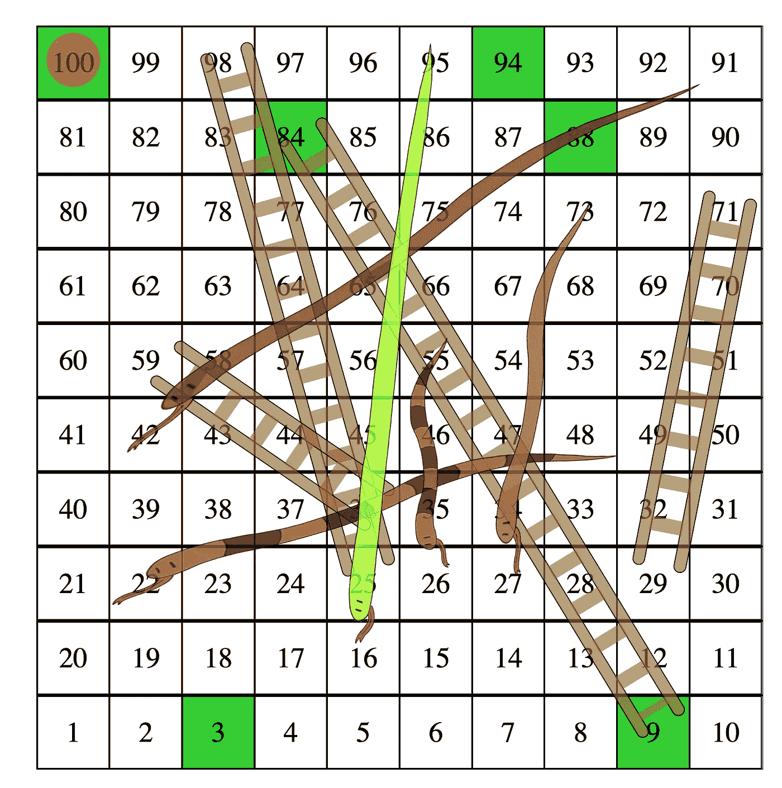
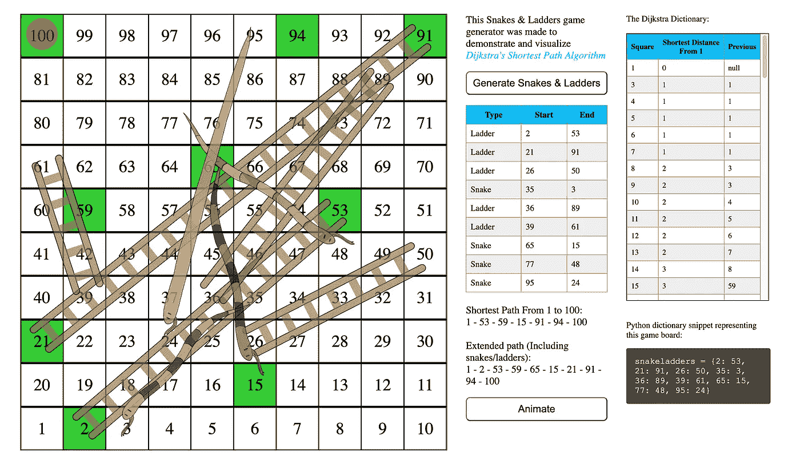

# 我创建了一个蛇和梯子生成器来可视化 Dijkstra 的算法

> 原文：<https://blog.devgenius.io/i-created-a-snake-ladders-generator-to-visualize-dijkstras-algorithm-c054deb9d226?source=collection_archive---------11----------------------->

# Javascript 有时会很奇怪(也许我有偏见)



前一段时间，当我还在学习 Dijkstra 的最短路径算法时，这个练习对我的理解有相当大的帮助。

# 练习

给你一本代表游戏中的蛇和梯子的字典。从 1 到 100 中找出最短的可能路径——如果你无限幸运，每一次都掷出尽可能好的骰子，你会选择这条路径。字典:

```
snakeladders = {9: 84, 25: 98, 29: 71, 36: 59, 49: 22, 55: 26, 73: 27, 91: 42, 95: 16}
```

这里，键较小的键-值对表示梯子，而键较大的键-值对表示蛇。

# 想象的需要

如果我是《蛇与梯子》新手，如果给我那本字典，我可能会一头雾水。需要对蛇和梯子游戏有一个更清晰的可视化，因此我花了一些时间使用 HTML、CSS 和 Javascript 来构建它(第一次迭代)。

# 链接

[https://zlliu . S3 . AP-southeast-1 . Amazon AWS . com/snake ladders/index . html](https://zlliu.s3.ap-southeast-1.amazonaws.com/snakeladders/index.html)

AWS S3 托管的静态网页



蛇与梯子是随机生成的，所以你可能看不到这个游戏

# 特征

1.  蛇和梯子的可视化(随机生成)
2.  生成新游戏的能力——“生成蛇和梯子”按钮
3.  应用 Dijkstra 的最短路径算法为每个随机生成的游戏找到从 1 到 100 的最短路径
4.  Djikstra 算法中最短路径的动画——“动画”按钮
5.  Dijkstra 字典，供您检查您的实现是否正确
6.  用于简单复制粘贴的 Python 代码片段

# 这对你有什么好处

如果你是数据结构和算法的新手，我建议你在这种情况下实现 Dijkstra 的算法，并尝试获得和我一样的输出(最短路径)。一定要生成几个新游戏来测试你的算法是否有效！

# 我是如何使用 Javascript、HTML 和 CSS 来构建它的

我认为自己在 Javascript、HTML 和 CSS 方面相对中级(远非高级)，所以我的源代码可能不包含绝对的最佳实践(第一次迭代，可能会有更多)。当我找到一种更优雅的编码方式时，我可能会写一个关于*我是如何用 Javascript、HTML & CSS 实现这一点的故事。*

# 结论

如果你正在学习 Dijkstra 算法，我希望这个练习能帮助你加强理解。否则，我希望这是一个有趣的阅读，你有乐趣与蛇和梯子乱搞！

# 一些最后的话

*如果这篇文章有价值，并且你希望支持我，请考虑注册一个 Medium 会员——每月 5 美元，你可以无限制地访问 Medium 上的文章。如果你用我下面的链接注册，我会给你零额外费用赚一点佣金。*

[***注册使用我的链接在这里阅读无限媒体文章***](https://zl-liu.medium.com/membership) ***。***

我写编码文章(主要是 Python ),我认为这些文章可能会帮助年轻的我加快我的学习曲线。请加入我的电子邮件列表，以便在我发布时收到通知。

[](https://zl-liu.medium.com/subscribe) [## 每当 Zlliu 发布时收到一封电子邮件。

### 每当 Zlliu 发布时收到一封电子邮件。注册后，如果您还没有中型帐户，您将创建一个…

zl-liu.medium.com](https://zl-liu.medium.com/subscribe)