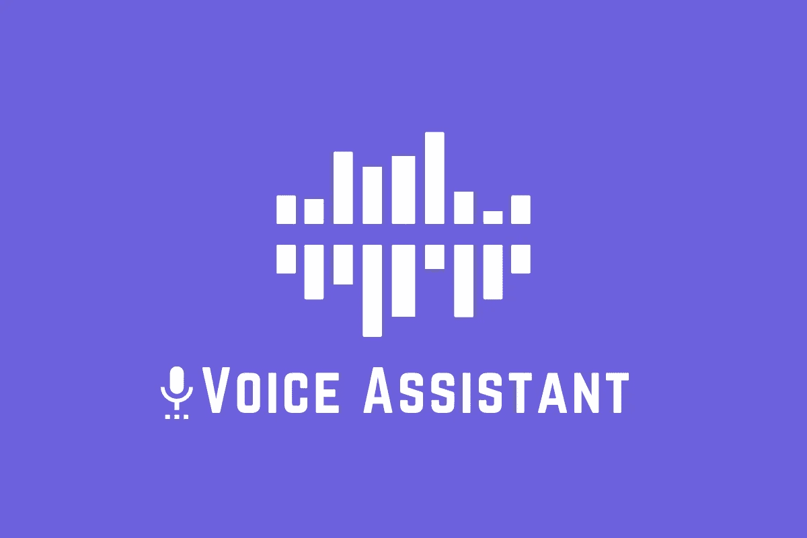
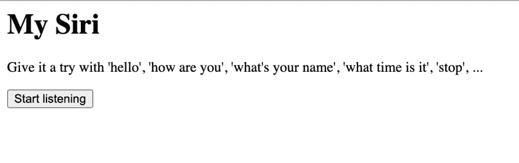
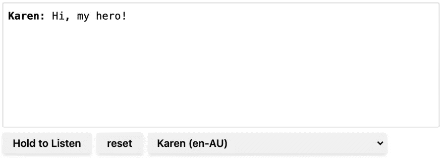
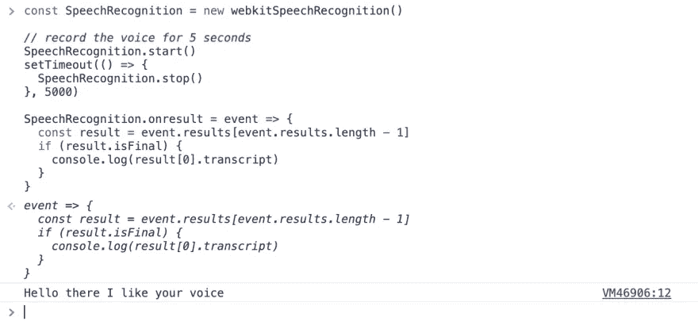
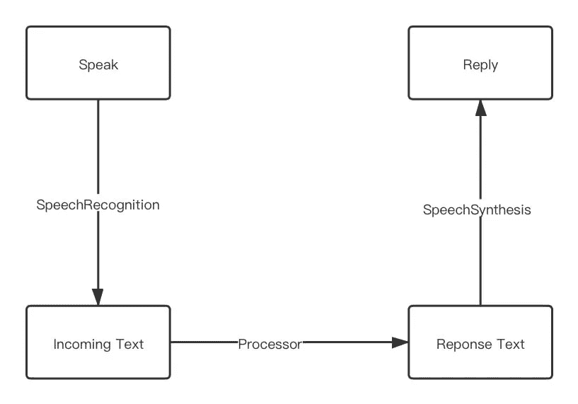
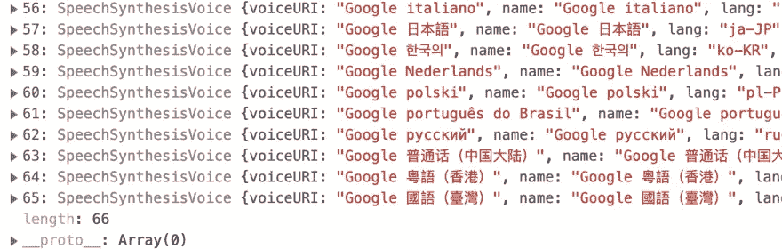

# 我用 180 行 JS 代码创建了一个语音助手

> 原文：<https://blog.devgenius.io/i-created-a-voice-assistant-in-180-lines-of-js-code-42ff947f85f4?source=collection_archive---------15----------------------->



就在前几天，我看到有人([nhudihtuan](https://github.com/nhudinhtuan))用 Chrome 实验 [WebSpeechAPI](https://developer.mozilla.org/en-US/docs/Web/API/Web_Speech_API) 做了一个语音识别助手。助手应用程序将听取人类的声音，并将其转换为纯文本。毕竟，它将打开一个新的谷歌搜索标签页。

点击这里的链接[试试吧](https://nhudinhtuan.github.io/mysiri/)。(仅支持 Chrome /新 Edge 浏览器)



我认为用很少使用的 API 来做一些有趣的项目是很有趣的。所以我决定做这个语音助手的升级版。我的版本没什么特别的，但它是用 [Vue.js](https://vuejs.org/) 及其新的[组合 api](https://composition-api.vuejs.org/) 实现的。

在本文中，我将带您了解创建这个性感的语音助手的过程。

**TLDR；**

# 演示我的语音助手

> *空谈不值钱，让我给你看看我的作品*

按住“Hold to Listen”按钮，尝试以下句子(仅适用于 Chrome/Edge79+)

*   *您好！*
*   *嗨！*
*   你叫什么名字？
*   我爱你
*   *谷歌搜索:*
*   *……裸体……*



我的语音助手演示

(打开此链接体验演示[https://daiyanze.com/sexy-voice-assistant/](https://daiyanze.com/sexy-voice-assistant/))

您也可以从右侧的选择列表中更改扬声器的声音。目前，我的 Mac 上支持的声音又多了 60 种。就我个人而言，我认为凯伦是最流畅的机器人英语演讲者之一。

我猜你一定尝试过对语音助手说一些其他的东西。但我真的很抱歉地告诉你，只有当你的发言符合上述例子时，它才能正确地回答你。否则，它无法理解。(尽管这只是一个原型)

# 它是如何工作的

让我们快速看一下语音助手中使用的语音处理 API。这些都是让语音助手变得“性感”的关键人物。

## 蜜蜂

*   演讲识别:识别你的声音，并将其转换成文本

```
// Needs the `webkit` prefix due to lacking of browsers support var recognition = webkitSpeechRecognition() // Set to `true` to listen to voices 
// continuously and return multiple results. 
recognition.continuous = true; // Start recognition 
recognition.start() // Stop recognition 
recognition.stop() // Handle the result 
recognition.onresult = function (event) {   console.log(event) }
```

*   [语音合成](https://developer.mozilla.org/en-US/docs/Web/API/SpeechSynthesis):获取所有支持的声音并大声说出来

```
var Synth = window.speechSynthesis // Speak out loud 
Synth.speak(utterThis) // Cancel speaking 
Synth.cancel() // Pause speaking 
Synth.pause() // Resume speaking 
Synth.resume() // List out voices supported by the OS 
Synth.getVoices()
```

*   [语音合成交互](https://developer.mozilla.org/en-US/docs/Web/API/SpeechSynthesisUtterance):语音请求对象

```
var utterThis = new SpeechSynthesisUtterance() // Utterance only has properties 
// The spoken language 
utterThis.lang // The tone or the pitch or voice, ranges from 0 to 2\. 
// The higher the younger :D 
utterThis.pitch // Speaking speed, ranges from 0.1 to 10 
utterThis.rate // The content to be spoken 
utterThis.text // Speaker's voice. It's an Object 
utterThis.voice // Speaker's volume 
utterThis.volume
```

实际上，这些 API 是为需要使用语音控制网页的人而创建的，而不是作为聊天机器人提供的。换句话说，当你的团队完成了大多数健壮的特性时。那么这将是一个很好的时机来提升你的网络应用程序的可访问性，以帮助那些需要语音控制的人。

## 用法示例

你可以在 Chrome 控制台上通过**复制** & **粘贴**下面的代码来试试。

1.语音扬声器:下面的代码将大声说出“hello world”。

```
const utterThis = new SpeechSynthesisUtterance("Hello world")  speechSynthesis.speak(utterThis)
```

2.语音到文本:下面的代码将把你的语音转换成文本。

```
const SpeechRecognition = new webkitSpeechRecognition() // record the voice for 5 seconds SpeechRecognition.start() setTimeout(() => {   
  SpeechRecognition.stop() 
}, 5000) SpeechRecognition.onresult = event => {   
  const result = event.results[event.results.length - 1]   
  if (result.isFinal) {     
    console.log(result[0].transcript)   
  } 
}
```

(以下是结果)



# 设计

经过对这些[API](https://dev.to/daiyanze/i-created-a-sexy-voice-assistant-in-180-lines-of-code-2pp6#apis)的一些练习，我能够用上面的[示例代码](https://dev.to/daiyanze/i-created-a-sexy-voice-assistant-in-180-lines-of-code-2pp6#usage-examples)创建一个语音中继器。但是我们需要另一个文本处理器来接收我的消息并返回正确的响应。

## 工作流程



很简单，不是吗？

工作流程简而言之就是，“**讲**”“**流程**”和“**回复**”。

## 控制

这个设计很简单，容易上手。现在我们需要一些触发器来启用/禁用听声音。所以这里附带了两个“按钮”:

*   按住此按钮来录制声音
*   重置点击此按钮可取消所有操作并重置所有状态

我希望我也可以让声音“可见”，以便对我的聊天有一个直观的历史记录。这意味着我需要一个像这样的消息框:

```
Me: Hello!
You: Hi!
```

好吧…我已经为我的语音助手做了所有的想象。现在我们可以开始编码了。

# 深入编码…

## HTML 模板

我使用 [Vue.js](https://vuejs.org/) 作为我的前端框架，这样语音助手的外观可以很容易地原型化。就我的设计而言，我想出了一个非常基本的模板，如下所示。

```
<template>
  <div>
    <pre></pre>
    <button>Hold to Listen</button>
    <button>Reset</button>
  </div>
</template>
```

## 控制器

为了启用控件，我在模板中添加了一些函数和道具。现在模板看起来像这样:

```
<template>
  <div>
    <pre class="message-box" v-html="context"></pre>
    <button
      class="button-control"
      @mousedown="listen(true)"
      @mouseup="listen(false)">
      Hold to Listen
    </button>
    <button class="button-control" @click="reset">Reset</button>
  </div>
</template>
```

至于逻辑部分，我使用了 [vue-composition-api](https://composition-api.vuejs.org/) 来返回模板的属性。下面这些代码足以在启用按钮的同时消除错误。现在，它只是一副骨架。

```
<script>
import { toRefs, reactive } from 'vue-composition-api'export default {
  setup () {
    const state = reactive({
      context: 'Hello!'
    }) const listen = start => {} const reset = () => {} return {
      ...toRefs(state),
      listen
    }
  }
}
</script>
```

## 认出声音了吗

目标非常明确:

> 让浏览器将我的声音转换成文本。

我将使用`listen`功能来控制语音识别。并设置一个回调函数来处理识别结果。

```
const SpeechRecognition = window.webkitSpeechRecognition && new window.webkitSpeechRecognition()
SpeechRecognition && (SpeechRecognition.interimResults = true)const listen = start => {
  if (!SpeechRecognition) return if (start) {
    SpeechRecognition.start()
  } else {
    SpeechRecognition.stop()
  }
}const reset = () => {
  if (!SpeechRecognition) return state.context = '<b>' + state.name + '</b>' + ': Hi, my hero!'
  speechSynthesis.cancel()
}SpeechRecognition.onresult = event => {
  const result = event.results[event.results.length - 1] if (result.isFinal) {
    state.context = result[0].transcript
  }
}
```

## 创建回复文本

我不是在创造一个全能的 AI 聊天机器人(这对我来说太难了)，而是一个足以处理文本的东西。简而言之，我的想法是创建一个处理器，它将根据我所说的话生成回复文本。

我就把函数名设为`process`。有了一些`if else`的声明，我们就完事了。

```
const process = (msg, voice) => {
  const content = msg.toLowerCase() if (/^google search/g.test(content)) {
    const url = `https://google.com/search?q=${msg.replace('Google search ', '')}`
    window.open(url, '_blank')
    return `Base on your query, I found some search results on Google`
  } else if (/your name/g.test(content)) {
    return `My name is ${voice.name}.`
  } else if (/(hello|hi)/g.test(content)) {
    return 'Hi! Nice to meet you!'
  } else if (/love you/g.test(content)) {
    return 'I love you too. And I\'ll love you forever!'
  } else if (/(naked|nude|tits|breast|butt|ass|shit|dick|pussy|asshole)/g.test(content)) {
    return 'I know I love you but can you show some politeness in front of a lady?'
  } return 'Sorry, my sweetheart. I don\'t understand. Could you try something else?'
}
```

做个小测试:当我说“我爱你”的时候。

```
process('I love you')
// I love you too. And I'll love you forever!
```

## 建立一个“性感”的声音

实际上，在我们的操作系统中隐藏着许多不同的说话声音。 [SpeechSynthesis](https://developer.mozilla.org/en-US/docs/Web/API/SpeechSynthesis) API 允许我们使用这些声音来替换默认的声音。

```
var voices = window.speechSynthesis.getVoices()
```

以我的 Mac 为例，有 **66** 种语音可供选择。



`speechSynthesis.getVoices`是不可预测的，必须确保它返回一个非空列表。所以我创建了另一个异步函数，通过即时检查来解析列表。

```
const getVoices = async (window) => {
  let id, res await new Promise((resolve, reject) => {
    id = setInterval(() => {
      res = window.speechSynthesis.getVoices()
      if (res.length !== 0) {
        resolve(res)
        clearInterval(id)
      }
    }, 10)
  }) return res
}
```

为了确保声音足够“性感”，我测试了所有的声音。对于女声，我选择**《凯伦》**。


两票赞成**“凯伦”**:

*   她说话很流畅
*   调高一点音调会让她的声音更可爱

```
onMounted(async () => {
  const voices = await getVoices()
  const voiceKaren = voices[17]
})
```

## 大声说出来

我已经得到了我需要的所有资源。下一步是使用响应处理器创建文本，并允许演讲者显示音频。说话的时机就在语音识别之后。

```
onMounted(async () => {
  const voices = await getVoices()
  const voiceKaren = voices[17] // The final function to speak out the response text
  const speechSpeaker = (text, voice) => {
    utterThis.text = text
    utterThis.voice = voice
    utterThis.pitch = 1.4 // This sounds better
    utterThis.lang = voice.lang
    window.speechSynthesis.speak(utterThis)
  } SpeechRecognition.onresult = event => {
    const result = event.results[event.results.length - 1] if (result.isFinal) {
      state.context = '\n<b>Me:</b> ' + result[0].transcript const reply = process(result[0].transcript, voice) state.context += '\n<b>' + voice.name + '</b>: ' + reply speechSpeaker(reply, voiceKaren)
    }
  }
})
```

经过几次测试，感觉我说话后马上听到回应声音很怪异。因此，将响应延迟 600 毫秒会更自然一些。

```
SpeechRecognition.onresult = event => {
    const result = event.results[event.results.length - 1] if (result.isFinal) {
      state.context = '\n<b>Me:</b> ' + result[0].transcript const reply = process(result[0].transcript, voice) setTimeout(() => {
        state.context += '\n<b>' + voice.name + '</b>: ' + reply speechSpeaker(reply, voiceKaren)
      }, 600)
    }
  }
```

## 式样

我使用 [Tailwindcss](https://tailwindcss.com/) 来设计我的语音助手，因为它提供了更多的可定制性。

`<style></style>`看起来是这样的:

```
.button-control {
  @apply font-semibold;
  @apply px-4 py-2;
  @apply mr-2 mb-2;
  @apply bg-gray-600;
  @apply rounded-sm;
  @apply shadow-2xl;
  @apply text-white; &:focus {
    @apply outline-none;
  } &:active {
    @apply bg-gray-700;
    @apply shadow-none;
  }
}.message-box {
  @apply relative;
  @apply h-48;
  @apply overflow-y-scroll;
  @apply rounded-sm;
  @apply border border-solid border-gray-300;
  @apply p-2;
  @apply mb-2;
  @apply leading-6;
}.voice-options {
  @apply font-semibold;
  @apply bg-gray-100;
  @apply px-2 py-1;
  @apply mr-2 mb-2;
  @apply rounded-sm;
  @apply border-2 border-solid border-gray-100;
  @apply shadow-md; &:focus {
    @apply outline-none;
  }
}
```

## UX 优化

现在我有两个好主意让它变得更好:

*   允许从下拉列表中选择语音
*   让消息框滚动条跟随最新消息

有了这 2 个想法，我的“性感”语音助手的最终原型就出来了。

让我给你看完整的源代码:

```
<template>
  <div class="mx-auto w-full">
    <pre class="message-box" v-html="context" ref="messageBox"></pre>
    <button class="button-control" @mousedown="listen(true)" @mouseup="listen(false)">Hold to Listen</button>
    <button class="button-control" @click="reset">Reset</button>
    <select class="voice-options" v-model="activeVoiceIdx">
      <option :key="key" :value="key" :selected="key === activeVoiceIdx" v-for="(val, key) in voices">
        {{ val.name }} ({{ val.lang }})
      </option>
    </select>
  </div>
</template><script>
import { onMounted, reactive, toRefs, ref } from '@vue/composition-api'export default {
  setup (_, { root }) {
    const getVoices = async (window) => {
      let id, res await new Promise((resolve, reject) => {
        id = setInterval(() => {
          res = window.speechSynthesis.getVoices()
          if (res.length !== 0) {
            resolve(res)
            clearInterval(id)
          }
        }, 10)
      }) return res
    } const process = (msg, voice) => {
      const content = msg.toLowerCase() if (/^google search/g.test(content)) {
        const url = `https://google.com/search?q=${msg.replace('Google search ', '')}`
        window.open(url, '_blank')
        return `Base on your query, I found some search results on Google`
      } else if (/your name/g.test(content)) {
        return `My name is ${voice.name}.`
      } else if (/(hello|hi)/g.test(content)) {
        return 'Hi! Nice to meet you!'
      } else if (/love you/g.test(content)) {
        return 'I love you too. And I\'ll love you forever!'
      } else if (/(naked|nude|tits|breast|butt|ass|shit|dick|pussy|asshole)/g.test(content)) {
        return 'I know I love you but can you show some politeness in front of a lady?'
      } return 'Sorry, my sweetheart. I don\'t understand. Could you try something else?'
    } const state = reactive({
      name: '',
      context: 'Sorry, your browser doesn\'t support SpeechRecognition. Please use Chrome / Edge79+ instead.',
      voices: [],
      activeVoiceIdx: 17
    }) const messageBox = ref(null) const SpeechRecognition = window.webkitSpeechRecognition && new window.webkitSpeechRecognition()
    SpeechRecognition && (SpeechRecognition.interimResults = true) const listen = start => {
      if (!SpeechRecognition) return if (start) {
        SpeechRecognition.start()
      } else {
        SpeechRecognition.stop()
      }
    } const reset = () => {
      if (!SpeechRecognition) return state.context = '<b>' + state.name + '</b>' + ': Hi, my hero!'
      speechSynthesis.cancel()
    } onMounted(async () => { if (!window.webkitSpeechRecognition) return state.voices = await getVoices(window)
      state.name = state.voices[state.activeVoiceIdx].name
      state.context = '<b>' + state.name + '</b>' + ': Hi, my hero!' const utterThis = new window.SpeechSynthesisUtterance() const speechSpeaker = (text, voice) => {
        utterThis.text = text
        utterThis.voice = voice
        utterThis.pitch = 1.4
        utterThis.lang = voice.lang
        window.speechSynthesis.speak(utterThis)
      } SpeechRecognition.onresult = event => {
        const result = event.results[event.results.length - 1] if (result.isFinal) {
          state.context += '\n<b>Me:</b> ' + result[0].transcript const voice = state.voices[state.activeVoiceIdx]
          const reply = process(result[0].transcript, voice)
          root.$nextTick(() => {
            messageBox.value.scrollTop = messageBox.value.scrollHeight
          }) setTimeout(() => {
            state.context += '\n<b>' + voice.name + '</b>: ' + reply root.$nextTick(() => {
              messageBox.value.scrollTop = messageBox.value.scrollHeight
            }) speechSpeaker(reply, voice)
          }, 600)
        }
      } }) return {
      ...toRefs(state),
      listen,
      reset,
      messageBox
    }
  }
}
</script><style lang="postcss" scoped>
.button-control {
  @apply font-semibold;
  @apply px-4 py-2;
  @apply mr-2 mb-2;
  @apply bg-gray-600;
  @apply rounded-sm;
  @apply shadow-2xl;
  @apply text-white; &:focus {
    @apply outline-none;
  } &:active {
    @apply bg-gray-700;
    @apply shadow-none;
  }
}.message-box {
  @apply relative;
  @apply h-48;
  @apply overflow-y-scroll;
  @apply rounded-sm;
  @apply border border-solid border-gray-300;
  @apply p-2;
  @apply mb-2;
  @apply leading-6;
}.voice-options {
  @apply font-semibold;
  @apply bg-gray-100;
  @apply px-2 py-1;
  @apply mr-2 mb-2;
  @apply rounded-sm;
  @apply border-2 border-solid border-gray-100;
  @apply shadow-md; &:focus {
    @apply outline-none;
  }
}
</style>
```

你也可以在我的 Github 上找到源码:
[https://github.com/daiyanze/sexy-voice-assistant](https://github.com/daiyanze/sexy-voice-assistant)

# 参考

*   [https://developer . Mozilla . org/en-US/docs/Web/API/speechsynthesisuterance](https://developer.mozilla.org/en-US/docs/Web/API/SpeechSynthesisUtterance)
*   [https://developer . Mozilla . org/en-US/docs/Web/API/speech synthesis](https://developer.mozilla.org/en-US/docs/Web/API/SpeechSynthesis)
*   [https://developer . Mozilla . org/en-US/docs/Web/API/speech recognition](https://developer.mozilla.org/en-US/docs/Web/API/SpeechRecognition)
*   【https://github.com/nhudinhtuan 

原本在[上的 pitayan.com](https://pitayan.com)T8[https://pitayan.com/posts/voice-assistant/](https://pitayan.com/posts/voice-assistant/)

[](https://pitayan.com/posts/voice-assistant/) [## 我用 180 行代码创造了一个性感的语音助手——皮塔扬

### 就在前几天，看到有人(nhudinhtuan)用 Chrome 实验做了一个语音识别助手…

pitayan.com](https://pitayan.com/posts/voice-assistant/)