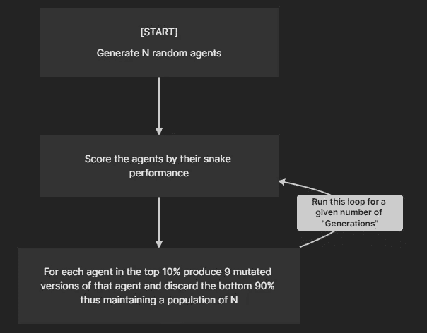
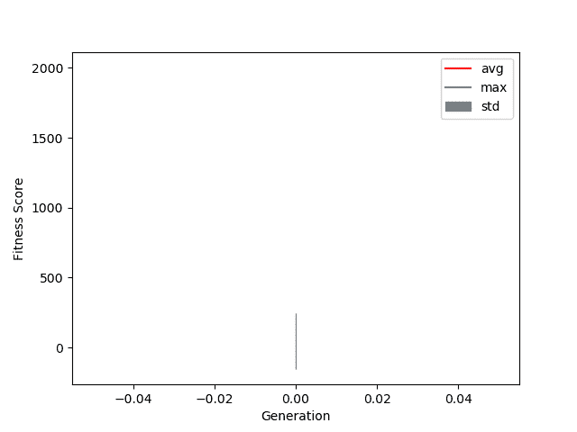
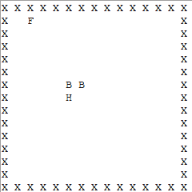
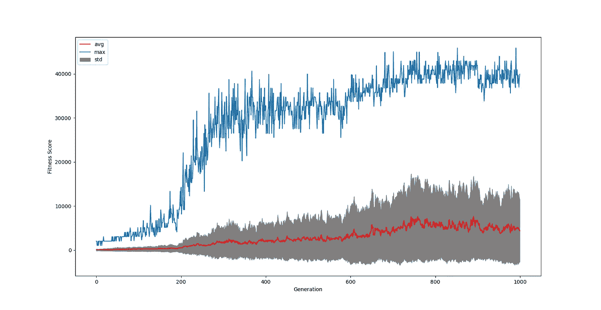

# 我终于用 Python 做了一个学习蛇的神经网络

> 原文：<https://blog.devgenius.io/i-finally-made-a-neural-network-that-learns-snake-in-python-4ba9f3975783?source=collection_archive---------3----------------------->

## 我的背景故事:

当我 15 岁的时候，我偶然在 YouTube 上看到一个视频，有人使用机器学习来训练一个人工智能玩蛇。受此启发，我立即加载了 python，并尝试使用神经网络和遗传算法来学习 snake。最终它失败了，因为它朝着第一个食物的方向跌跌撞撞，然后全心全意地撞向墙壁。

从那以后，每当我回来看这个项目时，它都会难倒我，有些东西就是不太管用。直到今天！

(再补充一点，我是一个对计算机科学没什么背景的业余爱好者。我对这个项目的想法是从头开始构建一切，这样我就可以尽可能多地学习，所以这是我的“hello world”机器学习项目

## 第 1 部分:定义成功

贪吃蛇是一个非常简单的游戏，所以让我们把成功的定义变得简单一些。吃 1 种食物只是运气，吃 2 种食物也可能只是运气，所以让我们一起来吃 10 种食物吧。

## 第二部分:计划



学习算法

正如我们可以从计划中看到的，我们将实现一个非常简单的遗传算法来提高代理。我在下面定义了评分函数:

体能= 1000*(进食次数)+ 1*(移动次数)

这导致食物成为主要的刺激因素，但也促使自我保护成为次要的刺激因素。代理人也将有一个“能量”值，这是他们在筋疲力尽之前可以做的动作数量，这是通过吃食物来补充的。这个“能量”值是至关重要的，否则代理可能会学习无限循环，以最大化他们的健身分数。

## 第 3 部分:代码

该代码由 4 个主要部分组成:

*   游戏引擎
*   神经网络
*   学习算法
*   分析

游戏引擎是整个操作的核心，它必须很快。为了做到这一点，我使用了 BitBoards，这是一种用 4 个整数来表示蛇的环境的方法，这 4 个整数分别代表食物位置、头部位置、身体位置和墙壁位置。这比用数组来表示游戏要快得多，因为我可以使用按位操作符来操作棋盘，而不是每次访问数组时都要搜索它。

为了更好地理解 BitBoards 如何工作，我发现这个链接在象棋环境中非常有用([滑动棋子攻击的有效生成——象棋编程维基](https://www.chessprogramming.org/Efficient_Generation_of_Sliding_Piece_Attacks))。

下面是我的游戏引擎代码。

```
import math
import random#Converting binary number to index location
def index(b):
    return math.log(b)/math.log(2)#Converting index location to binary number
def bini(index):
    return 2 ** index

class Board():
    def __init__(self):
        self.size = 15
        self.full_size = self.size ** 2

        self.walls = 0

        for i in range(self.size):
            self.walls += bini(i)
            self.walls += bini(self.size*(self.size-1)+i)

        for i in range(self.size-2):
            self.walls += bini(self.size + self.size * i)
            self.walls += bini(self.size *2 -1 + self.size * i)

        self.food = 0
        self.head = bini(round(self.full_size / 2)) << self.size
        self.body_list = [(self.head >> self.size*2) , (self.head >> self.size)]

        self.food_points = 0
        self.move_points = 0
        self.energy = 100

        self.end = False

        self.update()

        self.place_food()

    def __str__(self):
        con = '{:'+str(self.full_size)+'b}'
        walls = con.format(self.walls)
        head = con.format(self.head)
        food = con.format(self.food)
        body = con.format(self.body)

        rows = []
        r = ''
        for i in range(self.full_size):
            r += ' '
            if walls[i] == '1':
                r = r + 'X'
            elif head[i] == '1':
                r = r + 'H'
            elif food[i] == '1':
                r = r + 'F'
            elif body[i] == '1':
                r = r + 'B'

            else:
                r = r + ' '

            if (i+1) % self.size == 0:
                rows.append(r[::-1])
                r = ''

        out = '\n'.join(rows)

        return out

    def update(self):
        self.body = sum(self.body_list)

        self.all = self.walls | self.food | self.body | self.head

        if self.head & self.body != 0:
            self.end = True
            #print('GAME OVER')

        if self.head & self.walls != 0:
            self.end = True
            #print('GAME OVER')

        if self.energy < self.move_points:
            self.end = True

    def place_food(self):
        choices = []
        for i in range(self.full_size):
            if bini(i) & self.all == 0:
                choices.append(i)

        loc = random.choice(choices)
        self.food = bini(loc)

    def print(self,var):
        con = '{:'+str(self.full_size)+'b}'
        return con.format(var)

    def push(self,move):
        # 0 - Left
        # 1 - UP
        # 2 - Right
        # 3 - DOWN

        old_head = self.head

        if move == 0:
            self.head = self.head >> 1
        elif move == 1:
            self.head = self.head << self.size
        elif move == 2:
            self.head = self.head << 1
        elif move == 3:
            self.head = self.head >> self.size
        else:
            self.end = True
            print('wtf is this input')

        if self.head & self.food == 0:#if not on a food
            self.body_list.remove(self.body_list[0])
            self.body_list.append(old_head)

        else:
            self.food_points += 1000
            self.energy += 100
            self.body_list.append(old_head)
            self.place_food()

        self.update()
        self.move_points += 1
```

**神经网络**将由 3 层组成，一个输入层(大小 24)，一个隐藏层(大小 8)，和一个输出层(大小 4)。

输入层是蛇从头部获得的“视觉”。它能够在所有 4 个方向和 4 条以上的对角线上看到自己和物体之间的距离。它可以识别 3 种类型的对象，食物、墙壁和它的身体，因此这导致输入层的大小为 24。

输入和隐藏层之间的激活函数是一个整流器函数，这只是一个花哨的词:f(x) = max(0，x)。

隐藏层存在，大小为 8，因为为什么不，我们希望蛇是聪明的，对不对？但也不用花太多时间去思考。(老实说，这是我所有的想法)。

隐藏层和输出层之间的激活函数是 Softmax，它将输出中的值限制在 0-1 之间，所有输出的总和将为 1。这就放弃了代理偏好哪种输出的概率概念。

输出层的大小为 4，因为蛇可以选择 4 个方向移动。

下面是我的神经网络代码，在这种情况下，代理是由类 Brain 定义的。(这很大程度上是受到了 Sentdex 在 youtube 上的精彩教程的启发[https://www.youtube.com/c/sentdex/featured](https://www.youtube.com/c/sentdex/featured)

```
import numpy as npclass Layer_Dense: #hidden layer
    def __init__(self, n_inputs, n_neurons):
        self.weights = 0.1 * np.random.randn(n_inputs, n_neurons)
        self.biases = np.zeros((1, n_neurons))
    def forward(self, inputs):
        self.output = np.dot(inputs, self.weights) + self.biases

class Activation_ReLU:
    def forward(self, inputs):
        self.output = np.maximum(0, inputs)

class Activation_Softmax:
    def forward(self, inputs):

        exp_values = np.exp(inputs - np.max(inputs,axis=1,keepdims=True))
        probabilities = exp_values / np.sum(exp_values, axis=1, keepdims=True)
        self.output = probabilities

class Brain:
    def __init__(self):
        self.lay1 = Layer_Dense(24,8)
        self.act1 = Activation_ReLU()
        self.lay2 = Layer_Dense(8,4)
        self.act2 = Activation_Softmax()
    def forward(self, inputs):

        self.lay1.forward(inputs)
        self.act1.forward(self.lay1.output)

        self.lay2.forward(self.act1.output)
        self.act2.forward(self.lay2.output)

        self.output = self.act2.outputdef get_inputs(state):
    out = np.array([[0,0,0,0,0,0,0,0,
                     0,0,0,0,0,0,0,0,
                     0,0,0,0,0,0,0,0]],dtype = float)

    # d / l / u / r

    head = index(state.head)
    food = index(state.food)

    head_loc = (int(head // state.size),int(head % state.size))
    food_loc = (int(food // state.size),int(food % state.size))

    diff_x = head_loc[0] - food_loc[0]
    diff_y = head_loc[1] - food_loc[1]

    #print(head_loc)
    #print(food_loc)

    ouot = out[0]

    ouot[0] = head_loc[0]
    ouot[1] = head_loc[1]
    ouot[2] = state.size - ouot[0] - 1
    ouot[3] = state.size - ouot[1] - 1

    ouot[4] = (ouot[0] + ouot[1] - 1) / 2
    ouot[5] = (ouot[1] + ouot[2] - 1) / 2
    ouot[6] = (ouot[2] + ouot[3] - 1) / 2
    ouot[7] = (ouot[3] + ouot[0] - 1) / 2

    if head_loc[0] == food_loc[0]:

        if head_loc[1] > food_loc[1]:
            ouot[8] = head_loc[1] - food_loc[1]
        else:
            ouot[9] = food_loc[1] - head_loc[1]

    if head_loc[1] == food_loc[1]:
        if head_loc[0] > food_loc[0]:
            ouot[10] = head_loc[0] - food_loc[0]
        else:
            ouot[11] = food_loc[0] - head_loc[0]

    if diff_x == diff_y:
        if diff_x < 0:
            ouot[12] = abs(diff_x)
        else:
            ouot[13] = abs(diff_x)

    if diff_x == -diff_y:
        if diff_x < 0:
            ouot[14] = abs(diff_x)
        else:
            ouot[15] = abs(diff_x)

    for body in state.body_list:
        b = index(body)
        loc = (int(b // state.size),int(b % state.size))

        diff_x = head_loc[0] - loc[0]
        diff_y = head_loc[1] - loc[1]

        if loc[0] == head_loc[0]:
            if loc[1] > head_loc[1]:
                if ouot[16] == 0:
                    ouot[16] = loc[1] - head_loc[1]
                else:
                    ouot[16] = min(ouot[16],loc[1] - head_loc[1])

            else:
                if ouot[17] == 0:
                    ouot[17] = head_loc[1] - loc[1]
                else:
                    ouot[17] = min(ouot[17],head_loc[1] - loc[1])

        if loc[1] == head_loc[1]:
            if loc[0] > head_loc[0]:
                if ouot[18] == 0:
                    ouot[18] = loc[0] - head_loc[0]
                else:
                    ouot[18] = min(ouot[18],loc[0] - head_loc[0])

            else:
                if ouot[19] == 0:
                    ouot[19] = head_loc[0] - loc[0]
                else:
                    ouot[19] = min(ouot[19],head_loc[0] - loc[0])

        if diff_x == diff_y:
            if diff_x < 0:
                if ouot[20] == 0:
                    ouot[20] = abs(diff_x)
                else:
                    ouot[20] = min(ouot[20],abs(diff_x))
            else:
                if ouot[21] == 0:
                    ouot[21] = abs(diff_x)
                else:
                    ouot[21] = min(ouot[20],abs(diff_x))

        if diff_x == -diff_y:
            if diff_x < 0:
                if ouot[22] == 0:
                    ouot[22] = abs(diff_x)
                else:
                    ouot[22] = min(ouot[22],abs(diff_x))
            else:
                if ouot[23] == 0:
                    ouot[23] = abs(diff_x)
                else:
                    ouot[23] = min(ouot[23],abs(diff_x))

    for i in range(len(ouot)):
        if ouot[i] != 0:
            ouot[i] = (state.size - ouot[i] - 1) / (state.size - 2)

    return out
```

**学习算法**基于第 2 部分描述的简单进化算法。每一代的前 10%的病原体传递到下一代，并与每种病原体的其他 9 种变异版本包含在一起。变异是通过向每个代理的权重和偏差添加小的随机值而发生的(由下面的 multi_mutate 函数定义)。

通过让每一代的最佳表现者延续到下一代，使我们不会因为不幸的突变而失去进步。

下面是这个学习算法的代码。

```
def multi_mutate(brains, x): #keeps the brains and makes x many children asexually
    out = brains

    for i in range(len(brains)):
        brain = brains[i]
        for i in range(x):
            new_brain = deepcopy(brain)

            new_brain.lay1.weights += np.random.randn(24, 8) * np.random.randn(24, 8)
            new_brain.lay1.biases += 0.01 * np.random.randn(1,8)
            new_brain.lay2.weights += np.random.randn(8, 4) * np.random.randn(8, 4)
            new_brain.lay2.biases += 0.01 * np.random.randn(1,4)

            out.append(new_brain)

    return out

def learn(networks,gens):

    top_brains = int(networks/10) #top 10% stay alive in each gen
    trial_brains = [Brain() for i in range(networks)]
    output = []

    for i in range(gens):
        scores = []

        for brain in trial_brains: 
            score = test(brain) #score each brain
            scores.append(score)

        print('Gen :',i)
        print('Best Score :',max(scores))
        print('Avg Score :',sum(scores) / len(scores))

        max_index = scores.index(max(scores))
        best_brain = trial_brains[max_index]

        output.append([scores,best_brain])

        scores_copy = scores.copy()
        multi_best_brains = [] #list for best brains
        for x in range(top_brains): #picks out top 10% brains
                multi_best_brains.append(trial_brains[ scores_copy.index(max(scores_copy))])

            scores_copy.remove(max(scores_copy))

        trial_brains = multi_mutate(multi_best_brains, 9) #mutate

        plot_data(output)

    return output
```

**分析**功能让我们可以跟踪进度。您可能已经注意到 plot_data 函数，它绘制了每一代的最大适应度、平均适应度和标准偏差的图形。



健康与世代的进度图

我们还有一个函数来显示代理的动作，这是一个简单的窗口，使用 Tkinter 来显示正在玩的贪吃蛇游戏。



简单的图形用户界面

```
import matplotlib.pyplot as pltdef plot_data(data):
    plt.clf()

    data = [d[0] for d in data]

    avg = [sum(d)/len(d) for d in data]
    maxx = [max(d) for d in data]
    std = [np.std(d) for d in data]

    low_var = [avg[i] - std[i] for i in range(len(avg))]
    high_var = [avg[i] + std[i] for i in range(len(avg))]

    #print(low_var)

    plt.plot(avg,'r',label = 'avg')
    plt.plot(maxx,label = 'max')
    plt.fill_between(range(len(avg)),low_var,high_var)

    plt.legend()

    plt.show(block=False)
    plt.pause(0.1)def display(brain):

    state = Board()
    root = tk.Tk()
    while state.end == False:
        try:
            T.destroy()
        except:
            pass

        show = state.__str__()

        T = tk.Text(root)
        T.insert(tk.END,show)
        T.pack()

        inputs = get_inputs(state)
        brain.forward(inputs)
        brain_out = brain.output
        foo = 0

        for i in range(4):
            prob = brain_out[0][i]
            if prob > foo:
                foo = prob
                move = i

        state.push(move)
        root.update()
    points = state.food_points + state.move_points
    return points
```

## 第 4 部分:总结+结果

所以我设置学习函数运行 1000 代，群体大小 N = 1000。这花了大约一个半小时运行，这是结果！



这些结果给我留下了非常深刻的印象，正如你所看到的，接近第 1000 代的最好的代理达到了超过 40，000 的分数。这意味着他们吃了 40 多种食物，远远超过了我 10 种食物的目标。

有趣的是，你可以看到大约从第 0-400 代开始，最大适应度的大致形状类似于一个 sigmoid 函数。这在直觉上是有意义的，因为最好的特工开始掌握避开墙壁、走向食物和不背叛自己的概念。

从大约第 400-600 代开始，除了种群的平均健康水平稳步提高之外，似乎没有什么进步。然而，由于突变的性质，这个值似乎将一直保持较低，并且具有较高的方差。

从大约第 600 个标记到最后，从 30k 到 40k 有一个小的跳跃，我认为代理在定位和移动食物方面变得更加有效。

下面是第 1000 代最佳特工的动画。


第 1000 代最佳代理的演示

我们可以看到，代理人很好地掌握了避免墙壁，但坚持接近他们，我认为这是一个非常像人类的策略。它也能高效地走向食物。

我认为它最后的失败是因为它可以看到自己的身体，而沿着底部的墙，这种输入改变了输出，以避免避开蛇下面的墙。

这可能是代理人最大的改进领域，这将是正确理解有关其身体的视觉的最后 8 个输入。然而，我认为代理人应该没有学到这一点，因为与食物和墙壁相比，他们看到自己身体的机会要少得多。

## 第五部分:展望未来

显然，我可以对更多代或更大的人口规模运行学习算法，看看它们会产生什么结果。我认为其他一些改变可能会提高算法的准确性。

一个变化可以是让适应度函数是多次运行的平均值，因为在随机位置产卵的食物可能会淘汰好的代理，或者如果运气好的话，会包括坏的代理。

上述问题的另一个解决方案是为每一代设置一个随机种子，这样所有的代理在每一代都玩完全相同的贪吃蛇游戏。

另一个变化可能是减少消耗食物的“能量”。考虑到 13x13 的游戏区域，每种食物移动 100 次似乎已经足够了。将它减少到 50 可能会缩短模拟时间，从而允许我们在相同的时间框架内运行更多的模拟。

我们也可以调整神经网络的结构，也许有另一个隐藏层或改变现有隐藏层的大小。然而，如果我真的尝试了，那很可能是通过反复试验，因为我对这个话题还没有足够好的理解。

***非常感谢你坚持到我的文章结束！如果你有任何反馈，我很想听听。***