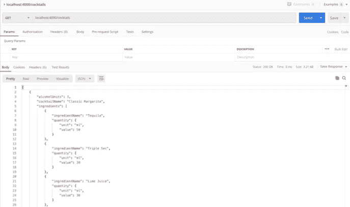
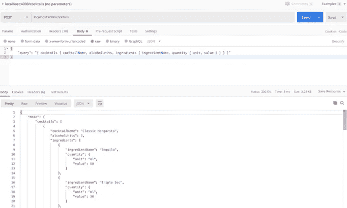
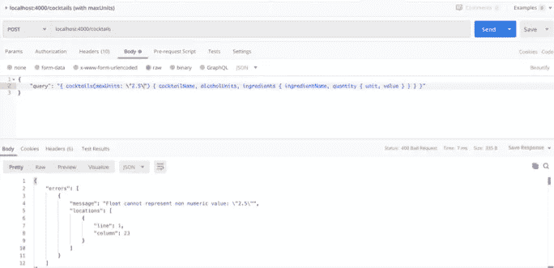

# 我喜欢休息，但是这样结束好吗？

> 原文：<https://blog.devgenius.io/i-love-to-rest-but-is-all-well-that-ends-graphql-e0fd84a476b8?source=collection_archive---------1----------------------->


美国宇航局在 [Unsplash](https://unsplash.com?utm_source=medium&utm_medium=referral) 拍摄的照片

很抱歉这个标题…

所以，在过去的一年里，我听说了很多关于 [GraphQL](https://graphql.org) 的事情——毫无疑问，你也听说过！由于还有时间，我决定尝试一个简单的数据获取和过滤用例。作为一个只开发过 REST API 的人，我想知道 GraphQL 是否能取代 REST，或者更有可能在某些情况下更合适。

在我的整个开发生涯中，REST 一直是我对最佳实践 API 设计的理解，对我来说，它支持一个精简的[微服务](https://martinfowler.com/articles/microservices.html)架构、简单的调试和一定程度的自我文档化。我已经习惯了在 [Postman](https://www.postman.com/) 中启动我的 REST 端点，并且看到:

HTTP 动词:请求的类型告诉我一些关于我正在采取的动作的信息。GET 将返回一些数据给我。一个帖子最像是创建或扩展一个资源。PUT 将更新现有记录。删除将移除资源。

路由参数和/或查询字符串参数:这些参数有助于指定要访问的资源。例如，GET 请求可能会指定一个搜索过滤器，以便返回一组更小、更相关的记录。删除请求通常通过唯一属性(如 ID)指定要删除的一条或多条记录。

相比之下，GraphQL 通过单个端点公开数据。动作的类型不是由 HTTP 动词指示的，而是由声明查询(GET-like)和突变(Update/Delete like)指示的。

我立刻喜欢上了这样一个事实:GraphQL 比 API 版本控制更支持可扩展性和向后兼容性。我还对其查询方法的性能优势感兴趣。GraphQL 解决了许多前端开发人员遇到的一个问题，在这个问题中，当我们只需要使用那些属性中的一小部分时，我们最终会消耗来自后端服务的一长串属性。除了不必要的网络负载之外，这通常意味着在我们开始构建 UI 之前，我们必须花费开发人员的时间来编写代码，以将数据转换为我们想要的结构。如果前端开发人员和 API 开发人员不能紧密合作，过时的文档可能意味着前端开发人员期望的结构([合同](https://apievangelist.com/2019/07/15/what-is-an-api-contract))可能不正确。

为了防止这种情况发生，GraphQL 要求 API 开发者执行一个[模式](https://graphql.org/learn/schema)，这意味着前端开发者/ API 消费者可以对这个契约更有信心。消费者在发出请求时指定他们想要的属性，而不是获取数据然后转换它。除了确保不检索无关的属性之外，这还使得新属性的添加成为更新查询以要求新属性的简单情况。

最终，这些都是设计良好的 REST API 可以实现的优势。也就是说，[人们不需要一个现代的 JavaScript 框架来编写一个单页应用程序](https://medium.com/better-programming/js-vanilla-script-spa-1b29b43ea475)，但是我们很多人都喜欢这种框架提供的结构和特性。如果我们知道我们可能会使用其中的许多功能，那么使用框架比花费我们的时间(以及我们的客户或雇主的钱)更好！)“重新发明轮子”。与此同时，如果只需要一个有吸引力的、可访问的静态网页，那么在现代框架中编写单页应用程序就没有任何价值。

考虑到这一点，在一个简单、有限的用例中尝试 GraphQL 似乎是明智的。我创建了两个版本的基本服务，返回关于鸡尾酒及其配料的有限信息，一个使用 REST，一个使用 GraphQL。因为这是一个基本的用例，所以这些服务只探索静态数据集上的 GET 请求和 GraphQL 查询。因此，我的“发现”纯粹是轶事，并且只是理解这些工具在不同情况下可能提供的优势的第一步。



REST API



GraphQL API

基于 Postman 的一些非常有限的测试，我的 REST API 显示平均响应速度稍快。这很可能是因为我的 REST API 提供的功能比 GraphQL 工具少得多。我还觉得我的数据集太小，无法真正利用 GraphQL 的性能优势。最后，即使将数据存储在静态文件中并在本地提供服务，响应时间也会有一些波动，这可能是造成最小差异的原因。

让我开始真正重视 GraphQL 的查询方法的是，当我决定停止返回“alcoholUnits”属性时，我试图比较这两种 API。在 GraphQL API 的例子中，这是修改我的查询的简单例子，所以:

```
“query”: “{ cocktails(ingredient: \”tequila\”) { cocktailName, alcoholUnits, ingredients { ingredientName, quantity { unit, value } } } }”
```

简单地变成了:

```
“query”: “{ cocktails(ingredient: \”tequila\”) { cocktailName, ingredients { ingredientName, quantity { unit, value } } } }”
```

使用 GraphQL 获得开箱即用的类型验证也很棒:



我试图在我的 REST API 中提供类似的功能，这里:[https://github.com/cloud-quinn/cocktails-api-rest/pull/1](https://github.com/cloud-quinn/cocktails-api-rest/pull/1)

如您所见，我编写了一个新函数，根据定义的模式来净化数据。虽然没花太多时间，但它的功能远不如我用 GraphQL 时的功能。例如，模式不能在客户端定义，我没有考虑嵌套属性(我的数据集包含这些属性)。这是 GraphQL 相对于 REST 的一个显著优势，特别是对于 API 开发人员和使用这些 API 的开发人员没有紧密合作的分布式团队。

也就是说，我喜欢我的 REST API 似乎有助于独立的、更小的函数，这些函数本质上是可重用的，并且绑定到描述性端点，这些端点简洁地记录了它们的参数和行为。在使用单个端点的情况下，我发现在我的 GraphQL 实现中很难避免一个更大、更复杂、包含大量条件的函数，即使我的用例很简单。

总而言之，我的 REST API 在最短的时间内完成并运行，我保留了对其行为和结构的完全控制权——但是处理数据转换可能需要几天(如果不是几周)的工作。对我个人来说，GraphQL 方法感觉更沉重，更固执己见，需要更多的配置和预先考虑；但是它从一开始就有很大的力量。

这表明 GraphQL 将继续流行，特别是在企业开发中，许多不同的开发人员将参与其中，需求将快速变化，并且可能有大量的消费者以不同的方式使用该 API。对我来说，感觉很不愉快[SOAP](https://www.w3schools.com/xml/xml_soap.asp)——就像必须通过查询对象在我的请求中指定响应结构，并且奇怪地想到需要一个前端发布来访问一个已经使用的端点上的新属性。但是，在我参与的许多项目中，我可以看到忽略有时大量不相关数据的能力是如何压倒这种微小的不便的。

我也不认为休息会去任何地方。开发人员总是为不同的工作使用一系列的工具，我相信这将继续下去。提供 REST 端点来公开处理后端查询的不同数据需求的微服务仍然是一种有效的方法，特别是在 API 主要由一小组内部开发人员使用，并且有理由希望完全控制 API 响应的结构的情况下——或者返回的数据过于简单，不足以保证 GraphQL 的设置成本。

我承认[我对我在开发社区的一些同事宣布一项有用的技术死亡的速度和喜悦有点怀疑。同时，我确实认为质疑一个工具是否真的会提升你的项目，或者只是安抚一种“落后于时代”的恐惧是明智的。当决定是否在你的下一个项目中使用 GraphQL 时，我建议首先考虑你的项目的性质，以及它与 GraphQL 的目标的关系。无论如何，如果您通常在团队中为企业软件编写代码，我觉得现在熟悉 GraphQL 是明智的，因为它的优势似乎最适用于这些情况。](https://blog.bashcorp.co.uk/post/170755458271/fieldguidezubthemagpie)

请随时查看我在 GitHub 上的概念证明:

https://github.com/cloud-quinn/cocktails-api-graphql

休息:[https://github.com/cloud-quinn/cocktails-api-rest](https://github.com/cloud-quinn/cocktails-api-rest)