# 我做了一个不和谐机器人！

> 原文：<https://blog.devgenius.io/i-made-a-discord-bot-9b8a69e8432b?source=collection_archive---------2----------------------->

凯文·卡纳斯在 [Unsplash](https://unsplash.com?utm_source=medium&utm_medium=referral) 上的照片

如果你还不了解我，我倾向于探索其他框架和语言来学习，这样我就可以接触到不同的语法。在对 Java 有了基本的了解之后，我终于一头扎进了 Python。我没有停止学习 Java，事实上我还没有完全看完我用来学习的教科书。但那是另一个帖子的内容！

取决于一周中的哪一天，在我完成所有的任务和待办事项(项目、算法等)后，我会通过观看直播来放松。我最近开始关注的一个新的 VTuber 到目前为止相当成功:吸引了社区，增加了关注者，等等。我会加入聊天，并随意地与社区的其他人讨论正在传输的内容。这一切都很有趣，直到有人提到他们的 Discord 服务器机器人没有响应。我真的很好奇，并决定自愿帮助解决 Discord 服务器的 bot 或 webhook 问题。

原来，当一个流开始时，抽动通知并没有立即更新。自然而然地，我知道这肯定是一个 webhook 问题。我继续向服务器管理员提供使用什么工具的建议，以便可以更新通知服务器中的每个人。在此之后，我还自愿制作了一个个人不和机器人。

我知道怎么做吗？*没有*！一点也不。

我对自己说，我可以只使用我熟悉的语言来制作机器人，但我想拓宽我的视野，选择一些新的东西。所以，我选择了 Python！我安装了制作 Discord 服务器机器人所需的必要的 pip 包，并从必要的执行资源中学习。

我开始阅读我能找到的关于 Python 的资料，发现基于单词的语法与 Ruby 相似。在 Flatiron 学校学习了 Ruby 之后，学习 Python 变得容易多了。

# Ruby vs Python

如果你像我一样，第一次接触 Ruby，但对钻研 Python 很感兴趣，这里有一些关键的区别:

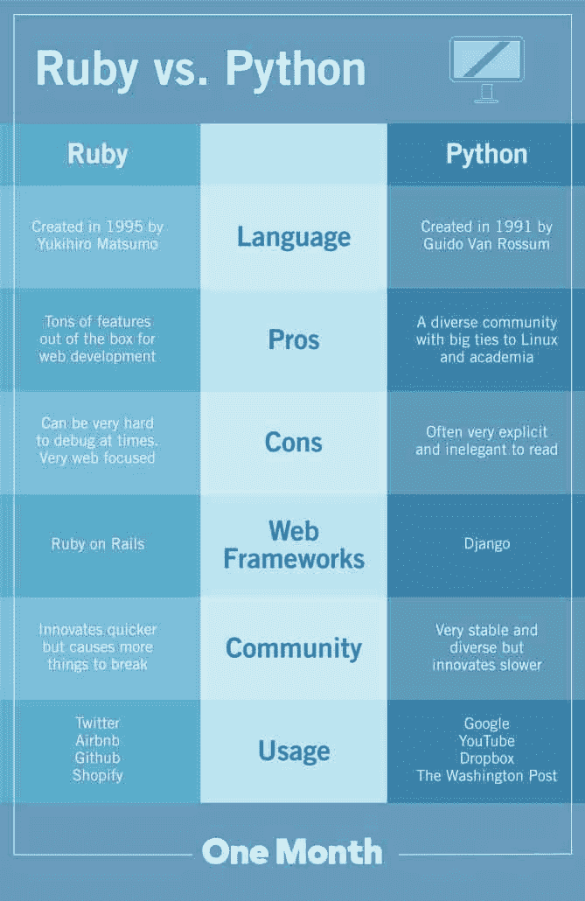

对比图&好的阅读来源:[https://learn.onemonth.com/ruby-vs-python/](https://learn.onemonth.com/ruby-vs-python/)

# 不和谐服务器机器人

我实际上遵循了一个过程来创建这个在 Python 中运行的特定的 Discord 服务器 bot。花了大约一个小时完成，但它确实教会了我 Python 的能力。我会在这篇文章的最后链接所有的资源和教程。

## 1.让您的帐户能够访问 Discord 开发者门户网站。

从那里你可以开始命名你的新服务器机器人，并给它一个简介图片！您将勾选几个复选框，使其像任何基于消息的机器人一样工作。

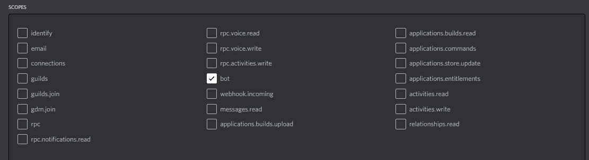

领域

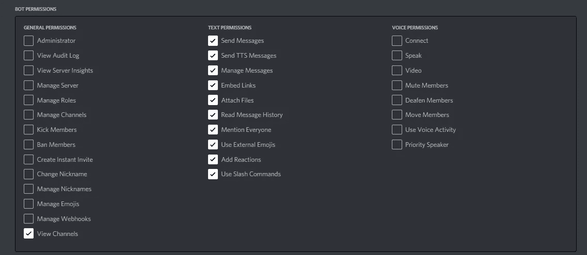

许可

它将根据您输入的权限和范围生成一个 OAUTH 链接，供您复制粘贴到浏览器中。一旦你完成了，它可以被用来添加到你运行的服务器上。

一旦被邀请，它将在那里，但它是离线的。

## 2.为您的环境下载必要的 Python 和 pip

需要注意的重要一点是 discord.py(如果您已经安装了 Python)，它包含了能够创建和移植到任何 discord 服务器的必要库。根据您使用的是 Ubuntu OS 还是 WSL 2，在第一次安装 Python 包时，可能需要输入特定的条目。一旦这些都完成了，就该编码了！

## 3.Python 开发

当我开始时，我通过发出“/”命令使它变得简单，如果被触发，它将有多个响应。由于它是专门为 VTuber 社区创建的，大多数人投票将其命名为 LiliBot。她模仿真实的 Lilia Agares 的角色，并有准确的按键反应。

这段代码实现了以下功能:

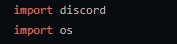

导入您的库！

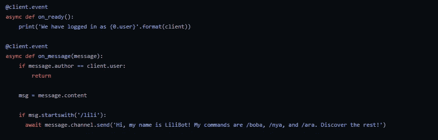

我们将导入 Discord 库，并在客户机实例和 Discord 之间建立连接。客户端事件是异步的，因此在这种情况下，每次用户输入“/lili”时，LiliBot 都会做出如下响应:

剩下的是什么？

我已经将变量 **msg** 设置为“message.content ”,这样我们可以缩短代码并创建额外的命令。接下来，我创建了一个字符串数组。

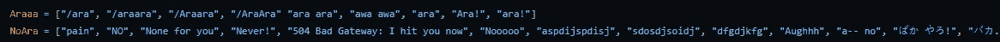

再一次，以同样的相似和粗鲁的方式。(现在用日语！)

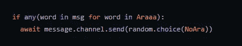

因此，对于用户在聊天中发送的 **Araaa** 数组中的任何字符串，Lilibot 将在 **NoAra** 下以任何顺序响应以下内容。

## 4.让它全天候运行吧

我们将使用两个库:Flask 和 Thread。

Flask 是一个用于 Python web 应用程序的微型 web 框架。当开始学习使用 Python 进行 web 开发时，这是很好的。Python 中的[线程](https://pymotw.com/2/threading/)库的“线程”允许您的 web 应用程序同时运行多个操作。

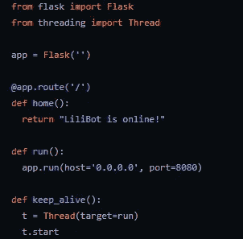

保持它运行的代码片段！

我们的 Flask 应用程序的主路径将位于('/')，一旦 Flask 成功运行，web 应用程序将返回字符串“LiliBot 在线！”。每当 web.py 应用程序运行时，它将在主机 0.0.0.0 上运行。这意味着它可以在任何可能的 IP 地址上运行，并使用 Flask 的 8080 端口。

keep_alive()将在 web-app 运行时启动，然后启动应用程序。我们将把这个函数导入 LiliBot 文件，如下所示:

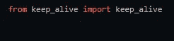

导入到您的 bot 文件。

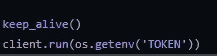

并在最后添加它来运行 web 应用程序。

最后，我们将使用 UptimeRobot 来保持机器人全天候运行。它每次都会 ping Flask 应用程序，以保持其正常运行。使用 Flask 初始化的网址添加为新显示器。

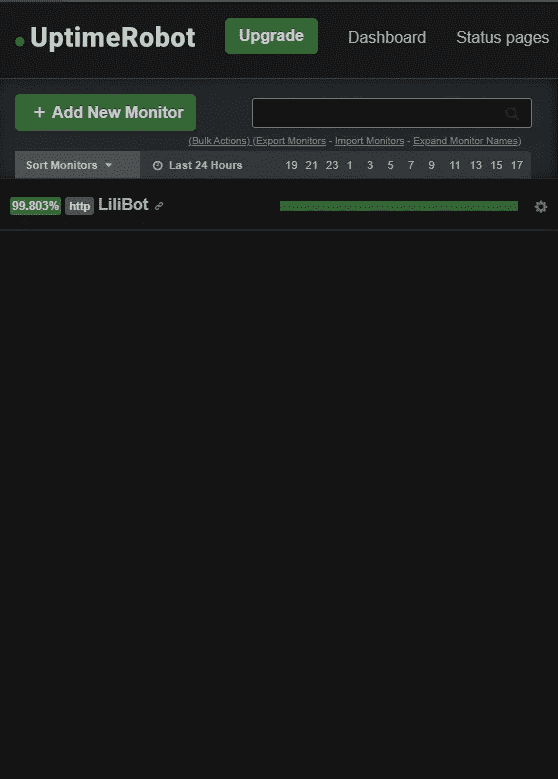

添加新显示器，输入您的网络应用地址，然后开始！

一旦完成，你可以在你自己的 Discord 服务器上测试这个机器人，当准备好了，你可以和你的朋友分享你的机器人！以下是 VTuber 社区自推出以来的情况:

这样一个健康的社区。

这是一个有趣的项目。用这个项目深入 Python 很有趣！社区参与度很高，他们真的很喜欢服务器上这个时髦的新机器人。我一直在根据社区的反馈提出要执行的其他命令，并且每次都在添加。如果您决定自己创建一个，我保证它不会很难，并且可以作为学习 Python 的第一步。

查看我完成的代码和下面的其他整洁的链接！

*Github-repo*:【https://github.com/Ro5hi/liliabot】T2Demo:[https://discord.gg/AFQJHFjJk4](https://discord.gg/AFQJHFjJk4)

____________________________________________________

# Lilia Agares 的社会联系

*   [抽动通道](https://twitch.tv/deepsealily)
*   [推特](https://twitter.com/LiliaAgares)

____________________________________________________

# 我的社交联系

*   [领英](https://www.linkedin.com/in/shirlend)
*   [GitHub](https://www.github.com/Ro5hi)
*   [推特](https://www.twitter.com/len_deta)
*   [Instagram](https://www.instagram.com/_sceptral_)
*   [YouTube](https://www.youtube.com/channel/UC_0nik4oj1T1Q160XVr0ZlA?view_as=subscriber)

____________________________________________________

# 资源和链接

*   [不和谐文档](https://discord.com/developers/docs/intro)
*   [Discord.py](https://discordpy.readthedocs.io/en/stable/)
*   [用 Python 线程化](https://pymotw.com/2/threading/)
*   [烧瓶](https://flask.palletsprojects.com/en/1.1.x/)
*   [主机 0.0.0.0](https://www.howtogeek.com/225487/what-is-the-difference-between-127.0.0.1-and-0.0.0.0/)
*   [Ruby vs Python](https://learn.onemonth.com/ruby-vs-python/)
*   [上涨机器人](http://uptimerobot.com/)
*   [FreeCodeCamp 指南](https://www.youtube.com/watch?v=SPTfmiYiuok)