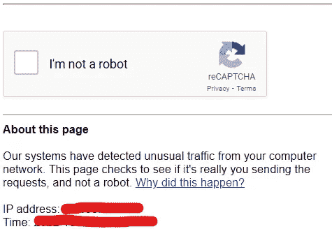

# 我犯了一个菜鸟错误，所以谷歌屏蔽了我。不要做同样的事情！

> 原文：<https://blog.devgenius.io/i-made-a-rookie-mistake-so-google-blocked-me-dont-do-the-same-63059ac67500?source=collection_archive---------10----------------------->

我认为网页抓取非常简单。我没有看到它的到来…

[照片 de Polina Zimmerman](https://www.pexels.com/fr-fr/photo/personne-femme-detente-smartphone-3958892/)

哇哦。我无法想象谷歌会屏蔽我。

不过，我不能说我不配。

**事情是这样的。**

今天我决定用我的编程技能来帮助我对我写的东西有更多的见解。所以我创建了一个算法来浏览谷歌的搜索结果，看看我的文章排名如何。

在那之前，我会经常在搜索引擎中输入我的故事的标题，看看我是否能轻易地找到它们。但是在某些时候，我觉得很懒，想自动完成这项任务。你知道，当你开始写十几篇文章时，你不会想自己一个人看完每一篇。

作为一个 Python 爱好者，以及过去做过一些 web 抓取的人，我知道我可以很容易地找到实现我的目标 ***的方法。*** 于是我一头扎进了这个小项目。

# **制作算法？到目前为止一切顺利。**

如果你知道一点网络营销，那么我想你知道什么是搜索引擎优化，为什么它很重要。否则，SEO 代表搜索引擎优化，处理网页在搜索引擎结果上的排名。

人们关心 SEO 是因为，当你拥有一个网站时，你希望人们能容易地找到它。换句话说，每当人们进行互联网搜索时，你希望它第一个出现在搜索结果页面上。

**我的目标—** 在这里，我的目的只是在搜索标题时确定我的文章的页面排名。

但是，你知道，有时你要找的网页不会出现在第一个结果页面上。因此，您必须转到下一个结果页面，依此类推。

我写的算法能够考虑到这些方面。然而，我从来不知道一个给定的请求会有多少个搜索结果页面。因此，为了避免每次使用时浏览成千上万的页面，我对算法浏览的结果数量进行了限制。

通常，如果在浏览了 1000 个搜索结果后，算法没有找到我的文章，那么我就停止执行。

一旦我把这些元素放在一起，我的算法就可以上网冲浪了。

而且成功了！我运行了几次我的代码来改进一些功能，一切都很顺利。

直到…

# 谷歌认为我是一个机器人。

我知道，这对你来说听起来很明显。

当我让我的算法浏览了几次互联网，很快就发出了数百个请求时，谷歌怀疑我是一个机器人。

**我是怎么注意到的？嗯，只是因为我的算法不再工作了。相反，它会输出这样的东西**

> “我们的系统检测到来自您的计算机网络的异常流量。这个页面会检查发送请求的是否真的是你，而不是机器人。”

我自己打开了我的网络浏览器，这次不是通过我的网页抓取器，来检查我是否还能在网上搜索。

我得到的是一个空白的页面，下面有一条信息。

一看到这个，我就觉得自己像个菜鸟。

我知道这可能会发生。但是，由于我以前从未在任何项目中遇到过这个问题，我觉得没有必要阻止这种情况发生。

现在，在我的生命中，我第一次成为了试图通过验证码的机器人。

# 我不会放弃的。

被谷歌封杀，我想通了应该用更道德的方式刮。

实际上有几种方法可以避免被认为是机器人。

我决定实现的一个方法是用随机的持续时间来间隔我的请求。

这里有两个原因可以解释为什么这是一个很好的网络抓取方法，并且不会被检测为机器人:

*   该算法将花费更多时间来发送请求，因此其行为变得更类似于正常人的行为。
*   使用两个请求之间的随机持续时间，搜索引擎将更难检测到搜索是机械完成的。

此外，这样做更合乎道德，因为这样做，我不会过度使用谷歌的资源。

这几乎就像是我自己在浏览搜索结果，只不过我可以在电脑为我浏览互联网的同时做些别的事情。

# 结论

谢天谢地，过了一段时间，一切又恢复正常了。现在我可以继续我的项目了。

**吸取的教训:我在做网页抓取时会更负责任。**

—

# 你想知道更多关于网页抓取的信息吗？

*   **在 Python 中超级容易上手**🐍

 [## 如何用一个简单的 Python 函数进行 Web 抓取

### 5 行代码，互联网就是你的了。

blog.devgenius.io](/how-to-do-web-scraping-with-a-simple-python-function-f20ac6473543) 

*   **看看你能做什么**📕

 [## 我在网上搜集了一本字典

### 做了自己的数据集用于数据分析。

medium.com](https://medium.com/mlearning-ai/i-scraped-an-online-dictionary-37577876eab5) 

**感谢** **的阅读！**
如果你喜欢这个故事，请随意**评论，**👏**或者关注我**！

 [## 通过我的推荐链接加入 Medium-Jean Meunier-Pion

### 阅读 Jean Meunier-Pion 的每一个故事(以及媒体上成千上万的其他作家)。您的会员费直接…

medium.com](https://medium.com/@jmpion/membership)