# 我和佐拉一起做了我的网站——但是你应该做吗？

> 原文：<https://blog.devgenius.io/i-made-my-website-with-zola-but-should-you-bb723fc26e45?source=collection_archive---------6----------------------->

## 带有静态站点生成器的个人网站

## 这里有一些建立个人网站的工具。

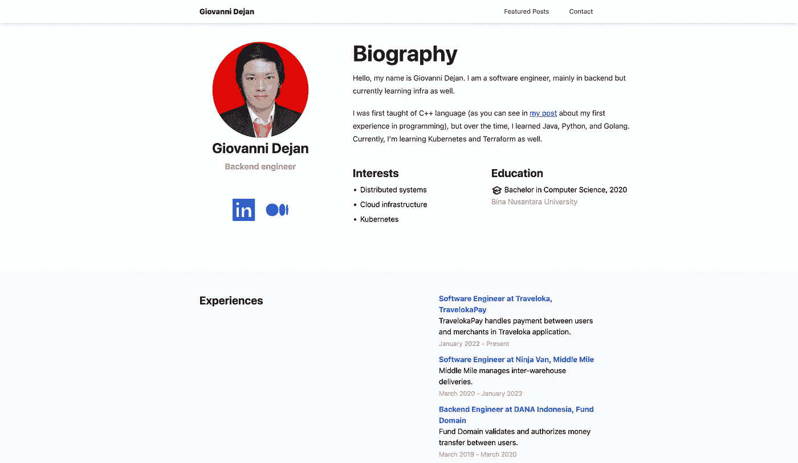

我的个人网站。下面的链接。

所以我最近开通了我的个人网站，你可以在[https://iamdejan.my.id/](https://iamdejan.my.id/)查看。这是一次有趣的经历，尽管有些事情可以改进。

在这篇文章中，我将根据我的经验和研究告诉你，当我们想创建自己的网站时，可以根据具体情况使用哪些工具。

# 云网站平台

Wix 广告。

如果你不是程序员，或者如果你没有时间编码，试着从托管平台创建一个网站，尤其是带有[所见即所得](https://en.wikipedia.org/wiki/WYSIWYG)编辑器的平台，比如 Wordpress 或 Wix。为什么？因为，有了这些平台，创建一个网站很容易，有内置的编辑器和现成的模板。

不利的一面很可能是成本。在 Wordpress 中，有些主题不是免费的。在 Wix 中，有一些限制，包括关于[自定义域](https://support.wix.com/en/article/connecting-your-own-domain-name)和[带宽](https://support.wix.com/en/article/free-vs-premium-site)的限制。自定义域*对于专业使用是[有用的，因为人们(尤其是招聘人员)会把你看成一个专业的人。](https://twitter.com/traversymedia/status/1507343606016880642)

*我们稍后将简要介绍自定义域以及如何连接到服务器。

# 静态站点发电机

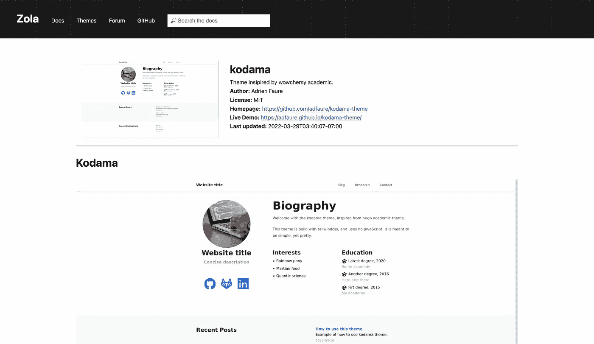

儿玉主题主页。链接:[https://www.getzola.org/themes/kodama-theme/](https://www.getzola.org/themes/kodama-theme/)

我选择了这个类别。为什么？因为我有一些时间编码，但是我不想花太多时间。我认为静态站点生成器是创建一个“足够好”的网站和不浪费太多时间之间的最佳折衷。如果你不知道的话，静态站点生成器是一个程序，它获取一个或多个配置文件**，并将其转换成或生成一个网站。由于内容是静态的，这意味着我们可以直接通过 FTP 或其他方法将生成的 HTML、CSS 和 JavaScript 文件上传到服务器。

大多数静态站点生成器使用主题。至少有两个问题。第一，如果你想定制网站，那么根据主题的设计，主题可能不容易修改。第二个问题是，既然是模板，如果你不定制，就会有其他看起来和你差不多的网站。然而，如果布局的独特性不是你主要关心的，我认为这应该没问题。

*特别是因为我不是前端开发人员，制作网站不是我的专业领域。

**大多数静态站点生成器允许我们通过 markdown 文件(不仅仅是配置文件)创建博客。随后，SSG 将把降价文件转换成博客文章。

## 我的经历

在创建我的网站时，我查找了一些 SSG。其实有几个比较流行的 SSG，比如 [Jekyll](https://jekyllrb.com/) (用 Ruby 做的)和 [Hugo](https://gohugo.io/) (用 go 语言做的)。

对于哲基尔，我真的没有找到我想要的主题。我一直在寻找，但没有一个能真正打动我。

对于 Hugo，实际上我已经挑选了一些候选主题，可能适合我对网站的“愿景”。我把它做了书签，然后就把它丢了。

有一天，我通过[找到了佐拉，我们是游戏了吗？](https://arewegameyet.rs/)网站。我以前从未听说过佐拉。但是在网站上看，它看起来很干净*，我想我会查找它。在网站上搜索主题时，我发现了[儿玉](https://www.getzola.org/themes/kodama-theme/)主题。“我想我想要这个主题”，我对自己说。

所以我试着跟着向导走。CSS 实际上使用了 [Tailwind CSS](https://tailwindcss.com/) ，所以我必须在构建静态站点之前编译 CSS。然后，我试着通过添加图标**来定制它。但是，我很困惑。**这就是问题**。在我尝试建造它之前，我应该先学习左拉的基础知识。原创主题只有博文(是内部博文，不能链接外部博客提供者)和出版物(是研究人员的，不是我的)。尽管我喜欢儿玉，但儿玉首先是为研究人员设计的。我最终[编辑了主题](https://github.com/iamdejan/portfolio-website/blame/main/themes/kodama-theme/templates/macros/icons.html#L23-L26)中的宏文件，只是为了添加电报和介质标识。成功了。

然后，我试着把我在外部博客平台(Medium 和 LinkedIn)上的帖子链接到网站上。由于我以前从未用过佐拉，**我又糊涂了**。显然，我意识到我需要创建一个部分(有一个期望的标题)，然后我修改主题以使用额外变量****中提供的链接。

在修改主题以将特色帖子链接到外部平台并添加了`Experiences`子部分后，我继续将其部署到 [Cloudflare 页面](https://pages.cloudflare.com/)* * * * * *。部署成功，但随后**出了点问题**。HTML 找不到 CSS 文件，导致显示中断。原来`[config.toml](https://github.com/iamdejan/portfolio-website/blob/main/config.toml#L1)` [文件中的`base_url`是用来“下载”CSS](https://github.com/iamdejan/portfolio-website/blob/main/config.toml#L1) 的。我不知道他们为什么不用相对路径，但事实就是如此。

解决问题后，现在我的网站已经开通了。最大的收获是**我需要学习 SSG 和主题是如何工作的**。这可以让我少受些挫折。

*我想我是因为主题而上钩的，这可能是第一个问题。

**在写这篇文章时，我意识到有一个添加图标的指南，那就是修改主题中的宏文件，就像我做的那样。

***雨果的教程比左拉多，因为它更受欢迎。

**** `extra`数据是 Zola 的一个特性，我们可以向主题发送额外的数据(主题和 Zola 使用的数据除外)。这些`extra`数据然后可以被 [Jinja 模板](https://jinja.palletsprojects.com/)读取，然后我们可以使用它作为显示文本或链接。

*****我将在帖子的最后解释 Cloudflare 页面。

# 前端框架

Fireship 比较了 10 种不同的全栈框架。

如果你有很多时间，或者你擅长前端开发，或者你想学前端，最好用前端框架。有了前端框架，你可以定制你想要的一切，从布局，内容，甚至动画。

当然，主要的缺点是你需要能够用框架使用的语言编程。然后，由于你使用的是 framework，这将花费更多的时间，因为你必须自己设置布局(包括处理网站的响应)。

至于你想选择哪种前端框架，那取决于你已经学习和/或使用了哪种编程语言。Fireship 使得[成为基于语言的不同前端框架](https://www.youtube.com/watch?v=FQPlEnKav48)的一个很好的对比视频。对于 JavaScript，他制作了另一个视频，比较了 [10 种不同的 JavaScript 框架](https://www.youtube.com/watch?v=cuHDQhDhvPE)。

# 普通的 HTML、CSS 和 JavaScript

Jessica Chan 解释了如何使用普通的 HTML 创建一个登陆页面。

你可能会认为普通的 HTML、CSS 和 JavaScript 是不必要的，甚至是太难或太耗时的。我同意。Academind 曾经制作了一个关于[为什么普通 JavaScript 可能不是最佳选择](https://www.youtube.com/watch?v=Gwup7MV_fXs)的视频。

但是我也认为仍然需要一个普通的解决方案。这可能是因为现有的框架太重了(在加载时间方面不是轻量级的)。或者，你不需要框架带来的所有特性，比如 Laravel 中的 ORM(如`Eloquent`)或者 Ruby on Rails(如`Active Record`)。也可能是因为直接上传 HTML 文件到服务器更容易。如果你只是建立一个投资组合网站，你可能会使用香草解决方案。

# 从注册商处购买域名

如果你想使用自定义域名，你需要从注册商那里购买(或者更准确地说，租用)一个域名。注册服务商可以简单地解释为“域名提供商”，尽管许多现代注册服务商都是经销商。

域名上的. my.id 域名推广。

对于我的网站，我使用的是印度尼西亚的注册商 [Domainesia](https://www.domainesia.com/) 。Domainesia 为`.my.id`域名提供了一个宣传片。你可以购买`.my.id`域名，第一年 12k，第二年每年 24k。

对于国际注册商，我觉得[福布斯注册商对比](https://www.forbes.com/advisor/business/software/best-domain-registrar/)足够你选择了。

# 将您的网站发布到互联网

*注意:如果你正在使用云网站平台(例如 Wix 和/或 Wordpress)，你可能不需要阅读这一部分。然而，这仍然是一个很好的见解，知道如何推出网站到互联网上。*

在你完成你的网站后，现在你想让其他人看到你的网站。你是怎么做到的？把你的网站放到互联网上。

有一些平台可以帮助你做到这一点。但是当然，每个平台都有自己的学习曲线。以下是我所知道的一些，以及我对这个平台的了解。

## Cloudflare 页面

让我们从 Cloudflare Pages 开始，我选择这个平台来发布我的网站。我不会谈论额外的功能(如回滚部署，预览等。).我将只专注于推出网站。

默认情况下，Cloudflare Pages 支持几种框架。你可以在这里找到名单[。幸运的是，佐拉得到了支持。如果左拉不被支持，也许我会选择其他 SSG 或使用其他平台。](https://developers.cloudflare.com/pages/framework-guides/)

您要做的第一件事是创建 Cloudflare Pages 帐户。然后，创建`Page`。您可以选择使用哪个 git repo provider(GitHub 或 GitLab)和哪个存储库(对于 GitHub，可以是私有存储库，虽然我不确定价格)。

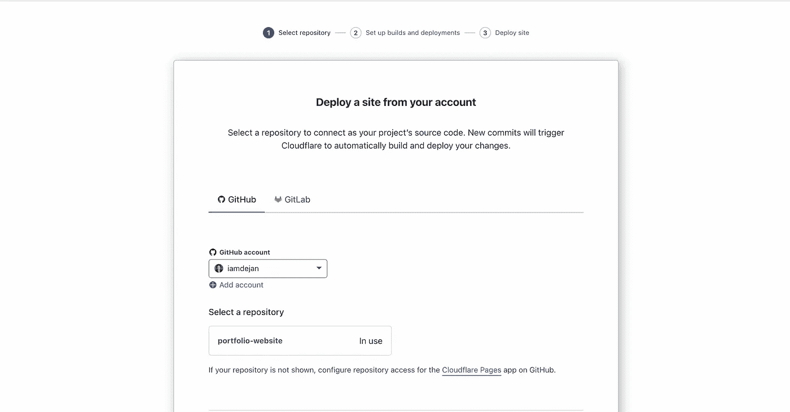

在 Cloudflare 页面中创建“页面”(或项目)。

然后，您可以选择您选择的框架。在我的例子中，由于我使用 Zola，我需要选择 Zola **和**添加一个指定 Zola 版本的环境变量。

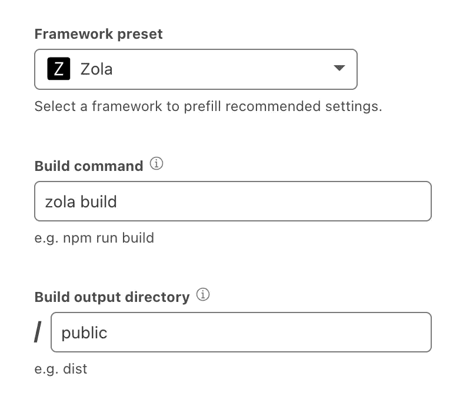

选择哪个框架，指定构建命令和输出。

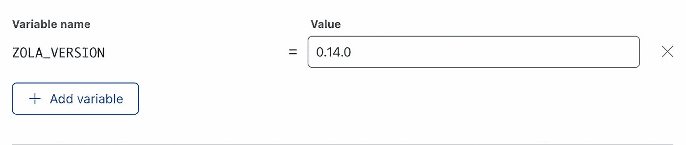

添加环境变量。对于佐拉来说，这个变量是强制性的。

然后，您将被带到新创建的`Page`的仪表盘。您可以在那里更改设置。等到部署完成。然后，您可以通过点击`Visit site`访问该网站。

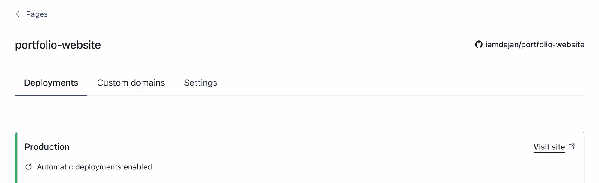

我的“页面”主菜单。

至于自定义域名，如果你的域名不是子域(比如我)，你就需要在左侧栏的`Websites`菜单上添加你的域名，然后才能将域名连接到网站。

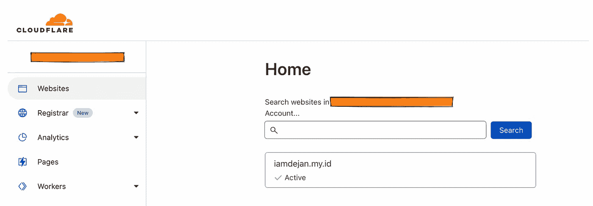

Cloudflare 中的域配置。

Cloudflare 会要求您将注册商上的域名服务器更改为 Cloudflare 的域名服务器。在您的注册器上更改名称服务器后，您可以单击`Check`或类似的东西(我忘记了按钮，我没有截图)，告诉 Cloudflare 检查名称服务器是否已经指向 Cloudflare 的 DNS。

之后，您可以将自定义域添加到您自己的页面中。添加自定义域后，Cloudflare 会添加 CNAME 记录，将您的域指向他们的子域。

DNS 传播完成后，您将看到域的状态是活动的。

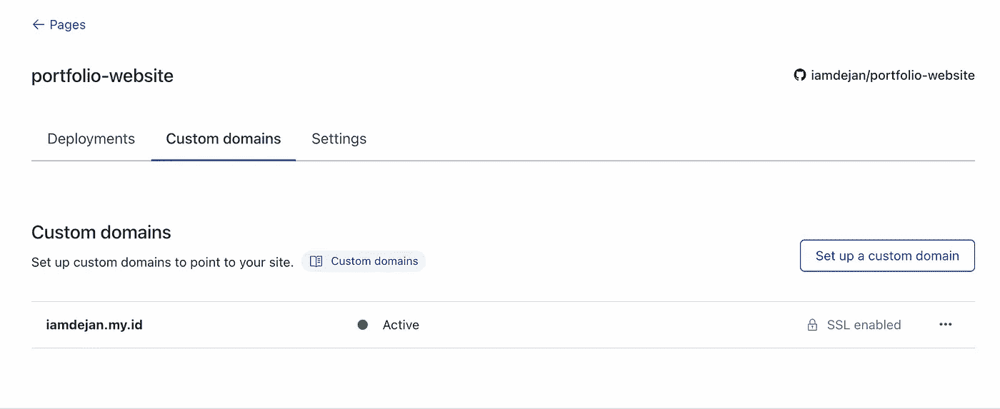

最后一个配置实际上是可选的，但是我推荐这个。您可以“强制”请求使用 HTTPS。不用担心，不需要购买任何 SSL 证书，因为 Cloudflare 已经提供了一个。

使用 Cloudflare 的一个好处是可以使用 [HTTP/3](https://www.cloudflare.com/learning/performance/what-is-http3/) 。这对于一个简单的作品集网站来说可能并不重要，但是对于其他类型的网站来说，这可能是有用的。是的，它包含在免费计划中。

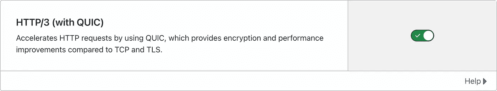

## 韦尔塞尔

Vercel 是开发 Next.js 的公司，他们的商业模式很简单:开发开源框架，希望人们在 Vercel 的平台上托管他们的网站。

Vercel 支持许多框架。你可以在这里看到完整的名单。但是人们通常使用 Next.js，因为由于 Vercel 是主要开发者，所以集成被认为是好的。我自己从来没试过。

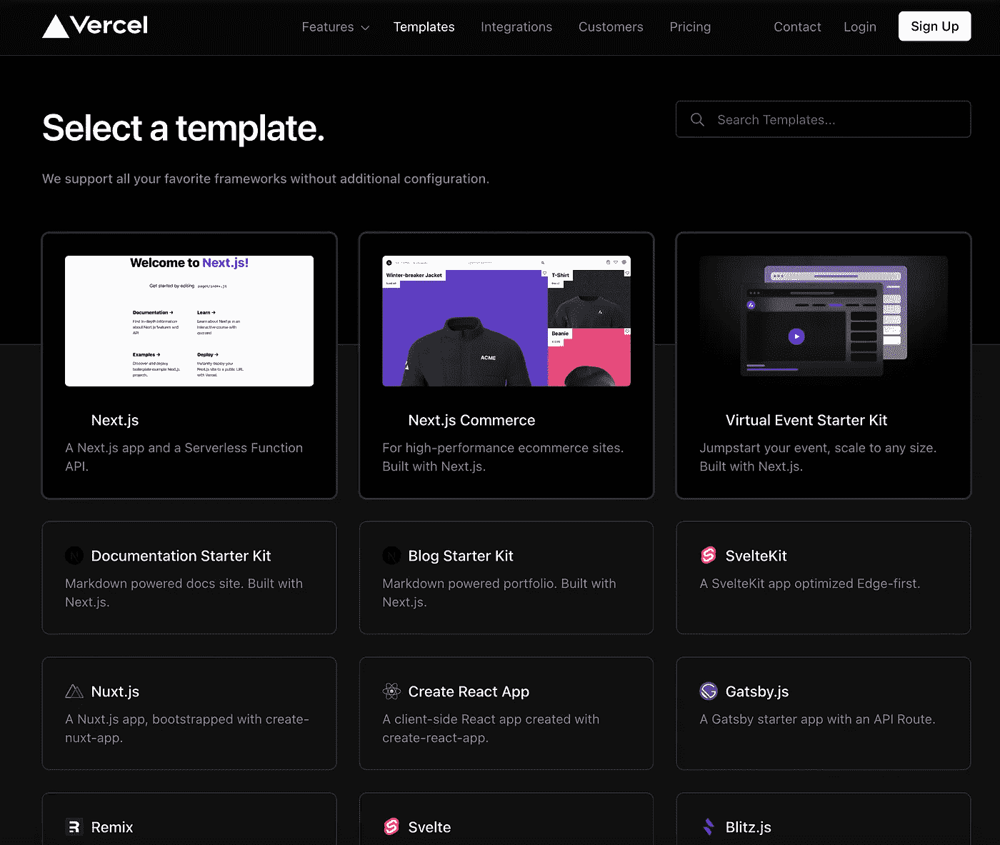

Vercel 中支持的“模板”。

对于定价，Vercel 有一个名为`Hobby`的免费计划。我不确定它是如何工作的，但我猜测它与 Cloudflare Pages 类似，您在 Git repository 中链接您的代码，然后 Vercel 会处理其余的事情。

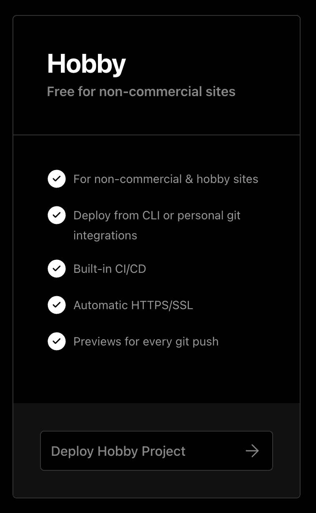

至于自定义域，Vercel 支持自定义域。它的工作方式类似于 Cloudflare，就是你把你的域名服务器改成指向 Vercel 的 DNS。你可以在这里观看添加自定义域名[的指南。](https://www.youtube.com/watch?v=ben3vRAqvKE)

## 网络生活

与 Vercel 类似，您可以使用 Netlify 将您的网站发布到互联网上。Netlify 支持几个框架，但是我不确定你的网站是否可以使用静态 HTMLs。

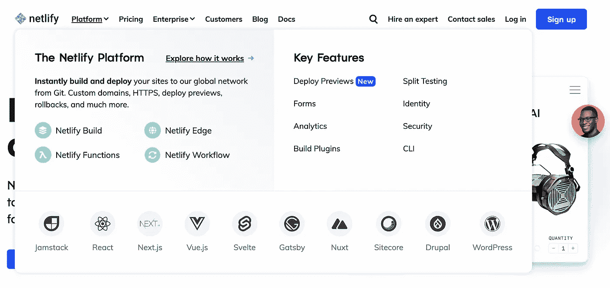

Netlify 中支持的框架。

对于定价，Netlify 有一个`Starter`计划，是免费的。类似于 Netlify，我不确定它是如何工作的，但我猜测它类似于 Cloudflare 页面，其中您将 Git 存储库中的代码与 Netlify 链接。

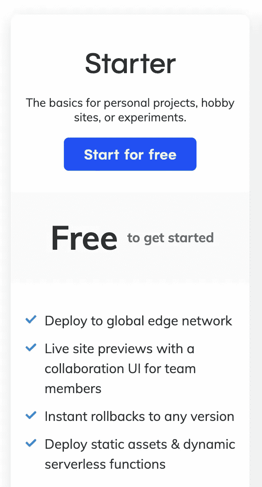

Netlify 也支持自定义域。你可以在这里阅读更多关于那个[的内容。](https://docs.netlify.com/domains-https/custom-domains/)

## 无服务器

如果你想使用定制的框架(甚至 Docker)，那么你可以使用云提供商提供的无服务器解决方案。无服务器是在云中“托管”你的定制网站的最便宜的方式。

[我试过 Google Cloud Run](/how-i-create-sembako-bot-using-google-cloud-5c347057859e) ，虽然只是针对后端 API。但是，我认为只要是 Docker，也可以运行前端应用程序。如果你想使用谷歌云运行自定义域，你可以查看他们的指南[这里](https://cloud.google.com/run/docs/mapping-custom-domains#run)。

如果你已经使用了亚马逊网络服务(AWS)，AWS 有 App Runner，它的工作方式类似于谷歌云运行，你只需要提供 Docker 图像，然后 App Runner 就会运行它。之前没试过 App Runner，所以不能多评论。

## 赫罗库

初学者最受欢迎的选择是 [Heroku](https://www.heroku.com/) 。有了 Heroku，你可以免费托管你的网站，甚至可以连接数据库。Heroku 也为你提供了很好的 UI 来管理你的网络应用。然而，Heroku 的主要缺点是启动时间太长(从空闲状态)。Heroku 的冷启动时间相比 Google Cloud Run 更长。

如果你想使用 Heroku，你最好在这里查看一下[支持的语言和框架列表](https://devcenter.heroku.com/categories/language-support)。

# 结论

所以，这就是我能分享的关于建立个人网站可能需要的工具。你可以对每种工具做更多的研究，然后根据多种因素决定使用哪种工具。