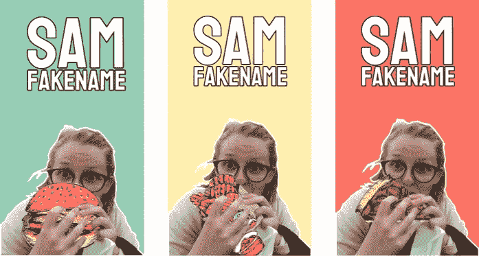
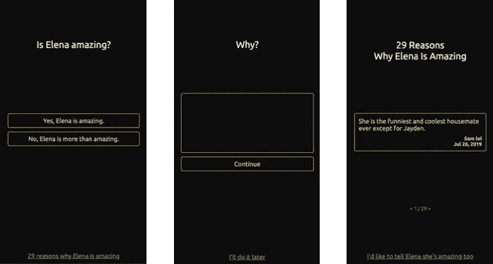
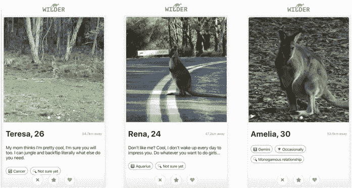

# 我制作网站作为朋友生日的礼物，以下是你也应该这样做的原因

> 原文：<https://blog.devgenius.io/i-make-websites-as-gifts-for-friends-birthdays-here-s-why-your-should-too-a7468655b8e0?source=collection_archive---------0----------------------->

## 制作网站作为生日礼物相对于购买网站的好处以及对你的一些启示。

从去年年初开始，我开始为朋友的生日制作网站，而不是给他们买实物礼物。对我来说，这是一段有趣的旅程，我想分享一些见解，如果我能激励你这样做，我会非常高兴。

我做的第一个网站是为我室友山姆的生日做的。激励我的是，我知道她是一个关心环境的人，我不想给她一些最终会用塑料包装在垃圾填埋场的东西。所以我像跟踪者一样下载了她的 facebook 个人资料照片，给她做了这个动画片段，你甚至可以和她互动。下面是[网站](http://sam.junwenchen.com/)【[阅读更多](https://medium.com/@mayyyyyyc/silly-website-an-interactive-animation-made-with-p5-js-8ecf3b4ad8dd)。

这比我想象的要好得多，她笑得很开心，更重要的是，它没有给这个世界带来更多的浪费。

积极的经历鼓励我在这条路上走得更远。所以我做了更多。

这是[给另一个朋友埃琳娜的一张](http://elena.junwenchen.com/)。她是一个超级善良的朋友，但她似乎不知道这一点，经常因为别人的错误而责备自己，所以在她的生日上，我想让她相信她是多么了不起，她用的不仅仅是我的话。我做了一个小调查“埃琳娜很棒吗？”并在她的朋友和家人中流传，希望所有的理由都能让她想起自己是多么了不起。

到目前为止，我最喜欢的是 [Wilder](http://wilder.junwenchen.com/) ，这是一个约会应用程序，你可以在周围遇到袋鼠，它的灵感来自于与朋友的一个笑话。当时她正在澳大利亚中部背包旅行，那里几乎什么都没有，她开玩笑/抱怨说她周围只有一个约会应用程序上的人。所以我开了个玩笑，让她去见见袋鼠。然后我就迷上了这个傻主意，给她建了 Wilder[[阅读更多](https://medium.com/@mayyyyyyc/silly-website-series-wilder-a-dating-app-that-you-can-meet-the-kangaroos-around-you-1ac072df9aa0) ]。

除了作为一个乏味的开发人员，花大量的空闲时间做一些无聊的事情对我来说非常有趣，下面是我发现的制作网站作为礼物的一些其他好处:

它是绿色的 —没有物理垃圾，没有包装，也没有不想要的东西。我们在这里消耗的唯一东西是为我们的计算机和存储我们代码的数据中心供电的电力，但如果我们决定花时间按照编码教程来构建一个待办事项应用程序，而不是一个有趣的网站，它无论如何都会被使用。

**很便宜**——这是费用明细:最便宜的域名 1-2 美元，AWS 免费层免费托管，2 天开发时间 0 美元，因为否则我会在其他兔子洞浪费时间。总数刚好是 2 美元，花 2 美元你还能买到什么更好的东西？

**他们喜欢它**——最好的礼物是向你在乎的人展示，制作一个个性化的网站是展示这一点的绝佳方式。在科技行业呆了一段时间后，对我来说，每个人都有一个应用程序或正在开发一个应用程序是很常见的，但我在科技行业以外的朋友总是很着迷，他们可以进入一个有他们名字的域名，并看到与他们相关的东西。他们喜欢它！

我希望我已经向你展示了足够多的东西，让你很高兴为你的朋友做一个网站，让我知道进展如何=)

**在我做的网站上阅读更多:**

1.  [笑脸测试——A 找出 P5.js 和 Matter.js 中的奇数一个游戏](https://medium.com/@mayyyyyyc/silly-website-smiling-face-test-a-find-the-odd-one-game-in-p5-js-and-matter-js-8c0206677aa1)
2.  [react js 中的替代拨号应用](https://medium.com/@mayyyyyyc/silly-website-an-alternative-dialling-app-in-reactjs-35ea2ce19086)
3.  [Elena 很厉害吗？—使用 AWS Amplify 进行的简单调查](https://medium.com/@mayyyyyyc/silly-website-series-is-elena-amazing-a-simple-survey-made-with-aws-amplify-7be6e661b87f)
4.  [用 p5.js 制作的互动动画](https://medium.com/@mayyyyyyc/silly-website-an-interactive-animation-made-with-p5-js-8ecf3b4ad8dd)
5.  [Wilder——一款可以认识身边袋鼠的约会 App](https://medium.com/@mayyyyyyc/silly-website-series-wilder-a-dating-app-that-you-can-meet-the-kangaroos-around-you-1ac072df9aa0)