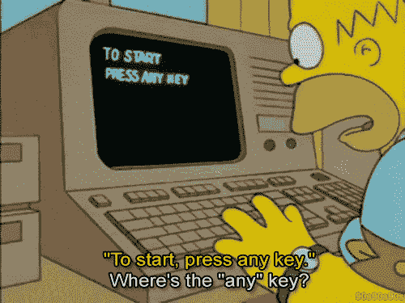
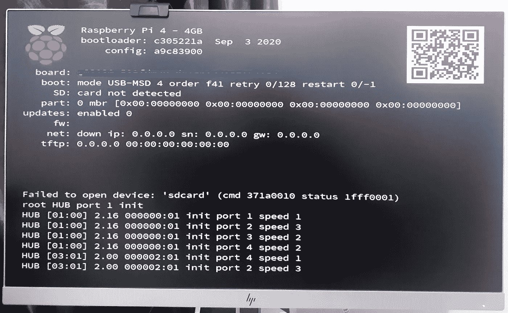

# 我用树莓派 400 玩了几天

> 原文：<https://blog.devgenius.io/i-spent-a-few-days-with-a-raspberry-pi-400-78f27aa3d349?source=collection_archive---------2----------------------->

嗯……我不想撒谎，自从我使用 [Raspberry Pi 400](https://www.raspberrypi.org/products/raspberry-pi-400/) 来处理几乎所有的日常网络事务以来，已经有一个多月了。这里是我处理的问题的路线，我喜欢的东西和我认为 RPI-400 的继任者需要改进的东西。

图片来源:【https://www.raspberrypi.org/products/raspberry-pi-400/ 

# 这一切是如何开始的？背后有什么故事？

图片来源，假视频:【https://www.youtube.com/watch?v=nrgzRo5Eoxs 

一开始，有一个人从印度到英国出差，他带着一台装有办公软件的笔记本电脑，想看《万达视界》(Wanda Vision)，但不是在工作用的笔记本电脑上。他想到的第一件事是什么？从易贝购买二手 mac mini。但是没有！作为早期的树莓派粉丝，这家伙更喜欢吃派。(多亏了他办公室的人，他家里已经多了一个显示屏)。

t̶h̶e̶ ̶g̶u̶y̶.̶.̶.̶:我想从经销商那里订购。首先，有两个选项，树莓 Pi 400 套件，包括 CPU/键盘、鼠标、电源线、迷你 HDMI 线、预装 R-pi 操作系统的 16GB 存储卡和树莓 Pi 初学者指南。

或第二种选择是只购买 CPU/键盘单元，并单独购买其他配件。考虑到 16GB 将是这台机器的存储容量，我选择了后者。用它，我订了一个 64GB 的卡，一个通用电源适配器什么的。

来源:[https://media0.giphy.com/media/26BGIqWh2R1fi6JDa/giphy.gif](https://media0.giphy.com/media/26BGIqWh2R1fi6JDa/giphy.gif)

我收到的设备看起来漂亮整洁，但它没有出现，电源 LED 灯闪烁了一次，仅此而已。💔

发了几封电子邮件，收到了退回的包裹，花了一段时间非常难过，因为《旺达·幻视》第一集的上映日期快到了，我没有随身携带的个人电脑来观看。

第二天早上，他从另一家经销商([thepihut.com](https://thepihut.com/))处订购了另一台设备，并选择了台式机套件，而不是带附件的独立设备。在一两天内得到它，🥁这一个工作得很好。

# 令人心碎的时刻！

**1:无 3.5 毫米音频插孔。**

是啊！名为 Raspberry Pi 400 的个人电脑套件没有 3.5 毫米音频输出插孔。

来源:[https://shop . pimoroni . com/products/raspberry-pi-400-personal-computer-kit？variant=32280730107987](https://shop.pimoroni.com/products/raspberry-pi-400-personal-computer-kit?variant=32280730107987)

良好的...我知道这件事。但是……一台没有 3.5 毫米音频插孔的个人电脑？这是不是就不那么私人了？我不知道。但是你对低于 100 美元的电脑有什么期望呢？天堂之门？

2 **: DRM(数字版权管理)**

大多数 OTT 平台使用 Widevine DRM 来处理其他内容权利。《旺达·幻视》第一集上映的那天，我登录了 Disney+Hotstar，发现了一个 DRM 错误，为什么？因为大多数开源操作系统都不支持 DRM。

Widevine DRM 问题

虽然 Raspberry Pi 说他们已经在 chromium 浏览器上启用了 Widevine，但仍有许多 ott 无法使用。

我自己也在努力寻找解决办法，安装了另一个由社区提供的 [Chromium(媒体版)版本，该版本支持 Widevine。](https://thepi.io/how-to-watch-netflix-on-the-raspberry-pi/)

4K 没有 4K。

Raspberry Pi 网站和所有其他经销商网站都说，“它支持双 4K”。

来源:[https://shop . pimoroni . com/products/raspberry-pi-400-personal-computer-kit？variant=32280730107987](https://shop.pimoroni.com/products/raspberry-pi-400-personal-computer-kit?variant=32280730107987)

k̸e̸y̸b̸o̸a̸r̸d̸/ pi 背面的两个微型 HDMI 端口。我连接了我的惠普显示器，这让我更生气了。它显示的最大分辨率选项是 *1920x1080* ，并在显示屏的所有侧面留下了巨大的边框。

左:开箱 Pi。右图:Pi 重新烹饪。

我不明白它背后的原因，但当我下载、安装并在它的操作系统上运行同一个 Raspberry Pi 的新图像时，分辨率被修复得很好。

**4:网速慢**

当然，我的网速也不慢。如果是的话，我为什么要告诉全世界？实际上，问题出在圆周率上。从理论上讲，这个可爱的白红色小 pi 支持蓝牙 5.0、WLan 5 GHz，有一个以太网端口，但当我开始使用它时，我注意到每当我试图用它上网或下载时都会有延迟。

来源:[https://shop . pimoroni . com/products/raspberry-pi-400-personal-computer-kit？variant=32280730107987](https://shop.pimoroni.com/products/raspberry-pi-400-personal-computer-kit?variant=32280730107987)

我在 PI 上观看的所有 youtube 视频通常都会被缓冲，这个问题不仅仅与我的机器有关，而是无处不在，在 Raspberry PI-400 世界中。在多个 R-PI 论坛中有许多帖子在讨论 400 中的这个问题，这太令人失望了！！！[自己去看。](https://www.raspberrypi.org/forums/viewtopic.php?p=1799075)奇怪的是，它所基于的[树莓派 4](https://thepihut.com/products/raspberry-pi-4-model-b) 却没有任何这样的问题。

**5:默认不从 USB 引导。**

耶！你没看错。Raspberry Pi 从最初的版本开始就支持从 USB 直接启动主板。但是，在 RPI-400 的情况下，它不是。当我移除 Micro-SD 卡并插入 USB 时，它出现如下所示的启动错误:

USB 启动时出现 Rpi 400 启动屏幕错误

最初，我很困惑，我不确定我是否有合适的词语来表达我此刻的感受。幸运的是，R-PI org 有一篇文章解释了如何使用 [raspi-config](https://www.raspberrypi.org/documentation/hardware/raspberrypi/bootmodes/msd.md) 实用程序启用 USB 引导。唷！

**6:微软回购争议**

树莓 Pi OS 现在有 VS 代码了。🥁耶！这是一个敲鼓的时刻。但是，RPI OS 出名的原因是它没有大型技术人员在背后工作。对于 VS 代码，Pi org 在事先没有让任何人知道的情况下添加了 Microsoft repo 和 key，社区失去了理智。你可以在这个上查看[杰夫的文章。](https://www.jeffgeerling.com/blog/2021/microsoft-repo-and-key-are-automatically-added-raspberry-pis)

Microsoft 回购 URL

愤怒的原因不仅仅是添加了 repo，而是 VSCode 附带了遥测功能，可以将日志发送给微软(微软称这些是匿名的)，但社区表示，如果他们真的想添加 [VSCode，他们可以添加一个开源的非微软版本或类似的东西。](https://vscodium.com/)

**7:没有 8GB RAM 型号**

Raspberry PI-400 只有一个 4GB 型号，这真的很奇怪，因为除了这个型号之外，所有 RPI 型号都有许多变体。一位[经销商说](https://support.thepihut.com/hc/en-us/articles/360015199178-Can-I-buy-an-8GB-Raspberry-Pi-400-)他们不知道在不久的将来会有任何其他型号的产品出现。

# **可爱的东西！**

你以为我不会说私家侦探的好话吗🥧？有许多我喜欢的东西。

**1:** **价格**

[Raspberry Pi](https://www.raspberrypi.org/) 已经问世近十年了，对于其他型号，我们不得不购买配件，但对于这款机型，他们有一个集成键盘，价格也低于 70 美元。

**2:操作系统**

ikipedia 有一个与 RPI 兼容的操作系统变体列表。当然，这与机器的具体版本无关，但我喜欢有多个操作系统的事实；它也有一个巨大的社区基础。我个人用的是 [Twister OS](https://twisteros.com/) 和[铬基 Fyde OS](https://fydeos.com/) 。

T 威斯特自带了很多预装的 OS 主题，比如 macOS 和 Windows 10 主题，还预装了 pwa。

另一方面，yde 能够在 Chromium 操作系统上安装 Linux 和 Android 应用程序，这又是一个双赢的局面。

左图:macOS 主题的 Twister OS。右图:基于铬的 Fyde 操作系统

**3:预包含的公用设施**

预装了许多软件，这是我在 Raspberry PI 操作系统上发现的最可爱的东西，raspi-config 实用程序，Raspberry Pi Imager，游戏等等。

Raspberry PI Imager 可帮助您从可在 PI 上使用的操作系统列表中进行选择。

# 无关观察📃：

*   我知道这没有关系，但我确实喜欢 Raspberry Pi 400 个人套装包含“入门手册”这一事实。另一方面，我不明白为什么没有选择不包括小册子的工具包给不需要它的人。
*   请再来点内存。

> *免责声明:*
> 
> 所有网站、操作系统和应用程序名称均为其各自所有者的财产，他们拥有所有权利。(如果您希望我删除任何姓名，请发表评论)
> 
> 这不是一篇赞助的帖子。

## ***接下来，树莓 Pi Pico，一颗 3.6 双核芯片。***