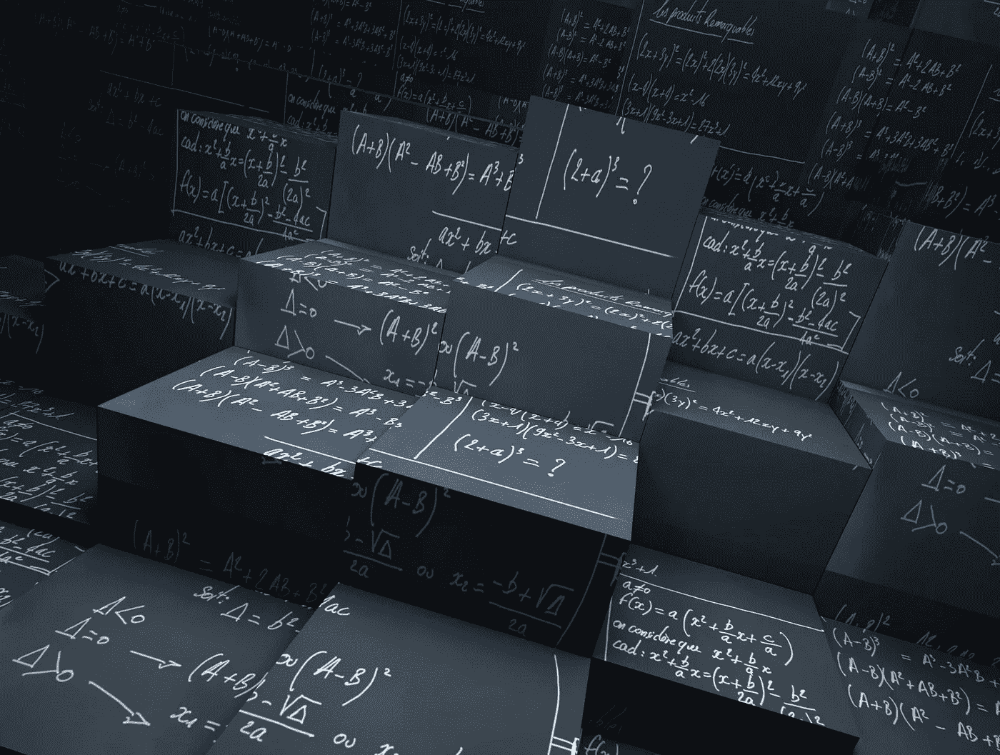
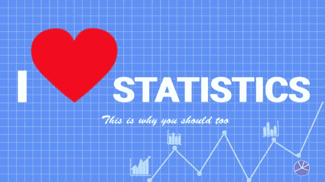

# 我又开始学习统计学，原因如下

> 原文：<https://blog.devgenius.io/i-started-learning-statistics-again-and-here-are-the-reasons-6dadd72762f1?source=collection_archive---------9----------------------->

有很多理由被忽视。下面是关于我为什么重新开始学统计学的细节。

在说出我的理由之前，我真的很喜欢统计学，这让我想把学习统计学作为一种激情。但我的职业道路和我的研究生学习是我重新开始学习统计的主要现实原因。

## 1-因为我需要我的事业

统计学是每个领域的必修科目，因为它是数据的语言。因为我的职业领域包含了大量的数据，尽管我想要的职业是区块链·R&D 项目管理，但了解统计数据来做决定成了一项义务。当考虑区块链 R&D 项目管理时，所有的决策都必须根据你所拥有的数据，根据数据敏感性结构提供解决方案。

## 2-因为我想攻读与统计相关的研究生课程

因为我想在国外学习，尽管我是经济学专业，但我也想用奖学金学习统计学，拥有知名机构的统计学课程证书可以让我超越其他申请人。当在统计和数据科学专业培训中增加计算技能时，我决定完成将真正有助于我在大学中掌握统计学和更合理地理解数据。此外，我会做任何我完全喜欢的事情，这让我更想去国外学习统计学。

## 3-我就是喜欢统计

我不得不告诉你，我讨厌统计学，直到我遇见了我的统计学教授。他让我明白，一开始不能理解统计学的逻辑并没有错。更重要的是，他告诉我，统计学可以通过用专门为统计分析设计的编程语言查看数据集来学习。此外，他还指导我从事与统计学相关的研究，让我相信只要我努力实现自己的目标，我的工作领域并不重要。因为我的目标需要对统计学有一个很好的理解，所以我变得和这个学科本身联系更紧密了。

*按照你的说法，人为什么要学统计学？在下面的评论区分享你的想法。*