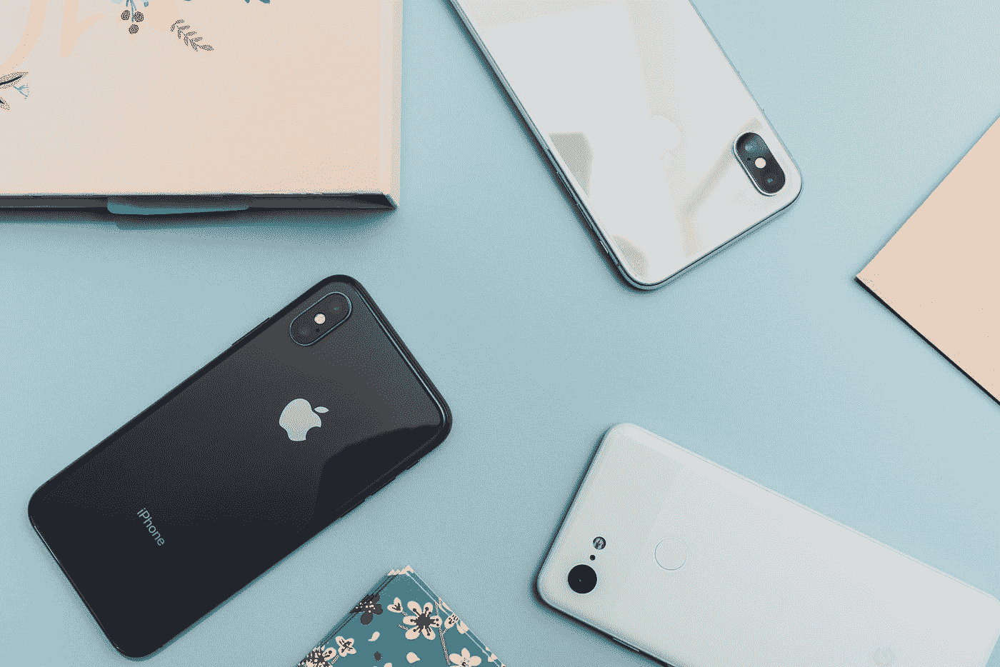
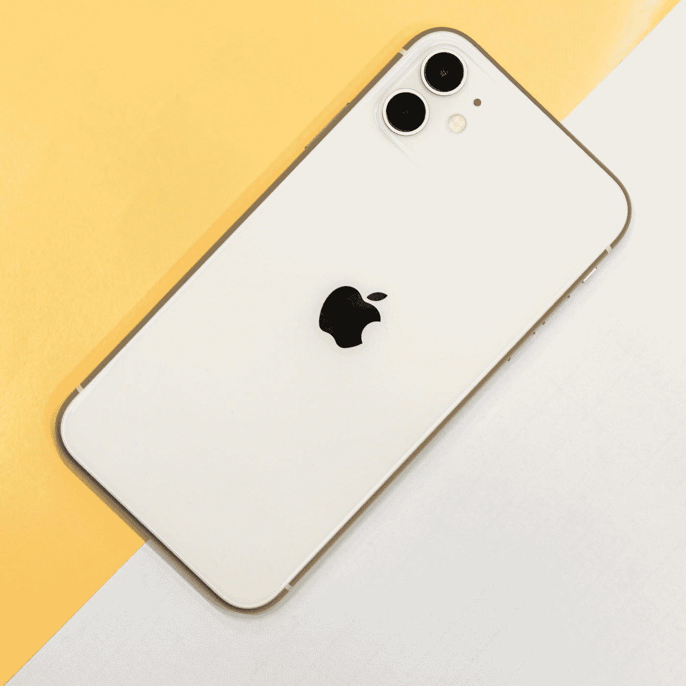
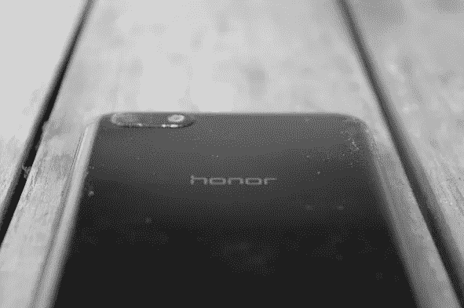

# 我把我的 iPhone 11 换成了 100 美元的 Android，也许我们应该停止在新手机上花费数百美元。

> 原文：<https://blog.devgenius.io/i-swapped-my-iphone-11-for-a-100-android-and-maybe-we-should-stop-spending-hundreds-of-dollars-on-5876c0192adb?source=collection_archive---------25----------------------->

阿恩尔·哈萨诺维奇在 [Unsplash](https://unsplash.com?utm_source=medium&utm_medium=referral) 上拍摄的照片

**1 月中旬，我最糟糕的噩梦之一成真了，我最近买的 IPhone11 两面都坏了，屏幕也不像 Face ID 那样好用了，所以我不得不把手机拿回去维修。当我的 iPhone 修好的时候，我把我的 SIM 卡放在我的一个紧急电话上，这个电话是一个 HONOR 7S，花了我不到 100 美元。用了几个星期后，我印象深刻，决定再用几个月。**

从 IOS 到 Android 的转变是我从未做过的事情，但总的来说，这是一个相当容易的过程。几天后，我已经习惯了这个新的操作系统。帮助我改变的是安装了 NOVA Launcher，这让 Android 更加简约和易用，这是我欣赏的来自 IOS 的东西。事实是，如果没有 Nova Launcher，我不可能做出这样的改变，我也不可能使用它超过几天。

照片由[vựa·陶](https://unsplash.com/@vuatao?utm_source=medium&utm_medium=referral)在 [Unsplash](https://unsplash.com?utm_source=medium&utm_medium=referral) 上拍摄

**这样做的原因是，这个应用程序让我的 100 美元手机用户体验快速流畅，这是安装在设备上的启动器所无法做到的。我应该提到的一点是，我是一个低功耗用户，我不会在我的智能手机上做任何要求高的事情，这是我能够将 Honor 7s 保留几周以上的原因之一。我在智能手机上做的大多数任务都是基于社交媒体平台，Honor 7s 处理起来没有问题，只是确保不要在后台打开两个以上的应用程序。继续说积极的一面:由于它的低功耗处理器，电池在没有充电的情况下支持了我整整两天。尽管只是一个 720p 的 LCD 屏幕，但对于观看 YouTube 上的视频来说已经足够好了，这也足够明亮，可以以良好的视角观看外面的世界。**

如果我说一切都很完美，那我是在撒谎，所以让我们从设备的硬件开始，对于一部 100 美元的手机来说，你不能期待更好的了，几乎整个设备都是由塑料制成的，很容易被划伤。在屏幕上，我们有玻璃，但它很容易刮花。你可以很容易地意识到，这款手机如此便宜的原因是制造商通过使用质量很差的材料来节省成本。然后我们有存储的问题，只有 16gb，你需要一个 SD 卡来使用这款手机。最后，我们有相机，这肯定是该设备最糟糕的功能，照片的质量很差，但如果你需要拍照，你可以，只要确保你对焦好。

图片来源:opiniontech

**在隔离期间，我打了很多视频电话，不算前置摄像头的糟糕质量，我对这种体验非常满意，它从未滞后，设备的麦克风清晰地拾取了我的声音，但我建议在进行视频会议或观看视频时使用耳机，因为扬声器，尽管观看视频时打电话是完全可以接受的，但扬声器会发出令人不快的声音。**

**六个月过去了，我将回到我的 iPhone 11，毫无疑问，你使用高端手机的体验是优越的，但总的来说，我对这个价格的手机可以做的所有事情感到惊讶，这只是一个适应的问题，没有问题，大多数人可以用这样的手机生活，我们会惊讶地发现，100 美元的手机可以做的事情和 10 倍于它的价格的手机一样好。**