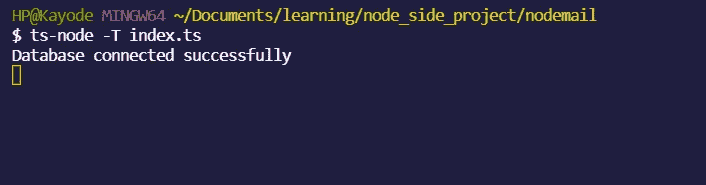

# 我试图在 1000 多个公共 GitHub 存储库中找到 MongoDB 连接字符串

> 原文：<https://blog.devgenius.io/i-tried-to-find-mongodb-connection-strings-over-1000-public-github-repositories-b870cb3bcac5?source=collection_archive---------18----------------------->

我试着通过在 GitHub search 上搜索就能得到别人的 Mongo 数据库连接字符串。是的，我找到了一些。我试着连接了几个，是的，成功了！



在你报警之前，请听听我的背景故事。🙏🏽


我正在开发一个 NodeJS/Express 应用程序，我记得我按了*。env* 文件到我的远程存储库。在修复这个错误的过程中，我想到了有多少人会犯这个错误，即使秘密最终没有被公开，它也会留在提交历史中的某个地方。
所以我上钩了，做了这个 [GitHub 搜索](https://github.com/search?p=1&q=mongodb%2Bsrv%3A&type=Code)。虽然大多数结果都不是实际的连接字符串，但是其中很多仍然有效。

[免责声明:没有恶意，这只是为了引起公众的注意]

## 我是如何浏览 1000 个知识库的

实际上， [GitHub 搜索 API 限制每次搜索 1000 个结果](https://docs.github.com/en/rest/reference/search#about-the-search-api)。使用下面的脚本，我能够生成代码包含 *mongodb+srv:* 的存储库

```
// index.ts
import dotenv from “dotenv”
dotenv.config()import axios from “axios”;
import fs from “fs/promises”;
import cliProgress from “cli-progress”;const jsonpath = “list_of_repo.json”;const makeSearch = async (page: number) => {
 const config = {
 headers: {
 Authorization: `Token ${process.env.GITHUB_API_TOKEN}`,
 },
 };const url = `[https://api.github.com/search/code?q=mongodb%2Bsrv+in:file&page=${page}&per_page=100`](https://api.github.com/search/code?q=mongodb%2Bsrv+in:file&page=${page}&per_page=100`);
 const result: {
 items: { html_url: string; repository: { html_url: string } }[];
 } = await axios.get(url, config);// make an an object from result
 let obj = {};
 result.data.items.forEach((item) => {
 obj[item.repository.html_url] = item.html_url;
 });await addToJson(jsonpath, obj);
};async function addToJson(jsonpath: string, data?: object) {
 const oldJson = (await fs.readFile(jsonpath)).toString();
 let jsonData = JSON.stringify(data, null, 2);if (oldJson) {
 jsonData = JSON.stringify(
 { …JSON.parse(oldJson), …JSON.parse(jsonData) },
 null,
 2
 );
 }await fs.writeFile(jsonpath, jsonData);
}async function main() {
 // I included a CLI progress loader because, who doesn’t like a loader.
 const bar1 = new cliProgress.SingleBar(
 {},
 cliProgress.Presets.shades_classic
 );
 // number of iteration 10
 bar1.start(10, 0);
 for (let i = 1; i <= 10; i++) {
 await makeSearch(i);
 bar1.update(1);
 }
 bar1.stop();
}main();
```

提供的结果并不意味着实际的 MongoDB 连接字符串存在，它只是暗示结果中的存储库有一个与 *mongodb+srv:* 匹配的文件内代码

我可以进一步创建一个脚本来搜索每个代码 URL，并运行一个正则表达式来进一步查找实际的连接字符串，但这不是必需的，因为我的目的是提高公众意识以及如何保护我们自己。

## 我发现了什么以及我们如何保护自己

我的一些发现包括:

- **一些结果在提交历史中包含旧的提交**:就像我导致这篇文章的错误一样，有时我们忘记创建一个*。gitignore* 文件，并在提交历史的某个地方准备一些秘密。

我们可以利用像 [GitGuardian](https://www.gitguardian.com/) 这样的工具不断扫描我们的回购协议，寻找源代码中的秘密。

- **一些结果包含了来自不同日志文件和环境文件的消息:**这可能是由于没有包含一个*. git ignore .*

GitHub 提供了一个 [repo](https://github.com/github/gitignore) 和众多类型的*。gitignore* 不同语言的模板，框架，工具，IDE e . t . c .
T21【我创建了一个简单的交互式 CLI 来生成*。gitignore* 基于 GitHub 列表的模板。

您可以找到交互式 CLI 工具来生成您的*。gitignore* 模板此处:[https://www.npmjs.com/package/gittyignore](https://www.npmjs.com/package/gittyignore](https://www.npmjs.com/package/gittyignore))

感谢您通读！🤗