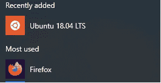
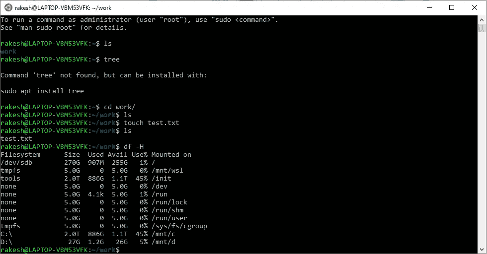

# 我试过 WSL

> 原文：<https://blog.devgenius.io/i-tried-wsl-75731395bc25?source=collection_archive---------31----------------------->

Artem Sapegin 在 [Unsplash](https://unsplash.com?utm_source=medium&utm_medium=referral) 上拍摄的照片

*请注意，本文所表达的观点完全是我个人的，并不代表我的雇主。*

众所周知，Linux 是全世界开发者的首选操作系统。除非你使用微软的技术，否则你很可能会编写跨平台的代码，而且你通常是在*NIX 环境下编写的。因此，在*NIX 环境中工作的选择可以归结为两个——Linux 或 MacOS。

尽管一个标准的 Linux 发行版提供了对开发人员的友好性，但在其他生产力应用程序(如 Office 等)方面还有很长的路要走。现在有很好的选择——开放式办公室、自由办公室等。但是出于各种安全性和合规性的原因，这些应用程序通常不是企业的首选。使用 Windows 也有一些很好的理由——易用性、各种可用的应用程序等等。

鉴于 MacOS 在可用性、应用程序多样性、稳定性和开发人员友好性之间取得了几乎正确的平衡，它正迅速成为许多开发人员的首选操作系统。您是否希望在熟悉的 MS Office 上使用*NIX 系统的强大功能，该系统具有坚如磐石的性能和出色的硬件？MacOS + MacBook 就是你的答案。但是，它也有自己的警告——硬件的高价格和对苹果生态系统的锁定。

到目前为止，在 Windows 上工作的开发人员在拥有一个基于*NIX 的开发环境方面几乎没有什么选择。唯一好的选择是 [MinGW](http://www.mingw.org/) 、 [Cygwin](https://www.cygwin.com/) 。这些运行时应用程序必须单独安装，它们有巨大的下载量，你必须手动选择你想要的包。带着成为开发者“首选平台”的新使命，微软着手将 Linux 原生集成到操作系统中。这在几年前还是不可想象的。有了 Linux 的 Windows 子系统，或者叫做 WSL，现在有一个完整的 Linux 内核在 Windows 操作系统中运行。

WSL 最初推出时，对所有 Linux 功能的支持是有限的。它的集成方式是微软工程师编写了一个 API 转换层，将 Linux 系统调用转换成 Windows API 调用。虽然这满足了拥有 Linux 内核的目的，但是我们不能运行某些应用程序，比如 docker。在 WSL2 中，这种情况发生了变化。微软从他们在 WSL 中构建的转换层转移到了 WSL2 中成熟的 Linux 内核。结果是现在有了完整的系统调用兼容性和更好的系统性能。有关 WSL 和 WSL2 之间差异的更多信息，请参考[本](https://docs.microsoft.com/en-us/windows/wsl/compare-versions#:~:text=Whereas%20WSL%201%20used%20a,are%20immediately%20ready%20for%20use.)。

我有一台 Mac 电脑用于工作(感谢我的雇主)，但就我个人而言，出于价格、方便等方面的考虑，我更喜欢 Windows 系统。因此，过了一个周末，有了一台像样的 Windows 笔记本电脑(英特尔酷睿 i3 处理器，4GB 内存)，我决定尝试一下 WSL2。

安装非常顺利，非常像 Windows，如果你已经更新到最新版本的 Windows 10(ver。2004)，您已经内置了 WSL2。你需要做的就是使用几个 Powershell [命令](https://docs.microsoft.com/en-us/windows/wsl/install-win10)来启用它，并在 BIOS 设置中启用虚拟化。一旦启用，您就可以从微软商店安装一个可用的 Linux 发行版了！是的，有几种 Linux 发行版可供选择，包括 Ubuntu 16、18、20、OpenSUSE 等。微软就是微软，他们甚至让操作系统的整个安装过程类似于安装任何其他应用程序！

开始菜单中的 Ubuntu

一旦你安装了你选择的 Linux 发行版，你就可以像在 Windows 上启动任何其他应用程序一样启动它——进入开始菜单并点击操作系统。谁能想到运行整个操作系统会变得如此简单？我选择了 Ubuntu 18.04 LTS，在启动应用程序时，我在黑色的控制台窗口中看到了熟悉的“$”符号。耶！我试着使用一些基本的 Linux 命令——导航目录、创建目录、查找文件权限、检查可用磁盘空间——一切都正常工作！

熟悉的终端

这种集成的有趣之处在于，您不会被排除在常规 Windows 文件系统目录之外。正如你在上面的图片中看到的，熟悉的' C:\ '和' D:\ '可以作为'/mnt/c '和'/mnt/d '目录使用，很像 Linux 中的任何其他目录。

现在，仍然需要深入探讨的是这种集成的安全和隐私含义。毕竟，这是一个完全不同的操作系统，我相信企业中的 It 团队在向他们的员工推广它之前会进行尽职调查。但是，如果你是一个爱好者，想尝试一些新的东西，这是一个探索的好机会。

至于我，我很高兴我的周末过得很好！干杯！