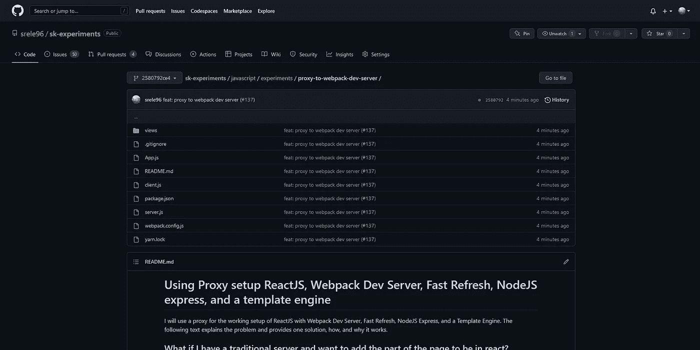

# 我使用一个代理来设置 ReactJS、Webpack Dev Server、Fast Refresh、NodeJS express 和一个模板引擎。

> 原文：<https://blog.devgenius.io/i-used-a-proxy-to-set-up-reactjs-webpack-dev-server-fast-refresh-nodejs-express-and-a-template-ecdbbfbf94b8?source=collection_archive---------6----------------------->

我提供了实现该解决方案的完整源代码。我将为 ReactJS 的工作设置使用一个代理，包括 Webpack Dev Server、快速刷新、NodeJS Express 和一个模板引擎。下面的文字解释了这个问题，并提供了一个解决方案，如何，以及为什么它的工作。

SK-experiments 存储库，包含代理和 Webpack 开发服务器解决方案的完整源代码

# 实现我所说的解决方案的完整代码

 [## sk-experiments/JavaScript/experiments/proxy-to-web pack-dev-server 位于…

### 我将使用一个代理来设置 ReactJS 与 Webpack Dev 服务器、快速刷新、NodeJS Express 和一个…

github.com](https://github.com/srele96/sk-experiments/tree/2580792ce490fddc249cae854874edd69d8bc773/javascript/experiments/proxy-to-webpack-dev-server) 

# 如果我有一个传统的服务器，并且想在 react 中添加页面的一部分，该怎么办？

ReactJS 是在客户机上运行的代码。最重要的是，我们想用 JSX。这很糟糕，因为我们必须使用一些工具来编译 javascript。然后，我们需要将其与快速更新相结合！问题越来越大；下面是我对如何解决的想法。

为应用程序的该部分创建一个单独的目录。我们将把 Webpack 和其他配置文件放在那个目录中。现在我们可以使用 Webpack 编译文件。我们如何使用快速刷新、Webpack 开发服务器和带有模板引擎的常规 express 服务器？我们可以运行 Webpack 开发服务器，但是链接到 javascript 文件的页面在哪里？一个 express 服务器正在托管那个页面，而 Webpack 开发服务器并不知道它。我们如何集成 Webpack 和常规服务器？

# 我们可以分角色。

Webpack 开发服务器提供热模块重载、javascript 文件路径，并提供编译后的内容。

express 服务器将处理所有的前端请求。对于它不能接受的任何请求，比如编译的文件，我们的 express 服务器可以代理到我们的 Webpack 开发服务器。通过这种方式，Webpack 开发服务器提供了几乎所有我们想要的现成的东西，并且我们拥有了几乎所有我们需要的东西。

这是怎么回事？让我们想象一下，当我们想打开 youtube 时，我们做的第一件事是什么。

1.  打开 web 浏览器
2.  像[https://www.youtube.com](https://www.youtube.com)一样输入路径
3.  https://www.youtube.com[的服务器向浏览器发送一个 HTML 响应。](https://www.youtube.com)
4.  浏览器解析 HTML 响应，并在发现链接、脚本或其他带有相对路径的标签时向服务器发回请求。
5.  服务器接收该请求并尝试发送响应。
6.  我们的服务器不知道编译的 javascript 文件，所以它向 Webpack 开发服务器请求这些文件。
7.  Webpack 开发服务器知道这些文件并发回它们的内容。

热模块重装怎么办？这是怎么回事？它是使用 web 套接字实现的，工作方式类似于前面的例子。它们还依赖于网络上的路径。我们必须将 WebSocket 内容从我们的 express 服务器代理到 Webpack 开发服务器。

为什么我们要这样做？Webpack 开发服务器可以更好地设置其他工具。然而，代理很好地完成了这项工作，我们可以花更少的精力用其他东西来设置它。

那么，我们最初的问题是什么？我们想在页面上使用快速刷新。我们希望使用 express 服务器，并使用 Webpack 开发服务器提供我们页面的一部分。

# 为什么所有这些都有效？

一、什么是浏览器？浏览器是一个擅长解析文本的程序。它读取文本并试图适当地使用它(换句话说，它试图解析它)。那它还让我做了什么？它允许我浏览我电脑的内容。我为什么要说这个？因为浏览我电脑的内容和访问 YouTube 差不多。不同的是，我的电脑允许浏览器打开任何东西，而 YouTube 服务器只允许浏览器进入其中的一部分。

如果你有 Windows 机器，通过浏览器打开 c 盘，你浏览的是一个目录。比如这个链接 file:///C:/。

那么，密码是什么？代码是一个文本，由于浏览器擅长解析文本，我们可以给它发送一些代码。

然后，让我们想想当我们打开一个网页时会发生什么。什么是网页？一个网页是一大块文本！因为我想创建一个 web 服务器，每当浏览器访问我的地址 [http://localhost:3000，](http://localhost:3000,)时，我会返回一些文本，但我会告诉它这些文本是特定的 HTML 格式。

前端开发者知道什么是 HTML。否则就去查。如果你有创建软件的经验，你就会明白。

浏览器是一个好孩子，将解析 HTML 格式的文本。当浏览器解析页面时，它开始通读内容。它将为它看到的每个链接发送一个 web 请求。它告诉我们什么？

脚本标签有一个链接。然后浏览器就会像，哎，你给我发 HTML，有一个统一资源位置的脚本标签。该脚本希望在该统一资源位置上运行一些代码。你能给我吗？

我们的服务器是个好孩子，它不能处理那个地址，但是我们很聪明。因此，我们将把它转发给 Webpack 开发服务器，Webpack 开发服务器正在运行和编译文件，同时将每个请求的内容作为响应发送出去。我们花了一个小时组装的配置正在努力工作！然后它会把脚本内容返回给我们的服务器。我们的服务器很高兴，并将 JavaScript 代码发送给运行该代码的浏览器。

# 那么，它将如何再次工作呢？

我们希望有一个页面，反应只生活在一部分。这意味着我们需要一个 HTML 元素作为根。有根的页面需要知道所有到编译好的 **JavaScript 的链接，以及根**的 ReactJS 代码。这就是为什么我们需要帮助服务器。我们将从 Webpack 文档提到的清单文件[中获取所有文件的路径](https://webpack.js.org/concepts/manifest/)。为什么显化？因为它重量轻，体积小。在计算机上写文件是很慢的，不管它看起来有多快，所以我们想写绝对的最小值。

Webpack 向我们保证有我们需要的 javascript 文件的路径，所以我们将使用它来获得它们。但是首先，将该文件写入目录，因为 express 不知道编译后的文件。这是从清单中读取路径的唯一方法。

或者，我们可以通过 HTTP 响应发送它们，将它们保存在内存中。

我们的 express 服务器可以读取该文件，使用该文件中的链接创建 HTML 脚本标记，并将脚本标记插入到需要 ReactJS 代码的页面中，该代码用于我们希望安装 ReactJS 的根。

# 结论

接下来，我们创建一个包含 JavaScript 文件路径的文件，我们的服务器读取它们，将它们插入到页面中，浏览器解析页面，并请求这些路径上的内容，我们的服务器找不到它们，所以它请求 Webpack，Webpack 将内容发送回来，我们的服务器将 JavaScript 返回给浏览器。