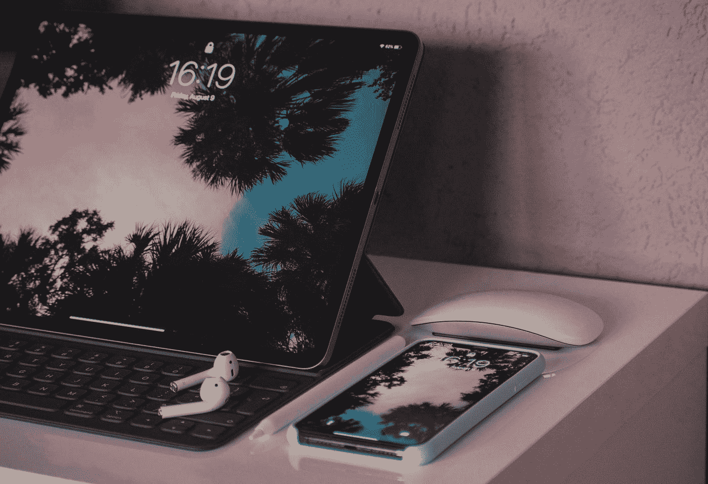

# 我对购买 iPad 持怀疑态度，但我错了。

> 原文：<https://blog.devgenius.io/i-was-skeptical-about-buying-an-ipad-but-i-was-wrong-9aded61f5665?source=collection_archive---------31----------------------->

我是一名学生，拥有我的智能手机(来自一加)和笔记本电脑(来自戴尔)。那么，当我可以使用智能手机(用于多媒体目的)和笔记本电脑(用于编码/项目工作)来完成大部分工作时，为什么我还需要 iPad 呢？

请注意，我没有任何其他苹果产品，因此购买 iPad 并不能使我完成任何圆，实现我的梦想，成为苹果生态系统中的一员，并使工作流程变得更容易(很悲伤的生活，是吧？).

好吧，这并不都是灾难(是的，从这篇文章的标题来看非常明显，我明白了；) )

苹果生态系统的图示

有一个戏剧性的故事，讲的是我如何在没有真正想买的情况下给自己买了一台 iPad，但是嘿，我们现在不想深究这个故事。

我拥有的 iPad 是 64g 存储的 iPad Air 2019。最初，它几乎是一台疯狂观看节目、YouTube 视频和其他几种媒体形式的机器(大屏幕和便利，谁不喜欢它)。但是，我对 iPad(以及其他 iOS 设备)自带的预装应用程序(由苹果公司制造)感到好奇，并开始探索它们(为所花的钱伸张正义，我是理性的)。

iPad Air (2019)

我一直在使用这个名为“GarageBand”的应用程序，它是用来制作音乐的(苹果将其描述为“在任何地方制作伟大的音乐”)，至于苹果如何描述它，这是真的。我必须承认，在我的笔记本电脑上使用 FL Studio(用于制作节拍和音乐的软件)制作一些听起来像 meh 的音乐对我来说并不陌生，但在它上面工作对我来说完全没有启发性(主观！).

GarageBand 中的轨道列表

但是 GarageBand 使用起来更令人兴奋(我知道，这又是主观臆断！)这反过来让我做了比以前更多的音乐作品。我喜欢它拥有像我这样的业余音乐家所关心的一切，而且它更容易使用。我过去尝试过很多应用程序，如苛性碱、FL Studio Mobile(在 Android 中),它们都无法与 GarageBand 的强大和便捷相提并论。这些应用程序阻止我做一些关于音乐的事情，并且使用 GarageBand，我发现自己发掘了更多的天赋。(后来我发现 android 设备不支持低延迟，不像苹果设备，这是苹果设备有很多音频制作相关应用的主要原因。)

另一个我觉得挺有用的应用是“iMovie”。我在视频编辑方面经验较少，iMovie 在最初阶段非常有助于我发现拍摄和编辑视频的热情。我开始为歌曲制作封面视频，GarageBand + iMovie 的结合对我来说非常有用，但过了一段时间后，它的局限性开始困扰我。然而，这是一个很好的开始应用程序。(现在，我用的是 GarageBand + iMovie + InShot 来实现这个目的。LumaFusion 是一个更有能力的应用程序，但它对我来说太过了，而且还是付费的！).

我知道 iPad 的整个使用案例只涵盖了关心制作音乐或视频博客的一部分人，但在我拿到我的 iPad 之前，我对音乐制作的兴趣早已消失，我不知道这台 iPad 会帮我重新发现它。如果我没有 iPad，我可能永远不会有动力去做封面视频。

你可能有隐藏的天赋或想法，我认为 iPad(不是任何其他平板电脑)将是一个很好的补充工具。

这并不是说 Android 没有我提到的所有东西的优秀应用程序，但是，有了 iPad，人们需要开始使用的所有工具都是预装的(由苹果公司制造，经过优化，也非常好)，所以在 Android 平台上搜索最佳工具的困惑是永无止境的(至少对我来说是这样！)扼杀了我寻找它们的目标的过程。

页（page 的缩写）s:这篇文章是用我的 iPad 在“观念”中创作的，我希望苹果公司赞助我来写这篇文章:/