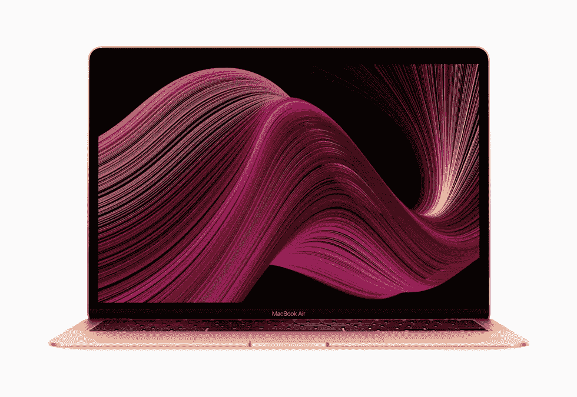

# i5 Macbook Air 试用 6 个月后的评测

> 原文：<https://blog.devgenius.io/i5-macbook-air-review-after-6-months-of-use-as-a-developer-b404dd26d103?source=collection_archive---------8----------------------->

大家好，今天我将快速讲述我作为开发人员和学生使用上一台 i5 Macbook 6 个月的经历，我不会给出任何数字细节，而是在简短的设计介绍后，给出一些典型用例的不同性能分析。

在转到 MBA(Macbook Air)之前，我自己实际上是一个台式机用户，我在日常任务和个人使用中使用 Linux Mint，我转而使用笔记本电脑的原因是为了学习而不得不搬到德国。所以也许你应该从这个角度来看待这篇评论。

我希望你喜欢它。

# 设计

我相信从美学的角度来看，没有人会说 MBA 是一个丑陋的设备，实际上直到今天，MBA 系列的大多数用户选择设备纯粹是因为外观和品牌。

金属和纤薄的机身让你无论何时拿着它都有一种高级的感觉，而且只用一只手就能打开它有点酷，在你习惯了它之后，你可能会觉得它是一种必需品，而不是一件好东西。

# 键盘

从我之前听到的情况来看，据我所知 2016–2019 年间的 Macbook 键盘有点问题。蝴蝶键盘不能带来太多的使用舒适性，同时也带走了大量的坚固性。MBA 2020 使用苹果魔法键盘，我对此没有什么不好的话要说，我有点高，所以我的手比平均水平稍大一点，但按键之间的移动距离对我来说完全平衡。

# 热

热量是 MBA 的一个大问题，这是一个故意的缺陷，以防止 MBP(Macbook Pro)过时。在我看来，如果没有散热问题，这两款设备之间的差异可能会被降级为屏幕和触摸条。我不是专家，所以我将跳过细节。

然而，即使我说热是一个大问题，当我运行任何类型的开发工作时，我并没有真正遇到任何性能问题。即使 Docker 和多个容器同时运行。热量的问题是当你想在膝盖上或床上使用设备时。因为当你在桌子上使用它时，键盘表面的整体热量不会太高，即使 CPU 在 100 摄氏度左右也不会打扰你，但当你试图在膝盖上使用它时，你完全可以感觉到热量，这并不是很好。类似地，在床上使用它甚至可能会在运行一些资源密集型任务时降低性能。

关于热度的另一个注意事项是，当你试图在 Youtube 上观看 4k 视频时，这是完全可能的，但在视频开始 15 秒后，粉丝们会开始疯狂旋转，类似地，当你举行多参与者缩放会议时，如果视频的整体质量稍微好一点，粉丝们会再次做同样的事情。

# 表演

说到性能，我真的没有什么不好说的，除了我上面提到的关于热火的一些边缘情况。

我的设备是 8GB ram 和 256 SSD 版本，我有点担心内存密集型作业在我的环境中会失败，结果证明所有这些假设都是错误的，ram 仅够使用容器和其他资源密集型作业，根本不会打扰我。我在后端与 React 等库或 Next 或 Express 等框架一起做了各种前端和后端工作。我必须补充一点，我从来没有在我的设备上运行过任何虚拟机，我认为这可能会导致一些问题，如果你每天都在使用虚拟机，也许你应该考虑升级内存。

然而，关于浏览器图形方面，我遇到了一个奇怪的问题，当我想使用 three.js 或 Phaser 等库或框架来移动一些图形内容时，Chrome 中禁用的 HA(硬件加速)会大大降低您的体验，以至于您会觉得您在使用一台 10 年前的笔记本电脑，但当您启用 HA 时，性能会有一个奇怪的折衷，我还没有找到解决方案。 每当你在启用高可用性的情况下播放视频时，每当屏幕切换时，视频输出就会变成绿色和奇怪的东西，持续一秒钟，我在购买设备时找不到解决方案，从那以后，如果我没有开发如上所述的东西，我就禁用高可用性。

# 定价

考虑到质量和整体体验，我认为价格还可以，当然也可以一直便宜一点，但纯粹因为这个原因而购买更便宜的型号对我来说没有太大意义，因为这基本上是金钱和开发人员体验之间的权衡。

# 结论

目前，我对自己的 MBA 学位完全满意，我也可以想象自己长时间使用同一个设备。对我来说，未来唯一可能的变化是，当我目前使用的这款电脑出现严重的性能问题时，我会转向新一代苹果硅 Macbook。

我希望你喜欢这篇文章，下一期再见。:)

*最初发表于*[*【https://blog.akbuluteren.com】*](https://blog.akbuluteren.com/blog/i5-macbook-air-after-6-months-of-use-as-a-developer)*。*