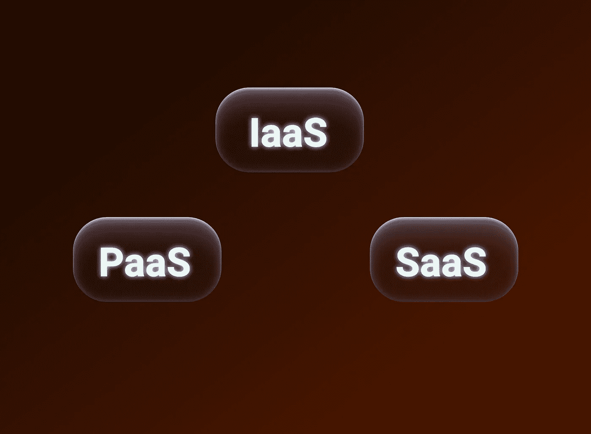
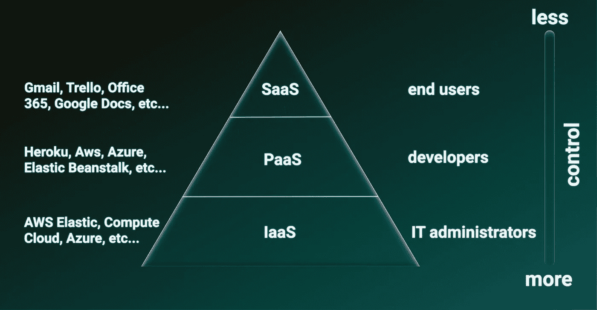

# IaaS，PaaS，SaaS。差异

> 原文：<https://blog.devgenius.io/iaas-paas-saas-difference-fbed005dd196?source=collection_archive---------9----------------------->

嗨，开发者🥳

你可能开始学习云(Azure、AWS 或 GCP ),并接触过诸如 IaaS、Paas、SaaS 等概念。

而你就是不明白有什么区别？没问题，在这篇文章中我会尽量用简单的语言解释一切:)

在开始之前，我会留下一张图，这样你可以参考它，我希望它能给你更多的理解。

## IaaS —基础设施即服务

假设您或您的团队已经编写了一个应用程序，是时候将它部署到互联网上了，现在您需要服务器和网络硬件、放置它的空间(数据中心或服务器机房)、配置和维护专家。

听起来很吓人，过时，最重要的是贵！现在，一种现代的解决方案来帮助我们了——IaaS。

我们可以购买具有一定处理能力和内存大小的虚拟服务器(当然，所有这些都可以在未来按需增加，只需点击鼠标)。

服务器和网络设备的所有管理问题都由提供商决定，但其中操作系统和应用程序级别的设置由客户自己(通常是系统管理员)执行。

> IaaS 和传统托管的主要区别在于能够快速扩展，并且只对消耗的资源收费。

IaaS 示例:IBM Softlayer、Hetzner Cloud、Microsoft Azure、Amazon EC2、GigaCloud。

## 平台即服务

那么，如果我们不想设置操作系统，但希望我们已经有一个现成的平台——开发环境、部署工具、数据库、机器学习库等，该怎么办呢？

那么 PaaS 就是我们需要的。提供商的职责范围包括所有物理基础设施，以及操作系统级别的管理。我们管理基于此基础架构部署的应用程序。

PaaS 的主要优势是能够快速启动应用程序，包括小型团队。此外，使用云服务，开发人员可以收集关于其软件运行的统计数据，进行分析并为企业做出最佳决策。

PaaS 例子:Google App Engine，IBM Bluemix，微软 Azure，VMWare Cloud Foundry。

## SaaS —软件即服务

最后，我们谈到了你们每个人在工作中日常使用的东西(也可能没有😕):Google Doc，微软 Office 365，Flickr，Dropbox，脸书。

你可能已经猜到了，SaaS 是指程序和服务由提供商开发和维护，放在云中，通过浏览器或终端用户电脑上的应用程序提供给终端用户。客户只需支付月费(或免费使用服务)，提供商负责程序的更新和技术支持。

SaaS 服务的主要客户是固定用户。

从最终用户的角度来看，SaaS 是最直观和用户友好的云模型。使用已经满足某些要求的现成 SaaS 服务通常更容易、更高效。但是现成的解决方案并不总是存在，在这种情况下，PaaS 和 IaaS 模型是不可替代的。

# 学到了新东西？

如果你喜欢这篇文章，可以 [**给我买杯咖啡**](https://www.buymeacoffee.com/stasoz) 我写下一篇文章的时候再喝:)

